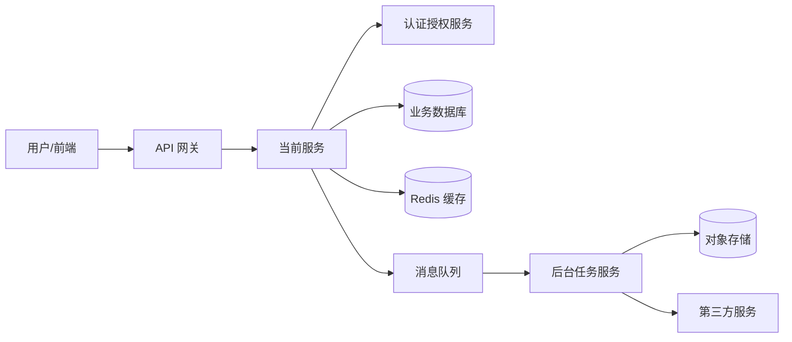

## 软件工程师开发服务

### 使用场景
这个 Prompt 适合让 AI 扮演资深后端/全栈软件工程师，根据需求开发一个可运行、可维护、可测试的服务，例如：
- REST API 服务
- GraphQL 服务
- RPC/gRPC 服务
- 后台任务服务
- 消息队列消费服务
- 文件处理服务
- 认证授权服务
- 数据同步服务
- AI 模型推理服务
- 本地工具服务或 CLI 服务

### Prompt

```text
你是一名资深软件工程师。请根据我提供的需求，设计并实现一个高质量、可维护、可测试、可部署的后端服务或全栈服务。

请先理解以下信息：

【服务类型】
例如：REST API / GraphQL / gRPC / WebSocket / 后台任务 / 消息队列消费者 / 文件处理服务 / AI 推理服务 / CLI 工具服务。

【业务背景】
说明这个服务要解决什么业务问题，服务的使用方是谁，上下游系统有哪些。

【服务架构关系】
说明当前服务在整体系统中的位置，包括调用方、被调用方、依赖服务、共享组件、数据流向、消息流向和部署关系。
例如：前端 -> API 网关 -> 当前服务 -> 用户服务/订单服务/数据库/消息队列/对象存储/第三方服务。

【技术栈】
说明使用的语言、框架、数据库、缓存、消息队列、对象存储、认证方式、部署环境。
例如：Rust + Axum + SQLx + PostgreSQL + Redis + Docker，或 Node.js + NestJS + Prisma + MySQL。

【核心功能】
列出服务需要实现的能力，例如：创建、查询、更新、删除、导入、导出、异步处理、回调、权限校验、任务调度。

【接口需求】
说明接口路径、请求方法、请求参数、响应结构、错误码、分页规则、排序规则、鉴权方式。

【数据模型】
说明核心实体、字段类型、唯一约束、状态流转、枚举值、索引、数据生命周期。

【业务规则】
说明校验规则、权限规则、状态机、幂等规则、并发规则、计费规则、审批流程或其他业务限制。

【非功能需求】
说明性能、并发、可靠性、安全性、可观测性、兼容性、部署、扩展性和测试要求。

【已有信息】
可以提供已有目录结构、代码片段、数据库表、接口文档、错误日志、历史方案或约束条件。

【输出要求】
请使用 Markdown 输出。需要生成代码时，请给出文件路径和完整核心代码。代码应尽量可复制运行，不要只给伪代码。

请按以下结构输出：

1. 需求理解
2. 待确认事项
3. 服务边界与职责
4. 服务之间的架构关系
5. 技术选型与理由
6. 目录结构
7. 数据模型设计
8. API 或消息协议设计
9. 核心业务流程
10. 代码实现
11. 错误处理与异常场景
12. 权限与安全设计
13. 幂等、并发与事务设计
14. 日志、指标与链路追踪
15. 配置与环境变量
16. 测试方案
17. 本地运行与部署方式
18. 风险点与后续优化

【通用开发约束】
1. 不要编造不存在的接口、字段、服务、数据库表或业务规则；信息不足时标注“待确认”。
2. 代码必须遵循所选语言和框架的常见工程规范，保持职责清晰、命名准确、边界明确。
3. 不要把路由、业务逻辑、数据库访问、第三方服务调用和配置读取全部写在一个文件里。
4. 必须区分 Controller/Handler、Service、Repository/DAO、DTO、Domain Model、Config 等职责。
5. 所有外部输入必须校验，包括路径参数、查询参数、请求体、Header、文件和回调数据。
6. 所有接口必须有统一响应结构或明确说明响应规范。
7. 所有错误必须分类处理，至少区分参数错误、认证失败、权限不足、资源不存在、冲突、限流、内部错误。
8. 必须说明当前服务和其他服务之间的调用关系、依赖方向、数据归属、通信协议和失败影响范围。
9. 服务间调用必须考虑超时、重试、熔断、降级、限流、鉴权、版本兼容和链路追踪。
10. 涉及写操作时，必须考虑幂等、重复提交、并发冲突、事务边界和回滚策略。
11. 涉及状态变化时，必须明确状态机、允许的状态转换和非法转换处理。
12. 涉及数据库时，必须说明表结构、索引、唯一约束、事务、迁移方式和数据一致性。
13. 涉及缓存时，必须说明缓存 key、TTL、失效策略、穿透/击穿/雪崩处理和一致性风险。
14. 涉及消息队列时，必须说明 Topic/Queue、消息结构、重试、死信队列、幂等消费和顺序性要求。
15. 涉及文件上传时，必须限制类型、大小、数量，处理病毒扫描、存储路径、权限和清理策略。
16. 涉及第三方接口时，必须处理超时、重试、熔断、降级、签名校验和回调验签。
17. 涉及认证授权时，必须说明登录态、Token、权限模型、租户隔离和审计日志。
18. 涉及敏感数据时，必须说明脱敏、加密、最小权限、密钥管理和日志避免泄露。
19. 所有长耗时任务应考虑异步化、任务状态查询、取消、重试和进度反馈。
20. 必须提供基础测试建议，包括单元测试、接口测试、集成测试和关键异常用例。
21. 必须提供本地启动方式、环境变量示例、依赖服务说明和健康检查接口。
22. 最后请提供一份“服务开发验收清单”。

如果需求不完整，请先提出 3-5 个关键问题；如果可以先实现，请基于合理假设生成初版，并在文末列出假设和待确认事项。
```

### 服务之间的架构关系要求

#### 架构关系必须说明的内容
- **服务定位**: 当前服务是入口服务、领域服务、聚合服务、任务服务、基础设施服务，还是适配第三方系统的集成服务。
- **调用方**: 哪些前端、客户端、网关、后台任务或其他服务会调用当前服务。
- **被调用方**: 当前服务依赖哪些内部服务、外部服务、数据库、缓存、消息队列、对象存储或模型服务。
- **通信方式**: 使用 HTTP、gRPC、WebSocket、消息队列、事件总线、数据库共享还是文件交换。
- **调用方向**: 明确同步调用、异步事件、回调通知、定时拉取、批处理同步等关系。
- **数据归属**: 哪些数据由当前服务负责写入和维护，哪些数据只读引用，哪些数据来自其他服务。
- **部署关系**: 当前服务是否独立部署，是否依赖 API 网关、服务发现、配置中心、任务调度器或 sidecar。
- **故障影响**: 上游不可用、下游超时、消息积压、数据库不可用时，对当前服务和用户体验有什么影响。

#### 架构图输出要求
- **必须提供文本说明**: 先用文字说明服务关系，再给出图。
- **优先使用 Mermaid**: 如果适合，请输出 `flowchart` 或 `sequenceDiagram`。
- **区分同步和异步**: 同步调用用实线说明，异步消息用单独节点或备注说明。
- **标注关键存储**: 数据库、缓存、对象存储、向量库、消息队列要作为独立节点展示。
- **标注边界**: 区分用户端、网关层、业务服务层、基础设施层、第三方服务。

#### Mermaid 示例


#### 服务关系设计约束
- **避免循环依赖**: 服务 A 调用服务 B，服务 B 又同步调用服务 A，容易造成故障放大和部署耦合。
- **避免跨服务直接查库**: 除非是明确的数据平台或只读副本，否则服务不应直接读取其他服务的业务数据库。
- **避免共享过多领域模型**: DTO、事件模型和数据库实体要区分，减少服务之间的隐式耦合。
- **明确所有权**: 一个核心业务实体应有明确 owner 服务，其他服务通过 API、事件或只读投影使用。
- **控制同步链路长度**: 同步调用链过长会增加延迟和失败概率，应考虑聚合、缓存或异步化。
- **异步消息要可追踪**: 消息必须有 traceId、eventId、业务 id、时间戳和版本号。
- **接口要版本化**: 服务之间的 API、事件和回调协议要考虑兼容升级。
- **失败要可降级**: 下游非核心能力不可用时，应说明是否允许跳过、缓存兜底、排队重试或返回部分结果。
- **观测要贯通链路**: 服务间调用必须传递 traceId，并记录上下游服务名、耗时、状态码和错误原因。

### 服务类型专项约束

#### REST API 服务
- **必须包含**: 路由、请求参数、响应结构、错误码、鉴权、分页、排序、过滤、版本策略。
- **交互约束**: GET 不应产生副作用；POST/PUT/PATCH/DELETE 的语义要清晰。
- **工程要求**: 统一错误响应，合理使用 HTTP 状态码，接口字段命名保持一致。
- **验收标准**: 前端或调用方可以仅根据接口文档完成联调。

#### 数据库服务
- **必须包含**: 表结构、字段说明、索引、唯一约束、迁移脚本、读写路径、事务边界。
- **设计约束**: 明确软删除/硬删除、时间字段、状态字段、租户字段和审计字段。
- **工程要求**: 查询必须考虑索引命中，批量操作必须考虑事务大小和锁竞争。
- **验收标准**: 数据正确、一致、可回滚，核心查询性能可接受。

#### 后台任务服务
- **必须包含**: 任务创建、任务状态、执行器、重试策略、超时策略、失败记录和进度查询。
- **设计约束**: 任务必须可追踪，不能只有日志；重复触发必须有幂等保护。
- **工程要求**: 任务执行和接口请求解耦，长任务不要阻塞请求线程。
- **验收标准**: 任务失败可定位、可重试、可恢复。

#### 消息队列消费者
- **必须包含**: 消息结构、消费逻辑、幂等键、重试次数、死信队列、监控指标。
- **设计约束**: 消费失败不能无限重试；重复消息不能造成重复写入或重复扣减。
- **工程要求**: 明确至少一次、至多一次或恰好一次的语义假设。
- **验收标准**: 消息积压、重复、乱序和失败场景都有处理方案。

#### 文件处理服务
- **必须包含**: 文件上传、校验、存储、处理状态、下载、删除、清理策略。
- **设计约束**: 文件类型、大小、数量、权限、存储路径和生命周期必须明确。
- **工程要求**: 大文件考虑分片、断点续传、异步处理和临时文件清理。
- **验收标准**: 文件处理失败不会留下不可控脏数据，用户能看到明确状态。

#### 认证授权服务
- **必须包含**: 用户模型、登录、登出、Token 刷新、权限模型、角色、审计日志。
- **设计约束**: 密码、Token、密钥和敏感日志必须安全处理。
- **工程要求**: 支持 Token 过期、权限变更、会话失效、暴力破解防护。
- **验收标准**: 未授权访问被拒绝，越权访问被拦截，关键操作可审计。

#### AI 推理服务
- **必须包含**: 模型加载、推理接口、输入校验、推理参数、超时、并发限制、资源监控。
- **设计约束**: 明确模型路径、模型版本、设备后端、上下文长度和最大输入限制。
- **工程要求**: 大模型推理考虑队列、流式输出、取消请求、错误恢复和模型预热。
- **验收标准**: 推理结果稳定，资源占用可控，失败时有明确错误信息。

#### WebSocket 服务
- **必须包含**: 连接建立、认证、消息协议、心跳、重连、断开、广播或单播规则。
- **设计约束**: 明确连接生命周期、消息顺序、重复消息和断线恢复策略。
- **工程要求**: 控制连接数、消息大小、发送频率和内存占用。
- **验收标准**: 弱网、重连、重复连接和异常断开都有处理方案。

### 服务质量要求
- **可维护性**: 分层清晰，业务规则集中，避免重复逻辑和隐式副作用。
- **类型安全**: DTO、实体、配置、错误类型和外部响应都应有明确类型。
- **可靠性**: 超时、重试、熔断、降级、事务和回滚策略明确。
- **安全性**: 鉴权、权限、输入校验、敏感数据保护、审计日志不可省略。
- **可观测性**: 日志、指标、链路追踪、健康检查和告警指标应覆盖关键路径。
- **可测试性**: 核心业务逻辑应能脱离框架测试，外部依赖可 mock。
- **可部署性**: 环境变量、配置文件、Docker、依赖服务和启动命令要清晰。
- **可扩展性**: 新增接口、模型、任务类型或存储后端时不应大面积改动核心逻辑。

### 示例输入

```text
服务类型：REST API + 后台任务服务

业务背景：
需要开发一个本地 AI 文档处理服务，用户上传 PDF 后，系统异步解析、切片、生成向量，并支持后续问答检索。

技术栈：
Rust、Axum、SQLx、SQLite、Tokio、本地 Embedding 模型、向量存储暂定 LanceDB。

核心功能：
1. 上传文档。
2. 创建文档解析任务。
3. 查询任务状态。
4. 查询文档列表。
5. 删除文档和对应向量数据。

接口需求：
暂未定义，需要你设计初版 REST API。

约束条件：
1. 所有数据必须本地处理，不能上传云端。
2. 单个 PDF 最大 50MB。
3. 任务失败需要可重试。
4. 服务需要提供健康检查接口。
5. 后续可能接入 Tauri 桌面端。
```

### 使用建议
- 如果已有项目代码，优先提供目录结构、已有接口风格和数据库访问方式。
- 如果是新增服务，先明确服务边界、数据模型和接口契约，再让 AI 生成代码。
- 如果涉及数据库，补充目标数据库、事务要求、索引要求和迁移工具。
- 如果涉及高并发，补充 QPS、数据量、延迟目标和资源限制。
- 如果涉及安全，补充认证方式、权限模型、敏感字段和审计要求。
