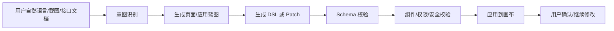
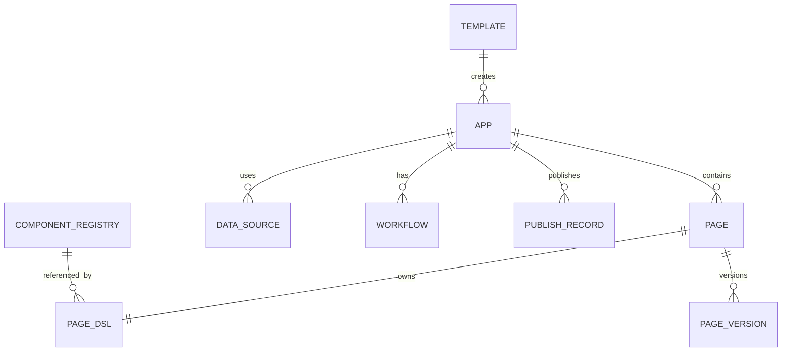
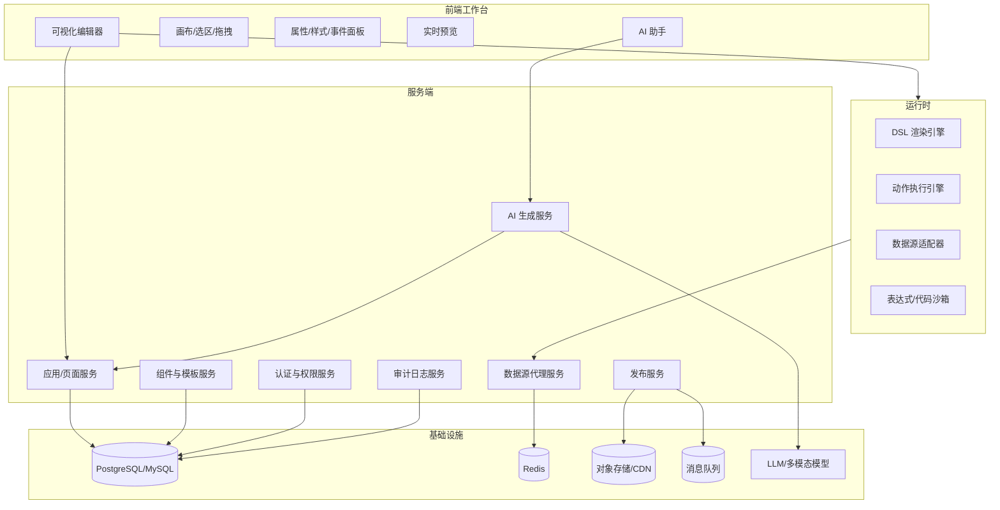
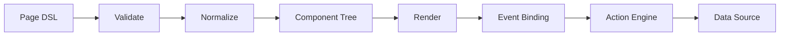
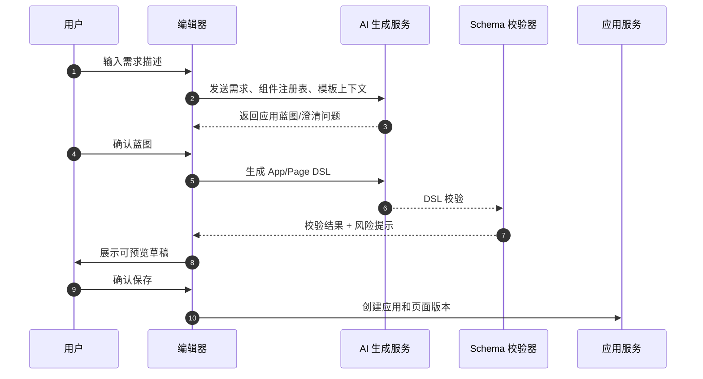
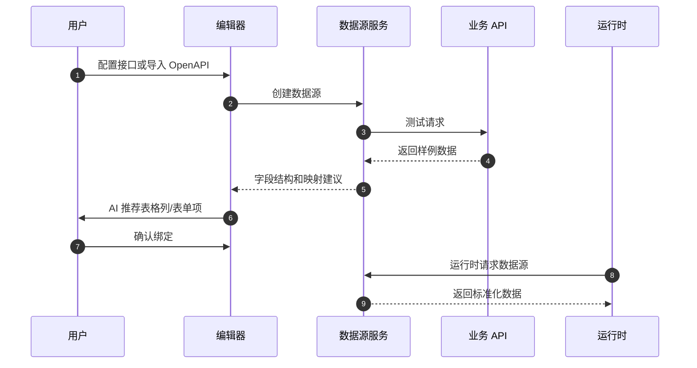
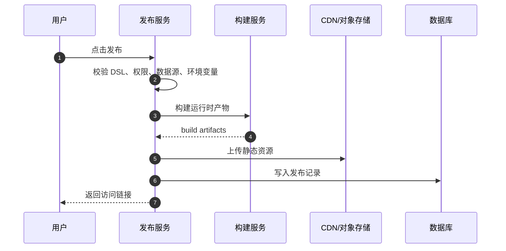

# AI 低代码搭建系统 — 详细设计

> 本文档描述一款结合大模型能力的低代码搭建系统详细设计，支持自然语言生成应用、可视化拖拽、组件化搭建、数据源编排、流程自动化、权限控制、预览发布和源码导出，适用于中后台、运营活动页、营销 H5、数据看板、内部工具和轻量业务系统。

---

## 一、产品概述

### 1.1 产品定位

| 维度 | 说明 |
|------|------|
| **产品名称** | AI 低代码搭建系统（暂定） |
| **目标用户** | 前端开发者、产品/运营、设计师、无代码需求方 |
| **核心价值** | AI 需求理解 + 可视化搭建 + 组件/模板/数据源复用 + 一键发布，快速生成可维护应用 |
| **典型场景** | 中后台表单/列表、活动落地页、营销 H5、官网模块、内部工具、审批流、数据看板 |

### 1.2 核心能力

```
┌─────────────────────────────────────────────────────────────┐
│                    AI 低代码搭建系统                           │
├─────────────┬─────────────┬─────────────┬──────────────────┤
│  AI 生成     │  可视化搭建  │  组件体系    │  数据与流程       │
│  需求→应用   │  拖拽/画布   │  基础/业务   │  API/变量/事件    │
├─────────────┴─────────────┴─────────────┴──────────────────┤
│  预览/发布  │  多端适配   │  模板市场   │  权限与协作       │
└─────────────────────────────────────────────────────────────┘
```

### 1.3 竞品与差异化

| 竞品 | 特点 | 我们的差异 |
|------|------|------------|
| **低代码平台（阿里宜搭、钉钉搭）** | 表单/流程为主 | 侧重页面自由搭建、视觉编辑、H5/落地页 |
| **鲁班/河马/搭搭** | 营销页、活动页 | 中后台 + 营销 + AI 一体化，支持导出源码 |
| **Webflow / Framer** | 设计驱动、高自由度 | 中文友好、组件化、对接国内设计规范 |
| **Ant Design Pro 脚手架** | 代码驱动、开发者 | 可视化 + 代码双模式，可降级为代码编辑 |

**差异化**：AI 需求到应用 + 可解释 DSL + 组件化 + 数据/流程编排 + 源码导出 + 多端发布

---

## 二、功能设计

### 2.1 可视化搭建

| 功能 | 说明 | 优先级 |
|------|------|--------|
| **画布编辑** | 拖拽组件到画布，自由布局（绝对/流式/Grid/Flex） | P0 |
| **组件选择** | 从组件面板拖入或点击插入 | P0 |
| **属性配置** | 右侧属性面板配置组件样式、数据、事件 | P0 |
| **层级与选中** | 树形结构展示组件层级，点击选中、多选 | P0 |
| **撤销/重做** | 操作历史可撤销、重做 | P0 |
| **复制/粘贴/删除** | 组件复制、跨页粘贴、删除 | P0 |
| **画布缩放** | 缩放、适应屏幕、标尺与辅助线 | P1 |
| **锁定/隐藏** | 组件锁定防误操作、临时隐藏 | P1 |
| **组合/解组** | 多组件组合为一个容器，可解组 | P2 |

### 2.2 组件体系

| 类别 | 示例组件 | 说明 |
|------|----------|------|
| **布局** | Container、Row、Col、Flex、Grid、Tabs、Card | 结构类组件 |
| **基础** | Button、Input、Select、Checkbox、Switch、Typography | 表单与展示 |
| **数据展示** | Table、List、Descriptions、Statistic、Tag、Avatar | 列表、统计等 |
| **反馈** | Modal、Message、Drawer、Toast、Skeleton | 弹窗、提示 |
| **导航** | Menu、Breadcrumb、Pagination、Steps | 导航类 |
| **业务** | 用户卡片、订单列表、图表、地图 | 可按业务扩展 |
| **自定义** | 用户注册的组件、第三方组件 | 支持导入 |

**组件规范**：
- 每个组件有 `schema`（属性、默认值、类型）
- 支持 slots（插槽）便于嵌套
- 支持事件绑定（onClick、onChange 等）

### 2.3 数据绑定与逻辑

| 功能 | 说明 | 优先级 |
|------|------|--------|
| **静态数据** | 组件属性直接配置固定值 | P0 |
| **变量绑定** | 绑定页面/全局变量，支持 {{变量名}} | P0 |
| **接口请求** | 组件可配置 API 请求，数据映射到展示 | P1 |
| **条件渲染** | 根据变量/表达式控制显隐 | P1 |
| **循环渲染** | List 等组件根据数组循环渲染 | P1 |
| **事件编排** | 点击、提交等触发动作（跳转、弹窗、请求、赋值） | P1 |
| **表达式** | 简单 JS 表达式（如 `a + b`、`list.length`） | P2 |

### 2.4 模板与复用

| 功能 | 说明 | 优先级 |
|------|------|--------|
| **页面模板** | 预设模板库（登录、列表、详情、活动页等） | P0 |
| **区块模板** | 可复用的区块（Header、Footer、表单区块） | P0 |
| **保存为模板** | 当前页面/选中区域保存为模板 | P1 |
| **导入/导出** | 导出 JSON schema，导入到其他项目 | P0 |
| **源码导出** | 导出 React/Vue 源码（可选） | P2 |

### 2.5 AI 辅助生成

| 功能 | 说明 | 优先级 |
|------|------|--------|
| **描述生成** | 用户输入「一个用户登录表单」，AI 生成对应组件组合 | P1 |
| **自然语言改版** | 「把按钮改成蓝色」「增加一个表格」等指令 | P1 |
| **代码转页面** | 粘贴 HTML/JSX，解析为画布结构（可选） | P2 |
| **智能布局** | 根据内容自动推荐布局方式 | P2 |

#### 2.5.1 AI 低代码核心场景

| 场景 | 用户输入 | AI 输出 | 系统校验 |
|------|----------|---------|----------|
| **需求生成应用** | “生成一个客户管理系统，包含客户列表、详情、新增编辑表单” | 应用结构、页面、组件树、数据模型、权限建议 | DSL Schema 校验、组件白名单、接口占位检查 |
| **页面生成** | “做一个活动报名落地页，移动端优先” | 页面布局、组件、文案、样式主题 | 响应式规则、可访问性、品牌规范 |
| **局部修改** | “把表格增加状态筛选，把提交按钮放到右下角” | 对当前 DSL 的 patch 操作 | Patch 冲突检测、撤销栈记录 |
| **数据源编排** | “表格接入用户列表接口，搜索条件是姓名和手机号” | API 配置、请求参数映射、表格列映射 | 接口鉴权、字段类型、空态/错误态 |
| **表单生成** | 上传接口字段或数据库表结构 | 表单项、校验规则、提交动作 | 字段类型映射、必填/长度/枚举规则 |
| **代码解释与导入** | 粘贴 HTML/JSX/JSON | 组件树 DSL、样式抽取、资源引用 | XSS 清洗、组件兼容性 |

#### 2.5.2 AI 生成策略

AI 不直接修改线上页面，而是输出结构化中间结果，由系统校验后再应用到画布。



**AI 输出类型**：
- **App Blueprint**：应用级蓝图，包括页面清单、路由、数据模型、权限建议。
- **Page DSL**：单页面组件树、变量、数据源、事件动作、响应式配置。
- **Patch DSL**：对已有页面的增删改操作，便于撤销、审计和冲突处理。
- **Code Suggestion**：低代码无法表达时，生成可插拔代码片段，但必须进入沙箱和人工确认。

#### 2.5.3 Prompt 与约束

**系统 Prompt 约束**：
- 只能使用平台已注册组件和动作，不能虚构组件名。
- 输出必须符合 JSON Schema，不允许混入解释性文本。
- 涉及接口、权限、支付、导出等敏感能力时，只生成配置建议，不直接启用。
- 对不明确需求先生成“可确认蓝图”，由用户确认后再落 DSL。

**生成页面 Prompt 输入示例**：

```json
{
  "userRequirement": "生成一个客户管理后台，包含搜索、表格、详情抽屉和新增编辑表单",
  "target": "web_admin",
  "componentRegistry": ["Page", "Card", "Form", "Input", "Select", "Table", "Drawer", "Button"],
  "theme": { "primaryColor": "#1677ff", "radius": 6 },
  "dataSources": [
    { "name": "customerList", "method": "GET", "path": "/api/customers" }
  ],
  "constraints": {
    "maxDepth": 8,
    "responsive": true,
    "permissionRequired": true
  }
}
```

**AI 输出必须包含**：
- `summary`：本次生成/修改摘要。
- `dsl` 或 `patches`：可执行结构化结果。
- `assumptions`：AI 对不明确需求的假设。
- `risks`：可能需要人工确认的风险，如接口不存在、字段含义不确定。
- `followUpQuestions`：必要时给出澄清问题。

#### 2.5.4 AI 质量控制

| 风险 | 控制策略 |
|------|----------|
| 生成不存在的组件 | 组件注册表白名单 + Schema 校验 |
| 生成不可运行 DSL | JSON Schema + 运行时 dry-run |
| 样式混乱 | 主题 token 约束 + 响应式断点检查 |
| 数据源字段错配 | 接口元数据/Mock 数据推断 + 字段映射确认 |
| 生成危险代码 | 默认禁止直接执行 JS；代码片段进入沙箱和人工确认 |
| Prompt 注入 | 用户输入转义，接口文档/页面文本作为数据而非指令 |

### 2.6 预览与发布

| 功能 | 说明 | 优先级 |
|------|------|--------|
| **实时预览** | 编辑时右侧/新窗口实时预览 | P0 |
| **多端预览** | PC / 平板 / 手机预览切换 | P1 |
| **发布** | 生成静态资源或对接部署流水线 | P0 |
| **版本管理** | 保存历史版本、回滚 | P1 |
| **协作** | 多人编辑、评论（可选） | P2 |

### 2.7 多端与响应式

| 功能 | 说明 | 优先级 |
|------|------|--------|
| **断点配置** | 预设 xs/sm/md/lg/xl 断点 | P1 |
| **响应式属性** | 同一属性在不同断点可配置不同值 | P1 |
| **移动端优先** | 支持 H5 单独搭建或自适应 | P1 |

---

## 三、数据模型

### 3.0 核心领域模型

低代码系统的核心数据以「应用 → 页面 → 组件树 → 数据源 → 动作/流程 → 发布版本」为主线。



| 模型 | 说明 |
|------|------|
| **App** | 一个低代码应用，包含页面、路由、数据源、权限和发布配置 |
| **Page** | 应用内页面，如列表页、详情页、表单页、落地页 |
| **Page DSL** | 页面结构化描述，包括组件树、变量、数据源绑定、动作和样式 |
| **Component Registry** | 可用组件注册表，定义组件 props、events、slots、版本和运行时包 |
| **Data Source** | API、数据库查询、Mock 数据或第三方 SaaS 连接器 |
| **Workflow** | 动作流/业务流程，如提交表单后请求接口、提示成功、跳转页面 |
| **Template** | 应用模板、页面模板、区块模板 |
| **Publish Record** | 发布版本、构建产物、CDN 地址、回滚信息 |

### 3.1 页面 Schema（DSL）

```json
{
  "id": "page_xxx",
  "title": "用户列表",
  "version": "1.0",
  "route": "/users",
  "viewport": { "width": 1920, "height": 1080 },
  "breakpoints": ["xs", "sm", "md", "lg", "xl"],
  "theme": {
    "primaryColor": "#1677ff",
    "fontFamily": "system-ui",
    "radius": 6
  },
  "variables": [
    { "name": "userList", "type": "array", "defaultValue": [] }
  ],
  "dataSources": [
    {
      "id": "ds_user_list",
      "type": "http",
      "method": "GET",
      "url": "/api/users",
      "params": { "keyword": "{{query.keyword}}" },
      "responseMapping": { "list": "$.data.list", "total": "$.data.total" }
    }
  ],
  "tree": {
    "id": "root",
    "component": "Page",
    "props": {},
    "children": [
      {
        "id": "comp_1",
        "component": "Table",
        "props": {
          "dataSource": "{{userList}}",
          "columns": [...]
        },
        "children": []
      }
    ]
  },
  "actions": [
    {
      "id": "act_search",
      "trigger": "onClick",
      "steps": [
        { "type": "request", "dataSourceId": "ds_user_list" },
        { "type": "setVariable", "name": "userList", "value": "{{response.list}}" }
      ]
    }
  ],
  "permissions": {
    "view": ["app:user:list:read"],
    "edit": ["app:user:list:write"]
  }
}
```

**DSL 设计原则**：
- **声明式**：页面结构、数据、动作尽量声明化，减少运行时任意代码。
- **可校验**：所有 DSL 必须有 JSON Schema 校验，保存前、发布前、AI 生成后都要校验。
- **可迁移**：包含 `dslVersion` 和组件版本，便于后续升级迁移。
- **可回滚**：每次保存形成版本快照或 patch 日志。
- **可解释**：AI 生成或修改的 DSL 需保留 `reason`、`source`、`promptId`，便于追溯。

### 3.2 组件 Schema

```json
{
  "component": "Button",
  "label": "按钮",
  "category": "基础",
  "props": [
    { "name": "type", "type": "select", "options": ["primary", "default", "dashed"], "defaultValue": "primary" },
    { "name": "children", "type": "string", "defaultValue": "按钮" }
  ],
  "events": ["onClick"],
  "slots": []
}
```

### 3.3 应用 Schema

```json
{
  "id": "app_crm",
  "name": "客户管理系统",
  "type": "web_admin",
  "description": "用于客户信息维护、跟进记录和数据统计",
  "routes": [
    { "path": "/customers", "pageId": "page_customer_list", "title": "客户列表" },
    { "path": "/customers/:id", "pageId": "page_customer_detail", "title": "客户详情" }
  ],
  "globalVariables": [
    { "name": "currentUser", "type": "object", "source": "auth" }
  ],
  "dataSources": ["ds_customer_list", "ds_customer_detail"],
  "permissions": {
    "roles": ["admin", "sales"],
    "policies": ["customer:read", "customer:write"]
  },
  "publish": {
    "mode": "spa",
    "basePath": "/apps/crm",
    "cdn": "https://cdn.example.com/apps/crm/"
  }
}
```

### 3.4 动作与流程 DSL

动作 DSL 用于描述事件编排，覆盖请求接口、赋值、弹窗、跳转、消息提示、条件分支和循环。

```json
{
  "id": "submit_form_action",
  "name": "提交客户表单",
  "trigger": "Form.onSubmit",
  "steps": [
    {
      "type": "validate",
      "target": "customerForm"
    },
    {
      "type": "request",
      "dataSourceId": "ds_create_customer",
      "payload": "{{customerForm.values}}"
    },
    {
      "type": "condition",
      "when": "{{response.success === true}}",
      "then": [
        { "type": "message", "level": "success", "content": "保存成功" },
        { "type": "navigate", "to": "/customers" }
      ],
      "else": [
        { "type": "message", "level": "error", "content": "{{response.message}}" }
      ]
    }
  ]
}
```

**动作执行限制**：
- 禁止默认执行任意用户 JS，表达式运行在沙箱内。
- HTTP 请求通过平台代理发起，避免泄露密钥和绕过鉴权。
- 动作步骤必须可中断、可记录、可重放，便于调试。

### 3.5 数据源模型

| 类型 | 说明 | 典型用途 |
|------|------|----------|
| **HTTP API** | REST/GraphQL 接口，支持鉴权、参数映射、响应映射 | 中后台 CRUD |
| **Mock Data** | 静态 JSON 或 AI 生成 Mock | 原型验证 |
| **Database Query** | 受控 SQL/查询构造器 | 内部工具 |
| **OpenAPI Import** | 导入 Swagger/OpenAPI 文档 | 自动生成数据源和表单 |
| **SaaS Connector** | 飞书、钉钉、企业微信、Notion 等连接器 | 运营自动化 |

```json
{
  "id": "ds_customer_list",
  "name": "客户列表",
  "type": "http",
  "method": "GET",
  "url": "/api/customers",
  "auth": { "type": "inherit_user" },
  "requestSchema": {
    "keyword": { "type": "string", "required": false },
    "page": { "type": "number", "default": 1 }
  },
  "responseSchema": {
    "list": { "type": "array" },
    "total": { "type": "number" }
  },
  "timeoutMs": 8000,
  "cacheTtl": 30
}
```

---

## 四、系统架构详细设计

### 4.1 模块划分



| 模块 | 职责 |
|------|------|
| **可视化编辑器** | 组件拖拽、画布编辑、选区、辅助线、撤销重做、属性配置 |
| **AI 助手** | 需求问答、应用蓝图生成、页面生成、局部修改、接口映射建议 |
| **DSL 渲染引擎** | 将页面 DSL 转换为真实组件树，支持编辑态和运行态 |
| **动作执行引擎** | 执行事件流、条件分支、请求、变量赋值、路由跳转 |
| **数据源代理服务** | 统一转发 HTTP/API/数据库连接器请求，处理鉴权、限流、日志 |
| **组件与模板服务** | 组件注册、版本管理、模板市场、区块复用 |
| **发布服务** | 构建静态资源、部署 CDN、生成访问链接、回滚版本 |
| **认证与权限服务** | 用户、团队、角色、应用权限、页面访问控制 |
| **审计日志服务** | 记录 AI 修改、发布、权限变更、数据源访问等关键操作 |

### 4.1.1 编辑器内部架构

编辑器建议采用「状态管理 + 命令模式 + Schema Patch」设计。

| 子模块 | 说明 |
|--------|------|
| **Editor Store** | 维护当前页面 DSL、选中节点、画布状态、历史栈 |
| **Command Manager** | 所有拖拽、属性修改、AI patch 都转成命令，支持 undo/redo |
| **Selection Manager** | 组件选中、多选、层级定位、框选 |
| **Drag Manager** | 拖拽排序、嵌套容器约束、吸附辅助线 |
| **Schema Validator** | 保存前校验组件 props、slots、events、数据源引用 |
| **Renderer Adapter** | 将不同组件库组件适配到统一渲染协议 |

### 4.1.2 运行时架构

运行时需同时支持编辑态和发布态：
- **编辑态**：显示选中框、拖拽锚点、辅助线、空容器占位，允许拦截组件事件。
- **预览态**：接近真实运行效果，但仍使用 Mock 数据和测试环境接口。
- **发布态**：移除编辑器辅助逻辑，只保留渲染、动作、数据源和权限校验。



### 4.2 技术选型建议

| 层级 | 技术建议 | 说明 |
|------|----------|------|
| **编辑器框架** | React / Vue | 组件生态丰富，建议优先 React + TypeScript |
| **拖拽** | @dnd-kit / react-dnd / vue-draggable | 支持嵌套、自由布局 |
| **画布** | 自定义 + transform | 或基于 fabric.js / Konva（需 canvas） |
| **表单/属性** | formily / FormRender | 根据 schema 生成表单 |
| **渲染** | 同一套组件 + 根据 tree 递归渲染 | 编辑器与预览共用组件 |
| **AI** | LLM API | 描述 → JSON schema，或描述 → 代码 |
| **状态管理** | Zustand / Redux Toolkit / Pinia | 支持命令模式、历史栈 |
| **后端** | Node.js / Go / Java | 低代码配置服务、发布服务、数据源代理 |
| **数据库** | PostgreSQL / MySQL + Redis | 结构化配置与缓存 |
| **构建发布** | Vite / webpack / esbuild + CDN | 生成发布产物和静态资源 |
| **沙箱** | iframe sandbox / Web Worker / QuickJS | 执行表达式和受控代码片段 |

### 4.3 核心流程

**编辑流程**：选择组件 → 拖入画布 → 更新 tree → 属性面板编辑 → 更新 props → 预览实时更新

**发布流程**：保存 schema → 生成静态 HTML/JS 或构建产物 → 上传 CDN / 对接 CI → 返回访问链接

#### 4.3.1 AI 生成应用流程



#### 4.3.2 数据源绑定流程



#### 4.3.3 发布与回滚流程



### 4.4 权限与多租户

| 角色 | 权限范围 |
|------|----------|
| **Owner** | 应用所有者，可管理成员、发布、删除 |
| **Developer** | 可编辑页面、数据源、动作流，可发布到测试环境 |
| **Designer** | 可编辑页面布局、样式、模板，不可配置生产数据源 |
| **Operator** | 可基于模板搭建活动页、发布运营页面 |
| **Viewer** | 只读预览、评论、查看发布版本 |
| **Admin** | 租户级管理，成员、角色、审计、组件市场配置 |

**权限粒度**：
- 应用级：创建、编辑、删除、发布、成员管理。
- 页面级：查看、编辑、发布、回滚。
- 数据源级：查看、调用、编辑密钥、生产环境调用。
- 组件级：使用、发布、下线、版本升级。
- AI 级：生成、修改、源码导出、消耗配额。

### 4.5 安全设计

- **DSL 安全**：组件名、props、events、actions 全部白名单校验；禁止任意 HTML 注入。
- **表达式安全**：表达式运行在沙箱中，只暴露受控上下文，如 `state`、`props`、`response`。
- **数据源安全**：密钥只存服务端，前端只引用 `dataSourceId`；服务端代理请求并做权限校验。
- **发布安全**：发布前进行 DSL 校验、依赖版本锁定、XSS 扫描、敏感信息扫描。
- **AI 安全**：Prompt 注入防护、输出 Schema 校验、危险动作拦截、AI 生成审计。
- **审计日志**：记录页面修改、AI 生成、数据源调用、发布、回滚、权限变更。

---

## 五、数据库设计

### 5.1 应用表 (lc_apps)

| 字段名 | 类型 | 约束 | 说明 |
|--------|------|------|------|
| id | BIGINT | PK | 应用 ID |
| tenant_id | BIGINT | NOT NULL | 租户/团队 ID |
| name | VARCHAR(128) | NOT NULL | 应用名称 |
| app_key | VARCHAR(64) | UNIQUE | 应用唯一标识 |
| type | VARCHAR(32) | NOT NULL | web_admin / h5 / dashboard / internal_tool |
| description | VARCHAR(500) | NULL | 描述 |
| owner_id | BIGINT | NOT NULL | 创建人/负责人 |
| status | VARCHAR(20) | NOT NULL | draft / active / archived |
| settings | JSON | NULL | 主题、发布、权限等应用配置 |
| created_at | DATETIME | NOT NULL | 创建时间 |
| updated_at | DATETIME | NOT NULL | 更新时间 |

### 5.2 页面表 (lc_pages)

| 字段名 | 类型 | 约束 | 说明 |
|--------|------|------|------|
| id | BIGINT | PK | 页面 ID |
| app_id | BIGINT | NOT NULL | 应用 ID |
| name | VARCHAR(128) | NOT NULL | 页面名称 |
| route_path | VARCHAR(256) | NOT NULL | 路由路径 |
| page_type | VARCHAR(32) | NOT NULL | list / form / detail / custom / landing |
| current_version_id | BIGINT | NULL | 当前草稿或已发布版本 |
| status | VARCHAR(20) | NOT NULL | draft / published / archived |
| created_by | BIGINT | NOT NULL | 创建人 |
| created_at | DATETIME | NOT NULL | 创建时间 |
| updated_at | DATETIME | NOT NULL | 更新时间 |

**索引**：`UNIQUE(app_id, route_path)`，`INDEX(app_id, status)`。

### 5.3 页面版本表 (lc_page_versions)

| 字段名 | 类型 | 约束 | 说明 |
|--------|------|------|------|
| id | BIGINT | PK | 版本 ID |
| page_id | BIGINT | NOT NULL | 页面 ID |
| version_no | INT | NOT NULL | 版本号 |
| dsl | JSON | NOT NULL | 页面 DSL 快照 |
| dsl_version | VARCHAR(16) | NOT NULL | DSL 版本 |
| change_summary | VARCHAR(500) | NULL | 修改摘要 |
| source | VARCHAR(32) | NOT NULL | manual / ai / import / rollback |
| prompt_id | BIGINT | NULL | AI 生成记录 ID |
| created_by | BIGINT | NOT NULL | 创建人 |
| created_at | DATETIME | NOT NULL | 创建时间 |

**索引**：`UNIQUE(page_id, version_no)`，`INDEX(page_id, created_at)`。

### 5.4 组件注册表 (lc_components)

| 字段名 | 类型 | 约束 | 说明 |
|--------|------|------|------|
| id | BIGINT | PK | 组件 ID |
| code | VARCHAR(128) | NOT NULL | 组件编码，如 `Button` |
| name | VARCHAR(128) | NOT NULL | 展示名 |
| category | VARCHAR(64) | NOT NULL | layout / form / display / business |
| version | VARCHAR(32) | NOT NULL | 组件版本 |
| schema | JSON | NOT NULL | props/events/slots 定义 |
| runtime_package | VARCHAR(256) | NOT NULL | 运行时包名或资源地址 |
| status | VARCHAR(20) | NOT NULL | active / deprecated / disabled |
| created_at | DATETIME | NOT NULL | 创建时间 |
| updated_at | DATETIME | NOT NULL | 更新时间 |

**唯一约束**：`UNIQUE(code, version)`。

### 5.5 数据源表 (lc_data_sources)

| 字段名 | 类型 | 约束 | 说明 |
|--------|------|------|------|
| id | BIGINT | PK | 数据源 ID |
| app_id | BIGINT | NOT NULL | 应用 ID |
| name | VARCHAR(128) | NOT NULL | 数据源名称 |
| type | VARCHAR(32) | NOT NULL | http / graphql / database / mock / connector |
| config | JSON | NOT NULL | URL、方法、参数、响应映射等非密钥配置 |
| secret_ref | VARCHAR(128) | NULL | 密钥引用，真实密钥存 Secret Manager |
| request_schema | JSON | NULL | 请求参数结构 |
| response_schema | JSON | NULL | 响应结构 |
| status | VARCHAR(20) | NOT NULL | active / disabled |
| created_by | BIGINT | NOT NULL | 创建人 |
| created_at | DATETIME | NOT NULL | 创建时间 |
| updated_at | DATETIME | NOT NULL | 更新时间 |

### 5.6 模板表 (lc_templates)

| 字段名 | 类型 | 约束 | 说明 |
|--------|------|------|------|
| id | BIGINT | PK | 模板 ID |
| type | VARCHAR(32) | NOT NULL | app / page / block |
| name | VARCHAR(128) | NOT NULL | 模板名称 |
| category | VARCHAR(64) | NOT NULL | admin / landing / dashboard / form |
| preview_url | VARCHAR(512) | NULL | 预览图或预览链接 |
| schema | JSON | NOT NULL | 模板 DSL |
| tags | JSON | NULL | 标签 |
| is_public | BOOLEAN | NOT NULL | 是否公开 |
| created_by | BIGINT | NOT NULL | 创建人 |
| created_at | DATETIME | NOT NULL | 创建时间 |

### 5.7 AI 生成记录表 (lc_ai_generations)

| 字段名 | 类型 | 约束 | 说明 |
|--------|------|------|------|
| id | BIGINT | PK | 生成记录 ID |
| app_id | BIGINT | NULL | 应用 ID |
| page_id | BIGINT | NULL | 页面 ID |
| user_id | BIGINT | NOT NULL | 发起人 |
| task_type | VARCHAR(32) | NOT NULL | app_generate / page_generate / modify / data_mapping |
| prompt | TEXT | NOT NULL | 用户输入 |
| context | JSON | NULL | 组件注册表、当前 DSL、数据源等上下文 |
| output | JSON | NULL | 模型输出 |
| status | VARCHAR(20) | NOT NULL | pending / success / failed / rejected |
| validation_errors | JSON | NULL | Schema 或安全校验错误 |
| token_usage | JSON | NULL | Token/成本统计 |
| created_at | DATETIME | NOT NULL | 创建时间 |

### 5.8 发布记录表 (lc_publish_records)

| 字段名 | 类型 | 约束 | 说明 |
|--------|------|------|------|
| id | BIGINT | PK | 发布记录 ID |
| app_id | BIGINT | NOT NULL | 应用 ID |
| env | VARCHAR(20) | NOT NULL | dev / test / prod |
| version_no | INT | NOT NULL | 发布版本号 |
| artifact_url | VARCHAR(512) | NULL | 构建产物地址 |
| entry_url | VARCHAR(512) | NULL | 访问入口 |
| status | VARCHAR(20) | NOT NULL | building / success / failed / rolled_back |
| build_log | TEXT | NULL | 构建日志 |
| published_by | BIGINT | NOT NULL | 发布人 |
| published_at | DATETIME | NOT NULL | 发布时间 |

### 5.9 成员与权限表

| 表名 | 说明 |
|------|------|
| `lc_app_members` | 应用成员，记录 `app_id`、`user_id`、`role` |
| `lc_role_permissions` | 角色权限配置，可与统一权限系统对接 |
| `lc_audit_logs` | 审计日志，记录 AI 生成、发布、回滚、权限变更、数据源调用 |

---

## 六、API 设计（核心）

### 6.1 项目与页面

| 接口 | 方法 | 说明 |
|------|------|------|
| `/apps` | GET/POST | 应用列表 / 创建应用 |
| `/apps/:id` | GET/PUT/DELETE | 应用详情 / 更新 / 删除 |
| `/apps/:id/pages` | GET/POST | 页面列表 / 创建 |
| `/pages/:id` | GET/PUT | 页面详情（含 schema）/ 更新 |
| `/pages/:id/versions` | GET/POST | 版本列表 / 保存新版本 |
| `/pages/:id/publish` | POST | 发布页面 |

### 6.2 模板

| 接口 | 方法 | 说明 |
|------|------|------|
| `/templates` | GET | 模板列表（分类、搜索） |
| `/templates/:id` | GET | 模板详情（schema） |
| `/templates` | POST | 保存为模板 |

### 6.3 AI 辅助

| 接口 | 方法 | 说明 |
|------|------|------|
| `/ai/apps/generate` | POST | 描述 → 生成应用蓝图与多页面 DSL |
| `/ai/pages/generate` | POST | 描述 → 生成单页面 DSL |
| `/ai/pages/modify` | POST | 描述 + 当前 schema → 生成 patch |
| `/ai/data-sources/map` | POST | 接口文档/样例数据 → 字段映射建议 |
| `/ai/code/import` | POST | HTML/JSX/JSON → DSL 草稿 |
| `/ai/generations/:id` | GET | 查询 AI 生成记录和校验结果 |

### 6.4 数据源与动作

| 接口 | 方法 | 说明 |
|------|------|------|
| `/apps/:id/data-sources` | GET/POST | 数据源列表 / 创建数据源 |
| `/data-sources/:id` | GET/PUT/DELETE | 数据源详情 / 更新 / 删除 |
| `/data-sources/:id/test` | POST | 测试数据源请求并返回样例结构 |
| `/runtime/data-sources/:id/query` | POST | 运行态代理调用数据源 |
| `/pages/:id/actions/validate` | POST | 校验动作 DSL |

### 6.5 组件与发布

| 接口 | 方法 | 说明 |
|------|------|------|
| `/components` | GET | 组件注册表，支持分类、版本过滤 |
| `/components/:code/schema` | GET | 获取组件 schema |
| `/apps/:id/publish` | POST | 发布整个应用 |
| `/apps/:id/publish-records` | GET | 发布记录 |
| `/publish-records/:id/rollback` | POST | 回滚到指定发布版本 |

### 6.6 权限与协作

| 接口 | 方法 | 说明 |
|------|------|------|
| `/apps/:id/members` | GET/POST | 成员列表 / 添加成员 |
| `/apps/:id/members/:userId` | PUT/DELETE | 修改成员角色 / 移除成员 |
| `/apps/:id/audit-logs` | GET | 查询应用审计日志 |
| `/pages/:id/comments` | GET/POST | 页面评论与协作反馈 |

---

## 七、MVP 范围与实施路线

**建议 MVP 包含**：
- 应用/页面管理：创建应用、页面、路由和版本保存。
- 画布 + 拖拽 + 组件面板：布局 + 基础组件 + 表单组件，首批 15~20 个。
- 属性面板：样式、文案、基础数据、简单事件动作。
- 页面模板 5~8 个：登录页、列表页、详情页、表单页、活动页、数据看板。
- AI 生成：自然语言生成单页面 DSL，支持局部修改 patch。
- 实时预览：编辑态和预览态切换。
- 数据源：HTTP API 配置、测试、表格/表单绑定。
- 保存 / 导入导出 JSON。
- 简单发布：生成静态 HTML 或运行时链接，支持回滚。
- 基础权限：应用成员、Owner/Developer/Viewer 三类角色。

**可延后**：
- 多页面应用级 AI 生成。
- 复杂工作流、审批流、定时任务。
- 多端高级响应式与设计稿导入。
- 源码导出和双向同步。
- 多人实时协作、评论和分支合并。
- 组件市场、第三方连接器、租户级权限体系。

### 7.1 里程碑

| 阶段 | 周期 | 目标 | 交付物 |
|------|------|------|--------|
| 第 0 阶段 | 2 周 | 需求与技术预研 | DSL 草案、组件协议、AI Prompt 原型 |
| 第 1 阶段 | 4 周 | 编辑器 MVP | 画布、拖拽、属性面板、基础组件 |
| 第 2 阶段 | 4 周 | 数据与发布闭环 | 数据源、动作流、保存版本、预览发布 |
| 第 3 阶段 | 4 周 | AI 生成闭环 | 页面生成、局部修改、Schema 校验、审计 |
| 第 4 阶段 | 4~6 周 | 企业可用 | 权限、模板市场、回滚、监控、稳定性优化 |

### 7.2 验收标准

| 能力 | 验收标准 |
|------|----------|
| 可视化搭建 | 用户可在 30 分钟内搭建一个列表 + 表单页面 |
| AI 生成 | 单页面生成成功率 ≥ 80%，Schema 校验通过率 ≥ 95% |
| 数据源绑定 | 可完成 API 测试、字段映射、表格展示和表单提交 |
| 发布 | 发布成功率 ≥ 99%，支持 1 分钟内回滚 |
| 性能 | 1000 节点页面编辑不卡顿，预览首屏 < 2s |
| 安全 | AI 输出、DSL、数据源、发布前均有校验和审计 |

---

## 八、测试与质量保障

### 8.1 自动化测试

| 测试类型 | 重点 |
|----------|------|
| 单元测试 | DSL parser、Schema validator、动作执行器、数据映射函数 |
| 组件测试 | 组件渲染、属性面板、事件绑定、响应式表现 |
| E2E 测试 | 创建应用、拖拽组件、配置数据源、发布、回滚 |
| AI 回归测试 | 固定 Prompt 集合验证输出 DSL 是否稳定、可运行 |
| 安全测试 | XSS、表达式沙箱逃逸、数据源密钥泄露、权限绕过 |
| 性能测试 | 大页面节点渲染、频繁拖拽、保存版本、发布构建 |

### 8.2 监控指标

| 指标 | 说明 |
|------|------|
| AI 生成成功率 | AI 输出通过 Schema 校验并成功应用的比例 |
| AI 修改采纳率 | 用户确认应用 AI patch 的比例 |
| DSL 校验失败率 | 保存/发布前校验失败比例 |
| 发布成功率 | 发布任务成功占比 |
| 编辑器错误率 | 前端运行时异常、组件渲染异常 |
| 数据源调用错误率 | 代理请求超时、鉴权失败、响应映射失败 |
| 平均搭建时长 | 从创建应用到首次发布的平均时间 |

---

## 九、附录

### 附录 A：术语

| 术语 | 说明 |
|------|------|
| DSL | 领域特定语言，此处指页面描述 JSON |
| Schema | 组件/页面的结构化描述 |
| Runtime | 根据 schema 渲染真实页面的运行时 |

### 附录 B：参考

- Ant Design、Element Plus 等组件库
- 鲁班、搭搭、宜搭等搭建平台
- 《低代码引擎技术白皮书》

---

**文档结束**
