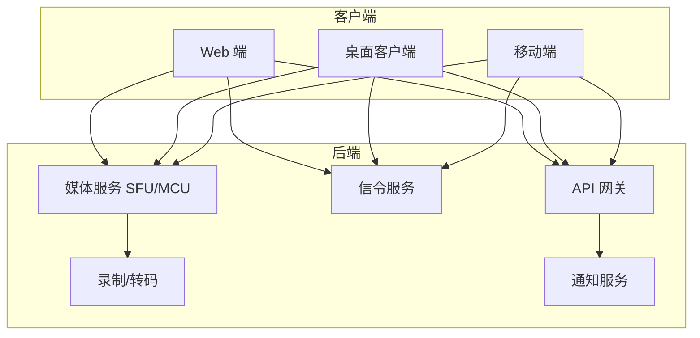
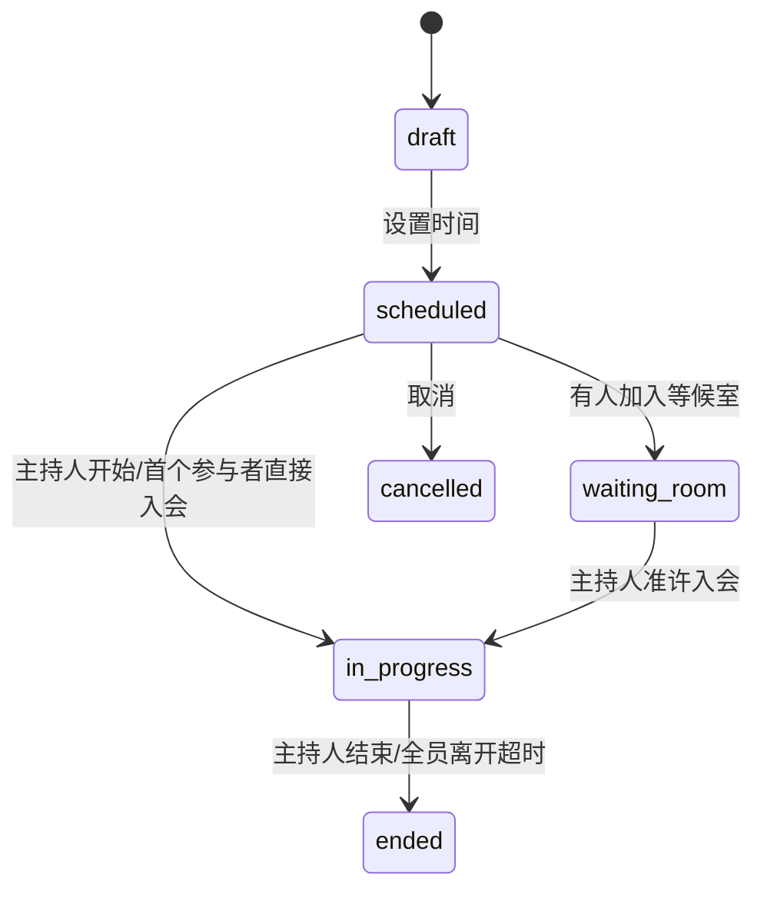
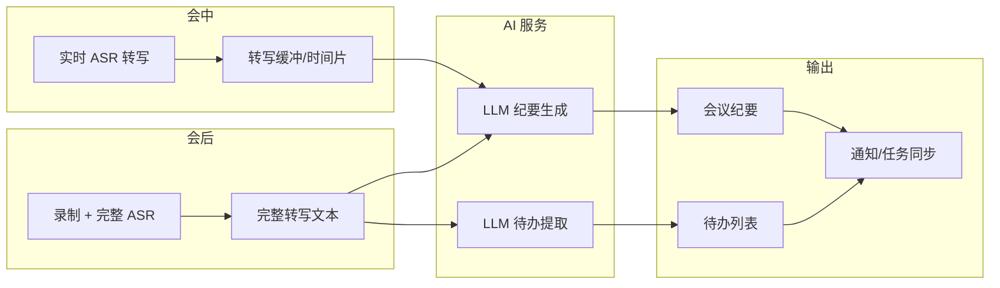
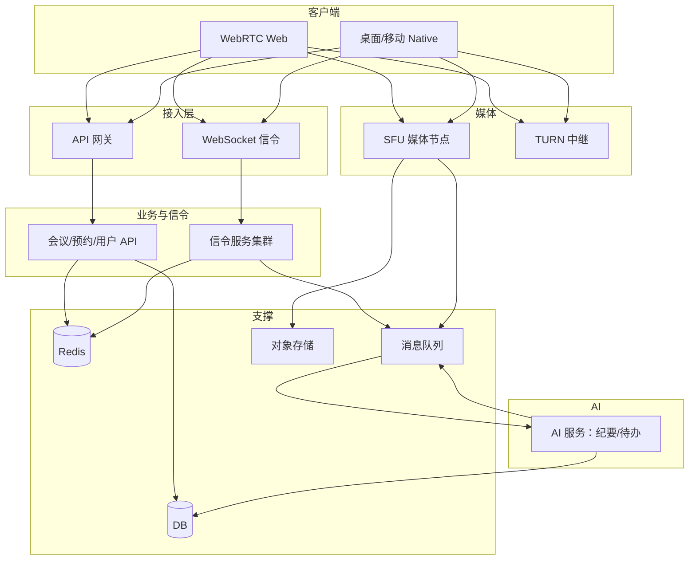

# 类 Zoom 视频会议系统设计文档

> 本文档描述一款类似 Zoom 的实时音视频会议系统设计，涵盖会议模型、角色与权限、音视频/共享/录制/聊天等核心功能、系统架构、数据库与 API 设计，供开发与架构参考。

## 📋 目录

- [概述](#概述)
- [1. 业务与领域模型](#1-业务与领域模型)
  - [1.1 会议与会议室](#11-会议与会议室)
  - [1.2 参与者与角色](#12-参与者与角色)
  - [1.3 会议生命周期与状态](#13-会议生命周期与状态)
- [2. 功能点详细设计](#2-功能点详细设计)
  - [2.1 音视频通话](#21-音视频通话)
  - [2.2 屏幕共享与白板](#22-屏幕共享与白板)
  - [2.3 聊天与互动](#23-聊天与互动)
  - [2.4 会议控制与安全](#24-会议控制与安全)
  - [2.5 录制与回放](#25-录制与回放)
  - [2.6 预约、日历与通知](#26-预约日历与通知)
  - [2.7 企业能力与扩展](#27-企业能力与扩展)
  - [2.8 AI 能力：会议纪要与待办](#28-ai-能力会议纪要与待办)
- [3. 系统架构](#3-系统架构)
  - [3.1 整体架构](#31-整体架构)
  - [3.2 信令与媒体通道](#32-信令与媒体通道)
  - [3.3 媒体服务器与网络](#33-媒体服务器与网络)
- [4. 数据库设计](#4-数据库设计)
- [5. 后端 API 设计](#5-后端-api-设计)
- [6. 实现要点与最佳实践](#6-实现要点与最佳实践)

---

## 📖 概述

本系统旨在提供**实时音视频会议**能力，支持即时会议、预约会议、大班课、网络研讨会等场景，在功能与体验上对标 Zoom / 腾讯会议 / Google Meet 等产品。

**设计目标**：

- **实时性**：音视频延迟低（端到端 RTT 可控）、弱网抗性（码率自适应、丢包恢复）。
- **规模**：单会议支持数十至数百人（视架构选型而定），支持 1:1、小班、大班、直播等。
- **功能完整**：音视频、屏幕共享、聊天、录制、预约、权限控制、企业级能力可扩展。
- **多端**：Web、桌面客户端、移动端（iOS/Android）一致体验，可复用同一套后端与信令。

**文档约定**：用户身份与登录沿用《公用-登录功能模块实现》中的 `users` 与 JWT；权限可衔接《公用-权限模块系统设计》；通知可衔接《公用-订阅、消息推送系统设计》。

**端与场景概览**：



---

## 1. 业务与领域模型

### 1.1 会议与会议室

| 概念 | 说明 | 示例 |
|------|------|------|
| **会议 (Meeting)** | 一次会议实例，有唯一 ID、类型、计划时间、实际开始/结束时间 | 某次「产品评审会」 |
| **会议室 (Room)** | 会议的抽象容器，对应一个信令房间与媒体房间，参与者加入后在此互动 | 与 Meeting 1:1 或 N:1（系列会议复用房间） |
| **会议类型 (Type)** | 即时会议、预约会议、周期性会议、网络研讨会(Webinar)、大班课等 | `instant` / `scheduled` / `recurring` / `webinar` / `webinar_large` |
| **会议链接** | 固定或一次性入会链接、会议号 + 密码、仅邀请链接 | `https://meet.xxx/join/abc-defg-hij` |
| **个人会议室 (PMI)** | 用户的固定个人会议号/链接，可随时发起即时会议 | 类似 Zoom 的 Personal Meeting ID |

**会议与房间关系**：

- **一对一**：一个 Meeting 对应一个 Room，会议结束则房间关闭。
- **系列会议**：周期性会议可共用一个「系列」与一个固定 Room ID，每次「发生」生成一条 Meeting 记录（用于预约、日历、录制拆分）。

### 1.2 参与者与角色

| 角色 | 说明 | 典型权限 |
|------|------|----------|
| **主持人 (Host)** | 会议创建者或指定主持人，拥有最高控制权 | 静音所有人、移出参与者、锁定会议、开始/停止录制、分配联席主持人、结束会议 |
| **联席主持人 (Co-host)** | 主持人指定，拥有大部分控制权，不能转移主持人 | 静音/移出参与者、管理等候室、开始/停止云录制（若授权）、管理分组讨论 |
| **参与者 (Participant)** | 普通参会者 | 开关麦克风/摄像头（可被主持人限制）、聊天、举手、共享屏幕（若允许） |
| **仅观看 (Viewer)** | 网络研讨会/大班课中的观众 | 仅看与听，无麦克风/摄像头，可文字互动、举手、投票 |
| **嘉宾 (Guest)** | 未登录或外部用户 | 可限制仅允许通过链接+密码入会，权限同参与者或更少 |

**参与者状态（可扩展）**：

- 在会、离开、被移出、主动离开、网络异常断开、在等候室。

### 1.3 会议生命周期与状态

```text
会议状态 (meeting_status)    说明
────────────────────────────────────────────────────────────
draft                       仅预约创建，未开始
scheduled                   已预约，等待开始
waiting_room                已有人进入等候室，主持人未放行
in_progress                 进行中
ended                       已结束（可保留录制与聊天记录）
cancelled                   已取消
```

**房间状态 (room_status)** 可与会议状态联动：`idle` → `waiting`（有人在等候室）→ `active`（进行中）→ `ended`。



---

## 2. 功能点详细设计

### 2.1 音视频通话

| 功能 | 说明 | 实现要点 |
|------|------|----------|
| **视频** | 开启/关闭摄像头、多路视频布局（画廊/演讲者/焦点等） | 客户端采集 → 编码 → 上传到 SFU；SFU 按订阅策略下发给各端；支持 simulcast 与层切换 |
| **音频** | 静音/取消静音、扬声器/听筒切换（移动端） | 音频单独流或与视频捆绑；支持 Opus 等低延迟编码；回声消除、降噪在端侧或服务端可选 |
| **设备选择** | 选择麦克风、摄像头、扬声器 | 端侧枚举设备，信令可同步「当前使用设备 ID」便于多端一致 |
| **虚拟背景** | 背景虚化、替换为图片/视频 | 端侧实现（如 Web 用 Canvas/WebGL 或 SDK）；或服务端处理（成本高） |
| **美颜/镜像** | 轻度美颜、本地镜像 | 端侧处理，不增加服务端负载 |
| **网络质量** | 显示延迟、丢包、码率，弱网提示 | 通过 RTCP 或自定义信令上报；可做码率/分辨率自适应 |
| **音频模式** | 普通会议 / 高保真音乐模式（可选） | 不同编码参数或双路（语音+音乐） |

**布局与订阅策略**：

- **画廊视图**：多路小格，一般每路取一层（如 360p）。
- **演讲者视图**：当前发言者大屏，其余小格；需结合「当前发言者」检测（音量或举手）。
- **焦点/置顶**：主持人可指定某参与者视频置顶，所有人看到同一布局建议（信令下发）。

### 2.2 屏幕共享与白板

| 功能 | 说明 | 实现要点 |
|------|------|----------|
| **屏幕共享** | 共享整个屏幕、应用窗口、浏览器标签页 | 端侧 `getDisplayMedia` 采集 → 编码 → 上传；可单独一路流（与摄像头流区分）；支持「谁在共享」状态与切换 |
| **共享权限** | 仅主持人/联席主持人可共享，或允许参与者共享 | 由会议设置与角色控制；信令控制「允许共享」与「当前共享者」 |
| **白板** | 多人实时涂鸦、形状、文字、图片 | 方案 A：信令同步绘图指令（矢量），端侧渲染；方案 B：白板服务生成画面再以视频流推送。需考虑同步顺序与冲突（OT/CRDT 等） |
| **批注** | 在共享屏幕/白板上批注 | 与白板类似，坐标基于共享流或白板画布 |
| **共享声音** | 共享时同时推送系统音频（如播视频） | 端侧捕获系统音频轨，与屏幕流一起上传 |

### 2.3 聊天与互动

| 功能 | 说明 | 实现要点 |
|------|------|----------|
| **公共聊天** | 会议内所有人可见的文字消息 | 信令通道或专用聊天通道；消息持久化可选（会议结束后可查） |
| **私聊** | 一对一私信 | 仅双方可见；信令带 target_user_id；可做敏感词与审计 |
| **表情反应** | 鼓掌、点赞、笑哭等快捷表情，短时展示 | 轻量信令广播，可带 TTL，不落库或仅日志 |
| **举手** | 举手/放下，用于发言排队或提问 | 状态信令；主持人可「清空所有举手」 |
| **签到** | 教学/培训场景下的签到 | 在某一时刻记录「当前在会成员」为签到名单 |
| **投票/问卷** | 主持人发起单选/多选/简答，参与者提交，结果汇总展示 | 信令：创建投票 → 提交选项 → 结束并广播结果；可落库做统计 |
| **问答 (Q&A)** | 观众提问，主持人/嘉宾回答，可置顶 | 类似聊天但带类型（question/answer）、关联、置顶状态；需存储 |
| **分组讨论 (Breakout Rooms)** | 将参与者分到多个子房间，讨论后再合并 | 见下节 |

**分组讨论 (Breakout Rooms) 细化**：

- 主持人创建 N 个子房间（或按人数自动分配），指定每房间成员或自动分配。
- 成员进入子房间后，音视频/聊天仅在子房间内；主持人可「广播」到各子房间（如倒计时、召回）。
- 到时间或主持人「结束分组」后，所有人回到主会议房间。
- 实现：每个分组对应一个子 Room，信令与媒体与主房间独立；成员列表与分配关系由业务层维护。

### 2.4 会议控制与安全

| 功能 | 说明 | 实现要点 |
|------|------|----------|
| **等候室 (Lobby)** | 参与者先进入等候室，主持人准许后入会 | 入会信令先进入「等候室状态」；主持人放行/拒绝列表；可设置「仅非本企业用户进等候室」 |
| **入会密码** | 会议密码、随机会议号密码 | 创建/预约时设置；加入时校验；可周期性更换（周期性会议） |
| **锁定会议** | 锁定后新参与者无法加入 | 信令状态；网关/信令拒绝新 join |
| **静音所有人** | 主持人一键静音所有（可选项：不允许参与者自行取消静音） | 信令下发「全员静音」+ 权限位「仅主持人可 unmute」 |
| **移出参与者** | 将某人移出会议并可选禁止再次加入 | 信令踢人；可记录黑名单（会议级或全局） |
| **结束会议** | 主持人结束，所有人断开 | 信令广播「会议已结束」；关闭房间；触发录制停止与归档 |
| **允许参与者录制** | 是否允许参与者本地录制 | 配置项 + 信令；法律合规需提示 |
| **仅企业/仅登录用户** | 仅本企业或仅登录用户可加入 | 校验 token / 域名 / 企业 ID |
| **端到端加密 (E2EE)** | 可选端到端加密（密钥仅端侧） | 密钥交换与加密在端侧，服务端只转发密文；与录制、转码、直播冲突，需明确场景 |

### 2.5 录制与回放

| 功能 | 说明 | 实现要点 |
|------|------|----------|
| **本地录制** | 参与者端侧录制自己的视图 | 端侧实现；需合规与提示 |
| **云录制** | 服务端合流录制（音视频+共享+布局） | 媒体服务输出到录制器；合流或分别录再后期混流；存储到对象存储 |
| **录制控制** | 开始/暂停/恢复/停止、仅主持人可操作 | 信令控制录制器；权限与角色绑定 |
| **录制内容** | 全画面、仅共享、仅主讲等 | 由录制任务配置与布局策略决定 |
| **转码与格式** | 生成 MP4/WebM、多清晰度、音频分离 | 异步转码流水线；生成封面、时长、索引 |
| **回放** | 按时间轴播放、倍速、字幕 | 点播拉流或下载；若有实时转写则可生成字幕轨 |
| **实时转写/字幕** | 语音转文字，实时展示或写入录制 | 音频流送 ASR 服务；结果同步到信令或写入 VTT/SRT |
| **录制权限与保留** | 谁可看、下载、删除；保留期与合规 | 与权限、企业策略挂钩；可对接审计 |

### 2.6 预约、日历与通知

| 功能 | 说明 | 实现要点 |
|------|------|----------|
| **预约会议** | 设置时间、时长、重复规则、密码、等候室等 | 创建 Meeting 记录；生成会议链接与会议号；可选生成日历事件 |
| **周期性会议** | 每日/每周/每月重复 | 系列 ID + 规则；每次发生可生成实例或按需创建 |
| **个人会议室 (PMI)** | 用户固定会议号/链接 | 用户维度配置；instant 类型会议绑定 PMI |
| **日历集成** | 与 Google Calendar、Outlook、企业日历同步 | OAuth + Calendar API 写事件；会议链接写入描述；可选双向同步 |
| **邮件/站内信提醒** | 会前 N 分钟提醒、会议邀请 | 定时任务扫描即将开始的会议；对接《公用-订阅、消息推送系统设计》 |
| **邀请与分享** | 复制链接、邀请邮件、添加参会人（若与日历打通） | 生成带密码的链接；邀请接口可写日历或发邮件 |

### 2.7 企业能力与扩展

| 功能 | 说明 | 实现要点 |
|------|------|----------|
| **企业/租户** | 按企业隔离会议、配置、用量 | tenant_id 贯穿 Meeting/Room/User；配额与计费按租户 |
| **SSO / 企业登录** | 与企业 IdP 对接 | 沿用登录模块 SSO；JWT 中带 org/tenant |
| **角色与权限** | 谁可创建会议、谁可开云录制、谁可看报表 | 衔接《公用-权限模块系统设计》；如 meeting:create、recording:manage |
| **会议室终端** | 固定会议室设备绑定专用账号/房间 | 设备注册、绑定房间；一键入会 |
| **网络研讨会 (Webinar)** | 主讲+嘉宾+观众，观众仅看听与互动 | 角色区分；观众走订阅式拉流或低码率合流 |
| **直播推流** | 将会议推送到第三方直播平台 | 媒体服务输出 RTMP 等到指定地址 |
| **用量与报表** | 会议时长、参会人次、录制存储 | 统计表或数仓；按企业/用户维度报表 |
| **审计日志** | 谁在何时加入/离开/被移出、谁操作了录制等 | 关键操作写审计表；可对接统一审计 |

### 2.8 AI 能力：会议纪要与待办

结合**语音转写（ASR）**与**大模型（LLM）**，在会中或会后自动生成会议纪要、提取待办事项，并支持同步到任务/待办系统。

#### 2.8.1 自动生成会议纪要

| 功能 | 说明 | 实现要点 |
|------|------|----------|
| **输入来源** | 实时转写文本 + 会议元数据（标题、时间、参会人、聊天记录） | 会中持续写入转写结果（或会后从录制+ASR 一次性生成全文）；可选纳入聊天内容、投票结果、共享文档标题 |
| **纪要结构** | 可配置模板：会议信息、讨论要点、决议、待办、附录（关键发言/时间戳） | 由 LLM 按模板生成；支持多语言（会议语言检测或用户指定） |
| **生成时机** | **会中实时**：按时间片（如每 5 分钟）增量总结，会末合并；**会后生成**：会议结束后一次性生成 | 会中方案延迟低、可边开边看；会后方案质量更稳、可结合完整转写与录制 |
| **编辑与发布** | 主持人/指定角色可编辑 AI 初稿、确认后「发布」给参会人 | 纪要存为版本（草稿/已发布）；发布后可推送通知、写日历备注或关联到会议详情页 |
| **权限与可见** | 仅主持人可见 / 全体参会人可见 / 按企业策略 | 与《公用-权限模块系统设计》衔接；敏感会议可关闭 AI 纪要或仅限内部 |

**纪要内容示例结构**：

```text
# 会议纪要
- 会议主题：xxx
- 时间：yyyy-MM-dd HH:mm–HH:mm
- 参会人：A、B、C

## 讨论要点
1. ……
2. ……

## 决议
- ……

## 待办事项（见下方「待办」列表）
- [ ] 张三：在下周五前完成需求文档
- [ ] 李四：……

## 附录（可选）
- [00:12:30] 王五：我认为……
```

#### 2.8.2 自动生成待办（Action Items）

| 功能 | 说明 | 实现要点 |
|------|------|----------|
| **提取逻辑** | 从转写/纪要文本中识别「谁、做什么、何时」类承诺与任务 | LLM 做 NER + 意图识别；输出结构化待办（负责人、内容、截止时间、来源时间戳/发言片段） |
| **负责人匹配** | 将「张三」「李四」或「产品组」映射为系统用户或群组 | 基于参会人列表 + 企业通讯录做实体链接；无法匹配时标记为「待指定」 |
| **与会议关联** | 每条待办关联 meeting_id、可选关联某段录制/转写 | 便于从会议详情跳转到待办、从待办回溯到会议上下文 |
| **同步到任务系统** | 支持将待办同步到内部任务/待办/项目系统或日历 | 通过 webhook 或统一「待办 API」推送；支持仅创建、或创建后由用户在第三方系统认领 |
| **会中提醒** | 主持人在会末可看到「AI 建议的待办列表」并勾选确认后发布 | 减少遗漏；确认动作写入纪要版本并生成待办记录 |

**待办数据示例**：

```json
{
  "content": "在下周五前完成需求文档初稿",
  "assignee_user_id": 123,
  "assignee_display": "张三",
  "due_at": "2025-02-21T18:00:00Z",
  "source": "meeting",
  "meeting_id": 456,
  "transcript_segment": "00:15:20 - 00:15:35",
  "status": "pending"
}
```

#### 2.8.3 整体流程（会中 + 会后）



- **会中**：ASR 持续输出，按时间片或会末触发纪要/待办生成（可仅生成待办建议，会末再确认）。
- **会后**：录制完成 → 若开启「会后纪要」则跑完整 ASR（或复用会中转写）→ 调用 LLM 生成纪要与待办 → 写入库并通知主持人/参会人。

#### 2.8.4 配置与开关

| 配置项 | 说明 | 默认建议 |
|--------|------|----------|
| **是否启用 AI 纪要** | 租户/会议级别开关 | 租户默认关，由管理员开启；单次会议可覆盖 |
| **生成时机** | 仅会中 / 仅会后 / 两者 | 仅会后实现简单；会中需考虑延迟与成本 |
| **是否自动提取待办** | 与纪要一起生成待办并写入待办表 | 开启时同时写 `meeting_minutes` 与 `meeting_action_items` |
| **待办同步目标** | 无 / 内部待办列表 / 第三方 webhook | 内部先支持；第三方按需对接 |
| **语言** | 转写与纪要语言（自动检测或指定） | 自动检测；企业可强制指定 |

---

## 3. 系统架构

### 3.1 整体架构



- **API 网关**：鉴权、限流、路由到会议/用户/录制等 HTTP API。
- **WebSocket 信令**：长连接，房间内成员列表、音视频状态、聊天、控制指令等。
- **信令服务**：维护连接与房间映射，广播或单播信令；可水平扩展，通过 Redis Pub/Sub 或 MQ 做多实例协同。
- **SFU**：接收端上行的音视频流，按需转发给其他端；支持 simulcast、录制出流。
- **TURN**：在 P2P 不通时提供中继，保证连通率。
- **AI 服务**：消费 MQ 中的会议结束/转写就绪等事件，调用 ASR+LLM 生成会议纪要与待办并落库；完成后可再发 MQ 事件驱动通知（见 [2.8 AI 能力：会议纪要与待办](#28-ai-能力会议纪要与待办)）。

### 3.2 信令与媒体通道

**信令消息类型（示例）**：

| 类型 | 方向 | 说明 |
|------|------|------|
| join / leave | C→S / S→C | 加入/离开房间，带 token、角色、设备信息 |
| offer / answer / ice-candidate | C↔C(经S) | WebRTC SDP 与 ICE 交换（或由 SFU 分配） |
| participant-joined / left / updated | S→C | 成员列表与状态变化 |
| mute / video-state / layout | C↔S | 静音、开关摄像头、布局建议 |
| chat-message | C↔S | 聊天（含私聊 target） |
| reaction / raise-hand | C→S, S→C | 表情、举手 |
| control (mute-all, remove, lock, etc.) | C→S, S→C | 主持人控制指令与结果 |
| recording-start / stop | S→C | 录制状态 |
| whiteboard / annotation | C↔S | 白板与批注指令同步 |

**媒体流**：

- 端 → SFU：每个参与者上传 1 路视频 + 1 路音频（或 + 1 路屏幕共享）；可选 simulcast 多码率。
- SFU → 端：按订阅策略下发所需流（如画廊 N 路、演讲者 1 路大 + 多路小）。
- 信令与媒体分离：信令走 WebSocket；媒体走 WebRTC (UDP/DTLS-SRTP)，经 TURN 时走 TURN 中继。

### 3.3 媒体服务器与网络

| 组件 | 说明 |
|------|------|
| **SFU 选型** | 如 Janus、Mediasoup、LiveKit、各云厂商 RTC；选型考虑：协议兼容、simulcast、录制对接、运维成本 |
| **STUN/TURN** | 公网部署 TURN，保证 NAT 穿透；STUN 用于获取公网反射地址 |
| **区域与调度** | 按用户地域调度到就近 SFU 与 TURN；调度信息可由 API 或信令在 join 时下发 |
| **码率与质量** | 端侧根据带宽与丢包做码率/分辨率自适应；SFU 可做层选择（simulcast）或转码（增加延迟与成本） |
| **录制链路** | SFU 输出混流或各流到录制服务；录制服务合流、编码、写对象存储；转码与字幕异步 |

---

## 4. 数据库设计

### 4.1 会议与房间

```sql
-- 会议（预约与实例）
CREATE TABLE meetings (
    id              BIGSERIAL PRIMARY KEY,
    tenant_id       BIGINT NOT NULL,
    room_id         VARCHAR(64) NOT NULL UNIQUE,          -- 信令/媒体房间 ID
    title           VARCHAR(256),
    type            VARCHAR(32) NOT NULL,                 -- instant, scheduled, recurring, webinar
    host_user_id    BIGINT NOT NULL,
    meeting_number  VARCHAR(32),                          -- 会议号（可读）
    password_hash   VARCHAR(128),                         -- 入会密码（加密）
    join_url        VARCHAR(512),
    settings        JSONB,                                -- 等候室、允许录制、静音策略等
    scheduled_start TIMESTAMPTZ,
    scheduled_end   TIMESTAMPTZ,
    started_at      TIMESTAMPTZ,
    ended_at        TIMESTAMPTZ,
    status          VARCHAR(32) NOT NULL DEFAULT 'draft',
    recurrence_rule TEXT,                                 -- iCal RRULE
    series_id       VARCHAR(64),                          -- 周期性会议系列
    created_at      TIMESTAMPTZ NOT NULL DEFAULT now(),
    updated_at      TIMESTAMPTZ NOT NULL DEFAULT now()
);

-- 参与者（会议内快照与状态可另表或 Redis）
CREATE TABLE meeting_participants (
    id              BIGSERIAL PRIMARY KEY,
    meeting_id      BIGINT NOT NULL REFERENCES meetings(id),
    user_id         BIGINT,
    guest_name      VARCHAR(128),                         -- 未登录时显示名
    role            VARCHAR(32) NOT NULL,                 -- host, co_host, participant, viewer
    joined_at       TIMESTAMPTZ NOT NULL DEFAULT now(),
    left_at         TIMESTAMPTZ,
    device_id       VARCHAR(64),
    CONSTRAINT uq_meeting_user UNIQUE (meeting_id, user_id)
);

-- 个人会议室 (PMI)
CREATE TABLE user_pmi (
    user_id         BIGINT PRIMARY KEY REFERENCES users(id),
    meeting_number  VARCHAR(32) NOT NULL UNIQUE,
    room_id         VARCHAR(64) NOT NULL UNIQUE,
    join_url        VARCHAR(512),
    password_hash   VARCHAR(128),
    settings        JSONB,
    updated_at      TIMESTAMPTZ NOT NULL DEFAULT now()
);
```

### 4.2 录制与资源

```sql
CREATE TABLE recordings (
    id              BIGSERIAL PRIMARY KEY,
    meeting_id      BIGINT NOT NULL REFERENCES meetings(id),
    tenant_id       BIGINT NOT NULL,
    started_at      TIMESTAMPTZ NOT NULL,
    stopped_at      TIMESTAMPTZ,
    status          VARCHAR(32) NOT NULL DEFAULT 'recording', -- recording, processing, ready, failed
    file_path       VARCHAR(512),                         -- 对象存储路径
    duration_sec    INT,
    file_size_bytes BIGINT,
    format          VARCHAR(16),                         -- mp4, webm
    created_by      BIGINT NOT NULL,
    created_at      TIMESTAMPTZ NOT NULL DEFAULT now()
);

CREATE TABLE chat_messages (
    id              BIGSERIAL PRIMARY KEY,
    meeting_id      BIGINT NOT NULL REFERENCES meetings(id),
    sender_user_id  BIGINT,
    sender_guest_name VARCHAR(128),
    target_user_id  BIGINT,                               -- 私聊目标，NULL 为公共
    content         TEXT NOT NULL,
    message_type    VARCHAR(16) DEFAULT 'text',           -- text, image, file
    created_at      TIMESTAMPTZ NOT NULL DEFAULT now()
);

-- AI 会议纪要
CREATE TABLE meeting_minutes (
    id              BIGSERIAL PRIMARY KEY,
    meeting_id      BIGINT NOT NULL REFERENCES meetings(id),
    tenant_id       BIGINT NOT NULL,
    version         INT NOT NULL DEFAULT 1,                -- 同一会议多版本（草稿/发布）
    status          VARCHAR(32) NOT NULL DEFAULT 'draft', -- draft, published
    content         TEXT,                                 -- 全文（Markdown 或 HTML）
    content_json    JSONB,                                -- 结构化：sections, bullets, resolutions
    generated_at    TIMESTAMPTZ NOT NULL DEFAULT now(),
    generated_by    VARCHAR(16) DEFAULT 'ai',            -- ai, manual
    published_at    TIMESTAMPTZ,
    published_by    BIGINT,
    created_at      TIMESTAMPTZ NOT NULL DEFAULT now(),
    updated_at      TIMESTAMPTZ NOT NULL DEFAULT now()
);

-- AI 待办（会议产生的行动项）
CREATE TABLE meeting_action_items (
    id              BIGSERIAL PRIMARY KEY,
    meeting_id      BIGINT NOT NULL REFERENCES meetings(id),
    minutes_id      BIGINT REFERENCES meeting_minutes(id),
    tenant_id       BIGINT NOT NULL,
    content         TEXT NOT NULL,                        -- 待办描述
    assignee_user_id BIGINT,                              -- 负责人，NULL 表示待指定
    assignee_display VARCHAR(128),                        -- 原始称呼（如「张三」）便于展示
    due_at         TIMESTAMPTZ,
    status          VARCHAR(32) NOT NULL DEFAULT 'pending', -- pending, in_progress, done, cancelled
    transcript_segment_start_sec INT,                     -- 来源片段起始秒
    transcript_segment_end_sec   INT,
    external_task_id VARCHAR(128),                        -- 同步到第三方任务系统后的 ID
    created_at      TIMESTAMPTZ NOT NULL DEFAULT now(),
    updated_at      TIMESTAMPTZ NOT NULL DEFAULT now()
);
```

### 4.3 索引建议

- `meetings(tenant_id, status, scheduled_start)`：预约列表、即将开始扫描。
- `meetings(room_id)`：入会时按房间查会议。
- `meetings(host_user_id, status)`：我发起的会议。
- `meeting_participants(meeting_id)`：参会名单。
- `recordings(meeting_id)`, `recordings(tenant_id, status)`：录制列表与处理队列。
- `chat_messages(meeting_id, created_at)`：会议聊天记录。
- `meeting_minutes(meeting_id, version)`：会议纪要版本；`meeting_minutes(tenant_id, status)`：发布列表。
- `meeting_action_items(meeting_id)`：会议待办；`meeting_action_items(assignee_user_id, status)`：我的待办。

---

## 5. 后端 API 设计

### 5.1 会议与预约

| 方法 | 路径 | 说明 |
|------|------|------|
| POST | /meetings | 创建会议（即时或预约），返回 meeting_id、room_id、join_url、meeting_number |
| GET | /meetings/:id | 会议详情（含设置、状态、参会人数等） |
| PATCH | /meetings/:id | 更新会议（时间、设置、取消） |
| POST | /meetings/:id/join | 获取入会 token 与信令/媒体地址（需密码、等候室逻辑可在此或信令层） |
| POST | /meetings/:id/end | 结束会议（仅 Host/Co-host） |
| GET | /meetings | 列表：我发起的 / 我参与的 / 租户下，支持时间与状态筛选 |
| GET | /users/me/pmi | 当前用户 PMI 信息与默认设置 |

### 5.2 录制

| 方法 | 路径 | 说明 |
|------|------|------|
| POST | /meetings/:id/recordings/start | 开始云录制 |
| POST | /meetings/:id/recordings/:rid/stop | 停止录制 |
| GET | /meetings/:id/recordings | 会议录制列表 |
| GET | /recordings/:id | 录制详情与播放/下载链接（含鉴权） |
| DELETE | /recordings/:id | 删除录制（权限与策略控制） |

### 5.3 信令与 WebSocket

- **连接**：`wss://xxx/signaling?room_id=xx&token=JWT`；服务端校验 token 与 room 归属，加入房间并推送成员列表与状态。
- **消息格式**：JSON，含 `type`、`payload`、`request_id`（可选，用于请求-响应）；服务端可回 ack 或 error。
- **权限**：根据 JWT 中的角色与会议配置，服务端拒绝无权限的控制类消息（如非 host 发 mute-all）。

### 5.4 会议纪要与待办（AI）

| 方法 | 路径 | 说明 |
|------|------|------|
| POST | /meetings/:id/minutes/generate | 触发生成会议纪要（会末或会后）；异步，返回 task_id |
| GET | /meetings/:id/minutes | 会议纪要列表（含版本、状态） |
| GET | /meetings/:id/minutes/:mid | 单版纪要详情 |
| PATCH | /meetings/:id/minutes/:mid | 编辑纪要内容（草稿）、发布 |
| GET | /meetings/:id/action-items | 该会议下的待办列表 |
| POST | /meetings/:id/action-items/sync-from-minutes | 从最新纪要重新提取待办（覆盖或增量由参数控制） |
| PATCH | /action-items/:id | 更新待办（状态、负责人、截止时间）；可同步到第三方 |
| GET | /users/me/action-items | 当前用户被分配的会议待办（可按状态、会议筛选） |

### 5.5 通知与日历

- 会前提醒、会议邀请：可调用《公用-订阅、消息推送系统设计》中的发送接口，或发邮件。
- 日历：单独服务或接口，写第三方日历（Google/Outlook）；会议创建/更新时同步事件。
- 纪要发布/待办分配：可推送站内信或邮件（如「会议《xxx》纪要已发布」「你有一条新待办」）。

---

## 6. 实现要点与最佳实践

### 6.1 信令一致性

- 房间状态（谁在会、谁在共享、是否锁定等）以服务端为准；关键操作（静音所有人、移出）由服务端校验后广播，避免客户端篡改。
- 新加入者拉取当前房间全量状态（成员、布局、共享者、录制状态），再订阅增量。

### 6.2 安全

- 入会 token 短期有效、单次会议绑定，防止链接泄露后被长期滥用。
- 敏感操作（移出、结束会议、删除录制）审计日志；企业场景可限制仅本企业用户入会、仅允许登录用户。

### 6.3 高可用与扩展

- 信令服务无状态，通过 Redis Pub/Sub 做房间内广播，多实例可水平扩展。
- SFU 与 TURN 按区域部署，做好健康检查与调度。
- 录制、转码、ASR 等异步化，通过 MQ 解耦，避免阻塞会议主路径。

### 6.4 成本与体验平衡

- 按需使用云录制与转码；大班课/网络研讨会可考虑「主讲合流 + 观众拉流」降低上行与混流成本。
- 弱网下优先保音频；视频可降分辨率或关视频以保流畅。

### 6.5 AI 纪要与待办实现要点

- **数据链路**：转写结果（实时或录制后 ASR）写入 DB 或对象存储；会议结束事件触发 MQ 任务，消费时拉取转写全文 + 聊天记录 + 会议元数据，调用 LLM 生成纪要与待办并落库。
- **LLM 调用**：建议使用结构化 prompt（模板 + 会议信息 + 转写），输出 JSON（纪要 sections + action_items 数组）；对长转写可先分段摘要再合并，或使用长上下文模型。
- **负责人解析**：LLM 输出 assignee 为自然语言名称；后端用参会人列表 + 企业用户表做模糊匹配写 `assignee_user_id`，匹配不到则留空并保留 `assignee_display`。
- **权限**：纪要与待办的可见、可编辑与《公用-权限模块系统设计》一致（如仅主持人可发布纪要、仅负责人可更新自己的待办状态）；企业可关闭 AI 能力或限制可见范围。
- **合规**：若涉及敏感内容，可提供租户级关闭 AI 纪要/待办；转写与纪要保留策略与录制一致，满足审计与隐私要求。

---

以上为类 Zoom 视频会议系统的整体设计，功能点覆盖音视频、共享、聊天、录制、预约、企业能力、安全以及与 AI 结合的会议纪要、待办自动生成；实现时可按阶段迭代（如先 1:1 与小班，再云录制与分组讨论，随后接入 AI 纪要与待办，最后网络研讨会与直播）。
