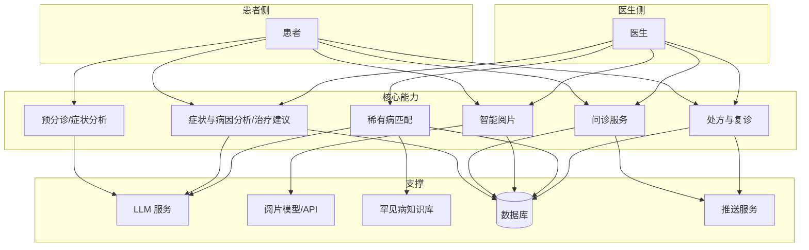
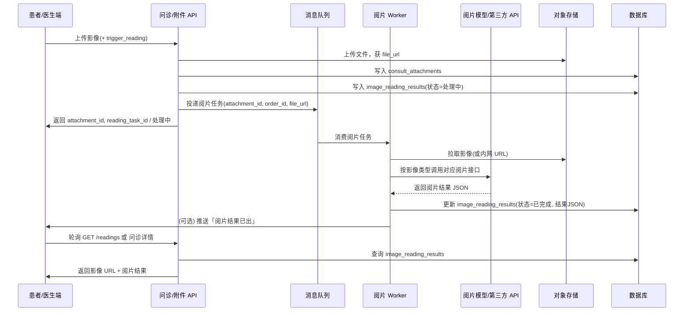
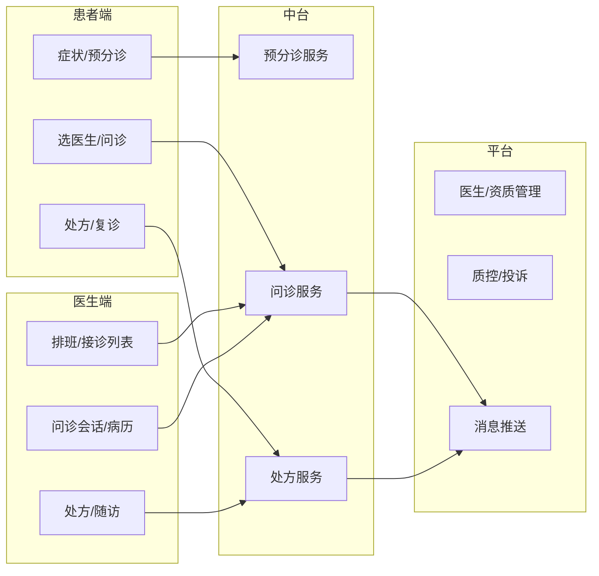
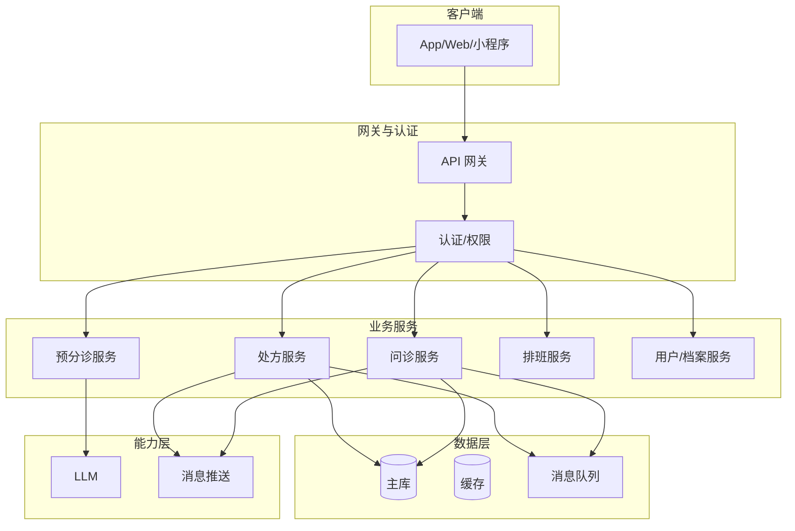
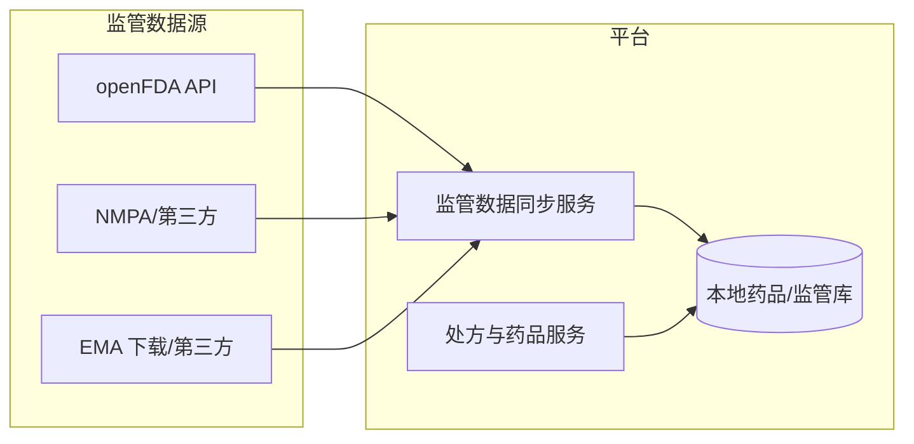

# 医疗问诊软件 — 系统设计文档

> 本文档描述一款面向患者与医生的在线医疗问诊软件系统设计，覆盖 AI 预分诊与症状分析、图文/音视频问诊、**智能阅片**、**稀有病匹配**、处方与复诊随访、医生排班与接诊流程，以及医疗数据安全与合规要求，供产品、研发与测试参考落地。

---

## 📋 目录

- [概述](#概述)
- [1. 业务模型](#1-业务模型)
  - [1.1 角色与参与方](#11-角色与参与方)
  - [1.2 问诊形态与流程](#12-问诊形态与流程)
  - [1.3 用户画像与目标](#13-用户画像与目标)
  - [1.4 核心功能清单](#14-核心功能清单)
  - [1.5 产品 KPI 与商业化](#15-产品-kpi-与商业化)
- [2. AI 能力设计](#2-ai-能力设计)
  - [2.1 预分诊与症状分析](#21-预分诊与症状分析)
  - [2.2 症状与病因分析及治疗建议](#22-症状与病因分析及治疗建议)
  - [2.3 医生匹配与推荐](#23-医生匹配与推荐)
  - [2.4 医生侧 AI 助手](#24-医生侧-ai-助手)
  - [2.5 生成电子病历](#25-生成电子病历)
  - [2.6 智能阅片](#26-智能阅片)
    - [2.6.1 智能阅片开发指南](#261-智能阅片开发指南)
    - [2.6.2 基于开源 DICOM 训练模型并生成诊断建议](#262-基于开源-dicom-训练模型并生成诊断建议)
  - [2.7 稀有病匹配](#27-稀有病匹配)
    - [2.7.1 中国、美国、欧盟病例库对接](#271-中国美国欧盟病例库对接)
  - [2.8 降级与人工兜底](#28-降级与人工兜底)
- [3. 系统架构](#3-系统架构)
  - [3.1 功能模块划分](#31-功能模块划分)
  - [3.2 整体架构](#32-整体架构)
  - [3.3 核心服务与流程](#33-核心服务与流程)
- [4. 数据库设计](#4-数据库设计)
  - [4.1 用户与档案](#41-用户与档案)
  - [4.2 问诊与处方](#42-问诊与处方)
  - [4.3 医生与排班](#43-医生与排班)
  - [4.4 消息与通知](#44-消息与通知)
- [5. 后端 API 设计](#5-后端-api-设计)
  - [5.0 通用约定](#50-通用约定)
  - [5.1 患者端：问诊与处方](#51-患者端问诊与处方)
  - [5.2 医生端：接诊与处方](#52-医生端接诊与处方)
  - [5.3 排班与预约](#53-排班与预约)
  - [5.4 管理端与运营](#54-管理端与运营)
- [6. 安全与合规](#6-安全与合规)
  - [6.1 医疗数据与隐私](#61-医疗数据与隐私)
  - [6.2 身份、权限与审计](#62-身份权限与审计)
  - [6.3 合规与资质](#63-合规与资质)
  - [6.4 监管机构与药品数据对接（FDA、NMPA、EMA）](#64-监管机构与药品数据对接fdanmpaema)
- [7. 实现要点与技术选型](#7-实现要点与技术选型)
- [8. MVP 与实施路线](#8-mvp-与实施路线)
- [附录 A：术语与缩写](#附录-a术语与缩写)

---

## 概述

**目标**：构建一款连接患者与医生的在线问诊平台，通过 AI 预分诊与症状分析提升匹配效率，支持图文、语音、视频多种问诊形态，覆盖从咨询、开方到复诊随访的完整链路，并满足医疗数据安全与行业合规要求。

**产品定位**：面向 C 端患者的轻问诊与复诊续方入口，以及面向医生的在线接诊与患者管理工具；AI 作为预分诊与医生助手，不替代医生诊断与处方决策。

**竞争分析与差异化**：

| 竞品 | 主要特点 | 我们的差异 |
|------|----------|------------|
| **平安好医生 / 好大夫** | 大平台、多科室、品牌医生 | 强化 AI 预分诊与症状结构化，减少盲目选科；医生助手提效 |
| **微医 / 丁香医生** | 预约挂号、健康科普 | 问诊与处方闭环更短；复诊续方流程标准化 |
| **京东健康 / 阿里健康** | 医药电商 + 问诊 | 问诊体验与合规优先，与电商解耦可独立部署 |

**核心竞争力**：AI 预分诊准确度 + 问诊体验（多形态、低等待）+ **智能阅片**（影像辅助分析）+ **稀有病匹配**（鉴别诊断辅助）+ 处方与复诊闭环 + 数据安全与合规

**核心价值**：

- **患者侧**：描述症状即可获得初步分科与紧急程度建议；**可根据自述获得症状分析、可能病因与推荐治疗方式**（仅供参考）；图文/音视频问诊，**可上传影像（X 光/CT/MRI/超声等）并获 AI 初步阅片建议**；处方在线开具与配送或到店取药。
- **医生侧**：接诊列表按紧急度与科室智能排序；**问诊中可查看患者上传影像及智能阅片结果**，作为参考；**可根据主诉、病历与影像进行稀有病匹配**，获得可能罕见病建议以辅助鉴别诊断；AI 助手提供病史摘要、常用药品建议与病历模板，减少重复录入。
- **平台侧**：合规留存问诊与处方数据，支持质控、纠纷调处与监管报送。

**设计目标**：

- **合规优先**：问诊与处方流程符合《互联网诊疗监管细则》等要求；电子处方、实名认证、数据留存可审计。
- **体验与效率**：预分诊缩短患者选科时间；多形态问诊适应不同场景；医生端工具减少无效操作。
- **可扩展**：支持后续接入线下机构、医保、药品供应链等，模块化设计便于对接。

**文档约定**：用户身份沿用现有登录体系（如 `users` + JWT）；消息与提醒可复用《公用-订阅、消息推送系统设计》中的主题与推送能力。本文重点描述医疗问诊域内的业务模型、AI 能力、架构与接口。

**能力总览**：



---

## 1. 业务模型

### 1.1 角色与参与方

| 角色 | 说明 | 典型行为 |
|------|------|----------|
| **患者** | 实名认证后的 C 端用户 | 填写主诉与症状、选择医生、发起图文/音视频问诊、查看处方与复诊提醒 |
| **医生** | 平台入驻、资质审核通过的执业医师 | 维护排班、接诊、书写病历与处方、发起随访 |
| **药师** | 可选；处方审核与调剂 | 审核处方、驳回或通过、关联药品与配送 |
| **运营/管理员** | 平台运营与质控 | 医生入驻审核、投诉处理、数据报表与监管报送 |

**关系**：患者与医生通过「问诊单」建立一次会话；一次问诊可对应多轮消息、一条电子病历与一条或多条处方（含复诊续方）。

### 1.2 问诊形态与流程

| 形态 | 说明 | 适用场景 | 计费与时长 |
|------|------|----------|------------|
| **图文问诊** | 文字 + 图片（患处、检查单、**影像**等）异步沟通；支持**智能阅片**（上传影像后 AI 给出初步阅片建议供医生参考） | 轻症咨询、复诊续方、慢病管理、**影像/报告解读** | 按次或按条；可设置有效时长（如 24/48 小时内） |
| **语音问诊** | 实时或异步语音消息 | 口述症状、医生语音回复 | 按次或按时长 |
| **视频问诊** | 实时音视频 | 需视诊、体格检查指导、复杂病情沟通 | 按时长；需预约时段 |

**通用流程**：

1. **患者发起**：填写主诉与症状（可选 AI 预分诊）→ 选择科室/医生 → 选择问诊形态 → 支付（若需）→ 进入问诊会话。
2. **医生接诊**：在接诊列表中选择订单 → 查看患者主诉与 AI 摘要 → 图文/语音/视频沟通 → 书写病历与诊断 → 开具处方（若需）。
3. **处方与后续**：处方提交后经药师审核（若配置）→ 患者确认取药方式（配送/到店）→ 复诊提醒与随访（可选）。

**紧急程度**：预分诊输出「建议科室」与「紧急程度」（如：建议急诊、建议 24 小时内问诊、可常规预约），用于排序与提醒，**不替代**医生判断。

### 1.3 用户画像与目标

| 用户类型 | 典型需求 | 产品侧重点 |
|----------|----------|------------|
| **轻症/咨询用户** | 小病咨询、用药指导、报告解读 | 预分诊准确、响应快、图文即可 |
| **复诊/慢病用户** | 续方、调药、定期复查提醒 | 历史病历与处方可查、复诊通道简化、提醒可配置 |
| **首诊转线上** | 先线上问诊再决定是否线下 | 医生资质透明、问诊记录可导出或带至线下 |
| **影像/报告解读用户** | 上传 X 光、CT、MRI、超声等影像或报告，寻求解读与建议 | 智能阅片初步分析、医生结合影像与病史给出诊断建议 |
| **疑难/罕见病排查用户** | 症状不典型、多次就诊未明确诊断，希望排查罕见病 | 稀有病匹配给出可能罕见病建议，供医生鉴别诊断与转诊参考 |
| **医生** | 利用碎片时间接诊、提高单位时间效率 | 接诊列表智能排序、病历与处方模板、**稀有病匹配**、AI 助手 |

### 1.4 核心功能清单

#### 1.4.1 患者端

| 功能模块 | 说明 |
|----------|------|
| **实名认证** | 姓名、身份证、可选人脸；与问诊、处方强绑定 |
| **症状描述与预分诊** | 结构化/自由文本书写主诉；AI 返回建议科室、紧急程度、可能疾病标签（仅供参考） |
| **症状与病因分析及治疗建议** | 根据患者自述，AI 分析症状、可能病因，并推荐治疗方式方法（如一般处理、用药方向、何时就医）；**仅供参考，不替代医生诊断与处方** |
| **选医生与问诊** | 按科室、擅长、评价、排班筛选；发起图文/语音/视频问诊并支付 |
| **问诊会话** | 消息列表、图片上传、**影像上传与智能阅片**（X 光/CT/MRI/超声等，上传后可触发 AI 初步阅片）、语音消息、视频通话入口；查看医生回复与病历摘要 |
| **处方与取药** | 查看处方详情、药品清单与用法；选择配送或到店取药；支付药费（若电商联动） |
| **我的问诊/病历** | 历史问诊列表、病历与处方归档；复诊时可关联历史 |
| **复诊与随访** | 复诊提醒（站内/推送）；医生发起的随访问卷或消息 |

#### 1.4.2 医生端

| 功能模块 | 说明 |
|----------|------|
| **入驻与认证** | 提交执业证、职称、擅长科室与标签；平台审核 |
| **排班管理** | 设置可接诊时段（按问诊形态）；临时停诊与请假 |
| **接诊列表** | 待接诊/进行中/已完成；按紧急度、科室、时间排序；AI 摘要展示 |
| **问诊会话** | 同患者端；可查看患者上传**影像及智能阅片结果**（AI 初步结论供参考）、历史病历与处方（脱敏策略可配置） |
| **病历与诊断** | 病历模板、诊断选择（ICD 等）、AI 建议诊断（参考）；**生成电子病历**：根据问诊会话由 AI 生成结构化病历草稿，医生审阅后保存/提交 |
| **稀有病匹配** | 根据主诉、病历摘要、检查与影像结果，从罕见病知识库匹配可能疾病，供鉴别诊断与转诊参考（仅供参考） |
| **处方开具** | 药品选择、用量、频次、天数；合理用药提示与禁忌提醒；提交审核或直接生效 |
| **收入与统计** | 接诊量、收入明细、患者评价（脱敏） |

#### 1.4.3 平台/运营

| 功能模块 | 说明 |
|----------|------|
| **医生管理** | 入驻审核、资质到期提醒、停诊/封禁 |
| **质控与投诉** | 问诊与处方抽检；投诉受理与处置；监管报送所需数据 |
| **消息与推送** | 复用公用推送；问诊新消息、处方审核结果、复诊提醒等主题 |

### 1.5 产品 KPI 与商业化

**患者侧 KPI**：DAU/MAU、问诊转化率（发起→完成）、复诊率、处方转化率、NPS。

**医生侧 KPI**：活跃医生数、人均接诊量、平均响应时长、处方合规率、投诉率。

**商业化**：

- **问诊服务费**：按次或按时长向患者收费；与医生分成。
- **处方与药品**：处方流转至合作药房/自营药房，药品差价或配送费。
- **会员/包月**：一定次数内免费或折扣问诊；慢病管理包。
- **B2B**：企业健康服务、保险合作问诊包。

---

## 2. AI 能力设计

### 2.1 预分诊与症状分析

**输入**：患者填写的**主诉**（自由文本）+ 可选**结构化选项**（部位、持续时间、加重/缓解因素等）+ 既往史/过敏史（若有）。

**输出**（均标注「仅供参考，不构成诊断」）：

| 输出项 | 说明 | 用途 |
|--------|------|------|
| **建议科室** | 1～3 个科室及置信度 | 患者选科、医生列表筛选 |
| **紧急程度** | 建议急诊 / 24h 内问诊 / 常规预约 | 接诊列表排序、提醒优先级 |
| **可能疾病标签** | 若干疾病或症状标签 | 医生接诊前快速了解、检索参考 |
| **追问建议** | 建议患者补充的信息 | 引导患者完善主诉，减少多轮澄清 |

**实现要点**：

- 使用 LLM + 规则：主诉文本做意图与实体抽取，映射到科室与疾病知识库；紧急程度由规则 + 关键词/模型联合判定。
- 输出需**脱敏**（不落库可含敏感词时仅存哈希或摘要）；落库仅存科室 ID、紧急度枚举、非敏感标签。
- 明确免责展示：「AI 建议仅供参考，请以医生诊断为准」。

### 2.2 症状与病因分析及治疗建议

**目标**：根据患者自述（主诉及可选结构化信息），由 AI 进行**症状分析**、**可能病因分析**，并**推荐治疗方式方法**，供患者与医生参考；**不替代**医生诊断与处方，仅作健康科普与就医前参考。

**适用场景**：

- 患者填写主诉后，在选医生前或选医生后、问诊前，希望了解「可能是什么原因、一般可以怎样处理、何时必须就医」。
- 医生接诊时，可在侧栏或摘要中查看基于患者主诉的「症状–病因–治疗建议」AI 分析，辅助问诊与沟通。

**输入**：

- 患者**主诉**（自由文本）+ 可选**结构化选项**（部位、持续时间、加重/缓解因素、伴随症状等）+ 可选既往史/过敏史摘要。
- 与预分诊可共用同一输入；可于预分诊同一请求中一并返回，或单独接口按需调用。

**输出（均标注「仅供参考，不构成诊断与治疗建议」）**：

| 输出项 | 说明 | 用途 |
|--------|------|------|
| **症状分析** | 从主诉中提取并结构化的症状列表（部位、性质、程度、时长等）；或对主诉的简短归纳 | 患者确认、医生快速把握主诉要点 |
| **可能病因分析** | 若干可能病因或疾病方向（含常见病与需警惕情形），可带简要说明或置信度 | 帮助理解「可能是什么问题」，非确诊 |
| **推荐治疗方式方法** | 一般性处理建议、生活/护理建议、用药方向（如对症退热、局部用药等）、何时建议就医或急诊 | 患者自我照护参考、就医决策参考 |
| **就医建议** | 建议科室（可与预分诊一致）、建议就诊时机（立即/24h 内/择期）、建议进一步检查方向 | 与预分诊衔接，引导合理就医 |

**流程**：

1. 患者在填写主诉后点击「分析症状与病因」或与预分诊一并触发；医生端可在问诊详情中查看本单的该分析结果（若已生成）。
2. 后端将主诉及可选结构化字段组织成 prompt，调用 **症状与病因分析服务**（LLM + 规则/知识库），输出结构化 JSON。
3. 返回结果到前端：患者端展示「症状分析」「可能病因」「推荐治疗方式」「就医建议」，并**显著标注「仅供参考，不能替代医生诊断与处方；请以医生面诊为准」**。
4. 可选：结果与问诊单关联落库（如 `symptom_etiology_analysis` 表或写入 `consult_orders` 扩展 JSON），供医生端读取与复诊参考。

**合规与责任**：

- 所有输出**仅作健康信息与就医参考**，不构成诊断、不构成治疗处方；最终诊断与治疗由医生面诊后决定。
- 推荐治疗方式中**不得出现具体药品剂量、疗程等处方级信息**；仅可为「用药方向」或「建议在医生指导下使用某类药物」等笼统表述。
- 遇紧急情形（如胸痛、呼吸困难、意识障碍等），输出须强调「建议立即就医/急诊」，并可在产品层与预分诊紧急程度联动。

**实现要点**：

- 与预分诊可**共用主诉输入**；实现上可与预分诊同一 LLM 调用中多任务输出（科室+紧急度+症状分析+病因+治疗建议），或拆成两次调用（先预分诊，再症状与病因分析及治疗建议），按延迟与成本权衡。
- 输出建议**结构化 JSON**（症状列表、病因列表、治疗建议分类、就医建议），便于前端展示与落库；治疗建议需经合规/医学审核规则过滤，避免具体处方化表述。
- 可缓存：相同主诉哈希可复用分析结果（TTL 可设较短，如 1 小时），减少重复调用。

### 2.3 医生匹配与推荐

**场景**：患者选择科室后，展示可接诊医生列表。

**推荐因素**：科室与擅长、当前排班、评分与接诊量、响应速度、价格档位；复诊场景可优先推荐历史接诊医生。

**AI 增强**：根据本次主诉与疾病标签，对医生擅长、历史病例标签做语义匹配，对列表排序或打「推荐」标记；可 A/B 测试排序策略。

### 2.4 医生侧 AI 助手

**能力**：

- **接诊摘要**：对患者主诉与历史相关病历做简短摘要，供医生快速把握病情。
- **症状与病因分析及治疗建议**：可展示患者主诉对应的 AI 症状分析、可能病因与推荐治疗方式（与 [2.2 症状与病因分析及治疗建议](#22-症状与病因分析及治疗建议) 同源），供医生参考。
- **诊断建议**：根据主诉与对话内容，给出可能诊断与 ICD 建议（明确标注参考，由医生确认）。
- **用药建议**：常用药品、用量、禁忌提醒；与平台药品目录或合理用药规则联动。
- **病历/处方模板**：根据科室与病种推荐模板，减少重复书写。
- **生成电子病历**：根据本单问诊会话（主诉 + 多轮消息）由 AI 生成结构化电子病历草稿，供医生审阅编辑后保存/提交；详见 [2.5 生成电子病历](#25-生成电子病历)。
- **智能阅片结果**：患者上传影像后，AI 给出初步阅片结论（异常征象、建议关注区域等）；医生在会话中查看影像与阅片结果，作为诊断参考；详见 [2.6 智能阅片](#26-智能阅片)。
- **稀有病匹配**：根据本单主诉、病历与影像等，从罕见病知识库匹配可能罕见病，供医生鉴别诊断与转诊参考；详见 [2.7 稀有病匹配](#27-稀有病匹配)。

**约束**：所有建议仅作辅助，最终诊断与处方责任在医生；操作留痕（如「采纳/未采纳 AI 建议」）便于质控与迭代。

### 2.5 生成电子病历

**目标**：根据当前问诊单的主诉与多轮会话内容，由 AI 自动生成符合规范的结构化电子病历草稿，医生审阅、修改后保存或提交，减少手写时间并保证病历结构完整。

**输入**：

- 问诊单主诉（`consult_orders` 主诉摘要）。
- 本单全部问诊消息（`consult_messages`：患者与医生文本/图片描述，语音可先转文字再参与）。
- 可选：患者档案中的既往史、过敏史（脱敏后摘要）。

**输出（结构化电子病历草稿）**：

| 字段/区块 | 说明 | 示例 |
|-----------|------|------|
| **主诉** | 患者主要症状或就医原因，一句话概括 | 发热 2 天，伴咽痛 |
| **现病史** | 起病情况、症状演变、伴随症状、已用药物等 | 患者 2 天前无明显诱因出现发热，体温最高 38.5℃…… |
| **既往史** | 既往疾病、手术、过敏史等（可从档案补全） | 否认高血压、糖尿病；青霉素过敏 |
| **体格检查** | 可选；线上可填「视诊未见异常」或医生补充 | 咽充血，双扁桃体 I 度肿大 |
| **辅助检查** | 可选；患者上传的检查单结论摘要 | 血常规：WBC 12×10⁹/L…… |
| **初步诊断** | 1～3 条诊断，建议带 ICD 编码 | 急性上呼吸道感染（ICD-10: J06.9） |
| **处理意见** | 治疗与随访建议 | 抗感染、对症；多饮水；3 天后复诊 |

**流程**：

1. 医生在问诊会话中点击「生成病历」。
2. 后端拉取本单主诉 + 本单消息列表（按时间序），可选拉取患者既往史/过敏史摘要。
3. 调用 **病历生成服务**：将上述内容组织成 prompt，请求 LLM 输出结构化 JSON（或按模板填空）。
4. 返回草稿到前端，展示在病历编辑区，**状态为「草稿」**，标注「AI 生成，请审阅修改」。
5. 医生审阅、修改任意字段后，可「保存草稿」或「提交病历」；提交后写入 `consult_records`，并记录生成方式为 `ai_draft`、医生最终编辑时间。
6. 若医生未采用生成结果，可清空后手动填写，生成方式记为 `manual`。

**合规与责任**：

- AI 生成内容**仅作草稿**，不作为最终病历；最终以医生保存/提交的版本为准。
- 病历表需记录：`record_source`（manual / ai_draft）、`ai_draft_at`、`doctor_edited_at`，便于质控与审计。
- 前端明确提示：「AI 生成内容仅供参考，请务必审阅、修改后提交；病历责任由接诊医生承担。」

**实现要点**：

- LLM 输出建议采用**结构化 JSON**（主诉、现病史、既往史、初步诊断数组、处理意见等），便于落库与前端展示；若输出自然段文本，需解析或再调用一次结构化接口。
- 消息内容过长时可做摘要或截断（保留最近 N 条 + 主诉），避免超长 token；图片可仅传 OCR 或医生描述摘要。
- 支持「重新生成」：医生修改主诉或补充消息后再次点击生成，覆盖当前草稿（未提交前）。

### 2.6 智能阅片

**目标**：患者在问诊会话中上传医学影像（X 光、CT、MRI、超声等）后，由 AI 对影像进行初步分析并输出结构化阅片结论，供医生结合病史做诊断参考；**不替代**医生阅片与诊断责任。

**支持影像类型**：

| 类型 | 说明 | 典型格式 | 备注 |
|------|------|----------|------|
| **X 光 / DR** | 胸片、骨片等 | DICOM、JPEG、PNG | 可先支持 JPEG/PNG，DICOM 需解析 |
| **CT** | 平扫/增强、多期相 | DICOM 序列 | 可支持关键帧或 3D 重建图 |
| **MRI** | 各序列影像 | DICOM 序列 | 同上 |
| **超声** | B 超、彩超截图 | JPEG、PNG、DICOM | 截图为主 |
| **其他** | 病理/内镜等图片 | 常见图片格式 | 按需扩展 |

**输入**：

- 影像文件（上传至对象存储，业务侧存 URL 或 attachment_id）。
- 可选：检查部位（如胸部、腹部）、检查类型（X 光/CT/MRI/超声）、主诉或临床信息（文本），用于提升阅片针对性。

**输出（均标注「仅供参考，不构成诊断」）**：

| 输出项 | 说明 | 用途 |
|--------|------|------|
| **影像质量** | 是否可评估、有无伪影/不全 | 提示医生或建议重拍 |
| **异常征象** | 描述的异常或可疑发现（部位、形态、密度等） | 医生重点核对 |
| **建议关注区域** | 建议关注的位置或层面（可配坐标/热力图） | 辅助定位 |
| **可能病变/鉴别** | 若干可能病变或鉴别诊断（带置信度或「待除外」） | 医生综合判断 |
| **建议进一步检查** | 建议复查、增强、其他部位等 | 供医生采纳或说明 |

**流程**：

1. 患者在问诊会话中上传影像（或发送带影像的消息）；可选填写检查部位、检查类型、主诉。
2. 后端落库附件（关联 order_id、message_id），并创建**阅片任务**（异步）；返回任务 id 或「处理中」状态。
3. **阅片服务**：根据影像类型路由到对应模型或第三方 API（如胸片 AI、CT 肺结节等）；传入影像 URL + 可选临床信息；异步回调或轮询写入阅片结果。
4. 结果写入 `image_reading_results`（关联 attachment_id / message_id、order_id）；状态：处理中 → 已完成 / 失败。
5. 患者端与医生端在问诊详情/消息列表中查看该条消息时，可展开查看**影像**与**智能阅片结果**；医生侧突出展示，并提示「AI 阅片仅供参考，诊断以医生为准」。

**合规与责任**：

- AI 阅片结果**仅作辅助参考**，不作为临床诊断依据；最终诊断与责任由接诊医生承担。
- 影像数据按医疗数据要求**加密存储、访问审计**；阅片结果落库需记录生成时间、模型版本（若有），便于质控。
- 前端明确免责：「智能阅片结果仅供参考，不能替代医生诊断；如有异常请以医生判断为准。」

**实现要点**：

- **存储**：影像文件存对象存储（如 OSS/S3），支持大文件与 CDN；DICOM 可先转关键帧图片再阅片，或对接支持 DICOM 的阅片引擎。
- **异步任务**：上传后立即返回，阅片在队列中执行；前端轮询或 WebSocket/推送通知「阅片结果已出」。
- **模型/API**：可按影像类型对接自研模型或第三方（如胸片、CT 肺结节、骨折检测等）；不支持的类型返回「暂不支持该类型阅片」或仅落库不调用 AI。
- **限流与成本**：单次问诊可限制触发阅片的影像数量；按次或按张计费时需与计费系统联动。

#### 2.6.1 智能阅片开发指南

以下为智能阅片功能的**可落地开发步骤**，供研发按模块实现与联调。

---

**一、整体架构与数据流**



- **同步部分**：上传影像 → 落库附件 → 创建阅片记录（处理中）→ 投递 MQ → 立即返回。
- **异步部分**：Worker 消费任务 → 拉图 → 调用阅片模型/API → 写回结果 → 可选推送。
- **前端**：上传后展示「AI 阅片中」；通过轮询 `GET /consult/orders/:id/readings` 或问诊详情内嵌 readings，或 WebSocket/推送收到「阅片完成」后刷新。

---

**二、模块拆分与开发顺序**

| 阶段 | 模块 | 开发内容 | 依赖 |
|------|------|----------|------|
| **1** | 影像上传与存储 | 上传接口（预签名或直传 OSS）、文件类型/大小校验、写入 `consult_attachments`，返回 `file_url` | 对象存储（OSS/S3）、问诊单与会话已存在 |
| **2** | 阅片任务与结果表 | 建表 `image_reading_results`（attachment_id, order_id, status, result_json, model_version, created_at）；业务层创建「处理中」记录并生成 `reading_task_id` | 数据库 |
| **3** | 消息队列与 Worker | 定义任务 payload（attachment_id, order_id, file_url, 影像类型/部位等）；Worker 消费后拉取影像、调用阅片服务、更新结果表；失败时更新 status=失败并写错误信息 | MQ（Kafka/RabbitMQ/SQS 等）、阅片服务接口 |
| **4** | 阅片引擎对接 | 按影像类型（胸片/骨片/CT/超声等）路由到不同模型或第三方 API；实现 DICOM 转 JPEG/关键帧（若有）；解析返回为统一 JSON 结构（影像质量、异常征象、建议关注、可能病变、建议进一步检查） | 自研模型或第三方阅片 API |
| **5** | 查询与展示 API | `GET /consult/orders/:id/readings` 列表与详情；问诊详情中带出 readings；前端在消息/附件维度展示「影像 + 阅片结果」卡片 | 无 |
| **6** | 限流与计费 | 单问诊单内阅片数量上限（如 5 张）；按张或按次扣费与计费系统对接（可选）；超限返回明确错误码 | 计费/限流中间件 |

---

**三、接口与数据格式约定**

**1. 上传并触发阅片（已有设计，细化 body）**

- `POST /patient/consult/orders/:id/attachments`  
  - Body：`multipart/form-data` 或先传文件获 `file_url` 再提交：`file` / `file_url`，`image_type`（xray/ct/mri/ultrasound/other），`body_part`（可选，如 chest/abdomen），`trigger_reading`（boolean，默认 true）。  
  - Response：`{ attachment_id, file_url, reading_task_id, reading_status: "pending" }`；若未触发阅片则无 `reading_task_id`。

**2. 阅片结果统一 JSON 结构（与 2.6 输出项对齐）**

```json
{
  "image_quality": "assessable|suboptimal|unassessable",
  "quality_note": "可选，如：伪影较多",
  "findings": [
    { "region": "左肺上野", "description": "条索影", "significance": "建议结合临床" }
  ],
  "attention_regions": [
    { "region": "右肺门", "reason": "密度稍高" }
  ],
  "possible_lesions": [
    { "name": "肺结节可能", "confidence": "low|medium|high", "note": "待除外" }
  ],
  "recommendations": ["建议 3 个月后复查胸片", "必要时胸部 CT 进一步检查"]
}
```

- 落库时可将整段 JSON 存入 `image_reading_results.result_json`；列表接口可只返回 `reading_status`、`summary`（如首条 finding 或首条 possible_lesion），详情再给完整 JSON。

**3. 查询阅片结果**

- `GET /patient|doctor/consult/orders/:id/readings`  
  - Response：`{ list: [ { attachment_id, file_url, reading_status, result_summary?, result_json?, created_at } ], total }`  
  - 未完成时 `result_json` 为空，`reading_status` 为 `pending` / `processing`；完成则为 `completed`，失败为 `failed`（可带 `error_message`）。

---

**四、阅片引擎对接方式**

| 方式 | 说明 | 适用 |
|------|------|------|
| **第三方云 API** | 调用厂商提供的胸片/CT 肺结节/骨折等接口，传影像 URL 或 base64；按厂商文档解析返回并映射为上述统一 JSON | 快速上线、无自研模型 |
| **自研模型推理** | 影像预处理（缩放、归一化、DICOM 转图）→ 调用推理服务（HTTP/gRPC）→ 后处理为统一 JSON | 有算法团队、需定制 |
| **DICOM 处理** | 若为 DICOM 序列：用 pydicom + 抽关键帧或 3D 重建图，再送 2D 模型；或对接支持 DICOM 的第三方引擎 | CT/MRI 多帧场景 |

**路由规则示例**：`image_type=xray` 且 `body_part=chest` → 胸片 AI；`image_type=ct` → CT 肺结节或通用 CT 接口；`image_type=ultrasound` → 超声 AI 或返回「暂仅支持展示，阅片即将开放」；未支持组合 → 落库不调用 AI，status 置为 `unsupported` 或 `skipped`。

---

**五、存储与安全**

- **影像**：对象存储私有读、链接带签名或通过业务层鉴权后代理访问；存储桶与访问日志开启，满足审计要求。  
- **阅片结果**：与问诊单、附件同权限；仅本单医生/患者可查；列表与详情接口需校验 `order_id` 归属。  
- **脱敏与合规**：日志中不落患者标识与影像内容；若对接第三方，需数据协议约定用途与保留期限。

---

**六、前端联调要点**

- 上传后：展示该条消息/附件为「智能阅片中」，可展示 loading 或进度文案。  
- 轮询：每 5–10 秒请求 `GET /readings`，当某条 `reading_status=completed` 时展示结果卡片；可设最大轮询次数（如 2 分钟）后提示「阅片处理较久，请稍后刷新」。  
- 展示：结果区展示「影像质量」「异常征象」「建议关注」「可能病变」「建议进一步检查」；文首/文末固定免责文案：「智能阅片结果仅供参考，不能替代医生诊断」。  
- 医生端：在问诊会话中该条影像消息下直接展开阅片结果，或问诊详情右侧/底部「本单智能阅片」列表，点击某条可看大图+完整结果。

---

**七、测试建议**

- **单元**：上传接口校验 file_type/size、必填字段；Worker 对 mock 的阅片 API 返回解析为统一 JSON 并写库。  
- **集成**：端到端：上传 → 消费任务 → 更新结果 → 查询接口返回正确 status 与 result_json。  
- **降级**：阅片 API 超时/5xx 时，Worker 将任务标记失败并记录错误；前端对 `failed` 展示「阅片暂不可用，请医生人工阅片」。  
- **限流**：单问诊超过 N 张触发阅片时返回 429 或明确业务错误码，前端提示「本单阅片已达上限」。

按以上顺序实现并联调后，即可完成「上传 → 异步阅片 → 结果展示」闭环；后续再按需扩展 DICOM、更多影像类型与模型路由。若需**自研阅片模型**，可参考 [2.6.2 基于开源 DICOM 训练模型并生成诊断建议](#262-基于开源-dicom-训练模型并生成诊断建议)。

#### 2.6.2 基于开源 DICOM 训练模型并生成诊断建议

本节说明如何利用**开源 DICOM/医学影像数据**训练阅片模型，并输出与智能阅片系统一致的**诊断建议**（结构化 JSON 或文本）；适用于自研模型替代或补充第三方阅片 API。

---

**一、开源数据集概览**

| 数据类型 | 数据集 | 说明 | 获取与格式 |
|----------|--------|------|------------|
| **胸片 X 光** | **NIH Chest X-ray** | 约 11 万张正位胸片，14 种胸部疾病标签（如肺不张、心脏肥大、肺炎、气胸等） | NIH 公开下载；部分为 PNG 等，可查是否有 DICOM 版本 |
| **胸片 + 报告** | **MIMIC-CXR** | 去标识化胸片与对应放射科报告；DICOM 格式 | PhysioNet 注册认证后下载（MIMIC-CXR 2.x） |
| **胸片 JPG + 标签** | **MIMIC-CXR-JPG** | MIMIC-CXR 的 JPG 版 + 从报告中抽取的结构化标签 | PhysioNet，便于直接训练分类/检测 |
| **CT 肺结节** | **LUNA16** | 888 例 CT，1186 个肺结节标注（≥3mm）；来自 LIDC/IDRI | Grand Challenge / Zenodo；MetaImage（.mhd/.raw），可转 DICOM/数组 |
| **CT 其他** | **LIDC-IDRI** | 肺结节 CT 原始来源，多机构 | 需按官网申请与许可使用 |

**选择建议**：胸片诊断/报告生成优先考虑 **MIMIC-CXR**（DICOM + 报告）或 **MIMIC-CXR-JPG**（已预处理）；CT 肺结节检测/分类用 **LUNA16**。使用前务必阅读各数据集许可（如 CC BY 4.0、PhysioNet 使用协议）及合规要求。

---

**二、DICOM 预处理流水线**

目标：将原始 DICOM 转为**模型可用的张量**（2D 单帧或 3D 体积），并做归一化/增强。

**1. 读取与解析**

- 使用 **pydicom**：`dcmread(path)` 读取单帧；提取 `pixel_array`、`RescaleSlope`/`RescaleIntercept`、`PixelSpacing`、`SliceThickness` 等。
- 多帧/序列：按 `SliceLocation` 或 `InstanceNumber` 排序后堆叠为 3D 数组（NumPy）；注意间距与层厚用于 3D 重建或 2D 抽帧。

**2. 模态与单位**

- **CT**：像素转 **HU（Hounsfield Unit）**：`hu = pixel_array * RescaleSlope + RescaleIntercept`；可做窗宽窗位（如肺窗、纵隔窗）再转为 0–255 或归一化到 [0,1]。
- **X 光**：通常已是显示值，可做灰度归一化或直方图均衡；若为 DICOM 需注意 PhotometricInterpretation 与窗宽窗位。
- **MRI**：强度因序列而异，常用 Z-score 或分位数归一化。

**3. 空间与尺寸**

- **2D**：固定输入尺寸（如 224×224、512×512），resize + 保持宽高比或裁剪/填充；可做中心裁剪保留 ROI。
- **3D**：固定 (D,H,W) 或按层数/间距重采样到统一分辨率；显存有限时可用 2.5D（多帧拼接）或仅用关键层。

**4. 数据增强（训练时）**

- 平移、旋转、翻转（注意解剖左右一致性）；亮度/对比度；随机裁剪；部分数据集已做增强，可按需加。
- 注意：医学影像增强不宜过强，以免改变病理征象；可参考已发表数据集的设置。

**5. 流水线工具**

- **pydicom** + **NumPy** + **OpenCV/PIL** 即可完成基础流程；3D 可配合 **SimpleITK** 或 **NiBabel** 做重采样与对齐。
- 训练时用 **PyTorch** `Dataset`：在 `__getitem__` 中完成「读 DICOM → 转 HU/归一化 → 增强 → Tensor」；可预先生成中间结果以加速。

---

**三、模型任务与选型**

| 任务 | 说明 | 典型模型与输出 | 与「诊断建议」的衔接 |
|------|------|----------------|----------------------|
| **多标签分类** | 胸片 14 病种等，每张图多个二分类/多分类 | CNN（ResNet/DenseNet/EfficientNet）→ 每类概率 | 将类别 + 置信度映射为 `possible_lesions`、`recommendations` |
| **检测 + 分类** | 肺结节等定位 + 良恶性/类型 | 2D/3D 检测网络（如 RetinaNet、Faster R-CNN）+ 分类头 | 检测框 → `attention_regions`；分类 → `possible_lesions` |
| **报告/文本生成** | 由影像生成放射科报告或诊断描述 | 视觉编码器 + 语言模型（如 MAIRA-1/2、CXRReportGen）；或 CNN + LSTM/Transformer | 生成文本后经 **解析或 LLM 抽取** 为结构化 JSON（findings、recommendations） |

**诊断建议生成两种思路**：

- **方案 A（分类/检测为主）**：模型输出为结构化标签（疾病类别、区域、置信度）；用**规则或模板**拼成智能阅片所需 JSON（`image_quality`、`findings`、`attention_regions`、`possible_lesions`、`recommendations`），例如「若肺炎概率 > 0.7，则 possible_lesions 加一条，recommendations 加『建议抗感染治疗后复查』」。
- **方案 B（报告生成为主）**：用 **MIMIC-CXR + 报告** 训练「影像 → 报告」模型（如 MAIRA 类）；推理得到整段报告后，用 **LLM 或规则** 从报告中抽取 findings、impression、recommendations，再填到统一 JSON 中。

---

**四、训练流程概要**

1. **数据划分**：按患者 ID 划分 train/val/test（避免同一患者多张图泄漏）；保证各类别在划分中尽量均衡。
2. **损失与指标**：分类常用 BCEWithLogitsLoss / CrossEntropy；多标签用 macro/micro F1、AUC-ROC；报告生成用 BLEU、ROUGE、RadGraph-F1、CheXpert F1 等。
3. **训练**：PyTorch 等框架；大模型或大图时需混合精度、梯度累积、多卡；注意过拟合（增强、Dropout、早停）。
4. **验证与测试**：在保留的 test 集上评估；若对接临床，需额外临床验证与合规（注册等）考虑。

---

**五、诊断建议的结构化输出与对接**

无论采用分类+规则还是报告生成+抽取，最终需输出与 [2.6.1 智能阅片开发指南](#261-智能阅片开发指南) 中**统一 JSON** 一致的格式，例如：

```json
{
  "image_quality": "assessable",
  "findings": [ { "region": "双肺", "description": "纹理增粗", "significance": "建议结合临床" } ],
  "attention_regions": [ { "region": "右下肺", "reason": "密度增高" } ],
  "possible_lesions": [ { "name": "肺炎可能", "confidence": "medium", "note": "建议抗感染后复查" } ],
  "recommendations": [ "建议抗感染治疗后复查胸片", "必要时胸部 CT" ]
}
```

- **分类模型**：为每个预测类别配置「描述模板 + 建议模板」，根据置信度阈值决定是否写入 `possible_lesions` 与 `recommendations`。
- **报告生成模型**：用 LLM prompt（如「从以下放射科报告中提取：异常征象列表、建议关注区域、可能病变、建议进一步检查，输出 JSON」）或 NER/规则从生成报告中抽取上述字段。
- **部署**：将训练好的模型封装为 **HTTP/gRPC 推理服务**，接收影像 URL 或 base64，返回上述 JSON；由智能阅片 Worker 调用（见 2.6.1 阅片引擎对接），写入 `image_reading_results.result_json`。

---

**六、注意事项与合规**

- **数据合规**：仅使用已公开、允许研究/商业训练的数据集；遵守 PhysioNet、NIH、LUNA16 等使用条款与引用要求；不得用未脱敏临床数据训练除非已获授权。
- **临床用途**：自研模型用于「辅助阅片、诊断建议」时，需明确为**辅助工具**，不可替代医生诊断；上线前需内部验证、必要时注册与质控。
- **可追溯**：在 `image_reading_results` 中记录 `model_version`、训练数据集与版本，便于质控与审计。

按上述流程即可完成「开源 DICOM 数据 → 预处理 → 训练 → 诊断建议结构化输出 → 对接智能阅片系统」的全链路；先在小规模数据与单一模态（如仅胸片）上跑通，再扩展 CT、报告生成与多病种。

### 2.7 稀有病匹配

**目标**：在常规诊断之外，根据患者主诉、现病史、症状/体征、检查与影像等，从**罕见病知识库**中匹配可能疾病，输出可能罕见病列表供医生鉴别诊断与转诊参考，降低漏诊罕见病的风险；**不替代**医生诊断与转诊决策。

**适用场景**：

- 症状不典型、常规诊断难以解释或治疗效果不佳。
- 多系统/多器官受累、病程迁延，需考虑罕见病或综合征。
- 医生在做鉴别诊断时，希望系统提示「是否需考虑罕见病」及可能病种。

**输入**：

- 问诊单主诉（`consult_orders` 主诉摘要）。
- 本单病历摘要或已生成的电子病历（主诉、现病史、初步诊断、辅助检查结论等）。
- 可选：本单智能阅片结果摘要（异常征象、可能病变描述）。
- 可选：患者既往史/家族史摘要（若有）。

**输出（均标注「仅供参考，不构成诊断」）**：

| 输出项 | 说明 | 用途 |
|--------|------|------|
| **可能罕见病列表** | 1～N 条疾病，含病名、ICD 编码（若有）、匹配度或置信度 | 医生鉴别诊断参考 |
| **关键匹配征象** | 与当前主诉/病历/影像相匹配的症状、体征或征象 | 帮助医生理解匹配依据 |
| **建议进一步检查** | 建议的实验室、影像或基因检查 | 辅助确诊或排除 |
| **建议转诊科室/方向** | 建议转诊的专科或上级医院方向（若有） | 供医生告知患者 |

**流程**：

1. 医生在问诊会话或病历区点击「稀有病匹配」。
2. 后端拉取本单主诉、病历摘要（若已生成）、智能阅片结果摘要（若有）、可选既往史摘要。
3. 调用 **稀有病匹配服务**：将上述内容组织成结构化输入，结合**罕见病知识库**（症状–疾病、征象–疾病映射等）与 LLM/规则或向量检索，输出可能罕见病列表及关键匹配征象、建议进一步检查等。
4. 返回结果到前端，展示在问诊详情或独立面板，**标注「AI 匹配仅供参考，诊断与转诊以医生为准」**。
5. 可选：结果落库 `rare_disease_suggestions`（order_id、建议列表 JSON、生成时间），便于复诊查阅与质控；医生可标记「采纳/未采纳」用于迭代。

**合规与责任**：

- 稀有病匹配结果**仅作辅助参考**，不作为诊断依据；最终诊断与转诊责任由接诊医生承担。
- 罕见病知识库需可追溯来源（如公开罕见病目录、临床指南）；输出需明确免责。
- 前端提示：「稀有病匹配结果仅供参考，不能替代医生诊断；是否转诊请以医生判断为准。」

**实现要点**：

- **罕见病知识库**：维护罕见病列表（病名、ICD、症状/体征/征象、建议检查等）；支持接入**中国、美国、欧盟**病例库/知识库（见 [2.7.1 中国、美国、欧盟病例库对接](#271-中国美国欧盟病例库对接)）；或自建症状–疾病映射表；支持按症状组合、征象做规则或向量检索。
- **匹配引擎**：规则匹配（症状/征象命中）+ LLM 推理（对复杂主诉做语义匹配与排序）；可先规则筛再 LLM 精排，控制成本与延迟。
- **与问诊单关联**：匹配结果关联 order_id，可选落库；同一问诊可多次触发（如补充病历后再次匹配），以最新结果为准或保留历史版本供对比；结果可记录**数据来源辖区**（中国/美国/欧盟）便于追溯。
- **限流**：单次问诊可限制触发次数（如 1～2 次），避免滥用。

#### 2.7.1 中国、美国、欧盟病例库对接

稀有病匹配支持接入**中国、美国、欧盟**的罕见病病例库与知识库，按**患者所在地区或机构配置**选用对应数据源，或融合多源做匹配与展示；数据仅用于辅助匹配与参考，不替代临床诊断。

---

**一、中国**

| 数据源 | 说明 | 接入方式 | 典型内容 |
|--------|------|----------|----------|
| **国家罕见病目录** | 卫健委发布，明确罕见病定义与病种列表 | 公开文件/官网，可本地维护或对接第三方已结构化数据 | 病种名称、ICD 编码、定义 |
| **中国国家罕见病注册系统（NRDRS）** | 北京协和牵头，国家级罕见病注册平台 [nrdrs.org.cn](https://www.nrdrs.org.cn) | 面向医疗机构/研究机构申请，非公开 API；需合规申请与数据使用协议 | 多病种队列、临床信息、遗传与生物样本信息（脱敏汇总可用于病种-征象等） |
| **中国罕见病诊疗直报系统** | 卫健委医政医管局支持，病例直报 | 医疗机构直报入口，非对外 API；数据汇总与统计可能通过卫健渠道或合作获取 | 病例数、诊疗现状、病种分布等统计与定位 |
| **中国罕见病联盟/学会** | 学术与患者组织，指南与共识 | 公开指南、共识、病种介绍；可人工维护或对接第三方整理的病种-症状-检查知识 | 诊疗指南、症状-疾病映射、建议检查 |

**对接建议**：优先将**国家罕见病目录** + 国内指南/共识中的病种–症状–征象做本地知识库；NRDRS、直报系统需**机构合作或审批**，若有合作可获取脱敏统计或病种维度数据用于丰富匹配；展示结果时可标注「参考中国国家罕见病目录及国内诊疗指南」。

---

**二、美国**

| 数据源 | 说明 | 接入方式 | 典型内容 |
|--------|------|----------|----------|
| **GARD（Genetic and Rare Diseases Information Center）** | NIH 下属罕见病信息中心 [rarediseases.info.nih.gov](https://rarediseases.info.nih.gov) | 网站浏览与搜索，无官方 REST API；可定期抓取或使用第三方聚合数据，需遵守使用条款与 robots.txt | 约 6000+ 病种、分类、患者组织与资源链接 |
| **NORD（National Organization for Rare Disorders）** | 美国罕见病患者倡导组织 [rarediseases.org](https://rarediseases.org) | 病种列表与教育资料多为网页；可本地整理病种-症状或采购第三方结构化数据 | 病种介绍、患者支持、临床试验信息 |
| **Orphanet（美国/国际）** | 见欧盟 Orphanet，美国也广泛使用 | 与欧盟共用 Orphanet/Orphadata 数据源（见下） | ORPHAcode、症状–疾病、基因–疾病等 |

**对接建议**：美国侧可优先用 **Orphadata**（与欧盟统一）做病种与症状–疾病结构化；GARD/NORD 可作为展示层「患者资源、临床研究」等补充，或通过合规抓取/第三方获取病种列表与简介做本地库。

---

**三、欧盟**

| 数据源 | 说明 | 接入方式 | 典型内容 |
|--------|------|----------|----------|
| **Orphanet / Orphadata** | 欧盟主导的罕见病与孤儿药知识库 [orpha.net](https://www.orpha.net)、[orphadata.com](https://www.orphadata.com) | **Orphadata API**（[api.orphadata.com](https://api.orphadata.com)）及 **Orphadata Science** 可下载数据集（XML 等），CC BY 4.0 许可；适合定期同步到本地做匹配与展示 | ORPHAcode 标准、病种–症状–基因、流行病学、分类；多国语言 |
| **EU 孤儿药登记与 ERN** | 欧盟孤儿药认定、欧洲参考网络（ERN） | 欧盟官网可下载孤儿药列表、ERN 专科中心信息；多为表格/文件，可定期同步 | 孤儿药与适应症、专科中心与转诊方向 |
| **各国罕见病注册表** | 如 ERN 成员国的国家注册表 | 部分通过 Orphanet 登记表数据库可查；深度对接需按国别申请 | 登记表列表、病种对应关系 |

**对接建议**：**欧盟侧优先对接 Orphanet/Orphadata**：通过 API 或定期下载 XML/数据集，在本地建「病种–症状–基因–ORPHAcode」知识库，与匹配引擎集成；展示与转诊建议可结合欧盟孤儿药与 ERN 专科信息（注明来源与辖区）。

---

**四、统一对接架构与数据模型**

- **多源汇聚**：平台侧维护统一「罕见病主数据」表（病名、ORPHAcode/ICD、辖区来源、症状/征象/建议检查等），从中国目录、Orphadata、GARD/NORD 等定期同步或人工维护，并做**辖区标签**（CN/US/EU）。
- **匹配时按辖区选用**：根据患者所在地、机构或问诊语言选择主要数据源（如国内问诊以中国目录+国内指南为主，海外或国际业务可选用 Orphadata + GARD）；也可多源并行匹配后去重与排序，结果中注明「来源于 XX 病例库/知识库」。
- **合规与免责**：使用 NRDRS、直报等需遵守国内数据使用与隐私规定；Orphadata 需遵守 CC BY 4.0 署名；所有匹配结果界面均需标注「仅供参考、不构成诊断」，并保留数据来源与更新日期。

### 2.8 降级与人工兜底

- **预分诊**：LLM 超时或解析失败时，退回「未给出建议」或仅按关键词规则给出科室；不阻塞患者选科。
- **症状与病因分析及治疗建议**：服务不可用时，仅展示预分诊结果或提示「分析暂不可用，请直接选择科室问诊」；不阻塞选医生与问诊。
- **医生助手**：模型不可用时隐藏 AI 建议入口，或仅展示模板与药品目录。
- **智能阅片**：模型/API 不可用或超时时，仅保存影像不返回阅片结果，或提示「阅片暂不可用，请医生人工阅片」。
- **稀有病匹配**：知识库或 LLM 不可用时，隐藏「稀有病匹配」入口或提示「暂不可用，请医生根据临床判断」。
- **投诉与异议**：患者/医生对 AI 建议有异议时，以人工客服与质控流程处理，不承诺 AI 结果正确性。

---

## 3. 系统架构

### 3.1 功能模块划分



### 3.2 整体架构



### 3.3 核心服务与流程

**预分诊服务**：接收主诉与结构化字段 → 调用 LLM/规则引擎 → 返回科室、紧急度、标签、追问建议；结果可缓存（相同主诉哈希）。

**问诊服务**：维护问诊单状态（待接诊/进行中/已结束/已关闭）；消息存储与推送；会话超时与自动结束策略；与排班、支付、处方解耦通过事件或内部 API。

**处方服务**：处方创建、修改、作废；与药师审核流程对接；处方与问诊单、患者、药品目录关联；审计日志必选。

**关键时序（简化）**：

1. 患者提交主诉 → 预分诊 → 返回建议科室与紧急度。
2. 患者选医生并发起问诊 → 创建问诊单 → 支付（若需）→ 消息通道建立 → 推送医生端。
3. 医生接诊 → 消息往来 → 书写病历与诊断 → 提交处方 → 处方服务落库并推送患者；可选药师审核分支。
4. 患者确认取药方式 → 订单至药房/配送（可独立系统）；复诊提醒由排班或任务触发推送。

---

## 4. 数据库设计

### 4.1 用户与档案

| 表名 | 说明 | 关键字段 |
|------|------|----------|
| **users** | 统一用户（沿用现有） | id, mobile/email, 实名状态 |
| **patient_profiles** | 患者档案 | user_id, 姓名, 身份证号(加密), 性别, 出生日期, 过敏史摘要, 创建/更新 |
| **doctor_profiles** | 医生档案 | user_id, 姓名, 执业证号, 职称, 科室, 擅长标签, 审核状态, 入驻时间 |
| **doctor_certifications** | 医生资质快照 | doctor_id, 证书类型, 编号, 有效期, 附件 URL |

### 4.2 问诊与处方

| 表名 | 说明 | 关键字段 |
|------|------|----------|
| **consult_orders** | 问诊单 | id, patient_id, doctor_id, 科室, 问诊形态(图文/语音/视频), 状态, 主诉摘要, 预分诊科室/紧急度(JSON), 创建/接诊/结束时间；可选扩展字段：**症状与病因分析及治疗建议**(JSON)，或关联 symptom_etiology_analyses |
| **symptom_etiology_analyses** | **症状与病因分析及治疗建议结果** | id, order_id(可选), 主诉摘要或 hash, 症状分析/可能病因/推荐治疗方式/就医建议(JSON), 生成时间；未创建问诊单时 order_id 为空 |
| **consult_messages** | 问诊消息 | order_id, sender_type(patient/doctor), 内容类型(文本/图片/语音/**影像**), content_url 或 body, 序号, 时间；影像类消息可关联 attachment_id |
| **consult_attachments** | 问诊附件（含影像） | id, order_id, message_id(可选), 附件类型(图片/影像), 影像类型(X光/CT/MRI/超声等), 检查部位(可选), file_url, 上传者, 上传时间 |
| **image_reading_results** | **智能阅片结果** | id, attachment_id, order_id, 状态(处理中/已完成/失败), 影像质量, 异常征象/建议关注/可能病变(JSON), 模型版本(可选), 生成时间 |
| **rare_disease_suggestions** | **稀有病匹配结果** | id, order_id, 输入摘要(hash 或 JSON), 可能罕见病列表(病名/ICD/ORPHAcode/匹配度/关键征象/建议检查)(JSON), **数据来源辖区**(CN/US/EU 或多源), 生成时间；可选 doctor_adopted(采纳/未采纳) |
| **consult_records** | 病历记录 | order_id, 主诉, 现病史, 既往史, 体格检查, 辅助检查, 初步诊断(ICD), 处理意见, 医生 id, 书写时间；**生成电子病历**：record_source(manual/ai_draft), ai_draft_at, doctor_edited_at |
| **prescriptions** | 处方头 | id, order_id, patient_id, doctor_id, 状态(待审核/已通过/已发药/已作废), 审核人/时间, 创建时间 |
| **prescription_items** | 处方明细 | prescription_id, 药品 id/名称, 规格, 用量, 频次, 天数, 备注 |

### 4.3 医生与排班

| 表名 | 说明 | 关键字段 |
|------|------|----------|
| **schedules** | 排班模板或实例 | doctor_id, 日期, 时段(开始-结束), 问诊形态, 是否可用, 最大接诊数 |
| **schedule_blocks** | 已占用时段 | schedule_id 或 doctor_id+日期+时段, order_id, 状态 |

### 4.4 消息与通知

问诊新消息、处方审核结果、复诊提醒等通过「主题 + 用户」订阅，调用《公用-订阅、消息推送系统设计》发送；业务表仅存业务事件标识（如 order_id、prescription_id），不重复存推送内容。

---

## 5. 后端 API 设计

### 5.0 通用约定

- **认证**：JWT 或现有登录态；患者端与医生端可用同一 user 体系，通过角色或 scope 区分。
- **基础路径**：`/api/v1`；患者端 `/api/v1/patient`，医生端 `/api/v1/doctor`，管理端 `/api/v1/admin`。
- **响应**：统一 `{ code, message, data }`；列表含 `total`、`list`；分页 `page`、`pageSize`。
- **敏感数据**：身份证、病历详情等按权限与脱敏策略返回；审计日志记录访问。

### 5.1 患者端：问诊与处方

| 接口 | 方法 | 说明 |
|------|------|------|
| `/patient/triage` | POST | 预分诊：body 主诉 + 可选结构化字段；返回建议科室、紧急度、标签、追问建议；可选 `include_analysis=true` 一并返回**症状与病因分析及治疗建议** |
| `/patient/symptom-analysis` | POST | **症状与病因分析及治疗建议**：body 主诉 + 可选结构化字段；返回症状分析、可能病因、推荐治疗方式、就医建议（仅供参考） |
| `/patient/doctors` | GET | 医生列表：query 科室、关键词、排班日期等；支持推荐排序 |
| `/patient/consult/orders` | POST | 发起问诊：选医生、问诊形态、主诉；返回 order_id、支付参数（若需） |
| `/patient/consult/orders/:id` | GET | 问诊单详情与消息列表（分页） |
| `/patient/consult/orders/:id/messages` | POST | 发送消息（文本/图片/语音上传）；图片/影像可带 `trigger_reading=true` 触发**智能阅片** |
| `/patient/consult/orders/:id/attachments` | POST | 上传影像附件（可选检查部位、检查类型、主诉）；可选 `trigger_reading=true`，返回 attachment_id、reading_task_id |
| `/patient/consult/orders/:id/readings` | GET | 本单**智能阅片结果**列表（按 attachment 维度）；含状态与结果摘要 |
| `/patient/consult/orders/:id/record` | GET | 当前问诊的病历与诊断（接诊完成后） |
| `/patient/consult/orders/:id/prescriptions` | GET | 该问诊下的处方列表及明细 |
| `/patient/consult/orders` | GET | 我的问诊列表（分页、按状态筛选） |
| `/patient/prescriptions/:id` | GET | 处方详情（含药品与用法） |
| `/patient/prescriptions/:id/confirm` | POST | 确认取药方式（配送/到店） |

### 5.2 医生端：接诊与处方

| 接口 | 方法 | 说明 |
|------|------|------|
| `/doctor/consult/orders` | GET | 接诊列表：待接诊/进行中/已完成；支持按紧急度、科室排序 |
| `/doctor/consult/orders/:id` | GET | 问诊详情、患者主诉与 AI 摘要、**影像与智能阅片结果**、历史病历摘要（脱敏） |
| `/doctor/consult/orders/:id/readings` | GET | 本单**智能阅片结果**列表及详情（含影像 URL、阅片结论 JSON） |
| `/doctor/consult/orders/:id/accept` | POST | 接诊（将状态改为进行中） |
| `/doctor/consult/orders/:id/messages` | POST | 发送消息 |
| `/doctor/consult/orders/:id/record` | PUT | 保存/提交病历与诊断 |
| `/doctor/consult/orders/:id/record/generate` | POST | **生成电子病历**：根据本单主诉与消息由 AI 生成病历草稿，返回结构化草稿供医生审阅编辑 |
| `/doctor/consult/orders/:id/rare-disease-match` | POST | **稀有病匹配**：根据本单主诉、病历摘要、阅片结果等由 AI 匹配可能罕见病，返回建议列表供医生鉴别诊断参考；可选落库并返回历史匹配记录 |
| `/doctor/consult/orders/:id/prescriptions` | POST | 开具处方（含明细） |
| `/doctor/prescriptions/:id` | GET/PATCH | 处方详情 / 作废 |
| `/doctor/schedules` | GET/PUT | 排班查询与更新（按日或周） |

### 5.3 排班与预约

| 接口 | 方法 | 说明 |
|------|------|------|
| `/patient/doctors/:id/slots` | GET | 某医生某日的可预约时段（用于视频问诊等） |
| `/patient/consult/orders` | POST | 发起问诊时可带 slot_id 表示预约时段 |
| `/doctor/schedules` | 见上 | 医生维护可接诊时段 |

### 5.4 管理端与运营

| 接口 | 方法 | 说明 |
|------|------|------|
| `/admin/doctors` | GET/PATCH | 医生列表、审核/停用 |
| `/admin/consult/orders/:id` | GET | 问诊与处方详情（质控、投诉） |
| `/admin/prescriptions/:id` | GET | 处方详情与审核（若药师审核在此） |
| `/admin/complaints` | GET/POST | 投诉列表与处理 |

---

## 6. 安全与合规

### 6.1 医疗数据与隐私

- **存储**：患者身份证号、病历详情、处方、**医学影像及阅片结果**等加密存储；密钥管理独立。
- **传输**：全站 HTTPS；敏感接口可二次校验或短效 token。
- **脱敏**：列表与日志中患者姓名、身份证做脱敏；医生端仅展示本人在诊患者必要信息。
- **留存**：问诊与处方数据按监管要求留存年限；删除/匿名化需合规流程与审计。

### 6.2 身份、权限与审计

- **实名**：患者问诊、处方与取药与实名绑定；医生入驻需执业资质校验。
- **权限**：患者仅能访问本人问诊与处方；医生仅能访问本人接诊单与排班；管理员按角色访问。
- **审计**：关键操作（开方、作废、查看敏感病历、**生成/提交电子病历**、**上传/查看影像及智能阅片结果**、**稀有病匹配**）写审计日志，可追溯人、时、操作与结果。

### 6.3 合规与资质

- **互联网诊疗**：遵循《互联网诊疗监管细则》等，具备相应 ICP、医疗机构合作或备案；电子处方格式与流转符合地方要求。
- **药品**：处方药须凭处方销售；处方审核与留存满足药监要求。
- **告知与同意**：首次问诊前明确告知服务范围、隐私政策与免责；关键操作需用户确认。

### 6.4 监管机构与药品数据对接（FDA、NMPA、EMA）

接入各国/地区药品监管机构数据，用于**药品目录校验、说明书/标签展示、召回与安全警示**，提升处方合规性与用药安全；多地区运营或出海时可按监管辖区选择对接范围。

---

#### 6.4.1 接入目的与使用场景

| 场景 | 说明 |
|------|------|
| **药品目录校验** | 处方开具时校验药品是否在对应辖区获批、是否仍在有效状态，避免使用未批准或已撤销品种 |
| **说明书/标签** | 展示或引用监管机构核准的适应症、用法用量、禁忌、不良反应等，供医生与患者参考 |
| **召回与安全警示** | 同步召回、黑框警告、用药安全通讯等，在处方或发药环节提示风险 |
| **合理用药** | 与平台药品目录、禁忌规则联动，支撑 AI 用药建议与药师审核 |

---

#### 6.4.2 美国 FDA（openFDA）

**数据来源**：FDA 提供 **openFDA** 开放 API，无需审批即可调用；建议正式使用前在 [open.fda.gov](https://open.fda.gov) 注册 API Key，以提升限流阈值。

**常用端点**：

| 端点 | 说明 | 典型用途 |
|------|------|----------|
| **/drug/ndc.json** | NDC 目录（国家药品编码） | 药品身份校验、NDC 与商品名/活性成分映射 |
| **/drug/label.json** | 药品标签（说明书） | 适应症、用法、禁忌、不良反应等展示 |
| **/drug/event.json** | 不良事件报告（FAERS） | 安全信号参考（非实时临床决策依据） |
| **/drug/enforcement.json** | 召回与执法报告 | 召回提醒、下架或警示 |

**接入方式**：

- **Base URL**：`https://api.fda.gov`
- **示例**：`GET https://api.fda.gov/drug/ndc.json?search=brand_name:Advil&limit=10`
- **格式**：JSON；单次默认最多 100 条，可分页。
- **限流**：未注册约 40 次/分，注册后更高；大量数据可选用 [批量下载](https://open.fda.gov/apis/drug/ndc/download/) 做离线同步。
- **更新**：NDC 等数据每日更新；可定期全量/增量同步到本地库，业务侧查本地为主、实时 API 兜底。

**注意**：openFDA 数据为公开数据，**不表示 FDA 对产品批准的官方认定**；NDC 分配不等于批准或医保覆盖，临床使用需以官方标签与法规为准。

---

#### 6.4.3 中国药监（NMPA）

**数据来源**：

- **官方**：国家药品监督管理局（NMPA）目前**未提供统一的药品批准文号/说明书公开 API**。官方渠道包括：
  - **药品查询**：通过 [国家药监局官网](https://www.nmpa.gov.cn) 或「中国药品监管」App 的查询入口，人工或爬虫获取（需遵守网站使用条款与 robots.txt）。
  - **医疗器械唯一标识（UDI）**：[udi.nmpa.gov.cn](https://udi.nmpa.gov.cn) 提供**对接申请**，填写《国家药品监督管理局医疗器械唯一标识数据库对接申请表》，审核通过后按文档调用 RESTful API（HTTPS + JSON），适用于**医疗器械**，不直接覆盖药品。
- **第三方**：国内有多家医药数据服务商提供**药品批文、说明书、医保/基药目录、一致性评价**等 API 或数据文件（如摩熵数科开放平台等），需商务签约与合规使用；可覆盖「药品目录校验、说明书、合理用药」等场景。

**接入方式建议**：

| 需求 | 建议 |
|------|------|
| **药品批准与说明书** | 优先通过合规的**第三方医药数据 API** 获取；或与药企/药房合作取得授权数据；自建需严格合规，不得违反官网使用政策 |
| **医疗器械 UDI** | 走 NMPA 官方 UDI 对接流程：申请 → 审核 → 获取接口授权 → 按文档集成 |
| **召回与通报** | 关注药监局公告与召回通报，可人工维护或对接第三方已聚合的召回数据 |

**合规**：使用任何 NMPA 相关数据需符合《药品管理法》《药品网络销售监督管理办法》等；展示说明书时应注明来源与更新日期。

---

#### 6.4.4 欧盟 EMA（European Medicines Agency）

**数据来源**：EMA 以**开放数据**为主，提供可下载的数据集与网站 JSON 导出，**无统一 REST API**；第三方有基于 EMA 数据的 API 服务。

**常用数据**：

| 类型 | 说明 | 获取方式 |
|------|------|----------|
| **药品数据表** | 集中审批的人用药品、上市许可、撤市、短缺等 | [EMA Download medicine data](https://www.ema.europa.eu/en/medicines/download-medicine-data)：CSV/JSON/XML 等表格下载 |
| **EPAR** | 欧洲公众评估报告（说明书、适应症、安全信息等） | 网站 JSON 导出或第三方 EPAR API |
| **更新频率** | 部分数据集每日 06:00、18:00 CET 更新 | 适合定时拉取、本地建库 |

**接入方式建议**：

- **批量同步**：从 EMA 官网下载药品表、EPAR 等，按周期（如每日）导入本地或数仓，供处方与药品目录校验、说明书展示。
- **实时/准实时**：若需按药品 ID 实时查单条，可自建索引服务（基于已下载数据），或采购第三方 EMA/欧盟药品 API。
- **格式**：CSV、JSON、XML；需解析后与平台药品主数据（商品名、活性成分、适应症等）做映射与归一。

**适用范围**：主要覆盖欧盟**集中审批**药品；各国本国审批药品需再对接该国药监（如德国 BfArM、法国 ANSM 等）或第三方聚合数据。

---

#### 6.4.5 统一对接架构建议



- **同步策略**：FDA 可 API 实时查询 + 定期全量/增量同步；NMPA、EMA 以**定时同步**为主（文件下载或第三方 API），写入**本地监管库**。
- **数据模型**：本地表建议包含「监管来源（FDA/NMPA/EMA）、药品标识（NDC/批准文号/EMA-ID）、辖区、说明书摘要、召回/警示状态、最后更新时间」等，与业务药品目录做关联。
- **业务使用**：处方保存/提交时按**患者或机构辖区**选择对应监管源，校验药品是否获批、是否在召回列表；说明书与警示在医生端/患者端展示时注明来源与日期。
- **降级**：监管 API 或同步失败时，仅用本地缓存或跳过监管校验，并告警；不阻塞处方提交时可做「待复核」标记。

---

#### 6.4.6 实施顺序与注意

| 监管机构 | 接入难度 | 建议顺序 | 注意 |
|----------|----------|----------|------|
| **FDA** | 低（开放 API） | 优先（若面向美国或国际药品） | 限流、免责声明、数据非批准认定 |
| **NMPA** | 中高（依赖第三方或申请 UDI） | 国内业务必选 | 合规、数据来源可追溯、说明书版权与展示规范 |
| **EMA** | 中（下载+自建或第三方） | 欧盟/出海时 | 集中审批与各国审批范围不同，按需扩展各国 |

**合规与免责**：展示监管数据时需注明「数据来源：XX 机构，仅供参考」；不得替代医生判断与药品说明书原文；召回与警示需优先展示、及时更新。

---

## 7. 实现要点与技术选型

- **预分诊**：LLM 调用需限流与超时；结果可缓存（主诉哈希 → 建议）；知识库可维护科室与疾病映射表。
- **症状与病因分析及治疗建议**：输入与预分诊一致（主诉 + 可选结构化字段），可与预分诊同次调用多任务输出或单独接口；输出结构化 JSON（症状分析、可能病因、推荐治疗方式、就医建议），治疗建议需过滤为非处方级表述；结果可落库 `symptom_etiology_analyses` 或 `consult_orders` 扩展字段；与预分诊共用缓存 key 时 TTL 宜短（如 1 小时）。详见 [2.2 症状与病因分析及治疗建议](#22-症状与病因分析及治疗建议)。
- **生成电子病历**：病历生成服务输入主诉 + 本单消息（可选既往史摘要），LLM 输出结构化 JSON（主诉、现病史、既往史、初步诊断、处理意见等）；草稿仅存医生端会话或临时表，提交时写入 `consult_records` 并记录 `record_source`、`ai_draft_at`、`doctor_edited_at`；支持重新生成覆盖未提交草稿。
- **智能阅片**：影像上传后落库 `consult_attachments`，创建阅片任务并异步调用阅片模型/第三方 API；结果写入 `image_reading_results`（关联 attachment_id、order_id）；支持 X 光/CT/MRI/超声等类型，按类型路由；DICOM 可转关键帧或对接 DICOM 引擎；限流与按次/按张计费可配置。
- **稀有病匹配**：输入主诉 + 病历摘要 + 阅片结果摘要（可选），结合罕见病知识库（症状–疾病、征象–疾病映射）与 LLM/规则或向量检索，输出可能罕见病列表；结果可落库 `rare_disease_suggestions`（order_id、建议 JSON、**数据来源辖区 CN/US/EU**、生成时间）；知识库支持接入**中国**（国家罕见病目录、NRDRS/直报等合作）、**美国**（GARD、NORD、Orphanet）、**欧盟**（Orphanet/Orphadata API 或下载）；单次问诊限流（如 1～2 次）。详见 [2.7.1 中国、美国、欧盟病例库对接](#271-中国美国欧盟病例库对接)。
- **消息与推送**：问诊新消息、处方状态变更通过内部事件发往消息队列，由推送服务按主题投递；复用公用推送的订阅与多端通道。
- **视频问诊**：采用成熟 RTC 方案（如声网、腾讯云 TRTC）；预约时段与排班、订单状态联动。
- **处方与药品**：药品目录、禁忌与合理用药规则可独立模块；与药房/电商系统通过标准化接口对接，便于扩展。
- **监管机构对接（FDA/NMPA/EMA）**：FDA 优先用 openFDA API + 定期同步落本地库；NMPA 以合规第三方药品 API 或 UDI（医疗器械）官方对接为主；EMA 以官网数据下载 + 自建索引或第三方 API 为主。统一建本地「监管药品/召回」表，处方与展示层按辖区选用数据源；同步失败时降级为本地缓存并告警。详见 [6.4 监管机构与药品数据对接](#64-监管机构与药品数据对接fdanmpaema)。

---

## 8. MVP 与实施路线

**MVP 范围**：

- 患者：实名认证、主诉 + AI 预分诊、按科室选医生、**图文问诊**、查看病历与处方、处方确认取药方式（先仅「到店」或「线下取药」）。
- 医生：入驻与审核、排班（简化为一周模板）、接诊列表、图文会话、**生成电子病历**（AI 草稿 + 医生审阅）、书写病历与诊断、开具处方（含平台药品目录）。
- 平台：问诊与处方列表、基础质控（人工抽检）、站内信/推送（复用公用推送）。

**后续迭代**：**智能阅片**（影像上传 + AI 初步阅片）、**稀有病匹配**（罕见病知识库 + 匹配引擎）、**监管机构与药品数据对接**（FDA openFDA、NMPA 第三方/UDI、EMA 数据同步）、语音/视频问诊、药师审核、复诊提醒与随访、药品配送对接、医保与机构对接、数据报表与监管报送增强。

**里程碑建议**：

| 阶段 | 内容 | 周期 |
|------|------|------|
| M1 | 用户与医生档案、预分诊、图文问诊与处方闭环、基础推送 | 8～10 周 |
| M2 | 排班与预约、接诊列表排序与 AI 摘要、医生端助手、**生成电子病历**（AI 草稿 + 医生审阅提交） | 4～6 周 |
| M3 | **智能阅片**（影像上传 + 阅片任务 + 结果展示）、**稀有病匹配**（知识库 + 匹配接口 + 结果展示）、语音/视频问诊、药师审核、复诊与随访 | 6～8 周 |

---

## 附录 A：术语与缩写

| 术语 | 说明 |
|------|------|
| **主诉** | 患者对主要症状或就医原因的陈述 |
| **预分诊** | 根据主诉建议科室与紧急程度，不替代医生诊断 |
| **症状与病因分析及治疗建议** | 根据患者自述分析症状、可能病因，并推荐治疗方式与就医建议；仅供参考，不替代医生诊断与处方 |
| **问诊单/订单** | 一次问诊会话的订单，含状态、医患、消息与处方 |
| **电子病历** | 与一次问诊对应的病历记录，含主诉、现病史、诊断、处理意见等；可由 AI 生成草稿，医生审阅后提交 |
| **电子处方** | 经医生开具、可审核与流转的处方电子记录 |
| **智能阅片** | 对患者上传的医学影像（X 光/CT/MRI/超声等）由 AI 进行初步分析，输出异常征象、建议关注区域等，供医生参考；不替代医生诊断 |
| **稀有病匹配** | 根据主诉、病历与影像等从罕见病知识库匹配可能罕见病，输出建议列表供医生鉴别诊断与转诊参考；不替代医生诊断 |
| **罕见病** | 发病率极低的疾病（如国家罕见病目录所列）；常需专科或基因等进一步确诊 |
| **FDA** | 美国食品药品监督管理局；openFDA 为其开放数据 API 平台 |
| **NMPA** | 中国国家药品监督管理局 |
| **EMA** | 欧洲药品管理局（European Medicines Agency），负责欧盟集中审批药品 |
| **NDC** | 美国国家药品编码（National Drug Code），药品唯一标识 |
| **ORPHAcode** | Orphanet 罕见病编码，国际常用的罕见病标准编码（欧盟 Orphanet 体系） |
| **NRDRS** | 中国国家罕见病注册系统（National Rare Diseases Registry System） |
| **GARD** | 美国 NIH 遗传与罕见病信息中心（Genetic and Rare Diseases Information Center） |
| **Orphadata** | Orphanet 提供的罕见病结构化数据集与 API，支持欧盟及国际罕见病知识库对接 |
| **ICD** | 国际疾病分类，用于诊断编码 |
| **DICOM** | 医学影像通用标准格式，常用于 CT、MRI 等 |
| **RTC** | 实时音视频通信 |

---

*文档版本：1.0 | 与《公用-订阅、消息推送系统设计》《公用-登录功能模块实现》等配套使用。*
