# AI 英语学习软件 — 详细设计文档

> 本文档描述一款基于 LLM 的英语学习软件详细设计，覆盖听、说、读、写四维评价，个性化学习计划制定与按时督促，以及各阶段水平评估与提升路径，供产品、研发与测试参考落地。

---

## 📋 目录

- [概述](#概述)
- [1. 业务模型](#1-业务模型)
  - [1.1 能力维度：听、说、读、写](#11-能力维度听说读写)
  - [1.2 水平阶段与评价标准](#12-水平阶段与评价标准)
  - [1.3 学习计划与督促](#13-学习计划与督促)
  - [1.4 用户画像与目标](#14-用户画像与目标)
  - [1.5 核心功能清单](#15-核心功能清单)
  - [1.6 国际考试支持（专项特性）](#16-国际考试支持专项特性)
  - [1.7 产品 KPI](#17-产品-kpi)
  - [1.8 商业化模式与收入模型](#18-商业化模式与收入模型)
  - [1.9 核心指标 (KPI) 与追踪](#19-核心指标-kpi-与追踪)
- [2. 听、说、读、写评价体系](#2-听说读写评价体系)
  - [2.1 听力评价](#21-听力评价)
  - [2.2 口语评价](#22-口语评价)
  - [2.3 阅读评价](#23-阅读评价)
  - [2.4 写作评价](#24-写作评价)
  - [2.5 综合水平评估与报告](#25-综合水平评估与报告)
  - [2.6 评分与反馈呈现](#26-评分与反馈呈现)
- [3. LLM 集成与提示设计](#3-llm-集成与提示设计)
  - [3.1 评价类调用](#31-评价类调用)
  - [3.2 计划与内容生成](#32-计划与内容生成)
  - [3.3 降级与人工兜底](#33-降级与人工兜底)
- [4. 学习计划与督促](#4-学习计划与督促)
  - [4.1 计划生成与更新](#41-计划生成与更新)
  - [4.2 提醒策略与推送](#42-提醒策略与推送)
  - [4.3 间隔复习与任务优先级](#43-间隔复习与任务优先级)
  - [4.4 激励与督促机制](#44-激励与督促机制)
  - [4.5 弹性调整与人工督学](#45-弹性调整与人工督学)
- [5. 自适应与推荐算法](#5-自适应与推荐算法)
- [6. 系统架构](#6-系统架构)
  - [6.1 功能模块划分](#61-功能模块划分)
  - [6.2 整体架构](#62-整体架构)
  - [6.3 核心服务](#63-核心服务)
  - [6.4 模型平台与数据层](#64-模型平台与数据层)
  - [6.5 实时与批处理](#65-实时与批处理)
  - [6.6 核心流程（时序）](#66-核心流程时序)
- [7. 数据库设计](#7-数据库设计)
  - [7.1 用户与档案](#71-用户与档案)
  - [7.2 练习与评价](#72-练习与评价)
  - [7.3 计划与提醒](#73-计划与提醒)
  - [7.4 内容与题库标签体系](#74-内容与题库标签体系)
  - [7.5 错题与间隔复习（SRS）](#75-错题与间隔复习srs)
  - [7.6 推荐日志与 A/B 实验](#76-推荐日志与-ab-实验)
  - [7.7 教师/人工复核与仲裁](#77-教师人工复核与仲裁)
- [8. 后端 API 设计](#8-后端-api-设计)
  - [8.0 通用约定](#80-通用约定)
  - [8.1 评价与练习](#81-评价与练习)
  - [8.2 计划与提醒](#82-计划与提醒)
  - [8.3 学习档案与报告](#83-学习档案与报告)
  - [8.4 内容与题库管理（管理端）](#84-内容与题库管理管理端)
  - [8.5 人工复核/评分仲裁（管理端）](#85-人工复核评分仲裁管理端)
  - [8.6 上传与媒体（预签名）](#86-上传与媒体预签名)
  - [8.7 推荐与间隔复习](#87-推荐与间隔复习)
- [9. 实现要点](#9-实现要点)
  - [9.1 语音与媒体](#91-语音与媒体)
  - [9.2 稳定性与成本](#92-稳定性与成本)
- [10. 技术选型建议](#10-技术选型建议)
- [11. 系统可靠性与性能](#11-系统可靠性与性能)
  - [11.1 SLA 与关键性能指标 (KPI)](#111-sla-与关键性能指标-kpi)
  - [11.2 容灾与恢复](#112-容灾与恢复)
  - [11.3 安全防护](#113-安全防护)
- [12. 安全与合规](#12-安全与合规)
  - [12.1 数据与隐私](#121-数据与隐私)
  - [12.2 身份、权限与内容安全](#122-身份权限与内容安全)
  - [12.3 前端与交互设计要点](#123-前端与交互设计要点)
- [13. 测试、指标与质量保障](#13-测试指标与质量保障)
  - [13.1 自动化测试体系](#131-自动化测试体系)
  - [13.2 产品指标与监控](#132-产品指标与监控)
  - [13.3 A/B 测试框架](#133-ab-测试框架)
  - [13.4 考试专项质量保证](#134-考试专项质量保证)
- [14. MVP 建议](#14-mvp-建议)
- [15. 实施路线（里程碑）](#15-实施路线里程碑)
- [16. 后续扩展方向](#16-后续扩展方向)
- [附录 A：术语与缩写](#附录-a术语与缩写)
- [附录 B：与现有系统的衔接](#附录-b与现有系统的衔接)

---

## 概述

**目标**：构建一款以听、说、读、写全方位评估为核心，提供个性化学习计划与定时督促的英语学习软件，目标用户从初学者到学术/职场提升者。

**产品定位**：面向英语学习者的 AI 助学产品，通过听、说、读、写四维能力评价与个性化学习计划，配合按时督促，系统化提升用户英语水平。

**竞争分析与差异化**：

| 竞品 | 主要特点 | 我们的差异 |
|------|--------|----------|
| **Duolingo** | 游戏化、高留存、轻松体验 | 深度评估（四维CEFR）、精准反馈、专业考试支持 |
| **Coursera/Udemy** | 名师课程、系统学习路径 | AI驱动的个性化调适、实时评分、智能督促 |
| **Quizlet** | 词汇卡片、社区内容 | 口语评分、综合四维评估、考试对标 |
| **李代沫/VIPKID** | 1对1真人师资、高互动 | 成本更低、24/7可用、科学评估体系、大规模服务 |
| **雅思官方练习** | 真题、权威性 | 更智能的诊断、个性化路径、多轮次持续改进 |

**核心竞争力**：AI 评估准度 + 个性化自适应 + 考试对齐 + 成本优化（相比真人1对1）

**核心价值**：

- **精准测评**：四维能力可量化、可解释，支持 CEFR 等级与多维度雷达图。
- **全人教育视角**：不仅关注语言技能，更融合语用得体性、跨文化意识与批判性思维培养。
- **动态计划**：按目标、时间与薄弱项生成 S.M.A.R.T. 计划，并根据完成率与测评结果弹性调整。
- **可解释反馈**：提供“诊断+支架”式反馈，指出错误类型并提供改进策略（Scaffolding），而非仅给分数。
- **低摩擦练习**：单任务流程、即时评分、可选复听/解析，降低练习门槛。
- **长周期学习促进**：打卡、徽章、积分、连续学习天数与多渠道提醒，提升坚持率。

**设计目标**：

- **全方位能力培养**：基于交际语言教学法 (CLT) 与任务型教学法 (TBLT)，从语言知识（词汇/语法）、语言技能（听说读写）到语用能力（得体性/策略）进行系统构建。
- **四维评价**：对听力、口语、阅读、写作分别设计题目与作答方式，由 LLM + 规则/专用模型对作答进行评分与反馈，支持从入门到高级各阶段。
- **水平可测**：基于 CEFR（欧标）或等价等级，对用户当前水平做评估与追踪，输出可解释的进步报告。
- **计划可执行**：遵循“螺旋式上升”原则，自动生成周/日学习计划，并支持动态调整。
- **督促可触达**：结合推送/站内信/日历/邮件/短信，按时提醒用户完成当日任务，减少遗忘与拖延。

**文档约定**：用户身份沿用现有登录体系（如 `users` + JWT）；督促触达可复用《公用-订阅、消息推送系统设计》中的主题与推送能力。本文重点描述英语学习域内的业务模型、评价体系、计划与提醒、数据与接口。

**能力总览**：

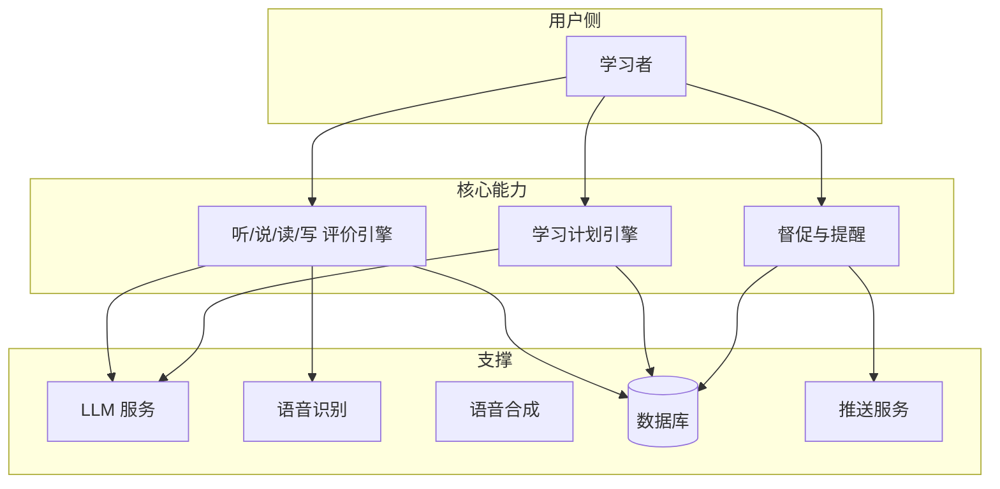

---

## 1. 业务模型

### 1.1 能力维度：听、说、读、写（全方位视角）

| 维度 | 教学重点 (Pedagogical Focus) | 典型输入 | 典型输出（评价） |
|------|------------------------------|----------|------------------|
| **听 (Listening)** | **解码能力**（辨音、连读、重弱读）+ **理解能力**（主旨、细节、推断、笔记策略） | 音频/视频（多口音、真实语料）+ 题目 | 正确率、笔记要点捕捉、解码障碍分析 |
| **说 (Speaking)** | **准确性**（发音/语法）+ **流利度** + **语用得体性**（Register/Politeness）+ **交际策略** | 任务驱动（Task-based）：复述、演讲、辩论、情景对话 | 综合评分、语用建议、表达地道性反馈 |
| **读 (Reading)** | **阅读策略**（略读/扫读/精读）+ **文本分析**（结构、逻辑、修辞）+ **批判性思维** | 真实文本（新闻/学术/文学）+ 题目/摘要 | 理解准确率、阅读速度、逻辑重构能力 |
| **写 (Writing)** | **过程写作**（构思/大纲/草稿/修订）+ **体裁意识**（Genre）+ **逻辑连贯** | 命题作文、改写、图表描述、邮件/论文 | 结构评分、连贯性分析、论证深度反馈 |

**支撑维度**：
- **语言知识**：词汇（语块/搭配）、语法（功能语法），不孤立考核，融入四维练习中。
- **跨文化能力**：理解语言背后的文化隐喻、习俗与价值观。
- **元认知策略**：学会如何学习（规划、监控、反思）。

### 1.2 水平阶段与评价标准（及考试映射）

采用 **CEFR** 作为核心标尺，并建立与主流国际考试的分数映射关系，便于考生定位。

| CEFR 等级 | 说明 | 雅思 (IELTS) | 托福 (TOEFL iBT) | 多邻国 (DET) | 典型能力 |
|-----------|------|--------------|------------------|--------------|----------|
| **A1/A2** | 基础/初级 | 0 - 3.5 | 0 - 31 | 10 - 55 | 简单日常交流，高频词汇 |
| **B1** | 中级下 | 4.0 - 5.0 | 32 - 59 | 60 - 85 | 应对熟悉话题，简单连贯表达 |
| **B2** | 中级上 | 5.5 - 6.5 | 60 - 93 | 90 - 115 | 专业讨论，理解抽象话题，学术入门 |
| **C1** | 高级下 | 7.0 - 8.0 | 94 - 114 | 120 - 140 | 流利学术表达，理解隐喻与长难句 |
| **C2** | 高级上 | 8.5 - 9.0 | 115 - 120 | 145 - 160 | 接近母语者，精准操控语言细微差别 |

**职场/求职参考**：常见英语岗位门槛——外企日常沟通/邮件会议约 **B2（雅思 5.5～6.0）**；海外研/博申请、高端商务谈判/演讲约 **C1（雅思 6.5～7.0，托福 94+）**。产品可据此在计划与报告中给出“距目标岗位水平差距”提示。

**评价方式**：

- **分维度等级**：听/说/读/写各自可有一个 CEFR 子等级（如 Listening B1, Speaking A2）。
- **考试预测分**：基于专项测评提供“雅思预测分”或“托福预测分”，并给出单项分（如“口语 6.0，流利度需提升”）。
- **综合等级**：由四维得分或子等级加权/规则综合得出，用于「当前水平」展示与计划目标。

### 1.3 学习计划与督促

- **计划内容**：每日/每周要完成的任务类型（如听力 1 篇、口语 3 条、阅读 1 篇、写作 1 篇）、建议时长、推荐素材难度。
- **计划生成**：根据「当前水平」「目标等级」「可用学习时间」「薄弱维度」由 LLM + 规则生成可执行计划，并支持用户微调。
- **计划更新**：根据完成率、最新测评结果与用户反馈，周期性（如每周）重新生成或调整计划。
- **督促**：在用户约定的学习时段或默认时间，通过推送/站内信/应用内提醒，按时提醒「今日任务」与未完成项，并可关联任务详情页或具体练习。

### 1.4 用户画像与目标

| 用户类型 | 典型需求 | 产品侧重点 |
|----------|----------|------------|
| **初学者** | 打好音标、词汇与基础听力、口语 | 音标与跟读、基础听力题、简单对话、词汇分级 |
| **中级学习者** | 强化流利度、阅读速度、写作逻辑 | 流利度与语法评分、精读/泛读、段落写作、逻辑结构反馈 |
| **高阶/学术** | 学术写作、演讲与专业听力（讲座、会议） | 学术写作维度、演讲评分、多口音/长段听力、专业词汇 |
| **职场/求职** | 邮件、会议、汇报、面试、海外岗位 | B2～C1 目标；对标雅思 6.0～7.0 / 托福 90+；商务场景与面试模拟 |

### 1.5 核心功能清单

以下为核心功能的结构化说明，与第 2～4 章评价体系、计划与督促设计一一对应。

#### 1.5.1 测评模块（入学测与周期性复测）

| 项目 | 说明 |
|------|------|
| **入学测构成** | 听（3～4 题，A1/B1/C1 自适应）、说（2～3 题，自我介绍/独白/讨论）、读（3～4 题）、写（2 题）；总耗时约 30～45 分钟，可分段完成。 |
| **复测周期** | 建议每 4～8 周一次复测；备考用户可缩短为每 2 周一次，用于预测分与弱项追踪。 |
| **等级输出** | 四维 CEFR 子等级（Listening/Speaking/Reading/Writing）+ 综合等级；可选考试预测分（雅思/托福/多邻国档位）。 |
| **报告与诊断** | 人物卡、四维雷达图、技能强弱诊断、趋势分析；置信度不足时展示等级区间并建议补充测评。详见 [2.5 综合水平评估与报告](#25-综合水平评估与报告)。 |

**用户流程**：新用户进入 → 引导完成入学测（可跳过则使用默认 A1）→ 生成首份水平报告与初始学习计划 → 周期性触发复测提醒并更新报告。

#### 1.5.2 听力练习

| 项目 | 说明 |
|------|------|
| **题型与形式** | 短对话、长独白、学术讲座；支持多速率播放（0.75x/1.0x/1.25x）；题目类型：细节、主旨、推理、笔记要点、多选/填空/匹配。 |
| **难度与素材** | 按 CEFR 分级（A1～C2）；支持多口音与真实语料；可关联考试题型（如雅思 Section、托福 Lecture）。 |
| **评分与反馈** | 客观题自动判分；听写/主观题由 LLM 按参考答案与要点评分；输出正确率、解码障碍分析（如连读/弱读识别）、理解层次反馈。 |
| **数据记录** | 单题得分、用时、错题入库；用于听力维度能力值计算与 SRS 复习推荐。 |

**技术依赖**：音频/视频存储与 CDN、多速率播放、LLM 听写/主观题评分；详见 [2.1 听力评价](#21-听力评价)。

#### 1.5.3 口语练习

| 项目 | 说明 |
|------|------|
| **任务类型** | 跟读（单句/段落）、自由回答（话题卡）、情景对话、考试专项（如雅思 Part 2 独白、托福综合口语）。 |
| **输入与交互** | 题目/话题/角色设定；端上录音并上传；可选播放标准音（TTS）跟读。 |
| **评分维度** | 发音准确性、流利度、语法、词汇、内容完整度、语用得体性；输出各维度分数 + 总分 + 简短反馈 + 2～3 条改进建议。 |
| **自动化链路** | ASR 转写（可选）→ 文本 + 音频送 LLM 或专用口语评分模型 → 结构化 JSON 落库；低置信度或临界分数可进入人工复核队列。 |

**用户侧呈现**：即时得分、维度雷达或条形图、可点击的改进建议、复听自己的录音与标准音对比。详见 [2.2 口语评价](#22-口语评价)。

#### 1.5.4 阅读练习

| 项目 | 说明 |
|------|------|
| **材料类型** | 精读（长难句解析、词汇注释、逻辑连接词）、泛读/略读（限时找主旨、寻读找细节）；真实文本（新闻/学术/文学），按主题与难度标签筛选。 |
| **题型** | 主旨题、细节题、推理题、词汇题、句子插入、段落排序等；支持多选、填空、匹配。 |
| **评估指标** | 正确率、阅读速度（WPM）、词汇覆盖率、长难句理解；主观/开放题由 LLM 语义匹配或要点评分。 |
| **学习支持** | 生词点击释义、篇章难度与 CEFR 标注、错题与解析入库并参与 SRS。 |

详见 [2.3 阅读评价](#23-阅读评价)。

#### 1.5.5 写作模块

| 项目 | 说明 |
|------|------|
| **题型** | 微写作（句子合并、改写）、图表/流程图描述（雅思 Task 1）、读-听-写综合（托福 Integrated）、独立议论文。 |
| **评分维度** | 任务响应、连贯与衔接、词汇资源、语法范围与准确性；考试题对齐官方 band descriptor，输出档位或换算分。 |
| **反馈形式** | 分维度得分与点评、支架式修改建议（诊断 + 示范）、范文或范文片段对照、可选的错误标注（Grammar/Error tagging）。 |
| **流程** | 用户选择或系统分配题目 → 提交文本 → LLM/写作评分模型批改 → 结果落库并更新写作维度历史。 |

可选：抄袭/重复检测、多轮修改与版本对比。详见 [2.4 写作评价](#24-写作评价)。

#### 1.5.6 学习计划

| 项目 | 说明 |
|------|------|
| **生成输入** | 当前等级、目标等级、周可用时长、薄弱维度、遗忘曲线/SRS 状态、可选考试类型与考试日期。 |
| **输出内容** | 周计划骨架 + 日任务列表（技能类型、建议时长、难度、推荐题目或素材范围）；备考模式下含「基础夯实 → 强化训练 → 模考冲刺」三阶段与倒计时。 |
| **更新逻辑** | 按完成率、掌握度与最新测评结果周期性（如每周）调整；完成率持续偏低则减量，进步明显则提难度或缩短周期；详见 [4.1 计划生成与更新](#41-计划生成与更新)。 |
| **与 SRS 结合** | 日任务中融入逾期复习项、错题巩固、弱项新题，优先级由公式计算（逾期/失败/低分加权）。详见 [4.2 间隔复习与任务优先级](#42-间隔复习srs与任务优先级)。 |

#### 1.5.7 督促系统

| 项目 | 说明 |
|------|------|
| **提醒内容** | 「今日任务」摘要、未完成项列表（如「还有 2 项：听力、写作」）、点击跳转至任务详情或具体练习。 |
| **时机** | 用户可配置每日提醒时间（如 9:00、19:00）；或系统按用户常活跃时段默认一次；当日未完成时在约定时间发送，避免重复打扰。 |
| **渠道** | App 推送、Web Push、站内信；可选邮件/短信（依赖《公用-订阅、消息推送系统设计》）。 |
| **激励** | 学习打卡、连续学习天数、徽章、积分；积分可兑换权益或增值服务（如人工督学）；可选排行榜与小组挑战。 |

详见 [4.3 提醒策略与推送](#43-提醒策略与推送)、[4.4 激励与督促机制](#44-激励与督促机制)。

#### 1.5.8 内容与题库管理

| 项目 | 说明 |
|------|------|
| **内容库** | 听力音频/视频、阅读篇章、口语话题与脚本、写作题目与范文；按 CEFR、主题、考试类型、技能点打标签。 |
| **题目标签与元数据** | 题目 ID、类型、难度、技能维度、考试对齐（如 IELTS Part 2）、使用次数与正确率统计；支持管理端 CRUD 与批量导入。 |
| **推荐与筛选** | 计划引擎与推荐服务按用户等级、弱项、SRS 状态从题库筛选题目；LLM 可参与「推荐题目或素材标签」，再由系统解析为具体题目 ID。 |

#### 1.5.9 教师/人工复核

| 项目 | 说明 |
|------|------|
| **触发条件** | LLM 超时/限流或解析失败、ASR 置信度低、评分处于临界档位（如 5.5/6.0 边界）、用户申诉。 |
| **管理端能力** | 「待评价列表」展示待复核的口语/写作作答；教师可打分、写评语、选择与 AI 评分仲裁（采纳人工或取平均）。 |
| **数据用途** | 复核结果写回用户档案与报告；可用于模型微调、Few-shot 样本与评分一致性校准。 |

详见 [3.3 降级与人工兜底](#33-降级与人工兜底)。

#### 1.5.10 社交与沉浸（可选扩展）

- **语言伙伴**：匹配学伴、语音/文字对话练习（需内容安全与隐私策略）。
- **小组挑战**：周/月目标、小组打卡、排行榜。
- **榜单与成就**：全站或好友维度学习时长、连续天数、等级进步榜；与徽章、积分联动。

以上为可选扩展，MVP 可不实现，在后续迭代中按优先级加入。

### 1.6 国际考试支持（专项特性）

针对 **IELTS (雅思)、TOEFL (托福)、Duolingo (多邻国)、PTE** 等考试提供深度支持。

**支持的考试简要说明**：

| 考试 | 全称 | 总分/档位 | 题型特点 | 常见用途 |
|------|------|-----------|----------|----------|
| **IELTS** | 国际英语语言测试系统 | 听/说/读/写各 0～9，总分 0～9 | 学术/培训两类；口语面对面；写作 Task1 图表/Task2 议论文 | 英联邦留学/移民/职场 |
| **TOEFL iBT** | 托福网考 | 各科 0～30，总分 0～120 | 综合任务多（听读说/听读写）；机考口语 | 北美留学/学术 |
| **Duolingo** | 多邻国英语测试 | 10～160 | 自适应、题型短平快；机考 | 部分院校替代托福/雅思 |
| **PTE** | 培生学术英语 | 各技能 10～90 | 全机考、听说读写综合题多 | 留学/移民 |

- **全真模考 (Mock Tests)**：
  - **流程还原**：严格模拟考试倒计时、界面交互（如托福阅读的界面布局、多邻国的题型切换）。
  - **题库同步**：剑桥雅思真题、TPO (托福在线练习)、机经预测题库。
- **专项题型训练**：
  - **口语**：雅思 Part 2 计时独白（1-2分钟）、Part 3 追问；托福独立/综合口语（听-读-说结合）。
  - **写作**：雅思小作文（图表/流程图分析）、大作文；托福综合写作（读-听-写）。
  - **听力/阅读**：支持多选题、匹配题、地图题（雅思特色）、句子插入题（托福特色）。
- **预测分与强项分析**：
  - 基于最近 3 次模考生成“预测分区间”。
  - 考前冲刺建议（如“离目标 7.0 还差口语 0.5，建议加强 Part 2 流利度”）。

### 1.7 产品 KPI

- **能力提升**：CEFR 等级提升、口语流利度分数、阅读理解准确率、写作分数。
- **学习行为**：学习坚持率、完成率、DAU/MAU、留存率。
- **商业**：付费转化率、人工督学等增值服务转化。

### 1.8 商业化模式与收入模型

**免费层 (Freemium)**：
- 每周 10 次免费练习（听/说/读/写混合）；同步评分入门版（简化反馈）。
- 无人工复核、无备考计划、月度报告。
- 目的：获取用户、验证学习效果、建立习惯。

**付费层 (Premium / 按年/月订阅)**：
- **订阅时价格**：
  - 月卡：¥79-99（约 15 美元）。
  - 季卡：¥199-229（约 30 美元，折扣 10%）。
  - 年卡：¥599-699（约 90 美元，折扣 20%）。
- **畅享内容**：无限练习、完整 AI 评分反馈（含支架式建议）、个性化计划生成、全天候提醒。
- **包含功能**：月周期报告、历史对标、进度追踪、考试预测分。
- **对标**：Duolingo Plus (年 70-170 美元)、Babbel (年 168 美元)。

**增值服务 (À la carte)**：
- **人工督学**（月 ¥199-299）：教师 1 对 1 答疑、周期反馈、计划调整；限 1 周 1 次，单次 15-30 分钟。
- **考试冲刺班**（¥499-699）：针对雅思/托福的 4 周集中训练、模考批改、口语单项突破；含人工评阅。
- **VIP 批改**（单笔 ¥29-49）：口语/写作题的人工优先批改与评语（与 AI 评分互补）。

**广告与B2B**（后期）：
- 内容广告（书、课程、留学服务）；佣金 5-15%。
- 企业版（API / 白标）：为上市公司（如链接app、教育平台）提供英语评测模块；按 API 调用次数或许可费。

**收入预测（年度，假设 100 万用户体量）**：
- 免费用户：50 万（贡献广告/冷启）。
- 付费用户：30 万（平均 ARPU ¥300/年 = 9000 万）。
- 增值服务：15 万用户，转化 5%（7500 人 × ¥500 = 375 万）。
- B2B / 企业版：500 万（随后期增长）。
- **总预估**：~1.3 亿人民币/年。

### 1.9 核心指标 (KPI) 与追踪

| KPI 类别 | 指标 | 目标 | 追踪频率 |
|---------|------|------|---------|
| **获取 (Acquisition)** | 新注册用户数 (MoM) | 每月环比增长 15% | 日 |
| | 付费转化率 | ≥ 3% (freemium 标准) | 周 |
| | CAC (Customer Acquisition Cost) | ≤ ¥30 | 月 |
| **留存 (Retention)** | Day 7 留存率 | ≥ 35% | 周 |
| | Day 30 留存率 | ≥ 15% | 周 |
| | Churn 率 (月度) | ≤ 8% | 月 |
| **活跃 (Engagement)** | DAU / MAU | N/A | 日 |
| | 周学习日数均值 | ≥ 3.5 天 | 周 |
| | 日均练习次数 | ≥ 2 次 | 周 |
| **学习效果** | CEFR 升级人数占比 | ≥ 40% (周期内) | 月 |
| | 平均得分提升 | 预期 20 分（百分制） | 月 |
| | 完成率 (计划) | ≥ 60% | 周 |
| **商业** | LTV (Life Time Value) | ≥ 600 元 | 月 |
| | LTV / CAC 比 | ≥ 20:1 | 月 |
| | ARPU (Average Revenue Per User) | ¥15-25/月 (付费） | 月 |
| **质量** | 评估准確性 (与人工 correlate) | ≥ 0.85 | 周 |
| | 推荐点击率 (CTR) | ≥ 20% | 周 |
| | Bug/Crash 率 | ≤ 0.1% | 日 |

---

## 2. 听、说、读、写评价体系

### 2.1 听力评价

**教学视角**：结合**自下而上 (Bottom-up)** 的语音解码训练（如听写、辨音）与**自上而下 (Top-down)** 的意义构建训练（如主旨大意、预测推理）。

**题型与形式**：

- **辨音与解码**：最小对立体（Minimal Pairs）、连读/弱读填空；训练耳朵对语音流的切分能力。
- **信息获取**：听音填表、关键词捕捉；训练对特定信息的扫描能力。
- **综合理解**：主旨选择、推理判断、笔记整理（Note-taking）；训练逻辑重构与记忆。

**评估指标**：

- 正确率、关键词捕捉、速记得分、理解深度（主旨/细节/推理）、语音解码能力（连读/失爆识别）。

**自动化方法**：

- 题目答案匹配、语义相似度（句向量）、多项选择与主观答案的 NLP/LLM 判分。

**流程**：

1. 用户选择/系统分配听力材料（按等级、话题）；支持多速率播放（如 0.75x/1x/1.25x）。
2. 播放音频/视频，展示题目；用户提交答案（可限时）。
3. 客观题自动批改；主观题与「听写」类送 LLM 评价，写入评价结果与建议。
4. 汇总当次正确率、得分、错题与改进建议，更新听力维度历史。

**技术依赖**：媒体播放（前端）、题目与答案存储、LLM 接口（主观题与听写判定）。

### 2.2 口语评价

**教学视角**：从**准确性 (Accuracy)** 走向**流利度 (Fluency)** 与**复杂性 (Complexity)**，强调**语用得体性 (Pragmatics)** 与**交际策略 (Communicative Strategies)**。支持雅思/托福**综合口语**（Integrated Tasks）。

**题型与形式**：

- **基础训练**：跟读 (Shadowing)、句子朗读；重点在音素准确与韵律。
- **考试专项**：
  - **IELTS Part 2**：抽卡 1 分钟准备 + 2 分钟独白；LLM 评价逻辑结构与时长控制。
  - **TOEFL Integrated**：听一段讲座/看一段文章 -> 口头总结；评估“听读信息的覆盖率”与“转述准确性”。
- **交互式对话**：Role-play、辩论、IELTS Part 3 深度问答。

**评估指标**：

- 发音准确性（音素级/韵律）、流利度、词汇多样性、语法复杂度、语用恰当性、交际策略、**信息完整度（综合口语重点）**。

**自动化方法**：

- ASR 转写 + 发音评分（CTC/可训练声学模型或端到端口语评分模型）、语义完整度评分（semantic similarity）、流利度统计（语速、停顿时长）。

**人工复核策略**：ASR 置信度低或评分处于边缘（如临界等级）的作答，可交由人工复核；复核结果用于仲裁与模型校准。

**流程**：

1. 用户选择口语任务类型与难度，获取题目/话题/对话角色。
2. 端上录音并上传音频（或实时流式上传）。
3. 服务端 ASR 转写（可选），将文本 + 音频（或仅文本）送 LLM 或专用口语评分模型，按维度打分（发音、流利度、语法、内容等）并生成反馈。
4. 结果落库并更新口语维度历史；可展示得分、维度雷达图与具体建议。

**技术依赖**：录音与上传、ASR（可选）、LLM 或口语评分模型、TTS（若需标准音跟读）。

### 2.3 阅读评价

**教学视角**：培养**阅读策略**（Skimming/Scanning）与**文本分析能力**（Text Analysis），从“学着读 (Learning to Read)”过渡到“通过读来学 (Reading to Learn)”。

**题型与形式**：

- **策略训练**：限时略读（找主旨）、寻读（找细节）；训练阅读速度与策略。
- **精读分析**：长难句解析、代词指代、逻辑连接词分析；训练语言知识的语境应用。
- **批判性阅读**：区分事实与观点、作者态度分析、跨文本比较；训练高阶思维。

**评估指标**：

- 正确率、阅读速度（WPM）、词汇覆盖率、长难句理解、逻辑推断能力、批判性思维（Bias 识别）。

**自动化方法**：

- 多选/简答自动判分、阅读速度统计、答案语义匹配（句向量或 LLM）。

**流程**：

1. 按等级与话题分配合适篇章，展示题目；支持精读/泛读材料与词汇注释。
2. 用户提交答案；客观题自动批改，主观题与开放题送 LLM 评价。
3. 记录得分、正确率、阅读速度、错题与反馈，更新阅读维度历史。

**技术依赖**：题目与篇章管理、LLM 阅读评分与解析。

### 2.4 写作评价

**教学视角**：采用**过程写作法**，支持**学术写作 (Academic Writing)** 规范，覆盖雅思/托福各类 Task。

**题型与形式**：

- **微写作**：句子合并、改写；重点在句法多样性。
- **考试专项**：
  - **IELTS Task 1**：图表/地图/流程图描述；LLM 评估“数据抓取准确性”与“对比趋势描述”。
  - **TOEFL Integrated**：读文听讲座 -> 写综述；LLM 评估“阅读与听力观点的对应关系”及反驳逻辑。
- **独立写作**：议论文 (Opinion Essay)；重点在论证深度与逻辑衔接。

**评估指标**：

- 任务响应、连贯与衔接、词汇资源、语法范围与准确性、体裁规范性、**信息整合能力（综合写作重点）**。

**自动化方法**：

- 文本质量模型（基于大模型或微调的评分器）、错误检测器（Grammar/Error tagging）、可解释修正建议（LLM 或规则）。

**流程**：

1. 用户选择或系统分配写作任务，提交文本。
2. 文本送 LLM 或写作评分模型，按既定维度（如 Task Response, Coherence, Vocabulary, Grammar）打分并生成反馈、范文对照与改写建议。
3. 结果落库并更新写作维度历史；可展示维度得分与可点击的改进建议。

**技术依赖**：LLM 或写作评分模型；可选抄袭/重复检测。

### 2.5 综合水平评估与能力映射算法

#### 2.5.1 综合测评与初级等级定维

**综合测评构成**：

- **听力**（3-4 题）：1 题 A1 级、1 题 B1 级、1 题 C1 级，自适应选择题难度。
- **口语**（2-3 题）：自我介绍（A1）、话题独白（B1）、深度讨论（C1）。
- **阅读**（3-4 题）：词汇题（A1）、理解题（B1）、推理题（C1）。
- **写作**（2 题）：句子填空（A1）、段落作文（B1）、议论文（C1）。

**总耗时**：30-45 分钟；可分两天完成或一次性完成。

#### 2.5.2 各维度得分聚合与 CEFR 映射

**原始分转换算法**：

```
对每项练习，记录：
  - raw_score: 实际得分（百分制 0-100）
  - max_score: 该题满分
  - difficulty: 题目难度（A1/A2/B1/B2/C1/C2）
  - skill: 技能维度（listening/speaking/reading/writing）

为每个技能维度计算「加权平均能力值」：

  1. 按题目难度档位聚合：
     - 若题目难度为 A1，得分作为"A1 能力段"样本
     - 若题目难度为 B1，得分作为"B1 能力段"样本
     - ...

  2. 采用「能力评分模型」（Ability Scale Model），参考 IRT（项目反应理论）：
     - 难题答对
 → 能力值 +20
     - 中等难题答对 → 能力值 +10
     - 易题答对 → 能力值 +3

  3. 计算单项维度的「加权分数」：
     weighted_score = Σ(raw_score_i × weight_i × difficulty_weight_i) / Σ(weight_i)
     
     其中：
       - weight_i：近期题目的时间衰减（指数衰减，最近题目权重更高）
       - difficulty_weight_i：题目难度的权重系数（难题权重 > 易题权重）
```

**CEFR 等级映射**：

| 能力值范围 | CEFR 等级 | 特征 | 建议下一步 |
|-----------|----------|------|---------|
| 0-20 | A1 | 无法理解简单表达 | 从音标和基础词汇开始 |
| 21-40 | A2 | 理解熟悉话题，表达不连贯 | 强化日常交流与基础语法 |
| 41-60 | B1 | 大致理解，简单连贯表达 | 提升流利度与语法精准度 |
| 61-75 | B2 | 理解较复杂话题，较流利表达 | 强化学术与职场表达 |
| 76-90 | C1 | 流利表达，理解隐喻与细微差别 | 追求近似母语的精准度 |
| 91-100 | C2 | 接近母语者 | 维持与微调 |

**子维度计算**：

对每个技能（听/说/读/写）单独计算，得到 4 个子等级：
```
  listening_level = map_to_cefr(listening_weighted_score)
  speaking_level = map_to_cefr(speaking_weighted_score)
  reading_level = map_to_cefr(reading_weighted_score)
  writing_level = map_to_cefr(writing_weighted_score)

综合等级（取较保守估计）：
  overall_level = min 或 median(listening, speaking, reading, writing)
```

**示例**：
```json
用户张三第一次综合测评结果：
- listening_score: 52（题目难度 A1/B1/B2，平均表现）→ listening_level = B1
- speaking_score: 35（流利度差，仅能简单回答）→ speaking_level = A2
- reading_score: 58（理解力可，但速度慢）→ reading_level = B1
- writing_score: 45（句式单调，连贯性弱）→ writing_level = A2/B1

综合等级取中位数：overall_level = B1
但报告指出"说和写较弱，重点改进方向：流利度和写作逻辑"
```

#### 2.5.3 评估准确性与噪声处理

**置信度计算**：

为避免单次测评噪声，引入置信度指标：

```
  confidence = min(1.0, sample_count / 20 * trend_stability)
  
  其中：
    - sample_count：该维度累计作答数（≥20 时置信度趋于 1.0）
    - trend_stability：最近 5 次评分趋势的方差倒数
                     （方差小 = 稳定 = 置信度高）

  当 confidence < 0.5 时：
    - 显示等级范围而非单一等级（如"A2~B1"）
    - 建议用户进行补充测评
```

**稳定性监控**：

```
  若同一维度最近 3 次测评差值 > 10 分：
  → 可能原因：练习强度不一致、环境变化、评分波动
  → 应自动标记为"可能误差"，采用历史均值而非最新值
  → 用户端展示"这次评分可能偏低，建议再练一次确认"
```

#### 2.5.4 学习报告与进度追踪

**周期性报告内容**：

1. **人物卡 (User Card)**：该周学习快照
   ```
   ┌─────────────────────────────────┐
   │ 本周学习总结（2026-02-03~09）   │
   │ 学习时长: 5.5 小时 / 目标 7 小时  │
   │ 完成率: 78% (10/13 任务)          │
   │ 练习次数: 42 次 (听12 说8 读11 写11) │
   │ 等级变化: B1 → B1（稳定）       │
   │ 进度: 距 B2 还差 15 分            │
   └─────────────────────────────────┘
   ```

2. **四维雷达图**：当前 vs 目标 vs 周期前
   - 中心点：当前水平
   - 蓝线：目标水平
   - 虚线：上周水平
   - 颜色：接近目标为绿，有差距为黄/红

3. **技能强弱诊断**：AI 生成的结构化诊断
   ```
   强项（可以发挥）：
   - 阅读：理解力 B2 级，词汇覆盖率 78%
   - 听力：细节捕捉准确，但连读识别还需加强
   
   弱项（需要重点突破）：
   - 口语流利度：平均停顿 0.8s（目标 <0.3s）
   - 写作连贯性：逻辑转折词使用频次低，建议加强 cohesive devices
   
   数据支撑：
   - 口语最近 3 次测评平均分 6.2，低于同等级均值 7.0
   - 写作 Task Response 维度得分 7/10，但 Coherence 仅 5/10
   ```

4. **趋势分析（4 周以上）**：折线图 + 预测
   ```
   按周或按题型显示得分轨迹；用机器学习预测：
   - 若当前速率，预计 4 周后升至 B2 吗？(线性回归预测)
   - 如果保持当前练习强度，哪个维度最可能成为瓶颈？
   ```

5. **AI 生成总结与建议**：
   ```
   示例文案 (LLM 生成)：
   "本周你表现稳定！✨ 虽然等级暂未提升，但我们看到：
   📈 读和听进步明显（都 +3 分），说和写略有波动。
   💡 建议：下周加强口语流利度训练（增加 3 项跟读），
      同时补充写作连接词练习包（预计周末完成）。
   🎯 按目标 B2，预计还需 3-4 周，冲刺吧！"
   ```

### 2.6 评分与反馈呈现

- **分数体系**：原始分 + 能力等级（CEFR）+ 能力雷达图 + **技能短板诊断**（如“听力-弱读识别弱”、“写作-逻辑连接词匮乏”）。
- **支架式反馈 (Scaffolding Feedback)**：
  - **诊断**：指出具体错误（如语法错误、逻辑跳跃）。
  - **支架**：提供修改提示（如“尝试使用 however 来连接转折关系”）、相关知识点链接。
  - **示范**：提供 2-3 种不同水平的优秀范例（Model Text）。
- **时间线视图**：展示能力维度的**动态变化**，而非仅分数波动；关联练习行为与能力提升的相关性（“你通过 10 次跟读，流利度提升了 5%”）。

---

## 3. LLM 集成与提示设计

### 3.1 评价类调用

**共性要求**：输出结构化（JSON），便于解析与落库；限定分数区间与维度，避免随意打分。

**口语评价 Prompt 要点**：

- 输入：题目/话题、参考要点、用户 ASR 文本（及可选：音频描述或时长）。
- 输出：各维度分数（如 pronunciation, fluency, grammar, vocabulary, content）、总分、简短反馈、2～3 条改进建议。
- 约束：分数 0～100 或 1～9 档位；反馈与建议用中文或英文可配置。

**写作评价 Prompt 要点**：

- 输入：题目、要求、用户作文。
- 输出：各维度分数（如 task_response, coherence, vocabulary, grammar）、总分、分维度点评、修改建议或范文片段。
- 约束：与口语类似，明确区间与语言。

**听写/主观题评价**：

- 输入：题干、参考答案/要点、用户答案。
- 输出：对错或得分、理由、可接受的同义表述说明。

**考试专项评分对齐**：IELTS/TOEFL 等题型的评分维度与档位需对齐官方描述（如 IELTS 1～9、TOEFL 0～30）。在 Prompt 中引用或摘要官方 band descriptor / rubric，保证「预测分」可解释、可校准；模型迭代后需用「金标作答 + 人工分数」回归集校验相关性。

**综合任务 Prompt 要点**（听读说/听读写）：
- **输入**：阅读材料摘要、听力转写（或关键信息点）、用户输出（口语转写/作文）。
- **输出**：信息覆盖度（阅读/听力要点是否被提及）、转述准确性、逻辑与语言质量；综合写作还需「阅读与听力观点的对应关系」及反驳逻辑是否清晰。
- **约束**：分数区间与考试一致（如托福口语 0～4 再换算 0～30）；反馈需指出漏掉的要点或错误转述。

**score_details 结构示例**（便于前后端与 LLM 统一）：

```json
{
  "pronunciation": 6,
  "fluency": 5,
  "grammar": 6,
  "vocabulary": 5,
  "content": 6,
  "overall": 5.5,
  "feedback": "Part 2 逻辑清晰，但 Part 3 追问时停顿较多，可多练衔接词。",
  "suggestions": ["增加 however / in addition 等连接词", "控制填充词 um/uh 频率"]
}
```

写作可类似：`task_response`, `coherence`, `vocabulary`, `grammar` 等；考试题可增加 `band` 或 `scaled_score` 字段。

所有评价结果需做**解析校验**（必填字段、数值范围）；解析失败时重试或降级为「仅保存原始作答，标记待人工评阅」。

### 3.2 计划与内容生成

- **学习计划生成**：输入为当前等级、目标等级、可用时间（如每天 30 分钟）、薄弱维度、计划周期（如 4 周）。输出为结构化周计划与日任务列表（类型、建议时长、难度、可选素材范围）。
- **报告总结生成**：输入为周期内练习与得分汇总。输出为一段用户可读的学习总结与 2～3 条下阶段建议。
- **题目/素材推荐**：根据等级与薄弱项，由 LLM 推荐题目 ID 或素材标签，再由系统从题库中筛选具体题目。

### 3.3 降级与人工兜底

- **超时/限流**：LLM 调用超时或限流时，客观题仍按规则批改；主观题可标记「待评价」并稍后重试或进入人工评阅队列。
- **解析失败**：重试 1～2 次；仍失败则保存原始输出与用户作答，标记为待人工，避免阻塞用户。
- **人工评阅**：管理端提供「待评价列表」，支持教师/运营对口语、写作等题目打分与写评语，结果写回后与 LLM 评价同等使用，并可用于后续模型微调或 Few-shot 样本。

---

## 4. 学习计划与督促

### 4.1 计划生成与更新

**教学原则**：采用**螺旋式上升 (Spiral Curriculum)** 策略，核心知识点与技能在不同阶段以递增的复杂度重复出现；结合**最近发展区 (ZPD)** 理论，推送略高于用户当前水平（i+1）的任务。

- **输入**：当前等级、目标等级、可用时间、薄弱维度、**遗忘曲线状态**、**考试日期（备考模式）**。
- **输出**：
  - **日任务**：技能组合，包含复习与新知。
  - **周目标**：本周重点突破的微技能。
  - **备考倒计时**（若设定考试日）：按“基础夯实 → 强化训练 → 模考冲刺”三阶段排期；临考前增加全真模考频率。
- **备考三阶段定义**：
  - **基础夯实**（距考试 8 周以上）：以词汇、语法、四维基础为主；每日任务中 SRS 与基础题占比高。
  - **强化训练**（距考试 4～8 周）：专项题型（如雅思 Part 2、托福综合写作）+ 弱项突破；计划中增加考试题型占比。
  - **模考冲刺**（最后 2～4 周）：全真模考频率提高（如每周 1～2 套）；错题复盘与预测分追踪；减少新知识输入，以巩固与应试策略为主。
  - 计划引擎根据「考试日期 − 当前日期」自动判断阶段并调整任务配比。
- **更新逻辑**：基于完成率与 Mastery Level（掌握度）动态调整；若某知识点未掌握，计划会自动安排降级复习（Scaffolding）而非简单重复。

#### 4.1.1 计划参数与约束

**用户输入参数**：current_level(当前等级) | target_level(目标) | weekly_minutes(周时长) | weak_skills(弱项) | exam_type/exam_date(备考) | plan_duration_weeks

**系统约束**：
- 等级进步预期：A1-A2 需 4-12 周 | A2-B1 需 6-16 周 | B1-B2 需 8-20 周 | B2-C1 需 12-32 周
- 每日时长范围：15-120 分钟（超出自动调整）
- 技能占比：无弱项 25% 各 | 有弱项 40% weak + 20% others

#### 4.1.2 动态调整规则

| 触发条件 | 调整行动 | 幅度 |
|---------|--------|------|
| 完成率 < 50% x 3 天 | 降低日任务量 | -20% |
| 完成率 > 80% + 分数 > 75% | 加速计划,缩短周期 | -1 week |
| 掌握度 < 60% | 自动增加复习项 | +2 tasks |
| 等级升级 | 提升难度档位 | +0.5-1 level |
| 距考试 <= 14 天 | 切换冲刺模式 | 50% 模考占比 |

### 4.2 间隔复习 (SRS) 与任务优先级

#### 4.2.1 SM-2 算法与计算示例

**改进 SM-2 公式**：
$$\text{EF}_{new} = \text{EF}_{old} + (0.1 - (5 - q) \times 0.08)$$
$$I_{n+1} = I_n \times \text{EF}$$

初值：$I(1)=1$ 天, $I(2)=3$ 天, $\text{EF}_{initial}=2.5$

**实例**：词汇"serendipity"复习轨迹  
- 创建：2026-02-01, EF=2.50
- 复习 1 (2-02, q=4)：EF=2.52, 下次 3 天后 → 2026-02-05
- 复习 2 (2-05, q=5)：EF=2.62, 下次 8 天后 → 2026-02-13
- 复习 3 (2-13, q=3)：EF=2.56, 下次 21 天后 → 2026-03-06

#### 4.2.2 优先级计算与任务分配

**优先级公式**：
$$Priority = Base \times f_{weak} \times f_{overdue} \times f_{failure} \times f_{score}$$

其中：$f_{weak}=1.5$ (弱项) 或 1.0 | $f_{overdue}=1+(days \times 0.2)$ (逾期) | $f_{failure}=1.3$ (失败) | $f_{score}=1.4$ (低分)

**四维时长分配**：
- 基础：各 25%
- 弱项调整：weak 40% → others 20% 各
- 掌握度调整：mastery<60% → ×1.2

**优先级梯队**：
- T1 紧急(30-40%)：逾期 SRS + 错题
- T2 重要(30-40%)：弱项新题 + 近期错题  
- T3 常规(20-30%)：当前级巩固
- T4 拓展(5-10%)：更高级预习

### 4.3 提醒策略与推送

- **提醒主题**：复用推送系统的「主题」设计，例如 `en_learning_remind`（学习提醒）。
- **提醒内容**：标题 + 正文摘要（如「今日还有 2 项未完成：听力、写作」）+ 点击跳转至「今日任务」或具体练习。
- **时机**：用户可配置每日提醒时间（如 9:00、19:00）；或由系统在「用户常活跃时段」内选取一个默认时间。若当日有未完成任务，可在约定时间发送一次，避免重复打扰。
- **渠道**：App 推送、Web Push、站内信、可选邮件/短信（按现有推送能力接入）。
- **与计划联动**：计划服务根据「今日任务」与完成状态，在到达提醒时间时调用推送服务的「发送消息」接口，消息体来自计划与任务数据。

### 4.4 激励与督促机制

- **多渠道提醒**：App 推送、邮件、短信（按现有推送能力接入），用户可配置渠道与时间。
- **学习打卡**：连续学习天数统计、打卡日历展示，可关联徽章与成就。
- **激励机制**：徽章、积分、连续学习天数展示；积分可兑换权益或人工督学等增值服务（可选）。
- **人工督学**（付费）：教师/督学定期查看进度、发送语音或文字督促、调整计划建议。

### 4.5 弹性调整与人工督学

- **弹性调整**：根据完成率与测评结果动态调整计划（如完成率持续偏低则降低每日任务量或延长周期；进步明显则提高难度或缩短目标达成时间）。
- **人工督学选项**：付费用户可开通人工督学，由教师查看学习数据、发送督促并参与计划微调。

### 4.6 计划生成案例与流程图

#### 4.6.1 完整计划生成流程

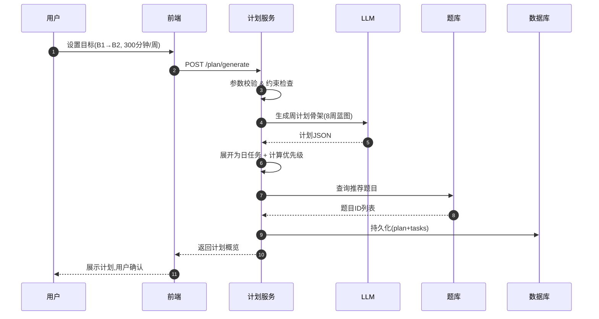

#### 4.6.2 B1→B2 计划案例（8周, 300分钟/周）

**计划概览**：
```
第 1-3 周：基础巩固
├─ 听力：维持 B1，加强学术类
├─ 口语：重点流利度(40% 时间)  
├─ 阅读：B1→B2 过渡
├─ 写作：段落逻辑(40% 时间)
└─ 每周 SRS 复习 2 次

第 4-6 周：强化训练
├─ 四维均衡 B2 难度
├─ 口语：Part 2 时间控制  
├─ 写作：论证深度
└─ 每周 SRS 3 次 + 1 次评测

第 7-8 周：冲刺阶段
├─ 60% 时间强化弱项(口语+写作)
├─ 全真模考 2 次
└─ 最后查漏补缺
```

**第 1 周日计划示例（周一）**：

| 时段 | 技能 | 任务 | 时长 | 题目推荐 | 目标 |
|------|------|------|------|--------|------|
| 08:00-08:25 | Listening | 学术讲座+笔记 | 25min | Q2341/2/3 | 70%+ 正确率 |
| 08:25-08:50 | Speaking | 2分钟独白 | 25min | Q3201 | <0.3s/次 停顿 |
| 08:50-09:00 | Vocab | SRS 复习 | 10min | SRS队列 | 80%+ 正确率 |


- **多渠道提醒**：App 推送、邮件、短信（按现有推送能力接入），用户可配置渠道与时间。
- **学习打卡**：连续学习天数统计、打卡日历展示，可关联徽章与成就。
- **激励机制**：徽章、积分、连续学习天数展示；积分可兑换权益或人工督学等增值服务（可选）。
- **人工督学**（付费）：教师/督学定期查看进度、发送语音或文字督促、调整计划建议。

### 4.5 弹性调整与人工督学

- **弹性调整**：根据完成率与测评结果动态调整计划（如完成率持续偏低则降低每日任务量或延长周期；进步明显则提高难度或缩短目标达成时间）。
- **人工督学选项**：付费用户可开通人工督学，由教师查看学习数据、发送督促并参与计划微调。

---

## 5. 自适应与推荐算法

- **学习者模型**：维护用户能力向量（听/说/读/写子维度）与学习偏好、错题历史、学习节奏（如每日可用时段与时长），用于推荐与难度调节。
- **推荐策略**：强化学习或多臂老虎机（MAB）用于优化「下次练习选择」（题目或技能维度）；冷启动采用基于规则的课程路径（按等级与目标生成固定序列）。
- **题目/内容标签化**：主题、语法点、词汇等级、语速、口音等标签，用于精细匹配与检索；向量/语义检索（如 Milvus/FAISS + Embedding）可辅助相似题与推荐。
- **个性化难度调节**：基于即时正确率调整题目难度，保证 70%～85% 的「可学习难度」区间，避免过难或过易。

---

## 6. 系统架构

### 6.1 功能模块划分

按功能将系统拆分为以下模块，便于边界清晰、独立迭代与排期。

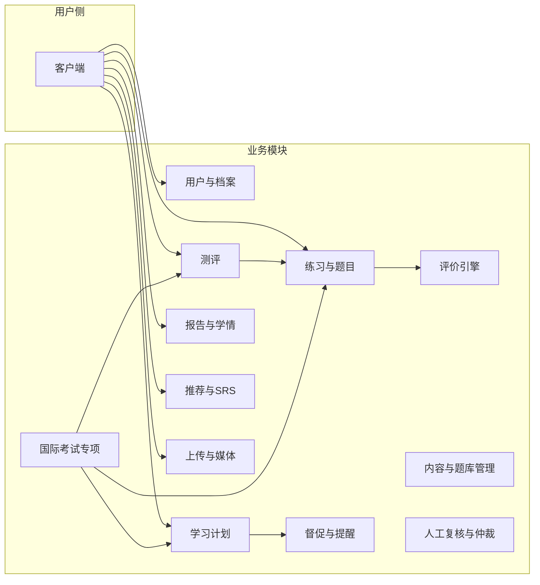

| 模块编号 | 模块名称 | 职责摘要 | 主要 API（章节 8） | 主要数据（章节 7） |
|----------|----------|----------|-------------------|---------------------|
| **M1** | **用户与档案** | 英语档案的读写（等级、目标、提醒时间、考试类型/日期/目标分） | GET/PATCH profile | user_english_profiles |
| **M2** | **测评** | 入学测/复测/综合测评：组卷、提交、结果汇总与 CEFR 映射 | GET assessment, POST sessions/answers, GET sessions/:id | en_questions, en_practice_sessions, en_practice_answers |
| **M3** | **练习与题目** | 题目与内容的查询、推荐；练习会话的创建与作答提交 | GET questions, POST sessions, POST sessions/:id/answers | en_questions, en_contents, en_content_tags, en_practice_* |
| **M4** | **评价引擎** | 接收作答（文本/音频），调用 ASR/LLM/评分模型，写回 score/score_details；异步评价队列 | 内部调用，无单独对外 API | en_practice_answers（更新 score/evaluated_at） |
| **M5** | **学习计划** | 计划生成/更新、今日任务、备考三阶段、任务完成标记 | GET plan/current, POST plan/generate, PATCH plan/:id, POST tasks/:id/complete | en_learning_plans, en_plan_tasks |
| **M6** | **督促与提醒** | 按用户提醒时间定时查未完成任务，调用推送服务发送提醒；打卡/徽章/积分（可选） | 无直接 C 端 API（计划服务内触发） | en_remind_logs；对接 Push 主题 en_learning_remind |
| **M7** | **报告与学情** | 学习汇总、等级历史、周期报告生成、预测分与薄弱项 | GET report/summary, level-history, POST report/generate | 读 en_practice_*, user_english_profiles；可写报告缓存表 |
| **M8** | **内容与题库管理** | 内容/题目/标签的 CRUD（管理端）；题目版本化 | POST/PATCH admin/contents, admin/questions | en_contents, en_tags, en_content_tags, en_questions |
| **M9** | **人工复核与仲裁** | 待评阅任务列表、分配、提交人工分、仲裁规则写回答案表 | GET/POST admin/reviews/*, POST reviews/appeal | en_review_tasks, en_review_results, en_practice_answers |
| **M10** | **推荐与 SRS** | 下次练习推荐、反馈上报；SRS 复习队列与复习提交；学习者模型/MAB | GET recommendations/next, POST feedback, GET srs/queue, POST srs/:id/review | en_reco_impressions, en_reco_feedbacks, en_srs_items, en_srs_reviews, en_wrong_items |
| **M11** | **上传与媒体** | 预签名上传 URL、上传完成回调；音视频存储与转码（可选） | POST uploads/presign, POST uploads/complete | 对象存储；无独立业务表 |
| **M12** | **国际考试专项** | 模考流程、考试题型路由、预测分展示、备考计划分支（与 M2/M3/M5 协同） | 复用 questions/sessions/plan，增加 examType/examDate 等参数 | 复用档案/题目/计划表；题目通过 exam_type/taskType 筛选 |

**模块依赖关系**：

- **M2 测评** 依赖 M3（题目与会话）、M4（评分）。
- **M5 学习计划** 依赖 M1（档案）、M10（推荐可选）、M6（触达）；备考分支依赖 M12 逻辑。
- **M4 评价引擎** 依赖 LLM/ASR/Storage，写回 M3 使用的作答表。
- **M7 报告** 读 M1/M3 数据，可调用 LLM 生成摘要。
- **M12** 不单独建表，通过参数与标签扩展 M2、M3、M5。

**实施建议**：MVP 可先实现 M1、M2、M3、M4、M5、M6、M7、M11；M8/M9 为管理/运营能力；M10、M12 可在二期迭代。

---

### 6.2 整体架构

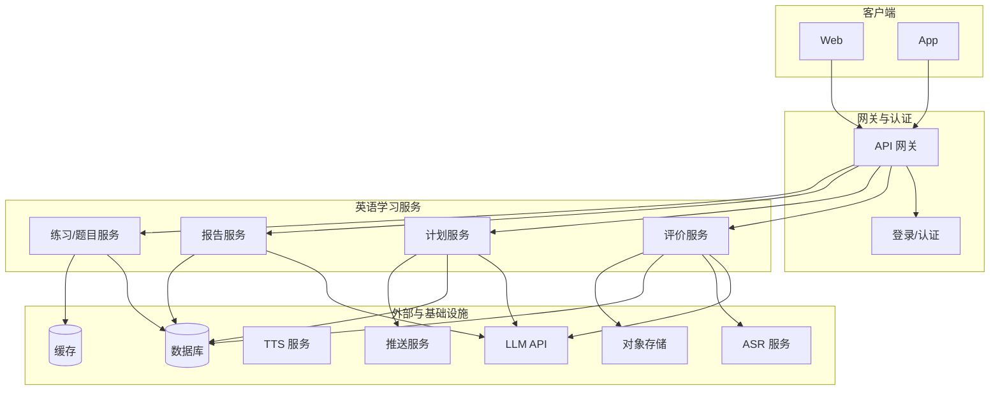

### 6.3 核心服务

| 服务 | 对应模块 | 职责 | 主要依赖 |
|------|----------|------|----------|
| **评价服务** | M4 评价引擎 | 接收练习作答（文本/音频），调用 LLM/ASR，写回得分与反馈，更新维度历史 | LLM, ASR, DB, Storage |
| **练习/题目服务** | M2 测评、M3 练习与题目、M12 考试专项 | 题目与素材的 CRUD、按等级与维度推荐、练习会话的创建与提交 | DB, Cache |
| **计划服务** | M5 学习计划、M6 督促与提醒 | 生成/更新学习计划，计算「今日任务」与完成状态，触发提醒 | LLM, DB, Push |
| **报告服务** | M7 报告与学情 | 综合测评、周期报告、进步追踪与报告摘要生成 | LLM, DB |
| **推送服务** | M6 督促与提醒 | 沿用现有订阅与消息推送，接收计划服务的发送请求 | 见《公用-订阅、消息推送》 |

说明：M1 用户与档案、M8 内容与题库管理、M9 人工复核、M10 推荐与 SRS、M11 上传与媒体可由上述服务承载或独立微服务实现，见 6.1 模块划分。

### 6.4 模型平台与数据层

**模型平台**：

- **ASR 服务**：实时与离线两套——低延迟流式（实时跟读/对话）与批量评分（离线转写与评分）。
- **口语评分模型**：端到端或两阶段（ASR + 评分）；可与 LLM 并联或作为主评分源。
- **写作评分与 NLP 服务**：文本理解、相似度、错误检测（Grammar/Error tagging）、可解释修正建议。
- **TTS**（可选）：自然朗读示例、跟读标准音。

**数据层**：

- **用户数据 DB**：关系型库，加密存储用户档案、计划、题目与作答元数据。
- **练习/日志时序库**：用于行为分析与推荐（如 InfluxDB、ClickHouse）。
- **模型训练数据湖**：脱敏语音与文本，用于模型迭代与评估。

### 6.5 实时与批处理

- **实时处理**：流式评分与即时反馈（口语/写作提交后尽快返回结果）；ASR 流式转写。
- **批处理**：模型训练、周期性报表、个性化策略离线计算（如推荐列表、间隔复习队列）。
- **可扩展性**：容器化 + 弹性伸缩 + 模型水平扩展（GPU 集群或推理服务）。

---

### 6.6 核心流程（时序）

#### 6.6.1 入学测评（听/说/读/写）

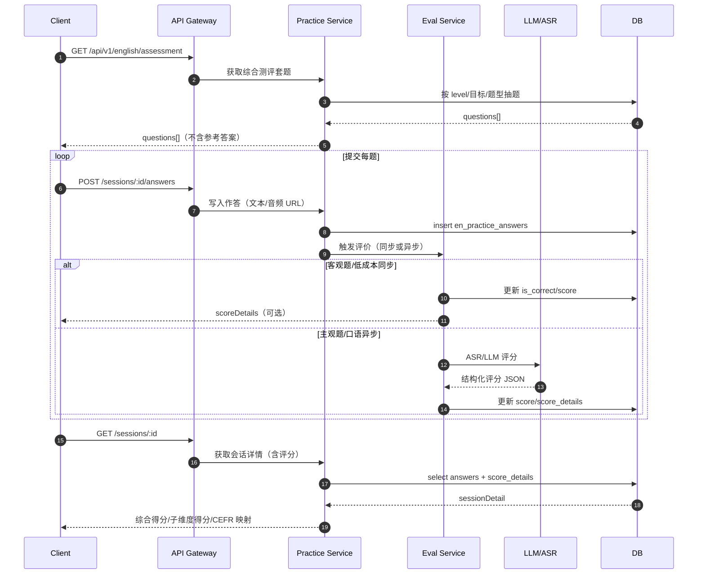

#### 6.6.2 练习提交 → 异步评估 → 结果回传

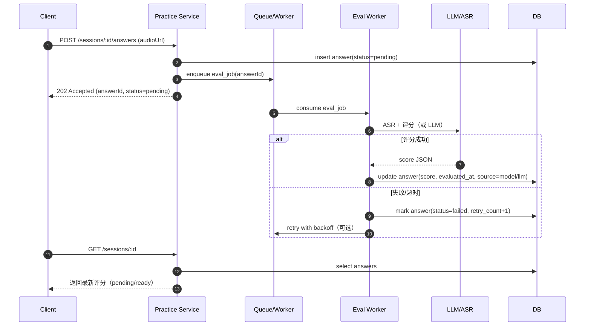

#### 6.6.3 计划生成 → 今日任务 → 定时提醒触达

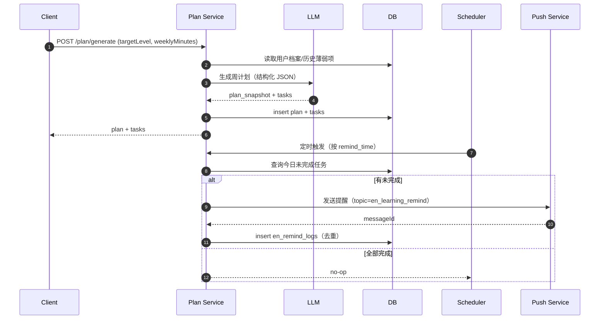

## 7. 数据库设计

### 7.1 用户与档案

**用户英语档案表 (user_english_profiles)**

| 字段名 | 类型 | 约束 | 说明 |
|--------|------|------|------|
| id | BIGINT | PK, AUTO_INCREMENT | 主键 |
| user_id | BIGINT | NOT NULL, FK→users(id), UNIQUE | 用户 ID |
| level_overall | VARCHAR(8) | NULL | 综合 CEFR，如 B1 |
| level_listening | VARCHAR(8) | NULL | 听力子等级 |
| level_speaking | VARCHAR(8) | NULL | 口语子等级 |
| level_reading | VARCHAR(8) | NULL | 阅读子等级 |
| level_writing | VARCHAR(8) | NULL | 写作子等级 |
| level_confidence | DECIMAL(3,2) | NULL | 当前等级评估的置信度 (0-1) |
| level_updated_at | DATETIME | NULL | 等级上次更新时间 |
| target_level | VARCHAR(8) | NULL | 目标等级 |
| weekly_minutes | INT | NULL | 每周可用学习分钟数 |
| weak_skills | JSON | NULL | 薄弱维度列表，如 ["speaking","writing"] |
| remind_time | TIME | NULL | 每日提醒时间 |
| exam_type | VARCHAR(32) | NULL | 备考考试：ielts, toefl, duolingo, pte |
| exam_target_score | VARCHAR(32) | NULL | 目标分数（如 7.0、100） |
| exam_date | DATE | NULL | 考试日期（备考模式） |
| last_assessment_id | BIGINT | NULL, FK→assessment_results(id) | 最近一次综合测评 ID |
| created_at | DATETIME | NOT NULL | 创建时间 |
| updated_at | DATETIME | NOT NULL | 更新时间 |

**新字段说明**：
- `level_confidence`：表示当前等级评估的可信度，<0.5 时建议补充评测
- `weak_skills`：JSON 数组，优先级排序，用于计划生成中的加权计算
- `level_updated_at`：追踪等级变化，用于检测是否需要重新调整计划
- `last_assessment_id`：快速关联最新测评，无需多次查询

---

### 7.2 评估结果与能力档案

**评估结果表 (assessment_results)**

| 字段名 | 类型 | 约束 | 说明 |
|--------|------|------|------|
| id | BIGINT | PK, AUTO_INCREMENT | 主键 |
| user_id | BIGINT | NOT NULL, FK→users(id) | 用户 ID |
| session_id | BIGINT | NOT NULL, FK→en_practice_sessions(id) | 关联会话 ID |
| assessment_type | VARCHAR(32) | NOT NULL | comprehensive（综合）, weekly（周测）, checkpoint（查测） |
| listening_score | DECIMAL(5,2) | NULL | 听力原始分 (0-100) |
| speaking_score | DECIMAL(5,2) | NULL | 口语原始分 |
| reading_score | DECIMAL(5,2) | NULL | 阅读原始分 |
| writing_score | DECIMAL(5,2) | NULL | 写作原始分 |
| overall_score | DECIMAL(5,2) | NULL | 综合分 |
| level_listening | VARCHAR(8) | NULL | 听力等级映射 |
| level_speaking | VARCHAR(8) | NULL | 口语等级映射 |
| level_reading | VARCHAR(8) | NULL | 阅读等级映射 |
| level_writing | VARCHAR(8) | NULL | 写作等级映射 |
| level_overall | VARCHAR(8) | NULL | 综合等级映射 |
| score_details | JSON | NULL | 各维度详细分数与诊断信息 |
| diagnosis | JSON | NULL | AI 生成的诊断摘要 |
| confidence | DECIMAL(3,2) | NULL | 本次评估的置信度 (基于样本量&稳定性) |
| created_at | DATETIME | NOT NULL | 创建时间 |

**score_details JSON 示例**：
```json
{
  "listening": {
    "score": 52,
    "level": "B1",
    "sub_dimensions": {
      "decoding_accuracy": 0.72,
      "comprehension_depth": 0.65
    }
  },
  "speaking": {
    "score": 35,
    "level": "A2",
    "sub_dimensions": {
      "pronunciation": 0.68,
      "fluency": 0.45,
      "grammar": 0.55
    }
  }
}
```

---

### 7.3 计划与任务表结构优化

**学习计划表 (en_learning_plans) — 补充字段**

| 字段名 | 类型 | 约束 | 说明 |
|--------|------|------|------|
| id | BIGINT | PK | 主键 |
| user_id | BIGINT | NOT NULL | 用户 ID |
| current_level | VARCHAR(8) | NOT NULL | 计划创建时的当前等级 |
| target_level | VARCHAR(8) | NOT NULL | 目标等级 |
| week_start_date | DATE | NOT NULL | 计划周起始日 |
| plan_snapshot | JSON | NOT NULL | 周计划快照（参阅 4.6 示例） |
| plan_mode | VARCHAR(20) | NOT NULL | general / exam_prep |
| exam_type | VARCHAR(32) | NULL | 考试类型 |
| exam_date | DATE | NULL | 考试日期 |
| exam_phase | VARCHAR(20) | NULL | foundation / intensive / sprint（自动判断） |
| skill_allocation | JSON | NOT NULL | 各维度时长分配 |
| status | VARCHAR(20) | NOT NULL | active / completed / abandoned |
| completion_rate | DECIMAL(3,2) | NULL | 周计划完成率 (0-100%) |
| avg_score | DECIMAL(5,2) | NULL | 本周练习平均分 |
| next_adjustment_trigger | DATETIME | NULL | 下次检查动态调整的时间 |
| created_at | DATETIME | NOT NULL | 创建时间 |
| updated_at | DATETIME | NOT NULL | 更新时间 |

**索引**：`INDEX(user_id, week_start_date)`，`INDEX(exam_date, exam_phase)`，`INDEX(status, next_adjustment_trigger)`

**计划任务表 (en_plan_tasks) — 补充字段**

| 字段名 | 类型 | 约束 | 说明 |
|--------|------|------|------|
| id | BIGINT | PK | 主键 |
| plan_id | BIGINT | NOT NULL | 计划 ID |
| task_date | DATE | NOT NULL | 任务日期 |
| skill | VARCHAR(16) | NOT NULL | listening / speaking / reading / writing |
| task_type | VARCHAR(32) | NOT NULL | practice / srs_review / mock_test 等 |
| suggested_minutes | INT | NULL | 建议时长 |
| difficulty | VARCHAR(8) | NULL | 难度档位 |
| priority_tier | VARCHAR(3) | NULL | T1 / T2 / T3 / T4（优先级梯队） |
| question_ids | JSON | NULL | 推荐题目 ID 列表 |
| focus_points | JSON | NULL | 该任务的重点关注点 |
| completed_session_id | BIGINT | NULL | 关联会话 ID |
| session_score | DECIMAL(5,2) | NULL | 完成该任务的得分 |
| completed_at | DATETIME | NULL | 完成时间 |
| created_at | DATETIME | NOT NULL | 创建时间 |

**优先级表**：快速查询和排序每日任务
```sql
SELECT * FROM en_plan_tasks 
WHERE plan_id = ? AND task_date = ?
ORDER BY priority_tier, skill
```

---

### 7.4 内容与题库

| 字段名 | 类型 | 约束 | 说明 |
|--------|------|------|------|
| id | BIGINT | PK, AUTO_INCREMENT | 主键 |
| type | VARCHAR(32) | NOT NULL | listening_single_choice, speaking_repeat, reading_cloze, writing_essay 等 |
| skill | VARCHAR(16) | NOT NULL | listening, speaking, reading, writing |
| level | VARCHAR(8) | NOT NULL | CEFR 档位 |
| topic | VARCHAR(64) | NULL | 话题标签 |
| content | JSON | NOT NULL | 题干、选项、参考答案、评分要点等 |
| media_url | VARCHAR(512) | NULL | 音视频 URL（听力/口语） |
| is_active | BOOLEAN | NOT NULL, DEFAULT TRUE | 是否启用 |
| created_at | DATETIME | NOT NULL | 创建时间 |
| updated_at | DATETIME | NOT NULL | 更新时间 |

**题目类型 (type) 枚举约定**（便于筛选与评分路由）：

| type | skill | 说明 | 客观题 | 需 ASR/LLM |
|------|-------|------|--------|------------|
| listening_single_choice, listening_fill, listening_short_answer | listening | 听力选择/填空/简答 | 选择/填空可客观 | 简答/听写用 LLM |
| speaking_repeat, speaking_monologue, speaking_integrated | speaking | 跟读/独白/综合口语 | 否 | 是 |
| reading_single_choice, reading_fill, reading_summary | reading | 阅读选择/填空/摘要 | 选择/填空可客观 | 摘要用 LLM |
| writing_essay, writing_chart, writing_integrated | writing | 议论文/图表/综合写作 | 否 | 是 |
| ielts_speaking_part2, ielts_writing_task1, toefl_integrated_speaking 等 | 对应 skill | 考试专项题型 | 视题型 | 口语/写作均为 LLM |

**索引**：`INDEX(skill, level)`，`INDEX(type)`，`INDEX(is_active)`。考试专项题可通过标签 `exam_type`（见 7.4）或 type 前缀（如 `ielts_*`）筛选。

**练习会话表 (en_practice_sessions)**

| 字段名 | 类型 | 约束 | 说明 |
|--------|------|------|------|
| id | BIGINT | PK, AUTO_INCREMENT | 主键 |
| user_id | BIGINT | NOT NULL, FK→users(id) | 用户 ID |
| session_type | VARCHAR(32) | NOT NULL | single（单题）, quiz（一套题）, assessment（综合测评） |
| skill | VARCHAR(16) | NULL | 单技能时非空 |
| started_at | DATETIME | NOT NULL | 开始时间 |
| submitted_at | DATETIME | NULL | 提交时间 |
| created_at | DATETIME | NOT NULL | 创建时间 |

**索引**：`INDEX(user_id, started_at)`，`INDEX(session_type)`。

**练习作答表 (en_practice_answers)**

| 字段名 | 类型 | 约束 | 说明 |
|--------|------|------|------|
| id | BIGINT | PK, AUTO_INCREMENT | 主键 |
| session_id | BIGINT | NOT NULL, FK→en_practice_sessions(id) | 会话 ID |
| question_id | BIGINT | NOT NULL, FK→en_questions(id) | 题目 ID |
| user_answer_text | TEXT | NULL | 用户文本答案 |
| user_answer_audio_url | VARCHAR(512) | NULL | 用户语音 URL |
| is_correct | BOOLEAN | NULL | 客观题对错 |
| score | DECIMAL(5,2) | NULL | 得分 |
| score_details | JSON | NULL | 各维度分、LLM 反馈与建议 |
| evaluated_at | DATETIME | NULL | 评价完成时间 |
| created_at | DATETIME | NOT NULL | 创建时间 |

**索引**：`INDEX(session_id)`，`INDEX(question_id)`，`INDEX(evaluated_at)`。

---

### 7.5 内容与题库标签体系

为了支持「分级内容库、题目标签与元数据、口音/语速/技能点精确匹配、语义检索」，建议将「内容（文章/音频/视频/对话脚本）」与「题目」分离建模，并引入统一的标签体系。

**内容表 (en_contents)**（文章/音频/视频/对话脚本等素材）

| 字段名 | 类型 | 约束 | 说明 |
|--------|------|------|------|
| id | BIGINT | PK, AUTO_INCREMENT | 主键 |
| content_type | VARCHAR(32) | NOT NULL | article, audio, video, dialog_script |
| title | VARCHAR(256) | NOT NULL | 标题 |
| level | VARCHAR(8) | NOT NULL | CEFR 档位 |
| topic | VARCHAR(64) | NULL | 主题/话题（可与标签并存） |
| text | MEDIUMTEXT | NULL | 文章正文/对话脚本（可为空，音视频用 transcript） |
| transcript | MEDIUMTEXT | NULL | 音视频转写（用于检索/题目生成） |
| media_url | VARCHAR(512) | NULL | 音视频 URL |
| duration_seconds | INT | NULL | 音视频时长（秒） |
| speech_rate_wpm | INT | NULL | 语速（词/分钟，听力关键特征） |
| accent | VARCHAR(32) | NULL | 口音：us, uk, au... |
| metadata | JSON | NULL | 扩展：来源、版权、作者、发布时间等 |
| is_active | BOOLEAN | NOT NULL, DEFAULT TRUE | 是否启用 |
| created_at | DATETIME | NOT NULL | 创建时间 |
| updated_at | DATETIME | NOT NULL | 更新时间 |

**索引**：`INDEX(content_type, level)`，`INDEX(level, is_active)`，`INDEX(accent)`，`INDEX(speech_rate_wpm)`。

**标签字典表 (en_tags)**

| 字段名 | 类型 | 约束 | 说明 |
|--------|------|------|------|
| id | BIGINT | PK, AUTO_INCREMENT | 主键 |
| tag_type | VARCHAR(32) | NOT NULL | topic, grammar, vocab_level, skill_point, accent, exam_type, domain |
| code | VARCHAR(64) | NOT NULL | 标签编码（如 exam:ielts, exam:toefl, grammar:tense_past） |
| name | VARCHAR(128) | NOT NULL | 展示名 |
| description | VARCHAR(500) | NULL | 描述 |
| created_at | DATETIME | NOT NULL | 创建时间 |

**唯一约束**：`UNIQUE(tag_type, code)`。

**内容标签关联表 (en_content_tags)**

| 字段名 | 类型 | 约束 | 说明 |
|--------|------|------|------|
| id | BIGINT | PK, AUTO_INCREMENT | 主键 |
| content_id | BIGINT | NOT NULL, FK→en_contents(id) | 内容 ID |
| tag_id | BIGINT | NOT NULL, FK→en_tags(id) | 标签 ID |
| created_at | DATETIME | NOT NULL | 创建时间 |

**唯一约束**：`UNIQUE(content_id, tag_id)`；**索引**：`INDEX(tag_id)`，`INDEX(content_id)`。

**题目关联内容**：在 `en_questions.content` 中增加 `contentId`（或新增 `en_question_contents` 关联表），用于阅读/听力题与素材绑定，便于复听与解析。

---

### 7.5 错题与间隔复习（SRS）

**错题表 (en_wrong_items)**（可由 `en_practice_answers` 派生，也可单独维护以便快速查询）

| 字段名 | 类型 | 约束 | 说明 |
|--------|------|------|------|
| id | BIGINT | PK, AUTO_INCREMENT | 主键 |
| user_id | BIGINT | NOT NULL | 用户 ID |
| question_id | BIGINT | NOT NULL | 题目 ID |
| last_answer_id | BIGINT | NOT NULL | 最近一次作答 ID |
| wrong_count | INT | NOT NULL, DEFAULT 1 | 累计错次数 |
| last_wrong_at | DATETIME | NOT NULL | 最近错题时间 |
| created_at | DATETIME | NOT NULL | 创建时间 |
| updated_at | DATETIME | NOT NULL | 更新时间 |

**唯一约束**：`UNIQUE(user_id, question_id)`；**索引**：`INDEX(user_id, last_wrong_at)`。

**SRS 复习项表 (en_srs_items)**（对词汇、句型、错题、写作改错点等统一建模）

| 字段名 | 类型 | 约束 | 说明 |
|--------|------|------|------|
| id | BIGINT | PK, AUTO_INCREMENT | 主键 |
| user_id | BIGINT | NOT NULL | 用户 ID |
| item_type | VARCHAR(32) | NOT NULL | vocab, sentence, question, writing_error |
| ref_id | BIGINT | NULL | 关联对象 ID（如 question_id / vocab_id） |
| skill | VARCHAR(16) | NULL | listening / speaking / reading / writing（分类用） |
| prompt | TEXT | NULL | 复习提示（如单词、句子或题干摘要） |
| due_at | DATETIME | NOT NULL | 下次到期复习时间 |
| interval_days | INT | NOT NULL, DEFAULT 1 | 当前间隔天数 |
| ease_factor | DECIMAL(4,2) | NOT NULL, DEFAULT 2.50 | 难度系数（如 SM-2） |
| review_count | INT | NOT NULL, DEFAULT 0 | 已复习次数 |
| failure_count | INT | NOT NULL, DEFAULT 0 | 失败（评分 0-2）次数，用于优先级 |
| recent_score | DECIMAL(5,2) | NULL | 最近一次复习评分 (0-5) |
| recent_reviewed_at | DATETIME | NULL | 最近一次复习时间 |
| state | VARCHAR(20) | NOT NULL, DEFAULT 'active' | active, suspended, graduated（已掌握） |
| created_at | DATETIME | NOT NULL | 创建时间 |
| updated_at | DATETIME | NOT NULL | 更新时间 |

**索引**：`INDEX(user_id, due_at)`，`INDEX(user_id, state)`，`INDEX(user_id, recent_reviewed_at)`，`INDEX(skill, due_at)`。

**优先级计算查询示例**：
```sql
SELECT 
  id,
  (DATEDIFF(CURDATE(), DATE(due_at)) * 0.2 + 1) as f_overdue,
  CASE WHEN item_type IN ('writing_error', 'question') AND skill = ? THEN 1.5 ELSE 1.0 END as f_weak,
  CASE WHEN failure_count > 0 THEN 1.3 ELSE 1.0 END as f_failure,
  CASE WHEN recent_score IS NOT NULL AND recent_score < 3 THEN 1.4 ELSE 1.0 END as f_score,
  100 as base_priority,
  (100 
    * (CASE WHEN item_type IN ('writing_error', 'question') AND skill = ? THEN 1.5 ELSE 1.0 END)
    * (DATEDIFF(CURDATE(), DATE(due_at)) * 0.2 + 1)
    * (CASE WHEN failure_count > 0 THEN 1.3 ELSE 1.0 END)
    * (CASE WHEN recent_score IS NOT NULL AND recent_score < 3 THEN 1.4 ELSE 1.0 END)
  ) as priority_score
FROM en_srs_items
WHERE user_id = ? AND state = 'active' AND due_at <= NOW()
ORDER BY priority_score DESC
LIMIT 30;
```

**SRS 复习记录表 (en_srs_reviews)**

| 字段名 | 类型 | 约束 | 说明 |
|--------|------|------|------|
| id | BIGINT | PK, AUTO_INCREMENT | 主键 |
| srs_item_id | BIGINT | NOT NULL, FK→en_srs_items(id) | 复习项 ID |
| user_id | BIGINT | NOT NULL | 用户 ID（冗余便于查询） |
| rating | INT | NOT NULL | 评分：0-5（如 Again/Hard/Good/Easy 映射） |
| reviewed_at | DATETIME | NOT NULL | 复习时间 |
| created_at | DATETIME | NOT NULL | 创建时间 |

**索引**：`INDEX(user_id, reviewed_at)`，`INDEX(srs_item_id, reviewed_at)`。

---

### 7.6 推荐日志与 A/B 实验

**推荐曝光日志表 (en_reco_impressions)**（用于训练/回溯/A-B）

| 字段名 | 类型 | 约束 | 说明 |
|--------|------|------|------|
| id | BIGINT | PK, AUTO_INCREMENT | 主键 |
| user_id | BIGINT | NOT NULL | 用户 ID |
| scene | VARCHAR(32) | NOT NULL | home_feed, next_task, srs_queue |
| algo | VARCHAR(64) | NOT NULL | rule_v1, mab_v1, rl_v1 ... |
| candidates | JSON | NOT NULL | 候选列表（题目/内容 ID） |
| chosen | JSON | NOT NULL | 实际下发列表 |
| context | JSON | NULL | 上下文特征快照（脱敏） |
| created_at | DATETIME | NOT NULL | 创建时间 |

**索引**：`INDEX(user_id, created_at)`，`INDEX(scene, created_at)`。

**推荐反馈日志表 (en_reco_feedbacks)**（点击/完成/得分等）

| 字段名 | 类型 | 约束 | 说明 |
|--------|------|------|------|
| id | BIGINT | PK, AUTO_INCREMENT | 主键 |
| impression_id | BIGINT | NOT NULL, FK→en_reco_impressions(id) | 曝光 ID |
| user_id | BIGINT | NOT NULL | 用户 ID |
| action | VARCHAR(32) | NOT NULL | click, start, complete, skip |
| reward | DECIMAL(6,3) | NULL | 奖励（用于 MAB/RL，如完成=1，提升加权） |
| details | JSON | NULL | 关联 sessionId、score 等 |
| created_at | DATETIME | NOT NULL | 创建时间 |

**索引**：`INDEX(user_id, created_at)`，`INDEX(impression_id)`。

**A/B 实验表 (ab_experiments)**（简化版，可与现有实验平台对接）

| 字段名 | 类型 | 约束 | 说明 |
|--------|------|------|------|
| id | BIGINT | PK, AUTO_INCREMENT | 主键 |
| code | VARCHAR(64) | NOT NULL, UNIQUE | 实验编码 |
| name | VARCHAR(128) | NOT NULL | 名称 |
| variants | JSON | NOT NULL | 变体列表与参数 |
| is_active | BOOLEAN | NOT NULL, DEFAULT TRUE | 是否启用 |
| created_at | DATETIME | NOT NULL | 创建时间 |

**用户分流表 (ab_assignments)**

| 字段名 | 类型 | 约束 | 说明 |
|--------|------|------|------|
| id | BIGINT | PK, AUTO_INCREMENT | 主键 |
| experiment_id | BIGINT | NOT NULL, FK→ab_experiments(id) | 实验 ID |
| user_id | BIGINT | NOT NULL | 用户 ID |
| variant | VARCHAR(64) | NOT NULL | 分配变体 |
| assigned_at | DATETIME | NOT NULL | 分配时间 |

**唯一约束**：`UNIQUE(experiment_id, user_id)`；**索引**：`INDEX(user_id)`。

---

### 7.7 教师/人工复核与仲裁

**人工评阅任务表 (en_review_tasks)**

| 字段名 | 类型 | 约束 | 说明 |
|--------|------|------|------|
| id | BIGINT | PK, AUTO_INCREMENT | 主键 |
| user_id | BIGINT | NOT NULL | 用户 ID |
| answer_id | BIGINT | NOT NULL, FK→en_practice_answers(id) | 作答 ID |
| skill | VARCHAR(16) | NOT NULL | speaking, writing 等 |
| reason | VARCHAR(64) | NOT NULL | asr_low_confidence, score_borderline, user_appeal, sampling_qc |
| status | VARCHAR(20) | NOT NULL | pending, assigned, reviewed, cancelled |
| assigned_to | BIGINT | NULL | 教师/审核员 ID |
| created_at | DATETIME | NOT NULL | 创建时间 |
| updated_at | DATETIME | NOT NULL | 更新时间 |

**索引**：`INDEX(status, created_at)`，`INDEX(assigned_to, status)`。

**人工评阅结果表 (en_review_results)**

| 字段名 | 类型 | 约束 | 说明 |
|--------|------|------|------|
| id | BIGINT | PK, AUTO_INCREMENT | 主键 |
| review_task_id | BIGINT | NOT NULL, FK→en_review_tasks(id) | 评阅任务 ID |
| reviewer_id | BIGINT | NOT NULL | 教师/审核员 ID |
| score | DECIMAL(5,2) | NOT NULL | 人工得分 |
| score_details | JSON | NULL | 分维度评分与评语 |
| decided_at | DATETIME | NOT NULL | 评阅时间 |

**唯一约束**：`UNIQUE(review_task_id)`；**索引**：`INDEX(reviewer_id, decided_at)`。

**仲裁规则**：当 LLM/模型评分与人工评分差异超过阈值时，以人工为准并记录差异用于模型校准；也可引入二审/抽检策略（sampling_qc）。

## 8. 后端 API 设计

### 8.0 通用约定

- **Base URL**：`/api/v1/english`（与现有项目风格保持一致）。
- **认证**：需登录接口使用 `Authorization: Bearer <access_token>`。
- **幂等**：对「生成计划」「创建会话」「上传预签名」等接口建议支持 `Idempotency-Key` Header，避免重复提交导致重复记录。
- **分页**：`page`（从 1 开始）、`pageSize`（默认 20，最大 100）；响应中返回 `total`、`page`、`pageSize`。
- **统一响应**：成功 `{ "success": true, "data": ... }`；失败 `{ "success": false, "error": { "code": "...", "message": "...", "details?": ... } }`。

**错误码建议**：

| HTTP 状态 | code | 说明 |
|-----------|------|------|
| 401 | UNAUTHORIZED | 未登录或 Token 无效 |
| 403 | FORBIDDEN | 无权限（管理端、教师端等） |
| 404 | NOT_FOUND | 资源不存在（题目/会话/任务） |
| 409 | CONFLICT | 冲突（如重复创建、状态不允许） |
| 422 | VALIDATION_ERROR | 参数校验失败 |
| 429 | RATE_LIMIT_EXCEEDED | 超出频率或配额限制（LLM/ASR/练习次数） |
| 500 | INTERNAL_ERROR | 服务端错误 |

### 8.1 评价与练习

- **GET /api/v1/english/questions**  
  题目列表/推荐：Query 支持 `skill`, `level`, `topic`, `type`；**考试专项**可传 `examType`（ielts/toefl/duolingo/pte）、`taskType`（如 part2、integrated_writing）；返回题目列表（含 content 摘要、media_url），不暴露参考答案。

- **POST /api/v1/english/sessions**  
  创建练习会话：Body `{ "sessionType", "skill?", "questionIds?" }`；返回 `sessionId`。

- **POST /api/v1/english/sessions/:sessionId/answers**  
  提交单题或批量作答：Body `{ "questionId", "userAnswerText?", "userAnswerAudioUrl?" }`；服务端触发评价（同步或异步），返回 `answerId` 及可选 `score`、`scoreDetails`（若同步评价）。

- **GET /api/v1/english/sessions/:sessionId**  
  会话详情：含题目列表、每题作答与评价结果（含 LLM 反馈）。

- **GET /api/v1/english/assessment**  
  获取综合测评套题（题目 ID 列表）；用户完成后按会话提交，由报告服务汇总各维度得分与等级。

### 8.2 计划与能力评估 API

- **GET /api/v1/english/profile**  
  当前用户档案：包括 `current_level`（当前 CEFR）、`level_listening/speaking/reading/writing`（四维子等级）、`target_level`、`weekly_minutes`、`weak_skills`、`exam_type/exam_date`；返回的 `confidence` 信息表示当前等级评估的置信度。

- **PATCH /api/v1/english/profile**  
  更新档案：如 `target_level`、`weekly_minutes`、`weak_skills`、`exam_type/exam_date`；触发计划重新生成。

- **POST /api/v1/english/plan/generate**  
  生成学习计划：
  - **Request Body**：
    ```json
    {
      "current_level": "B1",
      "target_level": "B2",
      "weekly_minutes": 300,
      "weak_skills": ["speaking", "writing"],
      "exam_type": "ielts",
      "exam_date": "2026-04-15",
      "plan_duration_weeks": 8,
      "learning_pace": "moderate"
    }
    ```
  - **Response**：
    ```json
    {
      "success": true,
      "data": {
        "plan_id": "plan_20260210_001",
        "overview": {...},
        "weekly_plans": {...},
        "adjustment_rules": {...}
      }
    }
    ```

- **GET /api/v1/english/plan/current**  
  当前生效计划：返回本周/当前周期计划与每日任务列表，以及**今日任务**完成状态。

- **PATCH /api/v1/english/plan/:planId**  
  微调计划：用户可调整某日任务难度、时长或题目推荐。

- **POST /api/v1/english/plan/tasks/:taskId/complete**  
  标记任务完成：Body 可带 `sessionId` 关联到本次练习会话；更新 `completed_at`；触发计划动态调整检查。

- **GET /api/v1/english/assessment/results/:assessmentId**  
  评估结果详情：返回四维评分、CEFR 映射、置信度、诊断信息：
  ```json
  {
    "overall_level": "B1",
    "skill_levels": {
      "listening": "B1",
      "speaking": "A2",
      "reading": "B1",
      "writing": "B1"
    },
    "confidence": 0.72,
    "diagnosis": {
      "strengths": ["阅读理解力较强", "听力细节捕捉准确"],
      "weaknesses": ["口语流利度差", "写作逻辑连贯性弱"],
      "recommended_focus": ["speaking", "writing"]
    }
  }
  ```

### 8.3 学习档案与报告

- **GET /api/v1/english/profile**  
  当前用户英语档案：等级、目标、提醒时间、本周可用时长；若备考则含 `examType`, `examDate`, `examTargetScore`。

- **GET /api/v1/english/report/summary**  
  学习汇总：Query `period=week|month`；返回各维度练习次数、正确率、得分趋势、薄弱项。

- **GET /api/v1/english/report/level-history**  
  等级与得分历史：用于进步曲线展示。

- **POST /api/v1/english/report/generate**  
  生成周期报告：Body `{ "period", "startDate", "endDate" }`；触发 LLM 生成总结与建议，返回报告内容或报告 ID。

---

### 8.4 内容与题库管理（管理端）

> 管理端接口需具备内容/题库管理权限（可对接《公用-权限模块》）。

- **POST /api/v1/english/admin/contents**：创建内容（文章/音频/视频/脚本），Body 含 `contentType`, `title`, `level`, `text?`, `transcript?`, `mediaUrl?`, `durationSeconds?`, `speechRateWpm?`, `accent?`, `tagIds?`。
- **PATCH /api/v1/english/admin/contents/:id**：更新内容元数据与标签。
- **POST /api/v1/english/admin/questions**：创建题目；支持绑定 `contentId` 与标签；参考答案与评分要点仅管理端可见。
- **PATCH /api/v1/english/admin/questions/:id**：更新题目；修改会影响评分回归，需要版本化（见实现要点）。

**版本化建议**：题目 `content` 增加 `version` 字段；重大变更新建版本，旧版本保留以支持历史回放与评分回归。

### 8.5 人工复核/评分仲裁（管理端）

- **GET /api/v1/english/admin/reviews/tasks**：获取待评阅任务列表（支持 `status`、`skill`、`assignedTo` 分页过滤）。
- **POST /api/v1/english/admin/reviews/tasks/:id/assign**：分配任务给评阅员。
- **POST /api/v1/english/admin/reviews/tasks/:id/submit**：提交人工评分与评语，Body `{ "score", "scoreDetails" }`；写入 `en_review_results` 并回写 `en_practice_answers.score/score_details`（标记 `source=human`）。
- **POST /api/v1/english/reviews/appeal**：用户申诉复核（可选），Body `{ "answerId", "reason" }`。

### 8.6 上传与媒体（预签名）

为避免客户端直传大文件经过业务服务，建议采用对象存储预签名直传。

- **POST /api/v1/english/uploads/presign**：获取预签名上传 URL。Body `{ "fileName", "contentType", "purpose": "speaking_answer_audio" }`，返回 `{ "uploadUrl", "fileUrl", "headers?" }`。
- **POST /api/v1/english/uploads/complete**：通知上传完成（可选），Body `{ "fileUrl", "size", "checksum?" }`；服务端可异步做转码/抽取特征。

### 8.7 推荐与间隔复习

- **GET /api/v1/english/srs/queue**：获取今日到期复习队列（按 `due_at` 排序，可返回 `items` + 建议时长）。
- **POST /api/v1/english/srs/:srsItemId/review**：提交复习结果，Body `{ "rating": 0-5 }`，服务端按 SM-2/自研策略更新 `due_at/interval/ease_factor`。
- **GET /api/v1/english/recommendations/next**：获取下一组推荐练习（可带 `scene`），返回题目/内容列表；同时写入 `en_reco_impressions`。\n+- **POST /api/v1/english/recommendations/feedback**：上报点击/完成/跳过等反馈，写入 `en_reco_feedbacks`。

## 9. 实现要点

### 9.1 语音与媒体

- **录音与上传**：端上录音（Web Audio / 原生录音），生成 WAV/WebM 或指定格式，上传至对象存储，返回 URL 供评价服务使用；可限制单段时长与文件大小。
- **ASR**：口语题可将用户音频转写后送 LLM，降低成本并提高稳定性；需约定语言与格式（如中文+英文混合场景）。
- **TTS**：跟读题若有标准音，可使用 TTS 或预录音频；链接存于题目 `media_url`。
- **版权与存储**：听力/阅读素材需有版权管理；音视频与用户录音按隐私策略保留与过期删除。

### 9.2 稳定性与成本

- **LLM 调用**：评价与计划生成均做超时、重试与限流；结果落库前校验结构，失败则标记待重试或人工。
- **缓存**：题目列表、推荐结果、当前计划等可缓存，减少 DB 与 LLM 压力。
- **异步评价**：主观题/口语可异步队列处理，提交接口先返回 `answerId`，结果通过轮询或 WebSocket 推送。
- **成本控制**：按用户/按日限制免费评价次数，超出部分需会员或积分；LLM 与 ASR 调用做用量统计与告警。

---

## 10. 技术选型建议

## 10. 技术选型建议

### 10.1 核心技术栈选型

| 层级 | 建议 | 说明 |
|------|------|------|
| **前端** | React / React Native 或 Flutter；Web 用 React | 跨端与组件复用 |
| **后端** | Node.js / Go + REST 或 GraphQL | 使用 gRPC 在服务间通信（高吞吐场景） |
| **流式/日志** | Kafka + Flink（或等价） | 日志与实时特征、行为分析 |
| **模型部署** | TorchServe / TensorFlow Serving / Triton，或云推理（AWS SageMaker、GCP Vertex AI） | 口语/写作评分、ASR |
| **ASR** | 开源（Whisper、NeMo）或商用（Google Speech-to-Text） | 需评估延迟与成本 |
| **向量/语义检索** | Milvus / FAISS + OpenAI-style embeddings 或自托管 embedding 模型 | 相似题、推荐与语义匹配 |
| **数据库** | Postgres（关系）、Redis（缓存/Session）、时序（InfluxDB 或 ClickHouse） | 用户与题目用 Postgres；行为与日志用时序 |
| **鉴权/支付** | OAuth + Stripe / 支付宝 / 微信支付 | 与现有登录与支付体系集成 |

### 10.2 供应商选型与成本对比（年度）

#### ASR 方案对比

| 供应商 | 延迟 | 准确率 (WER) | 成本（百万次） | 备注 |
|--------|------|-------------|-------------|------|
| **Google Cloud Speech-to-Text** | 200-500ms | 5-8% | $1.44-2.88 | 多语言、质量高 |
| **微软 Azure Speech Services** | 200-500ms | 5-8% | $1.4-2.8 | 支持中英混合 |
| **阿里云 OSS 内容识别** | 1-3s | 8-12% | $0.3-0.6 | 成本低、延迟长 |
| **Whisper (OpenAI / 自部署)** | 500ms-2s | 5-7% | $0（自建）+ 计算费 | 需 GPU，初期投入高 |
| **ByteDance /抖音 ASR** | 200-400ms | 5-8% | $0.5-1.0 | 中文优化、垂直领域强 |

**推荐**：小规模 MVP 用 Google / 微软；规模化后评估自建 Whisper 或合作定制。**初期预算**：100 万次/月（用户每日 1-2 次练习）= $12-24k/月。

#### LLM 方案对比

| 供应商 | 延迟 | Token 成本（百万token） | 能力 | 备注 |
|--------|------|----------------------|------|------|
| **OpenAI GPT-4** | 500ms-3s | $30-60 | 最强，支持复杂 prompt | 贵，但质量最好 |
| **OpenAI GPT-3.5-turbo** | 300-800ms | $0.5-2 | 足够，成本低 | 推荐用于评分 |
| **Claude 3 (Anthropic)** | 600-2s | $3-15 | 同样强，推理更好 | 成本中等 |
| **Llama 2 / 自建开源大模型** | 800ms-5s （GPU） | $0（自建）+ 计算费 | 可接受（需微调） | 初期投入高，长期成本低 |
| **阿里通义千问** | 500-1500ms | $0.2-1.0 | 中文支持强 | 成本低，延迟波动 |

**推荐**：
- MVP：用 GPT-3.5-turbo（评分）+ 必要时 GPT-4（计划生成）；成本约 $5-10k/月。
- 规模化：评估自建或微调 Llama 2，成本降至 $2-5k/月。
- 混合策略：95% 评分用廉价 GPT-3.5，5% 复杂任务用 GPT-4。

#### 口语评分模型方案

| 方案 | 延迟 | 准度 | 成本 | 备注 |
|------|------|------|------|------|
| **LLM 轮流（ASR 转写 + LLM 评分）** | 500ms-2s | 70-80% | 按 token 计 | 简单、易维护、泛化好 |
| **专用口语评分模型（如 Speechkk）** | 300-800ms | 85-90% | $500-2000 / 月 | 精度高，但定制度低 |
| **自建评分模型（微调 BERT/RoBERTa）** | 100-300ms（CPU） | 75-85% | 初期 $20k + 计算费 | 长期成本低，初期大 |
| **云推理（AWS SageMaker / GCP）** | 200-500ms | 可配 | $500-3000 / 月 | 弹性强，按用量付费 |

**推荐**：
- 快速上市：LLM (GPT-3.5 + ASR)，成本低且可控。
- 提升准度：搭配多维评分（加发音 API），如 Google Cloud Speech-to-Text 内置的语音风格评分。
- 长期运营：迭代数据后自建轻量级模型（多任务学习：发音 + 流利度 + 语法），部署在 CPU 集群上。

#### 成本综合预估（按用户体量）

**假设条件**：
- 100 万 DAU，30 万付费用户（年）。
- 人均每月 8 次评分任务（口语/写作）。
- 10% 概率的人工复核（高置信度阈值）。

| 成本项 | 计费方式 | 月成本 | 年成本 |
|--------|---------|--------|--------|
| **ASR** (100M 次/年) | $1.44/M | $12,000 | $144,000 |
| **LLM 评分** (50M token/年) | $20/M | $83,000 | $1,000,000 |
| **LLM 计划生成** (500k 次/年) | 按计算 | $5,000 | $60,000 |
| **对象存储** (用户音频) | $0.023/GB, 已用 500TB/年 | $10,000 | $115,000 |
| **数据库** (Postgres, 读写操作) | 按操作, ~500M/月 | $8,000 | $100,000 |
| **缓存 & CDN** (Redis + CloudFront) | 按流量, ~10TB/月 | $5,000 | $60,000 |
| **计算** (容器/服务器) | ECS/K8s, 10-20 个实例 | $30,000 | $360,000 |
| **人工教师** (月 200 小时 @ ¥100/h) | 薪资 + 福利 | $2,000 x 20 人 | $480,000 |
| **其他** (监控、日志、备份等) | 杂费 | $10,000 | $120,000 |
| **合计基础设施** | | **~$165,000** | **~$2,440,000** |

**收入对标 (30 万付费用户，ARPU ¥300/年)**：
- 订阅收入：9,000 万。
- 增值服务：3-5%用户购买，每户 ¥500，约 4,500 万。
- 合计：1.35-1.50 亿。

**毛利率**：约 82-85%（扣除基础设施成本后）。

---

## 11. 系统可靠性与性能

### 11.1 SLA 与关键性能指标（KPI）

| 指标 | 目标 | 监控方式 |
|------|------|---------|
| **API 可用性** | 99.9%（年度） | Uptime Robot、CloudWatch 告警 |
| **平均响应时间** (p50/p99) | 200ms / 1000ms（不含评分） | APM（如 DataDog / New Relic） |
| **评分延迟** (p99) | 口语 5s、写作 10s、计划生成 3s | 异步队列监控、metrics 上报 |
| **缓存命中率** | ≥ 85%（热题目、推荐） | Redis 内置统计 |
| **数据库查询延迟** (p95) | ≤ 100ms | 数据库慢查询日志、APM |
| **消息推送送达率** | ≥ 95% | 推送系统回调日志 |
| **音频上传成功率** | ≥ 99% | 上传完成回调 / 校验和 |
| **模型推理 QPS** | ≥ 100 req/s（单评估服务） | GPU 使用率、队列深度 |
| **错误率** (5xx) | ≤ 0.1% | 日志聚合（ELK）、告警 |

### 11.2 容灾与恢复

- **多区域部署**：后端服务部署在 2 个可用区（AZ），数据库启用同步复制；RTO ≤ 5 分钟，RPO ≤ 1 分钟。
- **数据备份**：
  - DB：每日全量 + 每小时增量备份，异地保存 30 天。
  - 用户音频/文件：对象存储启用跨域复制策略。
- **降级策略**：
  - LLM 超时：降级为仅展示文本作答与得分（简化反馈）；后续离线重试。
  - ASR 失败：标记待人工，或尝试备用供应商（如 A 方案失败，切至 B 方案）。
  - 评分服务瘫痪：提交接口返回 202 并入队，防止用户感知；评分离线补偿。
- **限流与熔断**：
  - 对 LLM/ASR 外部调用做动态限流（令牌桶），防止级联故障。
  - 评分队列长度若 > 1000，触发熔断，拒绝新评分请求并提示「系统繁忙」。

### 11.3 安全防护

- **DDoS 防护**：接入云厂商防护（如 CloudFlare、腾讯云盾）；限制单 IP 请求频率。
- **API 安全**：
  - 所有输入校验 + 参数白名单。
  - LLM 提示注入防护：对用户输入做清理与转义。
  - Rate Limit：按用户 ID 限制每分钟请求数（如 100/min）。
- **认证与授权**：JWT Token + RBAC（角色-权限）；敏感操作（如数据导出）需二次确认。
- **加密**：
  - 传输：所有 API 用 HTTPS/TLS 1.3。
  - 静态：敏感字段（密码、支付信息）加密存储；用户档案/音频可选端到端加密。
- **审计日志**：记录重要操作（如分数修改、用户数据导出），便于事后追踪与合规审查。

---

## 12. 安全与合规

### 12.1 数据与隐私

---

## 12. 安全与合规

### 12.1 数据与隐私

- **采集策略**：明确告知并获取同意，最低必要原则；仅采集业务必需的语音、文本与行为数据。
- **脱敏/加密**：语音与文本脱敏后可用于训练与评估；传输 TLS、静态数据加密（如数据库加密、对象存储加密）。
- **存储策略**：用户可控制保存周期；敏感数据可设置自动删除或匿名化。
- **合规**：支持 GDPR、China PIPL 等要求，提供数据导出与删除接口（账号注销时一并处理）。

### 12.2 身份、权限与内容安全

- **身份与权限**：所有接口依赖登录态；档案、计划、作答仅限本人访问；管理端需单独权限（如教师/运营）。
- **内容安全**：用户文本与语音在送 LLM/ASR 前可经内容安全过滤；生成的学习建议与报告不做未授权外发。
- **合规**：若面向未成年人，需符合当地未成年人保护与数据合规要求；教育类内容需注意版权与资质。

---

## 12.3 前端与交互设计要点

### 核心用户旅程与交互流程

#### 新用户入门（冷启动优化）

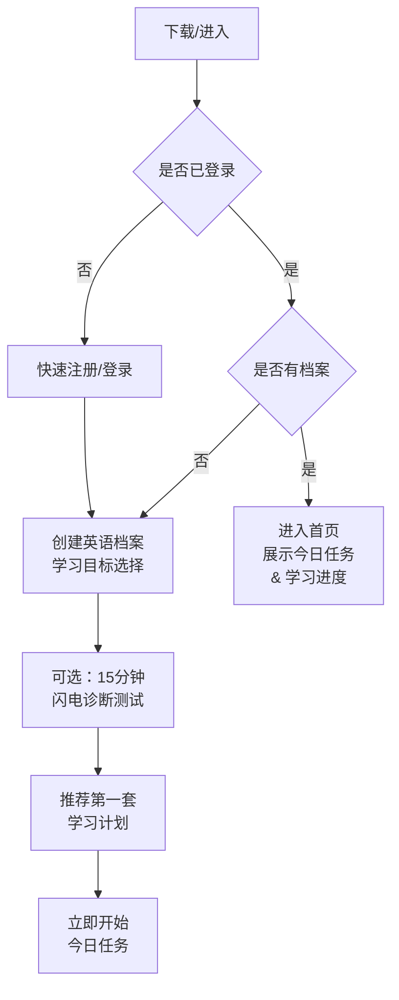

**交互细节**：
- **闪电诊断** (5-10 分钟)：快速评估当前水平（听2题、读2题、写1题），无压力；基于诊断结果推荐等级。
- **自动匹配**：档案选择「目标」+ 最近考试日期（可选），系统自动推荐备考路径。
- **首页导航**：中心位置「今日任务」（突出设计）；旁侧「学习报告」、「计划」、「设置」。

#### 日常学习流程（单题练习）

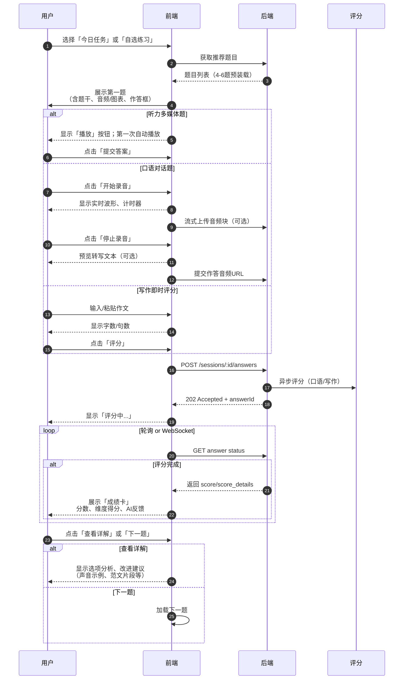

**交互细节**：
- **异步反馈**：避免用户等待；进度条 + 轮询/WebSocket 推送；评分完成 toast 通知。
- **成绩卡设计**：
  - 顶部：总分（如 7.5/9）、子维度（如发音 7、流利度 6.5、语法 8、内容 7）。
  - 中部：柱状图/雷达图展示各维度与平均值对比。
  - 底部：AI 反馈摘要（1-2 句关键建议）+ 可展开详细反馈。
  - CTA：「查看详解」、「收藏」、「再练一遍」。
- **复听与帮助**：听力题可 N 次复听不扣分；阅读题可实时查词；写作可关联手册检查。

#### 学习计划与每日督促

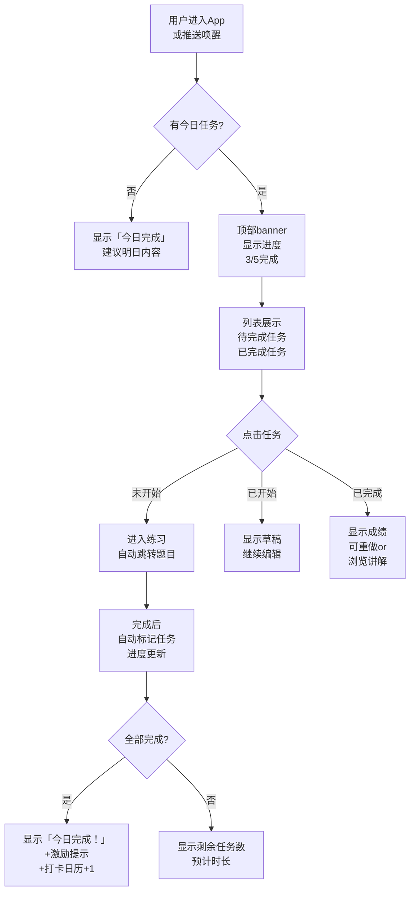

**交互细节**：
- **进度可视化**：Progress bar 或 checklist；完成任务有即时反馈（卡片滑出、进度条动画）。
- **打卡激励**：本日完成全部任务后，日历显示打卡、连续学习天数变色展示；周末完成额外徽章。
- **推送文案**：
  - 提醒阶段：「今天还有 2 任务待完成，预计 20 分钟，现在学习效率最高」。
  - 完成激励：「太棒了！你已连续学习 7 天，再坚持去打破你的记录！」。

#### 周期报告与学情分析

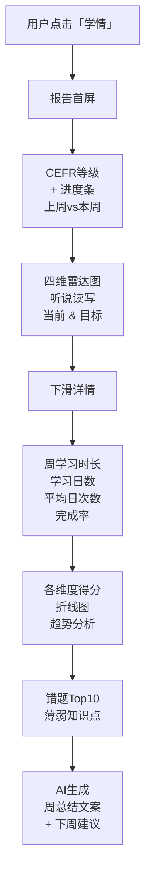

**数据展示**：
- **等级看板**：「上周 B1，这周 B1↑」含进度百分比；距目标等级的里程碑。
- **雷达图**：四维贴近目标时用暖色，差距大时用冷色；鼠标悬停展示数值。
- **折线图**：按周或按题型显示得分趋势；可对标当前等级均值或历史同期。
- **薄弱项详情**：「你在 pronunciation 方面的得分比平均低 15%，建议增加跟读练习」；关联快捷链接至对应题库。

### 交互设计要点与最佳实践

- **练习流程**：低摩擦、单任务页面；示例：听题 → 答题 → 即时评分 → 可选复听/解析。
- **反馈可视化**：雷达图、句级高亮、错误示例与改写建议，便于理解改进方向。
- **录音体验**：预录/按住说话/流式识别，显示实时波形与转写，减少等待感。
- **无障碍**：字体大小可变、色盲模式、离线包下载（可选）。
- **易用性**：快速开始的「入门测评」与明确「下一步任务」引导，降低冷启动摩擦。

### 关键按钮与 Microcopy 文案

| 场景 | 按钮/文案 | 目的 |
|------|-----------|------|
| 任务完成后 | 「太棒了！今日完成」 + 打卡动画 | 及时正反馈、激励 |
| 录音准备 | 「开始说话，说完后点停止」 | 清晰引导，降低门槛 |
| 异步评分中 | 「AI 正在评分...」 + 进度 | 透明化过程 |
| 错题提示 | 「一个善意提示：你在 X 方面得分较低」 | 友好而非指责 |
| 付费激励 | 「升级 Premium，解锁无限练习 & 人工批改」 | 呈现价值而非硬推 |

## 13. 测试、指标与质量保障

### 13.1 自动化测试体系

- **单元测试**（>70% 覆盖率）：LLM Prompt 组装、评分逻辑、计划算法等核心模块。
- **集成测试**：API 层级、数据库交互、外部服务集成（如 ASR、LLM 的 Mock）。
- **端到端测试**（E2E）：
  - 用户完整学习链路（入学测 → 练习 → 评分 → 计划生成）。
  - 音频上传、转写、评分的全流程模拟。
  - 支付与订阅流程（测试环境对接沙箱）。
- **性能测试**：
  - 并发压力测试（模拟 1000 DAU），关注 API 响应时间 & 数据库查询延迟。
  - 评分队列深度压力测试（突发 10k 评分请求，验证异步处理与降级策略）。
  - 内存泄漏与资源泄露检查（长时间运行稳定性）。
- **回归测试**：
  - **模型评分一致性**：金标作答集每 2 周回归一次，验证 Prompt 调整后的评分公平性。
  - **题库完整性**：新增题目发布前需完整性校验（参考答案、评分逻辑、媒体资源）。

### 13.2 产品指标与监控

**与 1.9 KPI 同步的重点关注指标**：

| 指标类型 | 关键指标 | 阈值告警 | 追踪工具 |
|---------|--------|---------|---------|
| **学习效果** | CEFR 升级率（周） | < 30% → P0 告警 | 自建仪表板 |
| | 评分准度（与人工 correlation） | < 0.80 → 触发模型 review | 模型 QA 脚本 |
| **用户行为** | 完成率（每日计划） | < 50%（周均） → 提示弱留存 | GA / 数据仓库 |
| | 完成任务到收到反馈的时间 | p95 > 15s （异步） → 优化队列 | APM + 日志 |
| **系统健康** | API 可用性 | < 99.9%（月） → 告警 | Datadog / 自建 |
| | 评分队列延迟 (p99) | > 10s → 自动扩容 | Prometheus |
| | LLM API 限流触发频率 | > 5%/day → 联系供应商扩容 | 服务日志 |
| **付费转化** | Day 1 转化率 | < 2% → 优化首页 CTA | 自建漏斗分析 |
| | Churn 率 (订阅) | > 10%/月 → 分析流失原因 | 用户生命周期分析 |

### 13.3 A/B 测试框架

支持快速迭代产品改进；重点测试场景：

| 实验 | 变量 | 预期提升指标 | 样本量 | 持续时间 |
|------|------|-----------|--------|---------|
| **提醒文案测试** | A: 「提醒」vs B: 「你还有 1 任务待完成」 | 完成率 ↑ 10% | 10k users | 1 周 |
| **推荐算法迭代** | A: 规则 v1 vs B: MAB v1 | 推荐 CTR ↑ 20% | 50k users | 2 周 |
| **评分反馈样式** | A: 纯文本 vs B: 带示例视频 | 生成错题率 ↓ 15% | 20k users | 1.5 周 |
| **付费定价测试** | A: ¥79 月卡 vs B: ¥99 月卡 | ARPU ↑（权衡转化） | 50k users | 2 周 |

### 13.4 考试专项质量保证

对标雅思/托福等国际考试，需特殊关注：

- **金标作答库维护**：与教师合作积累 500-1000 道题的人工标注作答 + 官方分数，按年更新。
- **评分相关性分析**：每月计算模型预测分与人工分的 Pearson/Spearman 相关系数，目标 ≥ 0.85。
- **偏差分析（Bias）**：按性别、年龄、地域等维度分析评分是否存在隐性偏见；定期做公平性审计。
- **口语题型专项**：
  - Part 2 （雅思）：独白时长控制、逻辑完整性、回答充分性评分准度。
  - 托福 Integrated Speaking：信息覆盖率与转述准确性的二维评估。
- **写作题型专项**：
  - Task Response 准度：是否真实回答了题目要求。
  - 综合写作（托福）：阅读与听力 source 跟踪与反驳论证清晰度。


---

## 14. MVP 建议（最小可行产品）

**包含功能**：

- 入学测评（听/读/写/说的基础测）。
- 基础题库（分级听力、阅读、写作题）与自动判分。
- 口语跟读与基础口语评分（ASR + 发音粗评分）。
- 自动生成学习计划 + 推送提醒。
- 数据仪表盘（个人得分/趋势）。

**交付周期**：3～4 个月（小团队：PM、2 后端、1 前端、1 ML 工程师、1 内容/语言专家）。

**验收标准**：基础测评可运行、口语评分与人工评分相关系数达到预期阈值（例如 ≥0.7）、计划生成并能触发提醒。

**若 MVP 含国际考试模块**：用户可完成一次雅思/托福模考流程（听/读/写/说），并得到与官方评分维度一致的预测分展示；备考计划在设定考试日期后能按三阶段（基础/强化/冲刺）生成任务。

---

## 15. 实施路线（里程碑）

| 阶段 | 周期 | 内容 |
|------|------|------|
| **第 0 阶段** | 2 周 | 需求梳理、目标用户访谈、题库与数据准备。 |
| **第 1 阶段** | 6～8 周 | MVP 开发（前后端 + 基础 ASR/评分集成）+ 第一版内容。 |
| **第 2 阶段** | 6 周 | 自适应计划引擎、间隔复习实现、强化口语评分。 |
| **第 3 阶段** | 持续 | 模型迭代、A/B 与规模化部署、付费/教师功能。 |

---

## 16. 后续扩展方向

- **多口音/多主体识别**：支持多口音听力与口语评分；对话式 Tutor（基于 LLM）用于沉浸式交流。
- **跨模态评估**：视频口语评估（面部、口型）提高发音判定精度。
- **国际考试定制**：雅思/托福写作/口语专项训练与评分对齐。
- **企业/学校版**：管理后台、班级报告与教师协作工具。

---

## 附录 A：术语与缩写

| 术语/缩写 | 全称或含义 |
|-----------|-------------|
| **CEFR** | Common European Framework of Reference for Languages，欧洲语言共同参考框架 |
| **CLT** | Communicative Language Teaching，交际语言教学法 |
| **TBLT** | Task-Based Language Teaching，任务型教学法 |
| **ZPD** | Zone of Proximal Development，最近发展区（维果茨基） |
| **SRS** | Spaced Repetition System，间隔重复系统 |
| **SM-2** | 一种广泛使用的 SRS 算法（如 Anki） |
| **Scaffolding** | 支架式教学/反馈，在最近发展区内提供适度支持 |
| **i+1** | 克拉申输入假设：略高于当前水平的可理解输入 |
| **ASR** | Automatic Speech Recognition，自动语音识别 |
| **TTS** | Text-to-Speech，文本转语音 |
| **WER** | Word Error Rate，词错误率（ASR 评估指标） |

---

## 附录 B：与现有系统的衔接

- **登录与用户**：沿用现有 `users` 与 JWT；`user_english_profiles.user_id` 关联 `users.id`。
- **推送与提醒**：使用《公用-订阅、消息推送系统设计》中的主题（如 `en_learning_remind`）、设备与发送接口；计划服务在提醒时刻构造消息并调用推送发送接口。
- **权限**：管理端「题目管理」「人工评阅」「报告查看」等可接入《公用-权限模块》的角色与权限。

以上为 AI 英语学习软件的详细设计。落地时可优先实现 [MVP 建议](#14-mvp-建议最小可行产品)（入学测 + 基础题库与自动判分 + 口语跟读与基础评分 + 计划与提醒 + 数据仪表盘），再按 [实施路线](#15-实施路线里程碑) 分阶段推进自适应计划、间隔复习、强化口语评分与付费/教师功能；后续可扩展多口音、对话式 Tutor、国际考试定制与企业/学校版（见 [后续扩展方向](#16-后续扩展方向)）。
