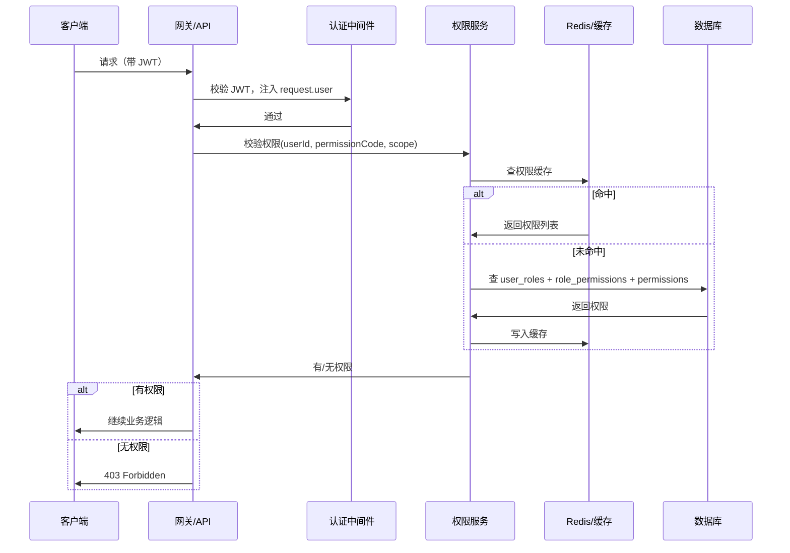
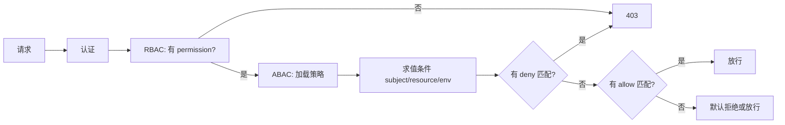

# 细粒度权限管理系统设计文档

> 本文档描述与登录/认证模块衔接的细粒度权限管理设计，涵盖权限模型、数据表、API、前后端集成与最佳实践，供开发与架构参考。

## 📋 目录

- [概述](#概述)
- [1. 权限模型](#1-权限模型)
  - [1.1 RBAC + 资源/操作/范围](#11-rbac--资源操作范围)
  - [1.2 权限标识与层级](#12-权限标识与层级)
  - [1.3 与登录模块的衔接](#13-与登录模块的衔接)
  - [1.4 ABAC 与 RBAC 的融合](#14-abac-与-rbac-的融合)
- [2. 数据库设计](#2-数据库设计)
  - [2.1 角色与权限表](#21-角色与权限表)
  - [2.2 用户-角色与数据范围](#22-用户-角色与数据范围)
  - [2.3 索引与查询](#23-索引与查询)
  - [2.4 ABAC 策略表](#24-abac-策略表)
- [3. 后端 API 设计](#3-后端-api-设计)
  - [3.1 权限校验接口](#31-权限校验接口)
  - [3.2 角色与权限管理接口](#32-角色与权限管理接口)
  - [3.3 用户权限查询](#33-用户权限查询)
  - [3.4 ABAC 策略接口](#34-abac-策略接口)
- [4. 后端实现要点](#4-后端实现要点)
  - [4.1 权限中间件](#41-权限中间件)
  - [4.2 权限服务与缓存](#42-权限服务与缓存)
  - [4.3 JWT 与权限载荷](#43-jwt-与权限载荷)
  - [4.4 ABAC 策略评估与 Fastify 集成](#44-abac-策略评估与-fastify-集成)
- [5. 前端集成](#5-前端集成)
  - [5.1 权限指令与组件](#51-权限指令与组件)
  - [5.2 路由与菜单控制](#52-路由与菜单控制)
- [6. 数据级权限（可选）](#6-数据级权限可选)
- [7. 审计与最佳实践](#7-审计与最佳实践)

---

## 📖 概述

细粒度权限系统在「谁已登录」（认证）的基础上，明确「谁能在什么范围、对什么资源、执行什么操作」（授权）。设计目标：

- **RBAC**：按角色分配权限（资源 + 操作），支持范围（租户、部门、项目），实现「是否有权做某类操作」。
- **ABAC（基于属性的访问控制）**：在 RBAC 基础上，按**主体、资源、环境**等属性做策略判定（如「仅文档创建者可删除」「工作时间外禁止导出」），实现更细的条件策略。
- **与现有登录一致**：复用 `users` 表与 JWT 流程，在签发 Token 时注入角色与权限信息；ABAC 所需主体/资源属性在请求时由上下文提供。

**文档约定**：下文中的「登录模块」指《公用-登录功能模块实现》中的用户表、JWT、会话等；本模块在其之上增加角色、权限、范围及校验逻辑。

**权限校验流程概览**：



**RBAC + ABAC 联合校验流程**：



---

## 1. 权限模型

### 1.1 RBAC + 资源/操作/范围

采用 **RBAC（基于角色的访问控制）**，并加上**资源、操作、范围**的细粒度定义：

| 概念 | 说明 | 示例 |
|------|------|------|
| **角色 (Role)** | 一组权限的集合，分配给用户 | 管理员、编辑、只读、部门主管 |
| **权限 (Permission)** | 对某一「资源」的某一「操作」的许可 | `document:read`、`user:update`、`report:export` |
| **资源 (Resource)** | 业务对象类型 | `document`、`user`、`project`、`report`、`setting` |
| **操作 (Action)** | 对资源的动作 | `create`、`read`、`update`、`delete`、`share`、`export`、`manage` |
| **范围 (Scope)** | 权限生效的数据范围（可选） | 租户 ID、部门 ID、项目 ID，或 `*` 表示全局 |

**权限标识格式**（建议）：

- 仅资源+操作：`resource:action`，例如 `document:read`、`user:create`。
- 带范围时：在业务层用「角色在某一 scope 下生效」表示，不强制写进 permission 字符串；或采用 `resource:action:scopeType`（如 `document:read:tenant`），由实现决定。

**范围的使用方式**：

- 用户通过「用户-角色」关联到角色时，可同时绑定一个 **scope**（如 `tenant_id`、`department_id`）。
- 校验时：先看用户是否拥有某 permission，再在该 permission 对应的资源上，根据用户当前请求的 scope（如当前租户、当前部门）与用户-角色的 scope 做匹配，决定是否允许访问该条数据。

### 1.2 权限标识与层级

**推荐资源与操作枚举（可按业务扩展）**：

```text
资源 (resource)    操作 (action)        说明
────────────────────────────────────────────────────
document           create, read, update, delete, share   文档
user               create, read, update, delete, manage    用户管理
project            create, read, update, delete, manage   项目
report             read, export, manage                   报表
setting            read, update, manage                  系统设置
audit              read, export                          审计日志
role               read, assign, manage                  角色与权限配置
```

**通配符（可选）**：

- 若支持 `*`，可定义：`resource:*` 表示该资源下所有操作，`*:action` 表示所有资源的该操作；`*:*` 表示超级管理员。使用通配符时，校验逻辑需在代码中显式处理。

### 1.3 与登录模块的衔接

- **用户来源**：权限模块只引用「已存在」的 `users.id`，不新建用户表；用户状态（active/locked 等）由登录模块负责，权限模块在校验前可依赖登录中间件已完成的「身份认证」。
- **JWT 载荷**：登录模块在签发 JWT 时，可写入：
  - `userId`、`username`（已有）；
  - `roles`：角色 ID 或角色 code 列表；
  - `permissions`：当前用户合并后的权限码列表（如 `['document:read','document:update',...]`）；
  - 可选：`scope`（当前租户/部门等），若前端固定传当前上下文则也可不写进 Token，由业务接口从 query/body 取。
- **刷新权限**：角色或权限变更后，可令用户重新登录或调用「刷新 Token」接口，以更新 JWT 中的 `roles`/`permissions`；或采用短期 Token + 每次请求从缓存/DB 查权限（见 4.2）。

### 1.4 ABAC 与 RBAC 的融合

**ABAC（Attribute-Based Access Control）** 基于**属性**做访问判定：除「谁」「对什么资源」「做什么操作」外，引入**主体属性**（用户部门、职级、标签）、**资源属性**（所有者、部门、敏感级）、**环境属性**（时间、IP、设备）等，通过策略条件决定允许或拒绝。

| 维度 | 说明 | 示例 |
|------|------|------|
| **主体 (Subject)** | 当前用户/服务身份及其属性 | `user.id`、`user.department_id`、`user.roles`、`user.level` |
| **资源 (Resource)** | 被访问对象及其属性 | `resource.type`、`resource.owner_id`、`resource.department_id`、`resource.sensitivity` |
| **操作 (Action)** | 请求的动作 | `read`、`update`、`delete`、`export` |
| **环境 (Environment)** | 请求上下文 | `env.time`、`env.ip`、`env.device`、`env.tenant_id` |

**与 RBAC 的关系**：

- **RBAC** 回答：「该用户是否具备 `document:delete` 这类权限？」（角色→权限）
- **ABAC** 回答：「在该次请求中，给定当前用户属性、目标资源属性、环境，策略是否允许执行？」

**推荐融合方式**：**先 RBAC、后 ABAC**。即：先校验用户拥有对应 permission（如 `document:delete`），再对该次请求做 ABAC 策略评估；若存在「拒绝」策略且条件满足则拒绝，否则在「允许」策略满足时放行。这样既保留角色的可维护性，又支持「仅创建者可删」「同部门可见」等细粒度规则。

**策略表达式示例**（逻辑条件，可存 JSON 或 DSL）：

- 仅资源所有者可删除：`resource.owner_id == subject.user_id`
- 同部门可读：`resource.department_id == subject.department_id`
- 工作时间可导出：`env.hour >= 9 && env.hour < 18`
- 高敏感资源需高等级用户：`resource.sensitivity == 'high' => subject.level >= 3`

---

## 2. 数据库设计

### 2.1 角色与权限表

**角色表 (roles)**

```sql
CREATE TABLE roles (
    id INT PRIMARY KEY AUTO_INCREMENT,
    code VARCHAR(50) NOT NULL UNIQUE COMMENT '角色编码，如 admin, editor, viewer',
    name VARCHAR(100) NOT NULL COMMENT '角色名称',
    description VARCHAR(500) NULL,
    is_system BOOLEAN DEFAULT FALSE COMMENT '系统内置角色不可删除',
    created_at DATETIME NOT NULL DEFAULT CURRENT_TIMESTAMP,
    updated_at DATETIME NOT NULL DEFAULT CURRENT_TIMESTAMP ON UPDATE CURRENT_TIMESTAMP,
    INDEX idx_code (code)
) COMMENT '角色表';
```

**权限表 (permissions)**

```sql
CREATE TABLE permissions (
    id INT PRIMARY KEY AUTO_INCREMENT,
    code VARCHAR(100) NOT NULL UNIQUE COMMENT '权限编码，如 document:read, user:manage',
    resource VARCHAR(50) NOT NULL COMMENT '资源类型',
    action VARCHAR(50) NOT NULL COMMENT '操作类型',
    name VARCHAR(100) NOT NULL,
    description VARCHAR(500) NULL,
    created_at DATETIME NOT NULL DEFAULT CURRENT_TIMESTAMP,
    INDEX idx_code (code),
    INDEX idx_resource_action (resource, action)
) COMMENT '权限定义表';
```

**角色-权限关联表 (role_permissions)**

```sql
CREATE TABLE role_permissions (
    role_id INT NOT NULL,
    permission_id INT NOT NULL,
    created_at DATETIME NOT NULL DEFAULT CURRENT_TIMESTAMP,
    PRIMARY KEY (role_id, permission_id),
    FOREIGN KEY (role_id) REFERENCES roles(id) ON DELETE CASCADE,
    FOREIGN KEY (permission_id) REFERENCES permissions(id) ON DELETE CASCADE
) COMMENT '角色-权限多对多';
```

### 2.2 用户-角色与数据范围

用户与角色为多对多；若需「同一用户在不同范围拥有不同角色」，可增加 **scope** 字段（如租户、部门、项目）。

**用户-角色关联表 (user_roles)** — 支持范围

```sql
CREATE TABLE user_roles (
    id INT PRIMARY KEY AUTO_INCREMENT,
    user_id INT NOT NULL,
    role_id INT NOT NULL,
    scope_type VARCHAR(50) NULL COMMENT '范围类型: tenant, department, project, 空表示全局',
    scope_id VARCHAR(100) NULL COMMENT '范围 ID，如 tenant_id、department_id',
    created_at DATETIME NOT NULL DEFAULT CURRENT_TIMESTAMP,
    UNIQUE KEY unique_user_role_scope (user_id, role_id, scope_type, scope_id),
    FOREIGN KEY (user_id) REFERENCES users(id) ON DELETE CASCADE,
    FOREIGN KEY (role_id) REFERENCES roles(id) ON DELETE CASCADE,
    INDEX idx_user_id (user_id),
    INDEX idx_role_id (role_id),
    INDEX idx_scope (scope_type, scope_id)
) COMMENT '用户-角色关联，支持按范围生效';
```

说明：

- `scope_type`、`scope_id` 为空时，表示该角色在「全局」生效。
- 同一用户可在同一 `scope_type + scope_id` 下拥有多个角色；校验时取这些角色下所有 permission 的并集。

### 2.3 索引与查询

- 常用查询：按 `user_id` 查其所有 `user_roles`，再按 `role_id` 查 `role_permissions`，再查 `permissions` 得到权限码列表；可按 `user_id` 做缓存（见 4.2）。
- 若按范围过滤：在 `user_roles` 上增加 `scope_type + scope_id` 条件，只取当前请求上下文的 scope 匹配的行。

**初始化示例数据（可选）**

```sql
INSERT INTO permissions (code, resource, action, name) VALUES
('document:read', 'document', 'read', '查看文档'),
('document:create', 'document', 'create', '创建文档'),
('document:update', 'document', 'update', '编辑文档'),
('document:delete', 'document', 'delete', '删除文档'),
('user:read', 'user', 'read', '查看用户'),
('user:manage', 'user', 'manage', '用户管理'),
('role:manage', 'role', 'manage', '角色与权限管理');

INSERT INTO roles (code, name, is_system) VALUES
('admin', '系统管理员', TRUE),
('editor', '编辑', TRUE),
('viewer', '只读', TRUE);

INSERT INTO role_permissions (role_id, permission_id)
SELECT r.id, p.id FROM roles r, permissions p
WHERE r.code = 'admin' AND p.resource IN ('document','user','role');
-- 其他角色按需插入
```

### 2.4 ABAC 策略表

ABAC 策略描述「在满足条件时对某资源某操作允许/拒绝」。条件可用 JSON 表达 subject/resource/environment 的约束。

**策略表 (abac_policies)**

```sql
CREATE TABLE abac_policies (
    id INT PRIMARY KEY AUTO_INCREMENT,
    code VARCHAR(100) NOT NULL UNIQUE COMMENT '策略编码，如 doc_delete_owner_only',
    name VARCHAR(200) NOT NULL,
    description VARCHAR(500) NULL,
    effect ENUM('allow', 'deny') NOT NULL DEFAULT 'allow' COMMENT '策略效果',
    resource_type VARCHAR(50) NOT NULL COMMENT '适用资源类型，如 document, user',
    action VARCHAR(50) NOT NULL COMMENT '适用操作，如 delete, export',
    priority INT NOT NULL DEFAULT 100 COMMENT '优先级，数值越小越先评估；deny 建议优先',
    condition_subject JSON NULL COMMENT '主体条件，如 {"department_id": "{{resource.department_id}}"}}',
    condition_resource JSON NULL COMMENT '资源条件，如 {"owner_id": "{{subject.user_id}}"}}',
    condition_environment JSON NULL COMMENT '环境条件，如 {"hour": {"$gte": 9, "$lt": 18}}',
    is_enabled BOOLEAN DEFAULT TRUE,
    created_at DATETIME NOT NULL DEFAULT CURRENT_TIMESTAMP,
    updated_at DATETIME NOT NULL DEFAULT CURRENT_TIMESTAMP ON UPDATE CURRENT_TIMESTAMP,
    INDEX idx_resource_action (resource_type, action),
    INDEX idx_priority (priority),
    INDEX idx_enabled (is_enabled)
) COMMENT 'ABAC 策略表';
```

**条件 JSON 约定（示例）**：

- **相等**：`{"owner_id": "{{subject.user_id}}"}` 表示资源 owner_id 等于当前用户 id。
- **范围/比较**：`{"hour": {"$gte": 9, "$lt": 18}}` 表示环境时间在 9–18 点。
- **包含**：`{"roles": {"$contains": "admin"}}` 表示主体 roles 包含 admin。
- 占位符 `{{subject.xxx}}`、`{{resource.xxx}}`、`{{env.xxx}}` 在求值时替换为本次请求的 subject/resource/environment 对象对应字段。

**可选：属性定义表**（用于管理端展示与校验可用的属性名）

```sql
CREATE TABLE abac_attribute_definitions (
    id INT PRIMARY KEY AUTO_INCREMENT,
    category ENUM('subject', 'resource', 'environment') NOT NULL,
    attribute_name VARCHAR(80) NOT NULL COMMENT '如 user_id, department_id, hour',
    data_type ENUM('string', 'number', 'boolean', 'array') DEFAULT 'string',
    description VARCHAR(200) NULL,
    UNIQUE KEY unique_cat_attr (category, attribute_name)
) COMMENT 'ABAC 可用属性定义，供策略配置参考';
```

---

## 3. 后端 API 设计

### 3.1 权限校验接口

供前端或网关按需调用，用于 UI 显隐或预检。

| 方法 | 路径 | 说明 |
|------|------|------|
| POST | `/api/v1/permissions/check` | 批量校验当前用户是否拥有指定权限 |
| GET  | `/api/v1/permissions/me` | 获取当前用户拥有的全部权限列表（含角色） |

**批量校验请求/响应示例**

```http
POST /api/v1/permissions/check
Authorization: Bearer <access_token>
Content-Type: application/json

{ "permissions": ["document:read", "document:update", "user:manage"] }
```

```json
{
  "success": true,
  "data": {
    "document:read": true,
    "document:update": true,
    "user:manage": false
  }
}
```

**获取当前用户权限**

```http
GET /api/v1/permissions/me
Authorization: Bearer <access_token>
```

```json
{
  "success": true,
  "data": {
    "roles": ["editor", "viewer"],
    "permissions": ["document:read", "document:create", "document:update"]
  }
}
```

### 3.2 角色与权限管理接口

需「角色管理」或「权限配置」权限（如 `role:manage`）的用户方可调用。

| 方法 | 路径 | 说明 |
|------|------|------|
| GET | `/api/v1/roles` | 角色列表（分页可选） |
| GET | `/api/v1/roles/:id` | 角色详情（含权限 ID 列表） |
| POST | `/api/v1/roles` | 创建角色 |
| PUT | `/api/v1/roles/:id` | 更新角色 |
| DELETE | `/api/v1/roles/:id` | 删除角色（非系统角色） |
| PUT | `/api/v1/roles/:id/permissions` | 设置角色权限（全量替换） |
| GET | `/api/v1/permissions` | 权限定义列表（树形或扁平） |

**设置角色权限示例**

```http
PUT /api/v1/roles/2/permissions
Content-Type: application/json

{ "permissionIds": [1, 2, 3, 4] }
```

### 3.3 用户权限查询

| 方法 | 路径 | 说明 |
|------|------|------|
| GET | `/api/v1/users/:userId/roles` | 查询某用户的角色列表（含 scope） |
| PUT | `/api/v1/users/:userId/roles` | 设置用户角色（含 scope，全量替换） |

### 3.4 ABAC 策略接口

需「角色/策略管理」权限（如 `role:manage`）的用户方可管理策略；校验接口供前端预检或后端内部调用。

| 方法 | 路径 | 说明 |
|------|------|------|
| GET | `/api/v1/policies` | 策略列表（可按 resource_type、action 过滤） |
| GET | `/api/v1/policies/:id` | 策略详情 |
| POST | `/api/v1/policies` | 创建策略 |
| PUT | `/api/v1/policies/:id` | 更新策略 |
| DELETE | `/api/v1/policies/:id` | 删除策略 |
| POST | `/api/v1/permissions/evaluate` | ABAC 评估：传入 subject、resource、action、env，返回是否允许 |

**ABAC 评估请求/响应示例**

```http
POST /api/v1/permissions/evaluate
Authorization: Bearer <access_token>
Content-Type: application/json

{
  "action": "delete",
  "resourceType": "document",
  "resource": { "id": 101, "owner_id": 5, "department_id": 2 },
  "environment": { "hour": 14, "tenant_id": 1 }
}
```

（subject 由当前 JWT 用户推导，可选在 body 中覆盖。）

```json
{
  "success": true,
  "data": {
    "allowed": false,
    "matchedPolicies": [{ "code": "doc_delete_owner_only", "effect": "deny" }],
    "reason": "仅文档创建者可删除"
  }
}
```

**批量校验接口扩展**：若需前端一次拿到「RBAC + ABAC」结果，可在现有 `POST /api/v1/permissions/check` 的 body 中增加可选字段 `resource`、`environment`，服务端对每个 permission 先 RBAC 再 ABAC，返回每项是否最终允许。

---

## 4. 后端实现要点（基于 Fastify）

以下示例以 **Fastify** 为例：使用 `preHandler` 钩子做认证与权限校验，使用 `request`/`reply` 与 `reply.code().send()` 返回响应；JWT 签发与校验可配合 **@fastify/jwt** 使用。

### 4.1 权限中间件（Fastify）

在需要「按权限保护」的路由上，使用 **preHandler** 钩子校验「当前用户是否拥有某权限」。

**示例（Fastify）**：要求拥有 `document:update` 才能访问「更新文档」接口。

```javascript
// 要求单个权限
function requirePermission(permissionCode) {
  return async function (request, reply) {
    const user = request.user; // 由认证 preHandler 注入（如 @fastify/jwt 或自定义 auth 钩子）
    if (!user) return reply.code(401).send({ code: 'UNAUTHORIZED' });
    const scope = request.context?.scope; // 可从 query/body/header 解析
    const has = await permissionService.userHasPermission(user.id, permissionCode, scope);
    if (!has) return reply.code(403).send({ code: 'FORBIDDEN', message: '无此操作权限' });
  };
}

// 要求权限之一
function requireAnyPermission(permissionCodes) {
  return async function (request, reply) {
    const user = request.user;
    if (!user) return reply.code(401).send({ code: 'UNAUTHORIZED' });
    const scope = request.context?.scope;
    const has = await permissionService.userHasAnyPermission(user.id, permissionCodes, scope);
    if (!has) return reply.code(403).send({ code: 'FORBIDDEN' });
  };
}

// 注册路由时使用 preHandler
fastify.put('/api/v1/documents/:id', {
  preHandler: [
    authPreHandler,                           // 认证，注入 request.user
    requirePermission('document:update')
  ]
}, async (request, reply) => {
  // 更新文档业务逻辑
});
```

**说明**：`request.context?.scope` 可在更前置的 preHandler 中从 query/body/header 解析出当前租户、部门等，与 `user_roles.scope_type/scope_id` 匹配。认证钩子（如 `@fastify/jwt` 的 `verify` 或自定义解码 JWT）需在权限钩子之前执行并设置 `request.user`。

### 4.2 权限服务与缓存

- **PermissionService**：提供 `userHasPermission(userId, permissionCode, scope)`、`getUserPermissions(userId, scope)`、`getUserRoles(userId, scope)`。内部先查缓存（如 Redis key `user:perms:{userId}`），未命中再查 DB 并回填缓存；角色/权限变更时使对应用户的缓存失效。
- **缓存键建议**：`user:perms:{userId}` 或 `user:perms:{userId}:{scopeType}:{scopeId}`，TTL 可设 5–15 分钟。
- **失效策略**：当 `user_roles` 或 `role_permissions` 发生变更时，删除对应用户的权限缓存；若角色被多处引用，可对角色 ID 维护「使用该角色的 user_id 列表」并批量失效（或简单按「所有可能受影响的 userId」失效）。

**简化版权限服务示例（无 scope）** — 可在 Fastify 中通过 `fastify.decorate('permissionService', permissionService)` 注入，在 preHandler 或路由中通过 `request.server.permissionService` 或传入的 service 实例调用。

```javascript
// 可与 Fastify 解耦，作为纯服务层使用
async getUserPermissionCodes(userId, scope = null) {
  const scopeSuffix = scope ? `:${scope.type}:${scope.id}` : '';
  const cacheKey = `user:perms:${userId}${scopeSuffix}`;
  const cached = await redis.get(cacheKey);
  if (cached) return JSON.parse(cached);
  const rows = await db.query(`
    SELECT p.code FROM permissions p
    INNER JOIN role_permissions rp ON rp.permission_id = p.id
    INNER JOIN user_roles ur ON ur.role_id = rp.role_id
    WHERE ur.user_id = ?
  `, [userId]);
  const codes = rows.map(r => r.code);
  await redis.setex(cacheKey, 600, JSON.stringify(codes));
  return codes;
}

async userHasPermission(userId, permissionCode, scope = null) {
  const codes = await this.getUserPermissionCodes(userId, scope);
  return codes.includes(permissionCode) || codes.includes('*:*');
}
```

### 4.3 JWT 与权限载荷（Fastify）

与《公用-登录功能模块实现》中 JWT 生成处衔接：在登录或刷新 Token 时，查询该用户的角色与权限并写入 payload。Fastify 可使用 **@fastify/jwt** 签发与校验，并在 preHandler 中把解码后的 user 挂到 `request.user`。

```javascript
// 登录或刷新 Token 时（例如在 POST /api/v1/auth/login 或 /auth/token/refresh 中）
const roles = await roleService.getUserRoleCodes(user.id);
const permissions = await permissionService.getUserPermissionCodes(user.id);
const payload = {
  userId: user.id,
  username: user.username,
  roles,
  permissions
};
const accessToken = fastify.jwt.sign(payload, { expiresIn: '1h' });
return reply.send({ accessToken, expiresIn: 3600 });
```

认证 preHandler 示例（校验 JWT 并注入 `request.user`）：

```javascript
async function authPreHandler(request, reply) {
  try {
    await request.jwtVerify(); // @fastify/jwt 会解码并挂到 request.user（默认）
    // 若 payload 与 user 结构不同，可在此处做映射：request.user = { id: request.user.userId, ... };
  } catch (err) {
    return reply.code(401).send({ code: 'UNAUTHORIZED' });
  }
}
```

- 前端或网关可直接从 JWT 解析出 `permissions` 做粗粒度控制；后端仍建议以「权限服务 + 缓存」为准做接口级校验，避免 Token 被篡改或权限滞后。

### 4.4 ABAC 策略评估与 Fastify 集成

**评估流程**：对一次请求，先通过 RBAC 确认用户拥有对应 permission（如 `document:delete`），再加载该 `resource_type + action` 下的启用策略，按 `priority` 排序后依次求值 `condition_subject`、`condition_resource`、`condition_environment`；任一 **deny** 策略条件满足则拒绝，否则若存在 **allow** 策略条件满足则允许（可约定「无匹配策略时默认拒绝」或「RBAC 通过即允许」）。

**策略求值**：将 JSON 条件中的占位符 `{{subject.xxx}}`、`{{resource.xxx}}`、`{{env.xxx}}` 替换为本次请求的 subject、resource、environment 对象，再对条件做逻辑判断（可选用轻量表达式引擎或手写比较逻辑）。

**Fastify preHandler 示例**：在 RBAC 通过后增加 ABAC 校验；resource 从 params/body 解析，subject 为 `request.user`，environment 从 request 提取。

```javascript
// 先 RBAC 再 ABAC：要求 document:delete，且通过 ABAC 策略
function requirePermissionThenAbac(permissionCode, getResourceFromRequest) {
  return async function (request, reply) {
    const user = request.user;
    if (!user) return reply.code(401).send({ code: 'UNAUTHORIZED' });
    const scope = request.context?.scope;

    const hasPermission = await permissionService.userHasPermission(user.id, permissionCode, scope);
    if (!hasPermission) return reply.code(403).send({ code: 'FORBIDDEN', message: '无此操作权限' });

    const resource = getResourceFromRequest ? await getResourceFromRequest(request) : null;
    const env = { hour: new Date().getHours(), tenant_id: request.context?.scope?.tenantId };
    const allowed = await abacService.evaluate({
      subject: { user_id: user.id, department_id: user.departmentId, roles: user.roles },
      resource: resource ? { ...resource, type: 'document' } : null,
      action: permissionCode.split(':')[1],
      environment: env
    });
    if (!allowed) return reply.code(403).send({ code: 'FORBIDDEN', message: '不满足策略条件' });
  };
}

// 使用：删除文档时校验「仅创建者可删」
fastify.delete('/api/v1/documents/:id', {
  preHandler: [
    authPreHandler,
    requirePermissionThenAbac('document:delete', async (req) => {
      const doc = await documentService.getById(req.params.id);
      return doc ? { id: doc.id, owner_id: doc.owner_id, department_id: doc.department_id } : null;
    })
  ]
}, deleteDocumentHandler);
```

**ABAC 服务示例（简化）**：按 resource_type + action 查策略，求值条件后返回是否允许。

```javascript
async evaluate({ subject, resource, action, environment }) {
  const resourceType = resource?.type || 'document';
  const policies = await this.getPoliciesFor(resourceType, action); // 从 DB 或缓存加载
  for (const p of policies.sort((a, b) => a.priority - b.priority)) {
    const matches = this.evaluateConditions(p, { subject, resource, environment });
    if (!matches) continue;
    if (p.effect === 'deny') return false;
    if (p.effect === 'allow') return true;
  }
  return false; // 无匹配策略时默认拒绝
}
```

策略列表可按 `resource_type + action` 缓存，策略变更时失效；条件求值可用简单递归比较或集成 `json-logic-js` 等库实现复杂表达式。

---

## 5. 前端集成

### 5.1 权限指令与组件

- **指令/组件**：根据当前用户权限控制按钮、链接、菜单的显隐或禁用。例如：
  - `v-permission="'document:update'"`（Vue）或 `<Permission code="document:update">编辑</Permission>`（React）：仅当用户拥有 `document:update` 时渲染子节点。
  - 权限数据来源：登录后从 `/api/v1/permissions/me` 或 JWT 解析得到，存入全局状态（Vuex/Pinia/Redux 等）。

**Vue 3 示例（组合式）**

```javascript
// 从 store 取 permissions 列表
function usePermission() {
  const permissions = computed(() => store.state.auth.permissions || []);
  const has = (code) => permissions.value.includes(code);
  const hasAny = (codes) => codes.some(c => has(c));
  return { has, hasAny };
}
// 指令
app.directive('permission', {
  mounted(el, binding) {
    const { has } = usePermission();
    if (!has(binding.value)) el.remove();
  }
});
```

### 5.2 路由与菜单控制

- **路由**：对需要权限的路由 meta 中声明 `permission: 'document:read'` 等，前置守卫中根据当前用户权限决定是否允许进入，否则重定向到无权限页。
- **菜单**：根据用户权限过滤菜单项（只保留用户至少具备其中一项 permission 的菜单），避免暴露无权限功能入口。

---

## 6. 数据级权限（可选）

在「接口是否允许调用」之上，可进一步做「只能访问自己部门/租户的数据」：

- **行级**：在 SQL 或 ORM 中根据当前用户的 `scope`（如 `tenant_id`、`department_id`）增加 WHERE 条件；或使用视图/行级安全（如 PostgreSQL RLS）。**ABAC** 可支撑「同部门可见」「仅本人可见」等规则：在策略条件中约束 `resource.department_id == subject.department_id`、`resource.owner_id == subject.user_id`，评估时传入每行资源的属性即可。
- **字段级**：对敏感字段（如手机号、薪资）按角色或权限决定是否在接口返回中脱敏或隐藏，可在序列化层根据 `permissions` 或 **ABAC 策略**（如「高敏感字段需 subject.level >= 3」）判断。

数据级规则建议写在业务层或独立「数据权限」服务中，与 RBAC + ABAC 配合：RBAC 决定「能否访问该资源类型」，ABAC 决定「能否访问该条/该字段」。

---

## 7. 审计与最佳实践

- **审计**：对角色/权限/ABAC 策略的变更（创建、修改、删除角色；修改用户角色；批量改权限；增删改策略）记录到审计日志（如 `security_events` 或专用 `permission_audit_log`），便于追溯。
- **最小权限**：默认角色只给必要权限；新用户默认只读或最小角色，再按需分配。
- **定期复核**：定期审查用户-角色与角色-权限配置，回收离职或转岗人员的权限。
- **与登录模块统一**：账户锁定、禁用由登录模块负责；权限模块仅做授权，不在未认证情况下放行任何需登录的接口。

---

## 结语

本设计在 **RBAC** 基础上，通过 **资源 + 操作 + 可选范围** 实现角色级细粒度权限，并引入 **ABAC** 做基于属性的策略判定（主体、资源、环境），二者融合为「先 RBAC、后 ABAC」的校验流程，兼顾可维护性与「仅创建者可删」「同部门可见」「时段/环境限制」等细粒度规则。与现有登录模块（users、JWT、会话）无缝衔接。实现时按业务扩展 `permissions`、`roles` 与 `abac_policies`，在接口层用 Fastify preHandler 与权限服务、ABAC 评估做校验，在前端用权限指令与路由守卫控制显隐与访问，即可形成完整的细粒度权限管理体系。
