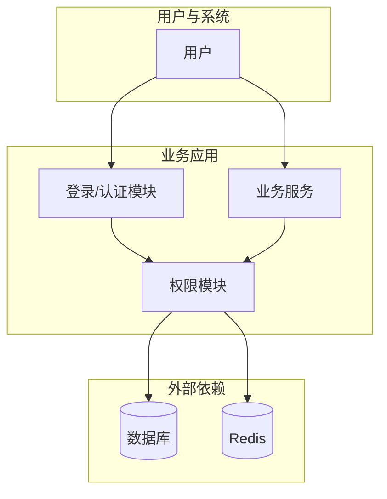
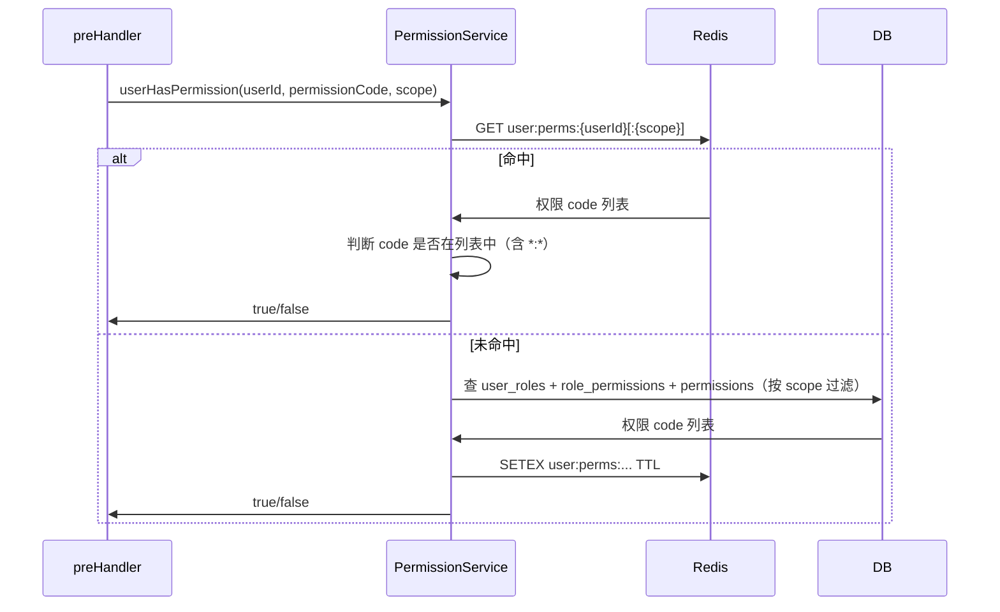

# 细粒度权限管理系统 — 详细设计文档

> 基于《权限模块实现.md》的细粒度权限方案，本文档给出实现级详细设计，包括数据字典、接口规范、流程、缓存、安全与测试，供开发与测试直接落地。

---

## 📋 文档信息

| 项目 | 说明 |
|------|------|
| **文档名称** | 细粒度权限管理系统详细设计 |
| **版本** | 1.0 |
| **参考文档** | 《权限模块实现.md》《公用-登录功能模块实现.md》 |
| **读者** | 后端/前端开发、测试、运维 |

---

## 📋 目录

- [1. 系统上下文与依赖](#1-系统上下文与依赖)
- [2. 数据字典与表结构](#2-数据字典与表结构)
- [3. 接口详细规范](#3-接口详细规范)
- [4. 核心流程详细设计](#4-核心流程详细设计)
- [5. 缓存与性能设计](#5-缓存与性能设计)
- [6. 安全与审计](#6-安全与审计)
- [7. 配置与部署](#7-配置与部署)
- [8. 测试与验收](#8-测试与验收)

---

## 1. 系统上下文与依赖

### 1.1 系统边界



- **权限模块**：对外提供「用户是否具备某权限」「用户权限列表」「角色/策略 CRUD」等能力；依赖**登录模块**提供已认证用户（`request.user`），依赖**数据库**与 **Redis** 做持久化与缓存。
- **业务服务**：在接口的 preHandler 中调用权限模块做 RBAC/ABAC 校验，不直接访问权限表。

### 1.2 与登录模块的约定

| 约定项 | 说明 |
|--------|------|
| 用户标识 | 使用 `users.id`（整型），权限模块不新建用户表 |
| 请求身份 | 认证通过后，在 `request.user` 上至少提供：`id`、`username`；可选：`departmentId`、`roles`、`permissions` |
| JWT 载荷 | 登录/刷新时可由权限模块或登录模块写入 `roles`、`permissions`，供前端与网关粗粒度控制 |
| 范围上下文 | 当前租户/部门等可从 `request.context.scope` 或 Header（如 `X-Tenant-Id`）解析，与 `user_roles.scope_type/scope_id` 匹配 |

### 1.3 技术栈假设

| 层级 | 技术 |
|------|------|
| Web 框架 | Fastify |
| 认证 | @fastify/jwt |
| 数据库 | MySQL 8.0+ / PostgreSQL 12+ |
| 缓存 | Redis 6+ |
| 可选 | 轻量表达式/策略引擎（如 json-logic-js） |

---

## 2. 数据字典与表结构

### 2.1 角色表 (roles)

| 字段名 | 类型 | 约束 | 默认 | 说明 |
|--------|------|------|------|------|
| id | INT | PK, AUTO_INCREMENT | - | 主键 |
| code | VARCHAR(50) | NOT NULL, UNIQUE | - | 角色编码，如 admin, editor |
| name | VARCHAR(100) | NOT NULL | - | 角色名称 |
| description | VARCHAR(500) | NULL | - | 描述 |
| is_system | BOOLEAN | - | FALSE | 系统内置角色不可删除 |
| created_at | DATETIME | NOT NULL | CURRENT_TIMESTAMP | 创建时间 |
| updated_at | DATETIME | NOT NULL | ON UPDATE CURRENT_TIMESTAMP | 更新时间 |

**索引**：`UNIQUE(code)`，`INDEX(code)`。

**约束**：`code` 仅允许字母、数字、下划线，长度 2–50；`is_system=TRUE` 时不允许 DELETE。

---

### 2.2 权限表 (permissions)

| 字段名 | 类型 | 约束 | 默认 | 说明 |
|--------|------|------|------|------|
| id | INT | PK, AUTO_INCREMENT | - | 主键 |
| code | VARCHAR(100) | NOT NULL, UNIQUE | - | 权限编码，如 document:read |
| resource | VARCHAR(50) | NOT NULL | - | 资源类型 |
| action | VARCHAR(50) | NOT NULL | - | 操作类型 |
| name | VARCHAR(100) | NOT NULL | - | 显示名称 |
| description | VARCHAR(500) | NULL | - | 描述 |
| created_at | DATETIME | NOT NULL | CURRENT_TIMESTAMP | 创建时间 |

**索引**：`UNIQUE(code)`，`INDEX(resource, action)`。

**约束**：`code` 格式须为 `resource:action`（或含通配符 `*`）；`resource`、`action` 建议来自预定义枚举。

---

### 2.3 角色-权限关联表 (role_permissions)

| 字段名 | 类型 | 约束 | 默认 | 说明 |
|--------|------|------|------|------|
| role_id | INT | PK, FK→roles(id) ON DELETE CASCADE | - | 角色 ID |
| permission_id | INT | PK, FK→permissions(id) ON DELETE CASCADE | - | 权限 ID |
| created_at | DATETIME | NOT NULL | CURRENT_TIMESTAMP | 关联创建时间 |

**主键**：(role_id, permission_id)。

---

### 2.4 用户-角色关联表 (user_roles)

| 字段名 | 类型 | 约束 | 默认 | 说明 |
|--------|------|------|------|------|
| id | INT | PK, AUTO_INCREMENT | - | 主键 |
| user_id | INT | NOT NULL, FK→users(id) ON DELETE CASCADE | - | 用户 ID |
| role_id | INT | NOT NULL, FK→roles(id) ON DELETE CASCADE | - | 角色 ID |
| scope_type | VARCHAR(50) | NULL | - | 范围类型：tenant, department, project；空为全局 |
| scope_id | VARCHAR(100) | NULL | - | 范围 ID |
| created_at | DATETIME | NOT NULL | CURRENT_TIMESTAMP | 创建时间 |

**唯一约束**：`UNIQUE(user_id, role_id, scope_type, scope_id)`。  
**索引**：`INDEX(user_id)`，`INDEX(role_id)`，`INDEX(scope_type, scope_id)`。

**scope 约定**：`scope_type` 与 `scope_id` 同时为空表示全局；校验时请求上下文的 scope 与二者均匹配或均为空时该行生效。

---

### 2.5 ABAC 策略表 (abac_policies)

| 字段名 | 类型 | 约束 | 默认 | 说明 |
|--------|------|------|------|------|
| id | INT | PK, AUTO_INCREMENT | - | 主键 |
| code | VARCHAR(100) | NOT NULL, UNIQUE | - | 策略编码 |
| name | VARCHAR(200) | NOT NULL | - | 策略名称 |
| description | VARCHAR(500) | NULL | - | 描述 |
| effect | ENUM('allow','deny') | NOT NULL | allow | 策略效果 |
| resource_type | VARCHAR(50) | NOT NULL | - | 适用资源类型 |
| action | VARCHAR(50) | NOT NULL | - | 适用操作 |
| priority | INT | NOT NULL | 100 | 优先级，数值越小越先评估 |
| condition_subject | JSON | NULL | - | 主体条件 |
| condition_resource | JSON | NULL | - | 资源条件 |
| condition_environment | JSON | NULL | - | 环境条件 |
| is_enabled | BOOLEAN | - | TRUE | 是否启用 |
| created_at | DATETIME | NOT NULL | CURRENT_TIMESTAMP | 创建时间 |
| updated_at | DATETIME | NOT NULL | ON UPDATE CURRENT_TIMESTAMP | 更新时间 |

**索引**：`INDEX(resource_type, action)`，`INDEX(priority)`，`INDEX(is_enabled)`。

**条件 JSON 约定**：见《权限模块实现.md》2.4 节；占位符 `{{subject.xxx}}`、`{{resource.xxx}}`、`{{env.xxx}}` 在求值时替换。

---

### 2.6 ABAC 属性定义表 (abac_attribute_definitions)（可选）

| 字段名 | 类型 | 约束 | 默认 | 说明 |
|--------|------|------|------|------|
| id | INT | PK, AUTO_INCREMENT | - | 主键 |
| category | ENUM('subject','resource','environment') | NOT NULL | - | 属性分类 |
| attribute_name | VARCHAR(80) | NOT NULL | - | 属性名，如 user_id, hour |
| data_type | ENUM('string','number','boolean','array') | - | string | 数据类型 |
| description | VARCHAR(200) | NULL | - | 描述 |

**唯一约束**：`UNIQUE(category, attribute_name)`。用于管理端展示与校验策略中可用的属性。

---

### 2.7 权限审计日志表 (permission_audit_log)（可选）

| 字段名 | 类型 | 约束 | 说明 |
|--------|------|------|------|
| id | BIGINT | PK, AUTO_INCREMENT | 主键 |
| event_type | VARCHAR(50) | NOT NULL | 事件：role_created, role_updated, role_deleted, user_roles_updated, policy_created 等 |
| operator_id | INT | NULL, FK→users | 操作人用户 ID |
| target_type | VARCHAR(30) | NOT NULL | 目标类型：role, user_role, policy |
| target_id | VARCHAR(100) | NULL | 目标 ID 或复合标识 |
| old_value | JSON | NULL | 变更前快照（可选） |
| new_value | JSON | NULL | 变更后快照（可选） |
| ip_address | VARCHAR(45) | NULL | 操作 IP |
| user_agent | VARCHAR(500) | NULL | User-Agent |
| created_at | DATETIME | NOT NULL | 发生时间 |

---

## 3. 接口详细规范

### 3.1 通用约定

- **Base URL**：`/api/v1`。
- **认证**：需登录的接口在 Header 中携带 `Authorization: Bearer <access_token>`。
- **统一响应**：成功 `{ "success": true, "data": ... }`；失败 `{ "success": false, "error": { "code": "...", "message": "..." } }`。
- **分页**：列表接口支持 `page`（从 1 开始）、`pageSize`（默认 20，最大 100）；响应中可带 `total`、`page`、`pageSize`。
- **请求连接性**：所有请求需设置 timeout 30s；server 端处理权限校验超时时应返回 503。
- **幂等性**：POST/PUT 操作需支持幂等性；可通过 `Idempotency-Key` Header（可选）或请求体中唯一标识字段实现。
- **版本控制**：API 变更采用 URL 版本（/api/v1）；废弃 API 需提前 3 个月通知并在日志中标注。

### 3.2 错误码

| HTTP 状态 | code | 说明 |
|-----------|------|------|
| 401 | UNAUTHORIZED | 未登录或 Token 无效/过期 |
| 403 | FORBIDDEN | 无权限 |
| 403 | FORBIDDEN_POLICY | ABAC 策略不满足 |
| 404 | NOT_FOUND | 资源不存在（如角色、策略、用户） |
| 409 | CONFLICT | 冲突（如角色 code 重复、系统角色不可删） |
| 422 | VALIDATION_ERROR | 参数校验失败，message 或 details 中给出字段级错误 |
| 429 | TOO_MANY_REQUESTS | 请求过于频繁，触发速率限制（权限变更操作） |
| 500 | INTERNAL_ERROR | 服务端错误 |
| 503 | SERVICE_UNAVAILABLE | 权限服务暂时不可用（如缓存故障） |

**错误返回体示例**：

```json
{
  "success": false,
  "error": {
    "code": "VALIDATION_ERROR",
    "message": "验证失败",
    "details": {
      "code": ["code 长度须为 2-50"],
      "permissionIds": ["ID 为 999 的权限不存在"]
    },
    "requestId": "req_xxx_123"
  }
}
```

所有错误响应需包含 `requestId`（用于日志追踪）。

### 3.3 权限校验接口

#### GET /api/v1/permissions/me

获取当前用户拥有的角色与权限列表。

**请求参数**：
- Header：`Authorization: Bearer <token>`（必须）
- Query（可选）：
  - `scope`: 范围类型，如 `tenant`、`department`、`project`；若不传则返回全局权限与指定 scope_id 为空的权限
  - `scopeId`: 范围 ID；需与 `scope` 同时提供
  - `includeAll`: 布尔值，是否同时返回全局权限和当前 scope 的权限（默认 false，仅返回当前 scope）

**响应 200**：

```json
{
  "success": true,
  "data": {
    "userId": 5,
    "roles": [
      { "code": "editor", "name": "编辑", "scope": null },
      { "code": "viewer", "name": "查看者", "scope": { "type": "department", "id": "10" } }
    ],
    "permissions": ["document:read", "document:create", "document:update"],
    "effectiveScope": { "type": "department", "id": "10" }
  }
}
```

**说明**：
- `roles` 返回角色对象列表（包含 scope 信息），便于前端区分全局/范围角色
- `permissions` 为综合权限列表（已去重），包括全局权限和当前 scope 的权限
- `effectiveScope` 表示当前评估的有效范围（用于 scope 调试）
- 响应需在 60s 内完成；若缓存不可用但 DB 正常，仍返回 200（不返回 503）

---

#### POST /api/v1/permissions/check

批量校验当前用户是否拥有指定权限（仅 RBAC）。支持单个权限查询和权限组合（AND/OR 逻辑）。

**请求 Body**：

```json
{
  "permissions": ["document:read", "document:update", "user:manage"],
  "combineLogic": "OR",
  "scope": { "type": "department", "id": "10" }
}
```

| 字段 | 类型 | 必填 | 说明 |
|------|------|------|------|
| permissions | string[] | 是 | 权限 code 列表，最多 50 个 |
| combineLogic | enum | 否 | 组合逻辑：OR（任一）或 AND（全部）；默认不组合，返回单个映射 |
| scope | object | 否 | `{ "type": "...", "id": "..." }` 指定范围；未提供时用全局 |

**响应 200**（不使用 combineLogic）：

```json
{
  "success": true,
  "data": {
    "results": {
      "document:read": true,
      "document:update": true,
      "user:manage": false
    },
    "cacheHit": true
  }
}
```

**响应 200**（使用 combineLogic=OR）：

```json
{
  "success": true,
  "data": {
    "allowed": true,
    "matchedPermissions": ["document:read", "document:update"],
    "logic": "OR",
    "cacheHit": true
  }
}
```

**响应 200**（使用 combineLogic=AND）：

```json
{
  "success": true,
  "data": {
    "allowed": false,
    "matchedPermissions": ["document:read", "document:update"],
    "missingPermissions": ["user:manage"],
    "logic": "AND",
    "cacheHit": true
  }
}
```

**说明**：
- 若未提供 `combineLogic`，返回每个权限的布尔值映射
- 若提供 `combineLogic`，返回组合后的 `allowed` 和已匹配/缺失权限列表
- `cacheHit` 表示此次查询是否从缓存取得；可用于前端性能分析
- 响应应在 100ms 内完成（含缓存延迟）

---

#### POST /api/v1/permissions/evaluate

ABAC 评估：在给定资源、环境及当前用户下，对指定操作是否允许。支持同步和异步资源查询。

**请求 Body**：

```json
{
  "action": "delete",
  "resourceType": "document",
  "resource": { 
    "id": 101, 
    "owner_id": 5, 
    "department_id": 2,
    "async": false
  },
  "environment": { 
    "hour": 14, 
    "tenant_id": 1,
    "source": "frontend"
  },
  "overrideSubject": null,
  "returnEvaluationDetails": true
}
```

| 字段 | 类型 | 必填 | 说明 |
|------|------|------|------|
| action | string | 是 | 操作，如 delete, export, view |
| resourceType | string | 是 | 资源类型，如 document, comment |
| resource | object | 否 | 资源属性；若为空或 `async=true`，则从 resourceId 异步查询（需调用方传 resourceId） |
| environment | object | 否 | 环境属性，如 hour, source, ip |
| overrideSubject | object | 否 | 覆盖当前用户；仅 `user:impersonate` 权限方可用 |
| returnEvaluationDetails | boolean | 否 | 返回详细评估过程（含条件匹配细节）；默认 false |

**响应 200**（简略）：

```json
{
  "success": true,
  "data": {
    "allowed": false,
    "matchedPolicies": [
      { 
        "code": "doc_delete_owner_only", 
        "effect": "deny",
        "priority": 10
      }
    ],
    "reason": "仅文档创建者可删除",
    "evaluationTimeMs": 8
  }
}
```

**响应 200**（含详细信息）：

```json
{
  "success": true,
  "data": {
    "allowed": false,
    "matchedPolicies": [
      {
        "code": "doc_delete_owner_only",
        "name": "文档删除-仅创建者",
        "effect": "deny",
        "priority": 10,
        "conditionsMet": {
          "subject": { "userId": 5 },
          "resource": { "owner_id": 5 },
          "environment": {}
        }
      }
    ],
    "evaluatedPolicies": 3,
    "reason": "仅文档创建者可删除",
    "evaluationTimeMs": 8,
    "policyListCacheHit": true
  }
}
```

**说明**：
- `subject` 默认由当前认证用户提供（从 JWT 解析）；可由 `overrideSubject` 覆盖（需权限）
- 若 `resource` 获取需异步查询，需在预处理阶段完成；此处假设已有完整属性
- `evaluationTimeMs` 用于性能监控；条件求值需在 50ms 内完成
- `policyListCacheHit` 表示策略列表是否来自缓存（调试用）
- RBAC 权限应由上游在调用前检验；本接口只做 ABAC 策略评估

---

### 3.4 角色管理接口

所有角色管理接口均需具备 `role:manage`（或等价）权限。

#### GET /api/v1/roles

角色列表，支持分页与按 code 模糊查询。

**Query**：`page`、`pageSize`、`code`（可选，模糊）、`isSystem`（可选，true/false）。

**响应 200**：

```json
{
  "success": true,
  "data": {
    "items": [
      {
        "id": 1,
        "code": "admin",
        "name": "系统管理员",
        "description": null,
        "isSystem": true,
        "createdAt": "2024-01-01T00:00:00.000Z",
        "updatedAt": "2024-01-01T00:00:00.000Z"
      }
    ],
    "total": 10,
    "page": 1,
    "pageSize": 20
  }
}
```

---

#### GET /api/v1/roles/:id

角色详情，含该角色拥有的权限 ID 列表。

**响应 200**：同上单条角色对象，并增加 `permissionIds: [1, 2, 3]`。  
**响应 404**：角色不存在。

---

#### POST /api/v1/roles

创建角色。

**请求 Body**：

```json
{
  "code": "custom_editor",
  "name": "自定义编辑",
  "description": "仅文档编辑",
  "permissionIds": [1, 2, 3]
}
```

| 字段 | 类型 | 必填 | 说明 |
|------|------|------|------|
| code | string | 是 | 角色编码，唯一 |
| name | string | 是 | 角色名称 |
| description | string | 否 | 描述 |
| permissionIds | int[] | 否 | 权限 ID 列表，创建时即绑定 |

**响应 201**：返回完整角色对象（含 id、createdAt 等）。  
**响应 409**：code 已存在。  
**响应 422**：code/name 格式不合法或 permissionIds 含无效 ID。

---

#### PUT /api/v1/roles/:id

更新角色（不含权限绑定；权限绑定用 PUT /api/v1/roles/:id/permissions）。

**请求 Body**：`name`、`description` 可选；不允许修改 `code`、`is_system`。  
**响应 200**：返回更新后角色对象。  
**响应 404**：角色不存在。

---

#### DELETE /api/v1/roles/:id

删除角色。系统角色（is_system=true）不可删除。

**响应 204**：无 Body。  
**响应 403/409**：系统角色不可删除。

---

#### PUT /api/v1/roles/:id/permissions

设置角色权限（全量替换）。

**请求 Body**：`{ "permissionIds": [1, 2, 3, 4] }`。  
**响应 200**：可返回更新后 permissionIds。  
**响应 404**：角色不存在。  
**响应 422**：permissionIds 中含不存在的 ID。

---

### 3.5 权限定义接口

需 `role:manage` 或单独的 `permission:manage` 权限。仅管理员可创建/删除权限；权限定义应由产品层定义。

#### GET /api/v1/permissions

权限定义列表，支持按 resource、action 过滤；支持分页。

**Query**：
- `page` / `pageSize` 可选
- `resource` 可选，如 document, user
- `action` 可选，如 read, write, delete
- `code` 可选，精确查询或前缀查询

**响应 200**：

```json
{
  "success": true,
  "data": {
    "items": [
      {
        "id": 1,
        "code": "document:read",
        "resource": "document",
        "action": "read",
        "name": "文档查看",
        "description": "查看文档内容",
        "createdAt": "2024-01-01T00:00:00Z"
      }
    ],
    "total": 50,
    "page": 1,
    "pageSize": 20
  }
}
```

---

#### GET /api/v1/permissions/:id

权限详情。**响应 404**：不存在。

---

#### POST /api/v1/permissions

创建权限（权限编码需遵循 resource:action 的规范）。

**请求 Body**：

```json
{
  "code": "document:export",
  "resource": "document",
  "action": "export",
  "name": "文档导出",
  "description": "导出文档为 PDF/Excel 等格式"
}
```

| 字段 | 类型 | 必填 | 说明 |
|------|------|------|------|
| code | string | 是 | 权限编码，唯一；格式 `resource:action` |
| resource | string | 是 | 资源类型，如 document |
| action | string | 是 | 操作类型，如 read, write |
| name | string | 是 | 显示名称 |
| description | string | 否 | 权限描述 |

**响应 201**：返回完整权限对象（含 id, createdAt）。  
**响应 409**：code 已存在。  
**响应 422**：码格式不符合 `resource:action` 规范。

---

#### PUT /api/v1/permissions/:id

更新权限的名称和描述（不允许修改 code、resource、action）。

**请求 Body**：`{ "name": "...", "description": "..." }`。  
**响应 200**：返回更新后的权限对象。  
**响应 404**：权限不存在。

---

#### DELETE /api/v1/permissions/:id

删除权限。会自动从 `role_permissions` 中移除相关绑定。

**响应 204**：成功删除。  
**响应 404**：权限不存在。  
**响应 409**：被某些角色使用，无法删除（可选：可改为级联删除役绑定）。

---

### 3.6 用户角色接口

需 `role:manage` 或「仅可管理下级」等业务权限。

#### GET /api/v1/users/:userId/roles

查询某用户的角色列表（含 scope）。支持按 scopeType 过滤。

**Query**：`scopeType` 可选，如 department, tenant。

**响应 200**：

```json
{
  "success": true,
  "data": {
    "userId": 5,
    "assignments": [
      {
        "id": 101,
        "roleId": 2,
        "roleCode": "editor",
        "roleName": "编辑",
        "scopeType": "department",
        "scopeId": "10",
        "createdAt": "2024-01-01T00:00:00Z"
      },
      {
        "id": 102,
        "roleId": 3,
        "roleCode": "viewer",
        "roleName": "查看者",
        "scopeType": null,
        "scopeId": null,
        "createdAt": "2024-01-02T00:00:00Z"
      }
    ],
    "total": 2
  }
}
```

**响应 404**：用户不存在。

---

#### PUT /api/v1/users/:userId/roles

设置用户角色（全量替换）。会删除所有已有角色后添加新角色。需实现原子性：要么全部成功，要么全部失败。

**请求 Body**：

```json
{
  "assignments": [
    { "roleId": 2, "scopeType": "department", "scopeId": "10" },
    { "roleId": 3, "scopeType": null, "scopeId": null }
  ]
}
```

| 字段 | 类型 | 必填 | 说明 |
|------|------|------|------|
| assignments | array | 是 | 角色分配列表（可为空，表示删除所有角色） |
| assignments[].roleId | int | 是 | 角色 ID |
| assignments[].scopeType | string | 否 | 范围类型；为 null 表示全局角色 |
| assignments[].scopeId | string | 否 | 范围 ID；需与 scopeType 同时为 null 或同时有值 |

**响应 200**：返回更新后的完整分配列表。

```json
{
  "success": true,
  "data": {
    "userId": 5,
    "assignments": [ ... ],
    "operationId": "op_xxx_123"
  }
}
```

**响应 404**：用户不存在。  
**响应 422**：roleId 不存在或 scope 格式错误。  
**响应 409**：重复分配（同一用户在同一 scope 分配相同角色）。

---

#### DELETE /api/v1/users/:userId/roles/:assignmentId

删除单个角色分配。

**响应 204**：成功删除。  
**响应 404**：分配不存在。  
**响应 409**：系统角色不可删除（若角色标记为系统内置）。

---

#### POST /api/v1/users/:userId/roles/batch

批量添加/删除角色分配（增量更新）。用于避免全量替换的竞态条件。

**请求 Body**：

```json
{
  "add": [
    { "roleId": 4, "scopeType": "project", "scopeId": "P1" }
  ],
  "remove": [
    { "roleId": 3, "scopeType": null, "scopeId": null }
  ]
}
```

**响应 200**：返回操作后的完整分配列表。  
**响应 422**：格式错误或 roleId 不存在。  
**响应 409**：移除不存在的分配或添加重复分配。

---

### 3.7 ABAC 策略接口

策略 CRUD 需 `role:manage`（或单独 `policy:manage`）；评估接口见 3.3。

#### GET /api/v1/policies

策略列表，支持分页与按 resourceType、action、isEnabled 过滤。

**Query**：
- `page`、`pageSize` 分页（默认 1, 20；最大 100）
- `resourceType` 可选，如 document, comment
- `action` 可选，如 delete, export
- `isEnabled` 可选，true/false
- `effect` 可选，allow/deny
- `code` 可选，使用前缀匹配

**响应 200**：

```json
{
  "success": true,
  "data": {
    "items": [
      {
        "id": 1,
        "code": "doc_delete_owner_only",
        "name": "文档删除-仅创建者",
        "description": "...",
        "effect": "deny",
        "resourceType": "document",
        "action": "delete",
        "priority": 10,
        "isEnabled": true,
        "conditionSubject": { ... },
        "conditionResource": { ... },
        "conditionEnvironment": { ... },
        "createdAt": "2024-01-01T00:00:00Z",
        "updatedAt": "2024-01-05T10:30:00Z"
      }
    ],
    "total": 25,
    "page": 1,
    "pageSize": 20
  }
}
```

---

#### GET /api/v1/policies/:id

策略详情。**响应 404**：不存在。

---

#### POST /api/v1/policies

创建策略。条件属性应遵循《权限模块实现.md》的 ABAC 条件格式。

**请求 Body**：

```json
{
  "code": "doc_delete_owner_only",
  "name": "文档删除-仅创建者",
  "description": "仅文档的创建者可删除该文档",
  "effect": "deny",
  "resourceType": "document",
  "action": "delete",
  "priority": 10,
  "conditionSubject": {
    "$and": [
      { "userId": { "$eq": "{{resource.owner_id}}" } }
    ]
  },
  "conditionResource": {
    "$and": [
      { "status": { "$ne": "archived" } }
    ]
  },
  "conditionEnvironment": null,
  "isEnabled": true
}
```

| 字段 | 类型 | 必填 | 说明 |
|------|------|------|------|
| code | string | 是 | 策略编码，唯一 |
| name | string | 是 | 策略名称 |
| description | string | 否 | 策略描述 |
| effect | enum | 是 | allow 或 deny |
| resourceType | string | 是 | 资源类型 |
| action | string | 是 | 操作类型 |
| priority | int | 否 | 优先级（0-1000）；数值小的先评估；建议 deny 策略 priority < allow 策略 |
| conditionSubject | object | 否 | 主体条件（关于用户属性）；null 表示无限制 |
| conditionResource | object | 否 | 资源条件；占位符 `{{resource.fieldName}}` 将在评估时被替换 |
| conditionEnvironment | object | 否 | 环境条件；如 `{ "hour": { "$gte": 9, "$lte": 18 } }` |
| isEnabled | boolean | 否 | 是否启用；默认 true |

**响应 201**：返回完整策略对象。  
**响应 409**：code 已存在。  
**响应 422**：
- resourceType/action 不存在或格式错误
- 条件 JSON 格式错误或占位符格式不符（应为 `{{category.field}}`）
- priority 超出范围

---

#### PUT /api/v1/policies/:id

更新策略。可修改 name, description, priority, conditions, isEnabled；不可修改 code/effect/resourceType/action（如需更改，应创建新策略）。

**请求 Body**：`{ "name": "...", "priority": 20, "isEnabled": false, ... }`。  
**响应 200**：返回更新后的策略对象。  
**响应 404**：策略不存在。  
**响应 422**：条件或优先级格式错误。

---

#### DELETE /api/v1/policies/:id

删除策略。此操作不可撤销。

**响应 204**：成功删除。  
**响应 404**：策略不存在。  
**响应 409**：策略被锁定（如标记为内置策略）。

---

## 4. 核心流程详细设计

### 4.1 RBAC 权限校验流程



**异常**：DB 查询失败返回 false 或抛错由上层统一处理；缓存失败可降级为仅查 DB。

### 4.2 ABAC 策略评估流程

1. 根据 `resource_type`、`action` 查询 `abac_policies` 且 `is_enabled=TRUE`。
2. 按 `priority` 升序排序（deny 策略建议 priority 更小）。
3. 依次对每条策略求值 `condition_subject`、`condition_resource`、`condition_environment`（占位符替换后做逻辑比较）。
4. 若某条策略条件满足且 effect=deny，则返回不允许，并记录匹配的 deny 策略。
5. 若某条策略条件满足且 effect=allow，则返回允许，并记录匹配的 allow 策略。
6. 若无一匹配：按约定返回「默认拒绝」或「默认允许」（建议默认拒绝）。

**条件求值**：将 JSON 中 `{{subject.xxx}}`、`{{resource.xxx}}`、`{{env.xxx}}` 替换为传入对象对应字段，再递归比较键值（支持 `$gte`、`$lt`、`$contains` 等运算符，见《权限模块实现.md》）。

### 4.3 登录/刷新时注入权限

1. 用户登录或刷新 Token 时，在签发 JWT 前调用 `PermissionService.getUserPermissionCodes(userId)`、`RoleService.getUserRoleCodes(userId)`（若有 scope 则传当前 scope）。
2. 将 `roles`、`permissions` 写入 JWT payload。
3. 前端或网关可从 JWT 解析得到，用于菜单/按钮显隐；接口侧仍以权限服务实时校验为准。

### 4.4 权限/角色变更后缓存失效

- 修改 `user_roles`：使对应用户的权限缓存失效，key 为 `user:perms:{userId}` 及带 scope 的变体。
- 修改 `role_permissions`：使所有拥有该角色的用户的权限缓存失效（可通过角色 ID 反查 user_id 列表或广播失效前缀）。
- 修改 `abac_policies`：使策略按 `resource_type+action` 的缓存失效（若有策略列表缓存）。

### 4.5 并发控制与一致性保证

#### 4.5.1 用户角色分配的原子性

全量替换用户角色时（PUT /api/v1/users/:userId/roles），需保证原子性：

```sql
START TRANSACTION;
  DELETE FROM user_roles WHERE user_id = ? AND role_id NOT IN (SELECT id FROM roles WHERE is_system = TRUE);
  INSERT INTO user_roles (user_id, role_id, scope_type, scope_id) VALUES (...), (...);
  -- 清缓存
COMMIT;
-- 或 ROLLBACK
```

若需要不同 scope 的角色分别更新，建议使用增量更新接口（POST .../batch）而非全量替换。

#### 4.5.2 角色权限的版本管理

当修改角色的权限集合时，可选择性地记录版本历史（便于审计与回滚）：

```sql
-- 可选：记录版本
INSERT INTO role_permissions_history (role_id, permission_ids, changed_by, changed_at)
  VALUES (?, ?, ?, NOW());

-- 然后同步更新
DELETE FROM role_permissions WHERE role_id = ?;
INSERT INTO role_permissions (...) VALUES (...);
```

#### 4.5.3 应对高并发权限查询

- **缓存预热**：系统启动时预加载热点用户（如管理员、频繁操作用户）的权限到 Redis。
- **缓存多层**：一级 Redis、二级本地内存（带 TTL），避免缓存穿透与雪崩。
- **熔断器**：缓存或 DB 故障时，权限校验应具有降级逻辑（如默认允许特定接口、返回 503 并提示重试）。

#### 4.5.4 策略更新的安全性

ABAC 策略更改后应立即失效缓存；建议同步更新（非异步）：

```javascript
async updatePolicy(policyId, updates) {
  await db.updatePolicy(policyId, updates);
  // 同步删除缓存
  const policy = await db.getPolicy(policyId);
  await redis.del(`abac:policies:${policy.resource_type}:${policy.action}`);
  // 广播消息（若有多进程）
  await eventBus.publish('policy_updated', { policyId });
}
```

### 4.6 故障转移与高可用设计

#### 4.6.1 缓存故障转移

```
Redis 不可用
  ↓
查询 DB（额外 I/O 成本）
  ↓
若 DB 也不可用，返回 503 或根据业务规则降级（如仅允许特定用户）
```

#### 4.6.2 多数据库副本

部署权限库的读写分离或多副本，提升可用性：
- 读：从副本，减少主库压力
- 写：先主后副
- 故障转移：若主库宕机，选举副本为主

#### 4.6.3 接口超时与重试

权限校验接口需设置超时（建议 30-60s），且上游在权限校验失败时应有重试机制（指数退避）。

------

## 5. 缓存与性能设计

### 5.1 缓存键与 TTL

| 键模式 | 说明 | TTL | 备注 |
|--------|------|-----|------|
| user:perms:{userId} | 用户全局权限 code 列表 | 600s（10 分钟） | 热数据，可加二级本地缓存 |
| user:perms:{userId}:{scopeType}:{scopeId} | 用户在某 scope 下权限列表 | 600s | 同上 |
| abac:policies:{resourceType}:{action} | 某资源类型+操作的策略列表 | 300s | 变更频率较低，可更长 TTL |
| user:perms:{userId}:version | 权限版本号 | 3600s | 用于检测权限变更 |

### 5.2 失效策略

- **用户权限失效**：`user_roles` 或 `role_permissions` 变更时，删除对应用户的 `user:perms:{userId}*` 键（支持通配符）。
- **角色权限失效**：修改某角色权限时，需反查所有拥有该角色的用户（查询 `user_roles` WHERE role_id = ?），逐一清除其权限缓存。可选方案：使用 Redis Pub/Sub 广播失效指令。
- **策略失效**：`abac_policies` 增删改时，删除对应 `abac:policies:{resourceType}:{action}`；若修改 resourceType 或 action，需同时删除旧键。
- **版本号更新**：权限变更时更新 `user:perms:{userId}:version`，客户端可定期检查版本号判断权限是否失效。

### 5.3 缓存穿透、击穿、雪崩应对

#### 缓存穿透（大量不存在的权限查询）
- **布隆过滤器** (Bloom Filter)：维护所有有效权限的 Bloom Filter，先查询是否存在再查 Redis/DB。
- **空值缓存**：不存在的权限也缓存空值（TTL 较短，如 60s），防止重复查询。

#### 缓存击穿（热权限过期导致大量 DB 查询）
- **互斥锁**：某权限缓存失效时，用分布式锁（Redis SET NX）保证仅一个请求查 DB，其他请求等待；查询完成后其他请求共享结果。
- **后台刷新**：在缓存即将过期时（如 TTL 剩余 10%）异步刷新，避免过期时刻的空窗。

#### 缓存雪崩（大量缓存同时过期）
- **TTL 随机化**：不使用固定 TTL，而是 TTL ± 10% 的随机值，使过期时间分散。
- **缓存预热**：系统启动或权限变更后主动预加载热权限。

### 5.4 性能目标

| 操作 | 目标响应时间 | 备注 |
|-----|------|------|
| userHasPermission（缓存命中） | < 5ms | 仅 Redis 查询 |
| userHasPermission（缓存未命中） | < 100ms | 包含 DB 查询与缓存更新 |
| GET /permissions/me | < 150ms | 可包含多个权限查询 |
| POST /permissions/evaluate（ABAC） | < 100ms | 包括策略查询与条件求值 |
| 权限管理接口（CRUD） | < 500ms | 包括缓存失效操作 |

### 5.5 本地缓存与多进程

针对高并发场景，可使用二级缓存（本地内存 + Redis）：

```javascript
// 伪代码
async function getUserPermissions(userId) {
  // 一级：本地缓存（内存中的 Map，TTL 30s）
  let perms = localCache.get(`${userId}:perms`);
  if (perms) return perms;

  // 二级：Redis（TTL 600s）
  perms = await redis.get(`user:perms:${userId}`);
  if (perms) {
    localCache.set(`${userId}:perms`, perms, 30000);
    return perms;
  }

  // 三级：数据库（含互斥锁）
  const lock = await redis.lock(`lock:user:perms:${userId}`, 5000);
  if (!lock) {
    // 等待其他请求完成，重新查询 Redis
    await sleep(100);
    return getUserPermissions(userId);
  }
  try {
    perms = await db.queryUserPermissions(userId);
    await redis.setex(`user:perms:${userId}`, 600, perms);
    localCache.set(`${userId}:perms`, perms, 30000);
    return perms;
  } finally {
    await redis.unlock(lock);
  }
}
```

### 5.6 监控指标

实现以下指标以监控缓存效果：

| 指标 | 说明 | 告警阈值 |
|-----|------|---------|
| 权限缓存命中率 | Redis 命中次数 / 总查询次数 | < 80% 需优化 |
| DB 查询延迟 | 权限 DB 查询 P95 响应时间 | > 100ms 需优化 |
| 权限接口响应时间 | GET /permissions/me 的 P99 | > 500ms 需警告 |
| 缓存失效延迟 | 权限变更到缓存失效的时间 | > 1s 需检查 |

---

## 6. 安全与审计

### 6.1 安全要点

- **最小权限原则**：所有写操作（角色/用户角色/策略的增删改）必须校验操作人具备 `role:manage`（或相应）权限；可进一步细化为 `role:create`、`role:delete`、`policy:manage` 等。
- **权限隔离**：不同租户的权限数据应物理或逻辑隔离；scope_type 与 scope_id 应与请求上下文一致。
- **缓存失效一致性**：权限与策略数据变更后必须同步（非异步）失效缓存，避免脏读导致的越权。
- **敏感操作审计**：管理员角色变更、策略修改等应记录完整的审计日志。
- **防止权限提升** (Privilege Escalation)：创建用户角色时需验证操作人是否可分配该角色（若用户已拥有角色 A，仅允许分配权限 ≤ A 的角色）。

### 6.2 审计日志

#### 审计事件类型

| 事件类型 | 说明 | 记录内容 |
|---------|------|---------|
| role_created | 创建角色 | role_id, code, name, permissionIds |
| role_updated | 更新角色 | role_id, 修改字段与新旧值 |
| role_deleted | 删除角色 | role_id, code, 被删除的权限列表 |
| role_permissions_updated | 修改角色权限 | role_id, 新增/移除的权限 ID 列表 |
| user_roles_updated | 修改用户角色 | user_id, 新增/移除的角色及 scope |
| policy_created | 创建策略 | policy_id, code, effect, resourceType, action |
| policy_updated | 更新策略 | policy_id, 修改的字段与新旧值 |
| policy_deleted | 删除策略 | policy_id, code, effect |
| permission_denied | 权限校验失败 | user_id, resource, action, reason（仅记录关键拒绝） |

#### 审计日志字段

```sql
CREATE TABLE permission_audit_log (
  id BIGINT PRIMARY KEY AUTO_INCREMENT,
  event_type VARCHAR(50) NOT NULL,
  operator_id INT NOT NULL,        -- 操作人 ID
  target_type VARCHAR(30) NOT NULL, -- role, user_role, policy, permission
  target_id VARCHAR(100),           -- 目标 ID
  old_value JSON,                   -- 修改前快照（仅修改操作）
  new_value JSON,                   -- 修改后快照（仅修改操作）
  ip_address VARCHAR(45),           -- 操作 IP
  user_agent VARCHAR(500),          -- User-Agent
  status VARCHAR(20),               -- success, failure
  error_message VARCHAR(500),       -- 失败原因
  created_at DATETIME DEFAULT CURRENT_TIMESTAMP,
  -- 索引：便于查询
  KEY idx_event_type (event_type),
  KEY idx_operator_id (operator_id),
  KEY idx_target_type_id (target_type, target_id),
  KEY idx_created_at (created_at)
);
```

#### 审计日志记录时机

- **操作成功后立即记录**，勿使用异步操作以保证一致性。
- **关键操作可记录详细的变更快照**（old_value / new_value），便于审计与追溯。
- **权限校验失败可选择性记录**：仅记录系统权限或敏感操作的拒绝（避免日志过大）。

### 6.3 防护措施

#### 防止权限提升
```javascript
// 伪代码：分配角色时检查权限限制
async function assignRoleToUser(operatorId, userId, roleId) {
  const assigningRole = await db.getRole(roleId);
  
  // 操作人必须拥有该角色
  const operatorRoles = await db.getUserRoles(operatorId);
  if (!operatorRoles.map(r => r.id).includes(roleId)) {
    throw new Error('权限不足：无法分配您未拥有的角色');
  }
  
  // 检查权限（权限继承规则由业务定义）
  const assigningPerms = await db.getRolePermissions(roleId);
  const operatorPerms = await db.getUserPermissions(operatorId);
  if (!permissionsInclude(operatorPerms, assigningPerms)) {
    throw new Error('权限不足：无法分配超出您权限范围的角色');
  }
  
  // ... 执行分配
}
```

#### 防止缓存中毒
- 缓存权限数据时进行校验（如权限 code 格式）。
- 定期审计缓存中的数据与 DB 的一致性（后台任务）。

---

## 7. 配置与部署

### 7.1 环境变量建议

| 变量名 | 说明 | 示例 | 环境 |
|--------|------|------|------|
| **缓存配置** | | | |
| PERM_CACHE_TTL_SECONDS | 用户权限缓存 TTL（秒） | 600 | 生产可调为 1200 |
| PERM_ABAC_POLICY_CACHE_TTL | 策略列表缓存 TTL（秒） | 300 | 生产可调为 600 |
| PERM_LOCAL_CACHE_TTL_MS | 本地内存缓存 TTL（毫秒） | 30000 | 仅高并发场景启用 |
| PERM_ENABLE_LOCAL_CACHE | 启用本地内存二级缓存 | false | 可选 |
| **ABAC 配置** | | | |
| PERM_ABAC_DEFAULT_NO_MATCH | 无匹配策略时默认 allow/deny | deny | 建议 deny |
| PERM_ABAC_MAX_POLICIES | 单次评估的最大策略数 | 100 | 防止策略数过多 |
| PERM_ABAC_CONDITION_EVAL_TIMEOUT_MS | 条件求值超时（毫秒） | 100 | 避免无限递归 |
| **审计日志** | | | |
| PERM_AUDIT_ENABLED | 是否记录权限审计日志 | true | 生产环境建议 true |
| PERM_AUDIT_SENSITIVE_ONLY | 仅记录关键操作（不记录查询） | false | 可减少日志量 |
| PERM_AUDIT_RETENTION_DAYS | 审计日志保留天数 | 90 | 定期清理 |
| **安全配置** | | | |
| PERM_CHECK_PRIVILEGE_ESCALATION | 防止权限提升 | true | 应始终启用 |
| PERM_RATE_LIMIT_ROLE_OPS | 角色/用户角色操作速率限制（/分钟） | 100 | 防止滥用 |
| PERM_REQUIRE_IDEMPOTENCY_KEY | POST/PUT 需要幂等键 | true | 可选 |
| **故障转移** | | | |
| PERM_DB_MAX_RETRY | DB 查询失败重试次数 | 3 | 避免雪崩 |
| PERM_DB_RETRY_BACKOFF_MS | 重试退避间隔（毫秒） | 100 | 指数退避 |
| PERM_FALLBACK_DENY_ON_ERROR | 错误时默认拒绝 | true | 宁可错拒，勿错许 |
| **监控** | | | |
| PERM_ENABLE_METRICS | 启用 Prometheus 指标 | true | 用于监控 |
| PERM_SLOW_QUERY_THRESHOLD_MS | 慢查询阈值（毫秒） | 100 | 记录超时的操作 |

### 7.2 数据库初始化

#### 建表脚本

```sql
-- 参考 2.1 - 2.7 小节建表，关键点：
-- 1. roles 表：加索引 UNIQUE(code)
-- 2. permissions 表：加索引 UNIQUE(code), INDEX(resource, action)
-- 3. user_roles 表：加唯一约束 UNIQUE(user_id, role_id, scope_type, scope_id)
-- 4. abac_policies 表：加索引 INDEX(resource_type, action), INDEX(priority), INDEX(is_enabled)
-- 5. permission_audit_log 表：加索引便于查询

-- 示例建表部分（简化）
CREATE TABLE roles (
  id INT PRIMARY KEY AUTO_INCREMENT,
  code VARCHAR(50) NOT NULL UNIQUE,
  name VARCHAR(100) NOT NULL,
  description VARCHAR(500),
  is_system BOOLEAN DEFAULT FALSE,
  created_at DATETIME DEFAULT CURRENT_TIMESTAMP,
  updated_at DATETIME DEFAULT CURRENT_TIMESTAMP ON UPDATE CURRENT_TIMESTAMP
) CHARSET=utf8mb4 COLLATE=utf8mb4_unicode_ci;

-- 务必添加检查约束：code 仅允许字母、数字、下划线
ALTER TABLE roles ADD CONSTRAINT chk_code_format CHECK (code REGEXP '^[a-zA-Z0-9_]{2,50}$');
```

#### 种子数据

```sql
-- 创建系统角色
INSERT INTO roles (code, name, is_system) VALUES 
  ('admin', '系统管理员', TRUE),
  ('editor', '编辑', FALSE),
  ('viewer', '查看者', FALSE);

-- 创建常用权限
INSERT INTO permissions (code, resource, action, name) VALUES 
  ('document:read', 'document', 'read', '文档查看'),
  ('document:create', 'document', 'create', '文档创建'),
  ('document:update', 'document', 'update', '文档编辑'),
  ('document:delete', 'document', 'delete', '文档删除'),
  ('document:export', 'document', 'export', '文档导出'),
  ('role:manage', 'role', 'manage', '角色管理'),
  ('permission:manage', 'permission', 'manage', '权限管理'),
  ('user:manage', 'user', 'manage', '用户管理'),
  ('policy:manage', 'policy', 'manage', '策略管理');

-- 给 admin 角色分配所有权限
INSERT INTO role_permissions (role_id, permission_id)
  SELECT 1, id FROM permissions;

-- 给 editor 角色分配文档权限
INSERT INTO role_permissions (role_id, permission_id)
  SELECT 2, id FROM permissions WHERE resource = 'document';

-- 给 viewer 角色仅分配 read 权限
INSERT INTO role_permissions (role_id, permission_id)
  SELECT 3, id FROM permissions WHERE action = 'read';
```

### 7.3 部署注意事项

#### 数据库连接池
- 配置连接池大小：建议权限库连接 20-50（视 QPS 调整）。
- 启用连接重用与连接超时管理，避免连接泄漏。

#### Redis 集群
- 若使用 Redis Cluster，需保证权限缓存 key 分布均匀。
- 启用 Redis 持久化（AOF），避免宕机时缓存丢失。
- 建议配置 Redis Sentinel 实现自动故障转移。

#### 多进程同步
- 权限变更时需通过 Redis Pub/Sub 或消息队列通知其他进程更新本地缓存。
- 多个部署实例应使用分布式锁（Redis SET NX）协调缓存刷新。

#### 版本管理
- 权限模块的 schema 变更应向下兼容；若无法兼容，需灰度发布与数据迁移。

### 7.4 性能调优建议

| 场景 | 调优方案 |
|-----|---------|
| 权限查询 QPS 高（>1000/s） | 启用二级缓存（本地内存）、提升 Redis 连接数、考虑读写分离 |
| 权限变更频繁 | 使用增量更新接口而非全量替换；延长缓存 TTL；使用后台异步刷新 |
| ABAC 策略复杂导致响应慢 | 简化策略条件、使用索引优化 DB 查询、考虑策略预编译 |
| 数据库压力大 | 启用从库读取权限；数据分片；定期清理审计日志 |

---

## 8. 测试与验收

### 8.1 单元测试要点

#### PermissionService

- **缓存命中场景**：
  - 权限已在缓存中，调用 `userHasPermission` 应直接从缓存返回（< 5ms）
  - 验证缓存 key 的组合（user_id + role_id + scope）正确性
  
- **缓存未命中场景**：
  - 缓存为空，查询 DB 并写入缓存，返回结果
  - 验证缓存 TTL 设置正确
  
- **Scope 过滤**：
  - 用户同时拥有全局角色和 scope 角色时，权限合并正确
  - 查询特定 scope 时，仅返回该 scope 及全局的权限
  
- **通配符处理**：
  - 拥有 `*:*` 权限时，任何操作都应返回 true
  - 拥有 `document:*` 时，所有 document 操作应返回 true

#### ABAC 引擎

- **条件求值**：
  - 占位符替换：`{{subject.id}}` → 实际用户 ID
  - 逻辑运算符支持：$and, $or, $not, $gte, $lte, $eq, $ne, $in 等
  - 嵌套条件求值（深层对象比较）
  
- **策略优先级和效果**：
  - deny 策略优先于 allow（即使 deny priority 更大）
  - 同优先级时，遵循优先级排序
  - 无匹配策略时返回默认行为（通常默认拒绝）
  
- **异常处理**：
  - 条件 JSON 格式错误时的优雅降级
  - 占位符无法替换时（missing field）应返回不匹配而非异常

#### 角色/权限/策略 CRUD

- **参数校验**：
  - code 格式（`[a-zA-Z0-9_]{2,50}`）
  - 枚举值验证（effect: allow/deny）
  - required 字段检查
  
- **系统角色保护**：
  - `is_system=TRUE` 的角色不可删除（返回 409）
  - 修改系统角色权限时给出警告
  
- **唯一约束**：
  - 重复的 code 返回 409 CONFLICT
  - 重复的用户-角色-scope 组合返回 409

### 8.2 接口集成测试

#### 认证与授权

| 场景 | 请求 | 预期响应 | 优先级 |
|-----|------|----------|--------|
| 无 Token | GET /permissions/me | 401 UNAUTHORIZED | P0 |
| Token 过期 | GET /permissions/me + expired_token | 401 UNAUTHORIZED | P0 |
| Token 合法但无权限 | GET /permissions/me + user_token, GET /roles | 403 FORBIDDEN | P0 |
| Token 合法且有权限 | 同上 + admin_token | 200 OK | P0 |

#### 权限查询

| 场景 | 请求 | 预期响应 | 备注 |
|-----|------|----------|------|
| 查询用户全局权限 | GET /permissions/me | roles + permissions 列表 | P0 |
| 查询特定 scope 权限 | GET /permissions/me?scope=department&scopeId=10 | 该 scope 下的权限 | P1 |
| 批量检查权限 | POST /permissions/check { "permissions": [...] } | 各权限的 true/false | P0 |
| 权限 AND 组合 | POST /permissions/check { combineLogic: "AND" } | 所有权限均拥有时 allowed=true | P2 |
| 权限 OR 组合 | POST /permissions/check { combineLogic: "OR" } | 任一权限拥有时 allowed=true | P2 |

#### 角色管理

| 场景 | 请求 | 预期响应 |
|-----|------|----------|
| 创建新角色 | POST /roles { code, name, permissionIds } | 201, 返回 role_id |
| code 重复 | POST /roles { code: "editor" } | 409 CONFLICT |
| 更新角色 | PUT /roles/1 { name: "..." } | 200, 返回更新后对象 |
| 删除系统角色 | DELETE /roles/1 (is_system=true) | 409, 禁止删除 |
| 删除自定义角色 | DELETE /roles/5 (is_system=false) | 204 No Content |

#### 用户角色分配

| 场景 | 请求 | 预期响应 | 备注 |
|-----|------|----------|------|
| 设置用户角色（全量） | PUT /users/5/roles { assignments: [...] } | 200, 返回完整分配列表 | 原子性保证 |
| 设置后验证权限生效 | GET /permissions/me（user=5） | 权限列表已更新 | 缓存失效 |
| 增量添加/移除角色 | POST /users/5/roles/batch { add, remove } | 200, 返回最终分配列表 | P2 |
| 删除单个角色分配 | DELETE /users/5/roles/101 | 204 | P2 |
| 重复分配 | PUT /users/5/roles { 同一用户在同一 scope 分配两次同一角色 } | 409 |  |

#### ABAC 策略评估

| 场景 | 请求 | 预期响应 | 备注 |
|-----|------|----------|------|
| 策略允许 | POST /permissions/evaluate { action: "read", ... } | 200, allowed=true | P0 |
| 策略拒绝 | POST /permissions/evaluate { action: "delete", ... } | 200, allowed=false | P0 |
| 多策略优先级 | deny policy priority=10, allow policy priority=20 | allowed=false（deny 优先） | P1 |
| 无匹配策略 | 无策略匹配资源+操作 | allowed=false（默认拒绝） | P1 |

### 8.3 缓存与一致性测试

| 场景 | 步骤 | 预期结果 | 工具 |
|-----|------|----------|------|
| 缓存失效 | 1. 修改用户角色 2. 立即查询权限 3. 等待 TTL 后查询 | 1-2 返回新权限 | Redis 监控 |
| 缓存穿透 | 频繁查询不存在的权限 | 缓存命中率 > 80% | Redis stats |
| 缓存击穿 | 多请求同时查询热权限 + 缓存失效 | 仅一个请求查 DB，其他等待 | 分布式锁测试 |
| 缓存与 DB 一致性 | 权限变更后立即查询（多次） | 结果一致 | 数据对比 |

### 8.4 性能与负载测试

#### 基准测试

| 操作 | 目标 QPS | 目标响应时间 (P99) | 测试工具 |
|-----|---------|------------------|---------|
| GET /permissions/me（缓存命中） | 10000+ | < 50ms | wrk / k6 |
| POST /permissions/check（批量） | 5000+ | < 100ms | 同上 |
| GET /roles（带分页） | 1000+ | < 200ms | 同上 |
| POST /permissions/evaluate（ABAC） | 2000+ | < 150ms | 同上 |

#### 压力测试

```bash
# 使用 k6 或 Apache Bench
# 场景1：高并发权限查询（10000 并发）
k6 run --vus 10000 --duration 5m permission_check.js

# 场景2：权限变更 + 查询混合工作负载
k6 run --scenario mixed-load mixed_load.js

# 验证指标：
# - 响应时间 P99 < 500ms
# - 错误率 < 0.1%
# - Redis CPU < 50%
# - DB CPU < 70%
```

### 8.5 混沌工程（Chaos Engineering）测试

| 故障场景 | 步骤 | 预期行为 |
|---------|------|---------|
| Redis 宕机 | 1. 停止 Redis 2. 继续权限查询 | 降级查询 DB；响应时间增加但无异常 |
| DB 连接耗尽 | 连接池满 | 返回 503，上游重试；权限校验默认拒绝或允许（策略定义） |
| 网络延迟高 | 模拟 +500ms 网络延迟 | 超时熔断，返回 503；无无限等待 |
| 策略列表过大（1000+ 条） | ABAC 策略数突增 | 条件求值 < 100ms；需优化或限制 |

### 8.6 安全测试

#### 权限越权测试

| 场景 | 操作 | 预期 |
|-----|------|------|
| 权限提升 | 普通用户试图给自己分配 admin 角色 | 403，禁止 |
| 跨租户权限 | 用户A 试图访问 tenant_B 的资源 | 403，ABAC 拒绝 |
| 系统角色修改 | 修改 is_system=true 的角色权限 | 允许但警告；记录审计日志 |

#### 参数注入测试

| 场景 | 恶意输入 | 预期 |
|-----|--------|------|
| SQL 注入 | 权限 code 含 SQL | 参数校验失败（422） |
| JSON 注入 | 条件 JSON 包含恶意代码 | 语法验证（422）；不执行代码 |
| 大数据攻击 | 权限列表 > 10MB | 截断或返回 414 Payload Too Large |

### 8.7 验收标准（Acceptance Criteria）

#### 功能验收

- ✅ 所有接口符合第 3 章的请求/响应及错误码规范
- ✅ RBAC 权限校验结果与数据库一致
- ✅ ABAC 策略评估遵循优先级、deny 优先的规则
- ✅ 权限/角色变更后，相关用户的权限缓存自动失效
- ✅ 系统角色（is_system=true）无法删除，返回 409
- ✅ 审计日志完整记录关键操作

#### 性能验收

- ✅ 权限查询 P99 响应时间 < 200ms
- ✅ ABAC 评估 P99 响应时间 < 150ms
- ✅ 缓存命中率 > 80%
- ✅ 单台服务器支持 > 5000 QPS

#### 可靠性验收

- ✅ Redis 宕机时，权限校验自动降级查询 DB（不返回 500）
- ✅ DB 故障时，返回 503 并提示重试；非直接返回异常
- ✅ 权限变更的原子性保证：user_roles、role_permissions 的修改要么全部成功要么全部回滚
- ✅ 无缓存穿透、缓存雪崩现象

#### 安全验收

- ✅ 普通用户无法绕过权限校验或提升权限
- ✅ 所有敏感操作（角色/策略修改）有审计日志
- ✅ 防注入、防暴力破解机制就位
- ✅ 用户无法访问其他租户的权限数据

---

## 附录 A：Fastify 路由与 preHandler 注册示例

```javascript
// 权限相关路由汇总
fastify.get('/api/v1/permissions/me', { preHandler: [authPreHandler] }, getPermissionsMe);
fastify.post('/api/v1/permissions/check', { preHandler: [authPreHandler] }, postPermissionsCheck);
fastify.post('/api/v1/permissions/evaluate', { preHandler: [authPreHandler] }, postPermissionsEvaluate);

fastify.get('/api/v1/roles', { preHandler: [authPreHandler, requirePermission('role:manage')] }, listRoles);
fastify.get('/api/v1/roles/:id', { preHandler: [authPreHandler, requirePermission('role:manage')] }, getRole);
fastify.post('/api/v1/roles', { preHandler: [authPreHandler, requirePermission('role:manage')] }, createRole);
fastify.put('/api/v1/roles/:id', { preHandler: [authPreHandler, requirePermission('role:manage')] }, updateRole);
fastify.delete('/api/v1/roles/:id', { preHandler: [authPreHandler, requirePermission('role:manage')] }, deleteRole);
fastify.put('/api/v1/roles/:id/permissions', { preHandler: [authPreHandler, requirePermission('role:manage')] }, setRolePermissions);

fastify.get('/api/v1/permissions', { preHandler: [authPreHandler, requirePermission('role:manage')] }, listPermissions);
fastify.post('/api/v1/permissions', { preHandler: [authPreHandler, requirePermission('permission:manage')] }, createPermission);
fastify.put('/api/v1/permissions/:id', { preHandler: [authPreHandler, requirePermission('permission:manage')] }, updatePermission);
fastify.delete('/api/v1/permissions/:id', { preHandler: [authPreHandler, requirePermission('permission:manage')] }, deletePermission);

fastify.get('/api/v1/users/:userId/roles', { preHandler: [authPreHandler, requirePermission('role:manage')] }, getUserRoles);
fastify.put('/api/v1/users/:userId/roles', { preHandler: [authPreHandler, requirePermission('role:manage')] }, setUserRoles);
fastify.delete('/api/v1/users/:userId/roles/:assignmentId', { preHandler: [authPreHandler, requirePermission('role:manage')] }, deleteUserRole);
fastify.post('/api/v1/users/:userId/roles/batch', { preHandler: [authPreHandler, requirePermission('role:manage')] }, batchUpdateUserRoles);

fastify.get('/api/v1/policies', { preHandler: [authPreHandler, requirePermission('policy:manage')] }, listPolicies);
fastify.get('/api/v1/policies/:id', { preHandler: [authPreHandler, requirePermission('policy:manage')] }, getPolicy);
fastify.post('/api/v1/policies', { preHandler: [authPreHandler, requirePermission('policy:manage')] }, createPolicy);
fastify.put('/api/v1/policies/:id', { preHandler: [authPreHandler, requirePermission('policy:manage')] }, updatePolicy);
fastify.delete('/api/v1/policies/:id', { preHandler: [authPreHandler, requirePermission('policy:manage')] }, deletePolicy);
```

### 权限校验 preHandler 实现示例

```javascript
// 基础认证
async function authPreHandler(request, reply) {
  try {
    await request.jwtVerify();
  } catch (error) {
    reply.code(401).send({
      success: false,
      error: {
        code: 'UNAUTHORIZED',
        message: 'Token 无效或已过期',
        requestId: request.id
      }
    });
  }
}

// 权限检查
function requirePermission(permission) {
  return async (request, reply) => {
    const userId = request.user.id;
    const scope = request.headers['x-scope'] ? 
      JSON.parse(request.headers['x-scope']) : null;
    
    const hasPermission = await permissionService.userHasPermission(
      userId, 
      permission, 
      scope
    );
    
    if (!hasPermission) {
      reply.code(403).send({
        success: false,
        error: {
          code: 'FORBIDDEN',
          message: `缺少权限: ${permission}`,
          requestId: request.id
        }
      });
    }
  };
}

// 组合 preHandler
fastify.get('/api/v1/roles', 
  { preHandler: [authPreHandler, requirePermission('role:manage')] }, 
  listRoles
);
```

---

## 附录 B：PermissionService 核心实现伪代码

```javascript
class PermissionService {
  constructor(db, redis) {
    this.db = db;
    this.redis = redis;
    this.localCache = new Map();
    this.cacheConfig = {
      ttl: 600,
      localTtl: 30
    };
  }

  /**
   * 获取用户权限列表（含缓存）
   */
  async getUserPermissions(userId, scope = null) {
    const startTime = Date.now();
    
    // 一级缓存：本地内存
    const localKey = this._getLocalCacheKey(userId, scope);
    if (this.localCache.has(localKey)) {
      const cached = this.localCache.get(localKey);
      if (cached.expireAt > Date.now()) {
        return cached.data;
      } else {
        this.localCache.delete(localKey);
      }
    }

    // 二级缓存：Redis
    const redisKey = this._getRedisKey(userId, scope);
    let permissions = await this.redis.get(redisKey);
    
    if (permissions) {
      // 写入本地缓存
      this._setLocalCache(localKey, JSON.parse(permissions));
      return JSON.parse(permissions);
    }

    // 三级存储：数据库（含分布式锁防穿透）
    const lock = await this.redis.lock(`lock:perms:${userId}`, 5000);
    if (!lock) {
      // 等待其他请求完成，重新查询
      await this._sleep(100);
      return this.getUserPermissions(userId, scope);
    }

    try {
      // 从 DB 查询
      const dbPermissions = await this._queryUserPermissionsFromDB(userId, scope);
      
      // 写入 Redis
      await this.redis.setex(
        redisKey, 
        this.cacheConfig.ttl, 
        JSON.stringify(dbPermissions)
      );

      // 写入本地缓存
      this._setLocalCache(localKey, dbPermissions);

      return dbPermissions;
    } finally {
      await this.redis.unlock(lock);
    }
  }

  /**
   * 检查用户是否拥有权限
   */
  async userHasPermission(userId, permissionCode, scope = null) {
    try {
      const permissions = await this.getUserPermissions(userId, scope);
      
      // 检查权限（支持通配符）
      return this._checkPermission(permissions, permissionCode);
    } catch (error) {
      // 降级：根据配置默认拒绝或允许
      const fallbackDenyOnError = 
        process.env.PERM_FALLBACK_DENY_ON_ERROR === 'true';
      console.error(`权限校验异常 (userId=${userId}, code=${permissionCode}):`, error);
      return !fallbackDenyOnError;
    }
  }

  /**
   * 从数据库查询用户权限
   */
  async _queryUserPermissionsFromDB(userId, scope = null) {
    const query = `
      SELECT DISTINCT p.code
      FROM permissions p
      INNER JOIN role_permissions rp ON p.id = rp.permission_id
      INNER JOIN user_roles ur ON rp.role_id = ur.role_id
      WHERE ur.user_id = ?
        AND (
          (ur.scope_type IS NULL AND ur.scope_id IS NULL)
          OR (ur.scope_type = ? AND ur.scope_id = ?)
          OR ur.scope_type IS NULL
        )
      ORDER BY p.code
    `;

    const [scopeType, scopeId] = scope ? 
      [scope.type, scope.id] : [null, null];

    const result = await this.db.query(query, [userId, scopeType, scopeId]);
    return result.map(row => row.code);
  }

  /**
   * 权限匹配（支持通配符）
   */
  _checkPermission(permissions, targetCode) {
    // 精确匹配
    if (permissions.includes(targetCode)) return true;

    // 通配符匹配
    // - *:* 表示所有权限
    // - document:* 表示 document 下所有操作
    if (permissions.includes('*:*')) return true;

    const [resource, action] = targetCode.split(':');
    if (permissions.includes(`${resource}:*`)) return true;

    return false;
  }

  /**
   * 权限变更时失效缓存
   */
  async invalidateUserPermissions(userId) {
    // 删除 Redis 缓存（含所有 scope 变体）
    const pattern = `user:perms:${userId}*`;
    const keys = await this.redis.keys(pattern);
    if (keys.length > 0) {
      await this.redis.del(...keys);
    }

    // 删除本地缓存
    const localPattern = `${userId}:`;
    for (const [key] of this.localCache) {
      if (key.startsWith(localPattern)) {
        this.localCache.delete(key);
      }
    }
  }

  /**
   * 角色权限变更时，需更新所有使用该角色的用户的缓存
   */
  async invalidateRolePermissions(roleId) {
    // 查询所有使用该角色的用户
    const users = await this.db.query(
      'SELECT DISTINCT user_id FROM user_roles WHERE role_id = ?',
      [roleId]
    );

    // 逐一失效缓存
    for (const User of users) {
      await this.invalidateUserPermissions(user.user_id);
    }

    // 广播消息（用于多进程场景）
    await this.redis.publish('permission:invalidate', JSON.stringify({
      type: 'role_permissions_changed',
      roleId,
      timestamp: Date.now()
    }));
  }

  // 辅助方法
  _getRedisKey(userId, scope) {
    if (scope) {
      return `user:perms:${userId}:${scope.type}:${scope.id}`;
    }
    return `user:perms:${userId}`;
  }

  _getLocalCacheKey(userId, scope) {
    if (scope) {
      return `${userId}:${scope.type}:${scope.id}`;
    }
    return `${userId}:global`;
  }

  _setLocalCache(key, data) {
    this.localCache.set(key, {
      data,
      expireAt: Date.now() + this.cacheConfig.localTtl * 1000
    });
  }

  async _sleep(ms) {
    return new Promise(resolve => setTimeout(resolve, ms));
  }
}

module.exports = PermissionService;
```

---

## 附录 C：ABAC 策略评估实现伪代码

```javascript
class ABACEngine {
  constructor(db, redis) {
    this.db = db;
    this.redis = redis;
    this.defaultBehavior = process.env.PERM_ABAC_DEFAULT_NO_MATCH === 'allow' 
      ? 'allow' : 'deny';
    this.maxEvaluationTime = 100; // ms
  }

  /**
   * 评估策略：返回 { allowed, matchedPolicies, reason }
   */
  async evaluate(subject, resource, action, resourceType, environment = {}) {
    const startTime = Date.now();

    // 1. 查询相关策略
    const policies = await this._getPolicies(resourceType, action);
    if (!policies || policies.length === 0) {
      return {
        allowed: this.defaultBehavior === 'allow',
        matchedPolicies: [],
        reason: '无匹配策略，应用默认行为',
        evaluationTimeMs: Date.now() - startTime
      };
    }

    // 2. 按优先级排序（deny 优先）
    policies.sort((a, b) => {
      if (a.effect !== b.effect) {
        return a.effect === 'deny' ? -1 : 1; // deny 在前
      }
      return a.priority - b.priority;
    });

    // 3. 依次评估策略
    const matchedPolicies = [];
    for (const policy of policies) {
      if (Date.now() - startTime > this.maxEvaluationTime) {
        console.warn(`ABAC 评估超时 (资源=${resourceType}, 操作=${action})`);
        break;
      }

      const conditionsMet = this._evaluateConditions(
        policy.condition_subject,
        policy.condition_resource,
        policy.condition_environment,
        subject,
        resource,
        environment
      );

      if (conditionsMet) {
        matchedPolicies.push({
          code: policy.code,
          effect: policy.effect,
          priority: policy.priority
        });

        // deny 策略匹配则立即返回不允许
        if (policy.effect === 'deny') {
          return {
            allowed: false,
            matchedPolicies,
            reason: `策略 ${policy.code} 拒绝该操作`,
            evaluationTimeMs: Date.now() - startTime
          };
        }

        // allow 策略匹配则返回允许（继续检查是否有 deny）
        if (policy.effect === 'allow') {
          // 继续检查是否有更高优先级的 deny 策略
          // 或直接返回允许
          return {
            allowed: true,
            matchedPolicies,
            reason: `策略 ${policy.code} 允许该操作`,
            evaluationTimeMs: Date.now() - startTime
          };
        }
      }
    }

    // 4. 无匹配策略，应用默认行为
    return {
      allowed: this.defaultBehavior === 'allow',
      matchedPolicies,
      reason: '无匹配策略，应用默认行为',
      evaluationTimeMs: Date.now() - startTime
    };
  }

  /**
   * 评估条件树
   */
  _evaluateConditions(
    subjectCondition, 
    resourceCondition, 
    envCondition, 
    subject, 
    resource, 
    environment
  ) {
    const subjectOk = this._evaluateConditionGroup(
      subjectCondition, 
      subject
    );
    const resourceOk = this._evaluateConditionGroup(
      resourceCondition, 
      resource
    );
    const envOk = this._evaluateConditionGroup(
      envCondition, 
      environment
    );

    return subjectOk && resourceOk && envOk;
  }

  /**
   * 递归评估条件组（含占位符替换）
   */
  _evaluateConditionGroup(condition, context) {
    if (!condition) return true; // null 表示无限制

    // $and 逻辑
    if (condition.$and) {
      return condition.$and.every(c => 
        this._evaluateConditionGroup(c, context)
      );
    }

    // $or 逻辑
    if (condition.$or) {
      return condition.$or.some(c => 
        this._evaluateConditionGroup(c, context)
      );
    }

    // $not 逻辑
    if (condition.$not) {
      return !this._evaluateConditionGroup(condition.$not, context);
    }

    // 键值比较
    for (const [key, value] of Object.entries(condition)) {
      if (key.startsWith('$')) continue; // Skip operators

      const actualValue = this._resolveValue(context[key], value);
      if (!actualValue) return false;
    }

    return true;
  }

  /**
   * 解析占位符并比较值
   */
  _resolveValue(contextValue, conditionValue) {
    // 处理各种比较运算符
    if (typeof conditionValue === 'object') {
      for (const [op, expected] of Object.entries(conditionValue)) {
        switch (op) {
          case '$eq':
            if (contextValue !== expected) return false;
            break;
          case '$ne':
            if (contextValue === expected) return false;
            break;
          case '$gte':
            if (contextValue < expected) return false;
            break;
          case '$gt':
            if (contextValue <= expected) return false;
            break;
          case '$lte':
            if (contextValue > expected) return false;
            break;
          case '$lt':
            if (contextValue >= expected) return false;
            break;
          case '$in':
            if (!expected.includes(contextValue)) return false;
            break;
          case '$contains':
            if (!Array.isArray(contextValue) || 
                !contextValue.includes(expected)) {
              return false;
            }
            break;
          default:
            console.warn(`未知操作符: ${op}`);
        }
      }
      return true;
    }

    // 直接值比较
    return contextValue === conditionValue;
  }

  /**
   * 获取策略列表（带缓存）
   */
  async _getPolicies(resourceType, action) {
    const cacheKey = `abac:policies:${resourceType}:${action}`;

    // 尝试从缓存获取
    const cached = await this.redis.get(cacheKey);
    if (cached) {
      return JSON.parse(cached);
    }

    // 从 DB 查询
    const policies = await this.db.query(
      `SELECT * FROM abac_policies 
       WHERE resource_type = ? AND action = ? AND is_enabled = TRUE
       ORDER BY priority ASC`,
      [resourceType, action]
    );

    // 写入缓存（TTL 300s）
    if (policies.length > 0) {
      await this.redis.setex(
        cacheKey, 
        300, 
        JSON.stringify(policies)
      );
    }

    return policies;
  }
}

module.exports = ABACEngine;
```

---

## 附录 D：故障转移与高可用设计

### D.1 缓存降级策略

当 Redis 不可用时，权限模块应自动降级：

```javascript
async function getUserPermissionsWithFallback(userId, scope) {
  try {
    // 尝试从缓存获取
    return await permissionService.getUserPermissions(userId, scope);
  } catch (cacheError) {
    console.warn(`缓存失败，降级到 DB: ${cacheError.message}`);
    
    // 直接查询 DB（无缓存）
    const permissions = await db.query(`...`, [userId, scope]);
    return permissions;
  }
}
```

### D.2 数据库故障转移

```javascript
async function queryWithRetry(query, params, maxRetries = 3) {
  let lastError;
  
  for (let attempt = 1; attempt <= maxRetries; attempt++) {
    try {
      return await db.query(query, params);
    } catch (error) {
      lastError = error;
      
      if (attempt < maxRetries) {
        // 指数退避重试
        const delay = Math.pow(2, attempt - 1) * 100; // 100ms, 200ms, 400ms
        await sleep(delay);
      }
    }
  }

  // 所有重试失败
  console.error(`数据库查询失败（已重试 ${maxRetries} 次）:`, lastError);
  throw new DatabaseError('权限服务暂时不可用', 503);
}
```

### D.3 权限校验失败时的兜底策略

```javascript
async function preHandlerWithFallback(request, reply) {
  try {
    await authPreHandler(request, reply);
  } catch (error) {
    // 根据配置决定是否放行
    const fallbackAllow = 
      request.url === '/api/v1/health' || // 健康检查路由
      request.url === '/api/v1/permissions/me'; // 关键路由
    
    if (fallbackAllow && 
        error instanceof ServiceUnavailableError) {
      // 记录日志但放行
      request.log.warn(`权限服务不可用，但放行 ${request.url}`);
      return;
    }

    // 其他情况返回 503
    reply.code(503).send({
      success: false,
      error: {
        code: 'SERVICE_UNAVAILABLE',
        message: '权限服务暂时不可用，请稍后重试'
      }
    });
  }
}
```

### D.4 监控与告警

```javascript
// Prometheus 指标
const permissionCheckDuration = new Histogram({
  name: 'permission_check_duration_ms',
  help: '权限检查耗时',
  buckets: [5, 10, 50, 100, 500, 1000]
});

const cacheHitRate = new Gauge({
  name: 'permission_cache_hit_rate',
  help: '权限缓存命中率'
});

// 记录指标
function recordMetrics(duration, cacheHit) {
  permissionCheckDuration.observe(duration);
  
  // 每分钟更新一次命中率
  updateCacheHitRate();
}

// 告警规则（Prometheus/AlertManager）
// - 缓存命中率 < 80% 告警
// - 权限检查 P99 > 500ms 告警
// - 权限校验失败率 > 1% 告警
```

---

## 附录 E：数据库扩展与性能优化

### E.1 读写分离配置

```javascript
const primaryDB = new Database(process.env.DB_PRIMARY_URL);
const replicaDB = new Database(process.env.DB_REPLICA_URL);

async function queryPermissions(userId) {
  // 权限查询为只读，使用副本库
  try {
    return await replicaDB.query(
      'SELECT ... FROM permissions WHERE user_id = ?',
      [userId]
    );
  } catch (error) {
    // 副本故障时降级到主库
    return await primaryDB.query(...);
  }
}

async function updateRole(roleId, updates) {
  // 写操作必须使用主库
  const result = await primaryDB.query(
    'UPDATE roles SET ... WHERE id = ?',
    [roleId, ...]
  );
  
  // 更新完成后，异步同步到副本（可选）
  await replicaDB.replicate(result);
  
  return result;
}
```

### E.2 数据分片策略（可选）

若权限数据量过大（数亿用户），可按 user_id 进行分片：

```javascript
function getShardId(userId) {
  const shardCount = 16; // 16 个分片
  return userId % shardCount;
}

async function queryUserPermissionsSharded(userId) {
  const shardId = getShardId(userId);
  const shardedDB = dbPool[shardId];
  return await shardedDB.query(...);
}
```

---

## 附录 F：与上游服务的集成建议

### 接口调用顺序

```
业务服务接口
  ↓
[认证 preHandler] → 验证 JWT
  ↓
[RBAC 检查 preHandler] → 检查 permission:* （同步）
  ↓
[ABAC 检查 preHandler]（可选）→ 评估策略 （同步）
  ↓
业务逻辑
```

### 推荐的 preHandler 链

```javascript
fastify.post('/api/v1/documents/:id/delete', {
  preHandler: [
    authPreHandler,                          // 认证
    requirePermission('document:delete'),    // RBAC
    abacPreHandler('document', 'delete')     // ABAC（可选）
  ]
}, deleteDocument);
```

---

## 附录 G：常见问题与解答

#### Q1: 如何处理权限变更后的缓存一致性？
**A**: 权限变更时同步删除缓存（不使用异步）。若需要极端一致性，可引入版本号机制：每次权限变更时更新版本，客户端周期性检查版本变化。

#### Q2: 如何定义合理的 ABAC 策略？
**A**: 遵循最小权限原则，从 DENY 策略开始定义（如"谁不能做什么"），再补充 ALLOW 策略。建议优先级：DENY > ALLOW，且限制条件复杂度。

#### Q3: 性能问题如何排查？
**A**: 启用慢查询日志（>100ms）、缓存命中率监控、数据库 Query Plan 分析。优先优化：本地缓存 → 缓存 TTL 调整 → 索引优化 → 查询改写。

#### Q4: 如何防止权限提升攻击？
**A**: 
1. 分配角色时检查操作人是否拥有该角色
2. 记录所有敏感操作的审计日志
3. 定期审计用户权限与角色分配

#### Q5: 多租户场景下如何隔离权限？
**A**: 在 user_roles 和 policies 中使用 scope_type/scope_id，及时检查请求上下文的租户 ID 是否与权限的 scope 匹配。

---
