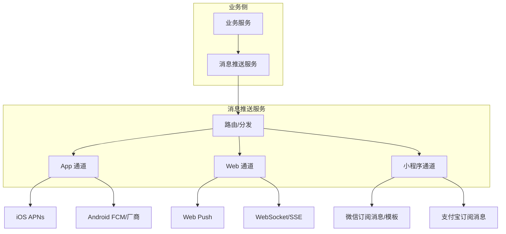
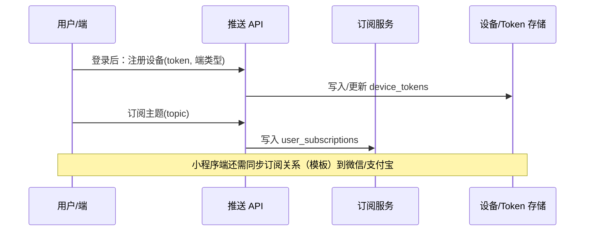
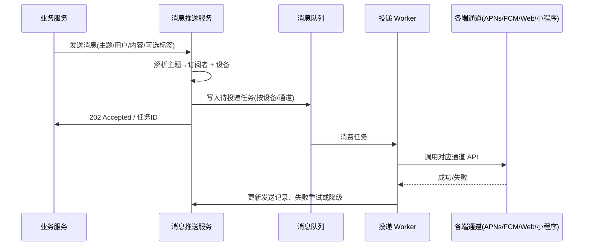

# 订阅与消息推送系统设计文档

> 本文档描述统一订阅与消息推送服务的设计，支持消息推送到 App（iOS/Android）、Web、小程序等多端，涵盖订阅模型、消息类型、通道选型、数据表、API 与实现要点，供开发与架构参考。

## 📋 目录

- [概述](#概述)
- [1. 业务模型](#1-业务模型)
  - [1.1 订阅模型](#11-订阅模型)
  - [1.2 消息类型与触达方式](#12-消息类型与触达方式)
  - [1.3 多端支持矩阵](#13-多端支持矩阵)
  - [1.4 付费订阅](#14-付费订阅)
- [2. 通道与第三方选型](#2-通道与第三方选型)
  - [2.1 App 推送](#21-app-推送)
  - [2.2 Web 推送](#22-web-推送)
  - [2.3 小程序推送](#23-小程序推送)
  - [2.4 统一抽象与降级](#24-统一抽象与降级)
- [3. 系统架构](#3-系统架构)
  - [3.1 整体流程](#31-整体流程)
  - [3.2 核心组件](#32-核心组件)
- [4. 数据库设计](#4-数据库设计)
  - [4.1 订阅与设备表](#41-订阅与设备表)
  - [4.2 付费订阅表](#42-付费订阅表)
  - [4.3 消息与发送记录](#43-消息与发送记录)
  - [4.4 索引与查询](#44-索引与查询)
- [5. 后端 API 设计](#5-后端-api-设计)
  - [5.1 订阅管理](#51-订阅管理)
  - [5.2 付费订阅](#52-付费订阅)
  - [5.3 设备/Token 管理](#53-设备token-管理)
  - [5.4 消息发送与历史](#54-消息发送与历史)
  - [5.5 管理端与回调](#55-管理端与回调)
- [6. 实现要点](#6-实现要点)
  - [6.1 消息队列与异步投递](#61-消息队列与异步投递)
  - [6.2 去重、限流与重试](#62-去重限流与重试)
  - [6.3 与登录/权限衔接](#63-与登录权限衔接)
- [7. 安全与最佳实践](#7-安全与最佳实践)

---

## 📖 概述

订阅与消息推送服务负责：**用户订阅**（主题/频道/业务事件）、**消息生产**（业务侧触发）、**多通道投递**（App / Web / 小程序），实现「一次发布、多端可达」的统一消息能力。

**设计目标**：

- **多端统一**：同一套订阅与消息模型，支持 App（iOS/Android）、Web 浏览器、微信/支付宝等小程序。
- **通道适配**：各端使用原生能力（APNs、FCM、Web Push、小程序订阅消息/模板消息），保证到达率与合规。
- **可扩展**：订阅维度（主题、标签、用户）、消息类型（系统通知、业务提醒、营销）可扩展；新增端或通道时尽量只增加适配层。

**文档约定**：用户身份与登录沿用《公用-登录功能模块实现》中的 `users` 与 JWT；本模块负责订阅关系、设备/Token、消息内容与投递，不负责认证本身。

**端与通道概览**：



---

## 1. 业务模型

### 1.1 订阅模型

采用 **主题（Topic）+ 用户** 的订阅关系，并可叠加 **标签（Tag）** 做精细化分组。

| 概念 | 说明 | 示例 |
|------|------|------|
| **主题 (Topic)** | 一类可订阅的消息流，由业务定义 | `order_status`、`system_announce`、`approval_notify` |
| **订阅 (Subscription)** | 用户对某主题的订阅关系 | 用户 A 订阅 `order_status` |
| **标签 (Tag)** | 对用户或设备的分组，用于定向推送 | `vip`、`region:beijing`、`dept:sales` |
| **设备 (Device)** | 用户在某端的推送终端，绑定推送 Token | 某用户的 iOS 设备、Chrome 浏览器、微信 openid |

**订阅粒度建议**：

- **按主题订阅**：用户主动订阅/取消主题（如「订单状态通知」「系统公告」），适合通知类、可配置。
- **按业务事件**：业务发事件时，由推送服务根据「事件类型 → 主题」映射 + 用户订阅关系 + 业务规则（如仅订单所属人）决定接收人，适合订单、审批等。
- **按标签推送**：运营或系统按标签筛选设备/用户做群发，适合活动、公告。

**主题与业务事件示例**：

```text
主题 (topic)           说明                    业务触发示例
────────────────────────────────────────────────────────────
order_status           订单状态变更            下单、支付、发货、完成
approval_notify        审批待办/结果           发起审批、通过/拒绝
system_announce        系统公告                运营发布公告
remind                 业务提醒                预约提醒、续费提醒
marketing              营销（需用户订阅）       活动、优惠券
```

### 1.2 消息类型与触达方式

| 类型 | 说明 | App | Web | 小程序 |
|------|------|-----|-----|--------|
| **系统推送 (Push)** | 系统级通知，可离线到达，点击打开指定页 | ✅ 原生 Push | ✅ Web Push | ✅ 订阅消息/模板消息 |
| **站内信 (Inbox)** | 应用内消息中心，可列表与已读 | ✅ | ✅ | ✅ |
| **实时通道 (Realtime)** | 在线时实时下发（WebSocket/SSE/长连接） | 可选 | ✅ | ✅ |

设计上建议：**一条业务消息**对应一份内容与语义，由推送服务根据**用户设备类型与在线状态**选择触达方式（Push / 站内信 / 实时），并可多路并行（如既发 Push 又写站内信）。

### 1.3 多端支持矩阵

| 能力 | App (iOS) | App (Android) | Web | 微信小程序 | 支付宝小程序 |
|------|-----------|---------------|-----|------------|--------------|
| 离线系统推送 | APNs | FCM/厂商通道 | Web Push | 订阅消息/模板消息 | 订阅消息 |
| 设备/Token 管理 | deviceToken | FCM token / 各厂商 token | Push 订阅 endpoint | openid + 订阅关系 | openid + 订阅关系 |
| 站内信 | 本地存储 + API | 同左 | 同左 | 同左 | 同左 |
| 实时推送 | 长连接/厂商通道 | 同左 | WebSocket/SSE | WebSocket | 同左 |

### 1.4 付费订阅

部分主题可设为**付费主题**：用户需先购买对应**订阅计划（Plan）**并在有效期内，才能订阅该主题并接收推送；发送消息时仅向「已订阅且具备付费权益」的用户投递。

| 概念 | 说明 | 示例 |
|------|------|------|
| **订阅计划 (Plan)** | 付费套餐，包含若干主题、计费周期与价格（由支付/商品模块定义） | 月度专业版、年度专业版 |
| **主题-计划绑定** | 某主题属于某计划，仅拥有该计划且在有效期的用户可订阅/收消息 | 主题 `premium_insight` 绑定计划「专业版」 |
| **用户付费订阅 (Paid Subscription)** | 用户对某计划的购买记录：生效时间、到期时间、状态（生效/已取消/已过期） | 用户 A 购买专业版，2024-01-01～2024-12-31 |

**流程约定**：

- **购买/续费**：由**支付模块**或业务服务完成下单与支付；支付成功后通过回调或事件通知推送服务，写入/更新「用户付费订阅」记录（user_id、plan_id、start_at、end_at、order_id 等）。
- **订阅主题**：用户请求订阅某主题时，若该主题为付费主题，则校验用户是否拥有包含该主题的付费计划且未过期；未通过则返回 402 或明确错误，引导去购买。
- **发送消息**：按主题解析订阅者时，若主题为付费主题，仅保留「已订阅且当前具备该主题对应计划权益」的用户，再解析设备并投递。

**主题与计划示例**：

```text
主题 (topic)           是否付费   绑定计划
────────────────────────────────────────────
order_status           否         -
system_announce        否         -
premium_insight        是         专业版
exclusive_alert        是         专业版 / 企业版
```

---

## 2. 通道与第三方选型

### 2.1 App 推送

- **iOS**：Apple APNs，需 App 向系统注册并上报 `deviceToken`，服务端用 APNs HTTP/2 或 Provider API 下发。
- **Android**：
  - **FCM**：Google 官方，海外与部分国内设备可用。
  - **国内**：各厂商自有通道（华为、小米、OPPO、vivo 等）到达率更好，通常通过 **JPush / 个推 / 极光** 等聚合 SDK 统一对接，由 SDK 在端上选厂商通道并上报统一 token 或多 token。

**建议**：Android 使用一家聚合服务（如 JPush）对接 FCM + 主流厂商通道；服务端只与聚合方通信，由聚合方负责通道选择与回执。

### 2.2 Web 推送

- **Web Push**：基于 W3C Push API + Service Worker，用户授权后浏览器分配 endpoint，服务端用 VAPID 签名向 endpoint 发 Push；支持 Chrome、Firefox、Edge 等，Safari 部分版本支持。
- **实时**：用户在线时用 **WebSocket** 或 **SSE** 推送，减少延迟；可与 Web Push 并存（在线走实时，离线走 Web Push）。

### 2.3 小程序推送

- **微信小程序**：
  - **订阅消息**：用户一次订阅可发 1 条，需用户主动点击订阅；适合强提醒、低频。
  - **模板消息**（逐步收紧）：按模板 ID 发送，有次数与场景限制，新业务优先用订阅消息。
- **支付宝小程序**：订阅消息机制类似，按支付宝文档做模板与发送限制。

小程序侧需维护：**openid / unionid**、**订阅关系**（用户勾选了哪些模板/关键词）、**formId / 一次性模板**（若仍用模板消息）。服务端按模板 ID 与 openid 调用微信/支付宝开放接口下发。

### 2.4 统一抽象与降级

推送服务内部对「端」和「通道」做统一抽象，便于扩展与降级：

- **端类型**：`app_ios`、`app_android`、`web`、`miniprogram_wechat`、`miniprogram_alipay`。
- **通道实现**：每个端类型对应一个或多个 Channel 实现（如 Android 对应 JPush Channel），同一消息可配置「优先通道 + 降级通道」。
- **降级策略**：主通道失败（如 token 失效、限流）时，可降级为「站内信」或「其他端」（如同一用户的 Web 端），由策略配置决定。

---

## 3. 系统架构

### 3.1 整体流程

**用户订阅与设备注册**：



**消息发送与投递**：



### 3.2 核心组件

| 组件 | 职责 |
|------|------|
| **订阅服务** | 维护主题、用户订阅、标签；解析「谁该收到这条消息」 |
| **设备服务** | 设备注册、Token 绑定/刷新、多端合并（同一用户多设备） |
| **消息路由** | 根据消息类型、用户设备列表、策略选择通道与降级 |
| **通道适配层** | 封装 APNs、FCM、JPush、Web Push、微信/支付宝接口，统一入参与回执 |
| **投递 Worker** | 从队列消费任务，调用通道、写发送记录、重试与限流 |
| **站内信服务** | 消息落库、未读计数、列表接口，与 Push 共用消息体 |

---

## 4. 数据库设计

### 4.1 订阅与设备表

**主题表 (push_topics)** — 可选，若主题固定可仅用配置/枚举

```sql
CREATE TABLE push_topics (
    id INT PRIMARY KEY AUTO_INCREMENT,
    code VARCHAR(64) NOT NULL UNIQUE COMMENT '主题编码，如 order_status',
    name VARCHAR(128) NOT NULL COMMENT '展示名称',
    description VARCHAR(500) NULL,
    need_confirm BOOLEAN DEFAULT TRUE COMMENT '是否需要用户主动订阅',
    is_paid BOOLEAN DEFAULT FALSE COMMENT '是否为付费主题，付费主题需拥有对应计划权益方可订阅/收消息',
    created_at DATETIME NOT NULL DEFAULT CURRENT_TIMESTAMP,
    updated_at DATETIME NOT NULL DEFAULT CURRENT_TIMESTAMP ON UPDATE CURRENT_TIMESTAMP,
    INDEX idx_code (code),
    INDEX idx_is_paid (is_paid)
) COMMENT '推送主题';
```

**用户订阅表 (user_push_subscriptions)**

```sql
CREATE TABLE user_push_subscriptions (
    id BIGINT PRIMARY KEY AUTO_INCREMENT,
    user_id BIGINT NOT NULL COMMENT '用户ID，关联 users.id',
    topic_code VARCHAR(64) NOT NULL COMMENT '主题编码',
    channel VARCHAR(32) NULL COMMENT '端：app_ios, app_android, web, miniprogram_wechat, miniprogram_alipay；NULL 表示全端',
    created_at DATETIME NOT NULL DEFAULT CURRENT_TIMESTAMP,
    UNIQUE KEY uk_user_topic_channel (user_id, topic_code, channel),
    INDEX idx_user (user_id),
    INDEX idx_topic (topic_code)
) COMMENT '用户推送订阅';
```

**设备/Token 表 (device_push_tokens)**

```sql
CREATE TABLE device_push_tokens (
    id BIGINT PRIMARY KEY AUTO_INCREMENT,
    user_id BIGINT NOT NULL COMMENT '用户ID',
    device_id VARCHAR(128) NULL COMMENT '端上设备唯一标识，用于同设备多端',
    channel VARCHAR(32) NOT NULL COMMENT 'app_ios, app_android, web, miniprogram_wechat, miniprogram_alipay',
    token VARCHAR(512) NOT NULL COMMENT '推送 token：APNs deviceToken、FCM token、Web Push endpoint、小程序 openid 等',
    extra JSON NULL COMMENT '通道扩展：如微信 template_id 订阅关系、设备名、系统版本',
    last_active_at DATETIME NULL COMMENT '最后活跃时间',
    created_at DATETIME NOT NULL DEFAULT CURRENT_TIMESTAMP,
    updated_at DATETIME NOT NULL DEFAULT CURRENT_TIMESTAMP ON UPDATE CURRENT_TIMESTAMP,
    UNIQUE KEY uk_channel_token (channel, token(255)),
    INDEX idx_user_channel (user_id, channel),
    INDEX idx_user (user_id)
) COMMENT '设备推送 Token';
```

**用户标签表 (user_push_tags)** — 用于按标签定向推送

```sql
CREATE TABLE user_push_tags (
    id BIGINT PRIMARY KEY AUTO_INCREMENT,
    user_id BIGINT NOT NULL,
    tag VARCHAR(128) NOT NULL COMMENT '如 vip, region:beijing',
    created_at DATETIME NOT NULL DEFAULT CURRENT_TIMESTAMP,
    UNIQUE KEY uk_user_tag (user_id, tag),
    INDEX idx_tag (tag),
    INDEX idx_user (user_id)
) COMMENT '用户推送标签';
```

### 4.2 付费订阅表

**订阅计划表 (push_subscription_plans)** — 套餐定义，价格与计费由支付/商品模块负责，推送模块仅存计划与主题绑定

```sql
CREATE TABLE push_subscription_plans (
    id INT PRIMARY KEY AUTO_INCREMENT,
    code VARCHAR(64) NOT NULL UNIQUE COMMENT '计划编码，如 premium_monthly',
    name VARCHAR(128) NOT NULL COMMENT '展示名称',
    description VARCHAR(500) NULL,
    duration_days INT NOT NULL COMMENT '有效天数，如 30、365',
    sort_order INT DEFAULT 0,
    is_enabled BOOLEAN DEFAULT TRUE,
    created_at DATETIME NOT NULL DEFAULT CURRENT_TIMESTAMP,
    updated_at DATETIME NOT NULL DEFAULT CURRENT_TIMESTAMP ON UPDATE CURRENT_TIMESTAMP,
    INDEX idx_code (code),
    INDEX idx_enabled (is_enabled)
) COMMENT '推送订阅计划（套餐）';
```

**主题-计划绑定表 (push_topic_plan_bindings)** — 付费主题与计划的多对多

```sql
CREATE TABLE push_topic_plan_bindings (
    id INT PRIMARY KEY AUTO_INCREMENT,
    topic_code VARCHAR(64) NOT NULL COMMENT '主题编码',
    plan_id INT NOT NULL COMMENT '计划ID，FK→push_subscription_plans(id)',
    created_at DATETIME NOT NULL DEFAULT CURRENT_TIMESTAMP,
    UNIQUE KEY uk_topic_plan (topic_code, plan_id),
    INDEX idx_topic (topic_code),
    INDEX idx_plan (plan_id)
) COMMENT '主题与计划绑定（拥有该计划可订阅该主题）';
```

**用户付费订阅表 (user_paid_subscriptions)** — 用户对某计划的购买/权益记录，由支付回调写入

```sql
CREATE TABLE user_paid_subscriptions (
    id BIGINT PRIMARY KEY AUTO_INCREMENT,
    user_id BIGINT NOT NULL COMMENT '用户ID，FK→users(id) ON DELETE CASCADE',
    plan_id INT NOT NULL COMMENT '计划ID，FK→push_subscription_plans(id)',
    status VARCHAR(20) NOT NULL DEFAULT 'active' COMMENT 'active, cancelled, expired',
    start_at DATETIME NOT NULL COMMENT '生效时间',
    end_at DATETIME NOT NULL COMMENT '到期时间',
    order_id VARCHAR(128) NULL COMMENT '关联支付单号，便于对账',
    created_at DATETIME NOT NULL DEFAULT CURRENT_TIMESTAMP,
    updated_at DATETIME NOT NULL DEFAULT CURRENT_TIMESTAMP ON UPDATE CURRENT_TIMESTAMP,
    INDEX idx_user_plan (user_id, plan_id),
    INDEX idx_user_end (user_id, end_at),
    INDEX idx_plan_end (plan_id, end_at),
    INDEX idx_status (status)
) COMMENT '用户付费订阅（权益记录）';
```

### 4.3 消息与发送记录

**消息表 (push_messages)** — 站内信 + 推送共用消息体

```sql
CREATE TABLE push_messages (
    id BIGINT PRIMARY KEY AUTO_INCREMENT,
    topic_code VARCHAR(64) NOT NULL,
    title VARCHAR(256) NOT NULL,
    body TEXT NULL COMMENT '正文或 JSON 扩展',
    payload JSON NULL COMMENT '点击跳转等：{ "url": "", "path": "", "query": {} }',
    biz_id VARCHAR(128) NULL COMMENT '业务单号，去重与跳转',
    biz_type VARCHAR(64) NULL COMMENT '业务类型',
    created_at DATETIME NOT NULL DEFAULT CURRENT_TIMESTAMP,
    INDEX idx_topic_created (topic_code, created_at),
    INDEX idx_biz (biz_type, biz_id),
    INDEX idx_created (created_at)
) COMMENT '推送消息主表';
```

**消息接收人表 (push_message_recipients)** — 谁该收到（用于站内信与未读）

```sql
CREATE TABLE push_message_recipients (
    id BIGINT PRIMARY KEY AUTO_INCREMENT,
    message_id BIGINT NOT NULL,
    user_id BIGINT NOT NULL,
    read_at DATETIME NULL COMMENT '站内信已读时间',
    created_at DATETIME NOT NULL DEFAULT CURRENT_TIMESTAMP,
    UNIQUE KEY uk_message_user (message_id, user_id),
    INDEX idx_user_read (user_id, read_at),
    INDEX idx_message (message_id)
) COMMENT '消息接收人（站内信可见 + 未读）';
```

**推送投递记录表 (push_deliveries)** — 按设备/通道的发送结果

```sql
CREATE TABLE push_deliveries (
    id BIGINT PRIMARY KEY AUTO_INCREMENT,
    message_id BIGINT NOT NULL,
    user_id BIGINT NOT NULL,
    device_token_id BIGINT NOT NULL,
    channel VARCHAR(32) NOT NULL,
    status VARCHAR(20) NOT NULL COMMENT 'pending, sent, failed, invalid_token',
    external_id VARCHAR(128) NULL COMMENT '通道侧消息ID',
    error_message VARCHAR(500) NULL,
    sent_at DATETIME NULL,
    created_at DATETIME NOT NULL DEFAULT CURRENT_TIMESTAMP,
    INDEX idx_message (message_id),
    INDEX idx_user_message (user_id, message_id),
    INDEX idx_status_created (status, created_at),
    INDEX idx_device_token (device_token_id)
) COMMENT '推送投递记录';
```

### 4.4 索引与查询

- **解析订阅者**：按 `topic_code` 查 `user_push_subscriptions`，得 `user_id` 列表；按标签推送时再关联 `user_push_tags`。
- **付费主题过滤**：若主题 `is_paid=TRUE`，则再过滤：仅保留在 `user_paid_subscriptions` 中存在该用户、对应 plan_id 与主题绑定（`push_topic_plan_bindings`）、且 `status=active` 且 `end_at > NOW()` 的用户。
- **解析设备**：按 `user_id` + `channel` 查 `device_push_tokens`，得到待推送 token 列表。
- **站内信列表**：按 `user_id` 查 `push_message_recipients` 关联 `push_messages`，按 `created_at` 分页，用 `read_at` 算未读。
- **发送统计与失败重试**：`push_deliveries` 按 `status`、`created_at` 查询，无效 token 可反写 `device_push_tokens` 禁用或删除。

---

## 5. 后端 API 设计

### 5.1 订阅管理

| 方法 | 路径 | 说明 |
|------|------|------|
| GET | `/api/push/topics` | 获取可订阅主题列表（含当前用户已订阅状态） |
| POST | `/api/push/subscriptions` | 订阅主题，body: `{ "topicCode": "order_status", "channel": "app_ios" }` |
| DELETE | `/api/push/subscriptions/:topicCode` | 取消订阅，query 可选 `channel` |
| GET | `/api/push/subscriptions` | 当前用户订阅列表 |

### 5.2 付费订阅

| 方法 | 路径 | 说明 |
|------|------|------|
| GET | `/api/push/plans` | 可购买的订阅计划列表（含包含的主题、价格由业务/支付模块提供） |
| GET | `/api/push/my-paid-subscriptions` | 当前用户付费订阅列表（含计划名、到期时间、状态） |
| POST | `/api/push/payments/callback` | 支付成功回调（由支付服务调用）：写入/更新 `user_paid_subscriptions` |

**订阅主题时**：若主题为付费主题，需先校验用户具备对应计划权益，否则返回 402 或错误码，前端引导去购买。

### 5.3 设备/Token 管理

| 方法 | 路径 | 说明 |
|------|------|------|
| POST | `/api/push/devices/register` | 注册/更新设备，body: `{ "channel", "token", "deviceId?", "extra?" }`，需登录 |
| DELETE | `/api/push/devices` | 注销当前设备，query: `channel`, `token` |
| GET | `/api/push/devices` | 当前用户设备列表（脱敏） |

### 5.4 消息发送与历史

**业务侧调用（服务间或带权限的管理端）**：

| 方法 | 路径 | 说明 |
|------|------|------|
| POST | `/api/push/send` | 发送消息，body: `{ "topicCode", "userIds?" | "tags?", "title", "body?", "payload?", "bizId?", "bizType?" }`，返回任务 ID 或 202 |

**用户侧**：

| 方法 | 路径 | 说明 |
|------|------|------|
| GET | `/api/push/messages` | 站内信列表，分页，query: `page`, `pageSize`, `unreadOnly?` |
| POST | `/api/push/messages/:id/read` | 标记已读 |
| GET | `/api/push/messages/unread-count` | 未读数量（用于角标） |

### 5.5 管理端与回调

- **管理端**：主题 CRUD（含 is_paid）、订阅计划 CRUD、主题-计划绑定、按主题/时间查询消息与投递统计、失败重试、无效 token 清理（需权限控制）。
- **回调**：各通道（如微信、JPush）的送达/点击/失效回调，用于更新 `push_deliveries`、清理无效 token；**支付回调**用于写入/更新 `user_paid_subscriptions`。

---

## 6. 实现要点

### 6.1 消息队列与异步投递

- 业务调用「发送消息」接口后，推送服务只负责：解析接收人、解析设备、写入消息主表与接收人表、**投递任务入队**，随即返回 202 或任务 ID。
- 投递由 **Worker 消费队列** 执行，避免长耗时阻塞 API；队列可选 Redis List/Stream、RabbitMQ、Kafka 等。
- 单条消息可能拆成多条「设备级」任务（一个用户多设备），便于重试与统计。
- **付费主题**：解析订阅者后，若主题为付费主题，需过滤掉无有效付费权益的用户，再解析设备与入队。

### 6.2 去重、限流与重试

- **去重**：同一 `bizType + bizId` 在时间窗口内可只生成一条消息或只投递一次，由业务需求决定。
- **限流**：按用户/设备/通道做频率限制，防止骚扰与通道限流；可配置每用户每日条数、同一内容冷却时间。
- **重试**：投递失败（网络/5xx）时指数退避重试；通道返回 token 无效时，标记 token 并停止重试，必要时通知端重新注册。

### 6.3 与登录/权限衔接

- **设备注册、订阅、站内信** 等接口均需 **登录态**（JWT），从 `request.user` 取 `userId`。
- **发送消息接口** 仅允许业务服务或具备「推送管理」权限的账号调用，可在网关或应用内做权限校验（参考《公用-权限模块系统设计》）。
- 用户表沿用 `users.id`，不新建用户体系。
- **付费订阅**：订阅主题时若为付费主题，校验 `user_paid_subscriptions` 中该用户是否有对应计划且 `end_at > NOW()`；支付成功由支付服务回调推送服务写入权益，推送服务不直接对接支付渠道。

---

## 7. 安全与最佳实践

- **敏感内容**：推送内容避免明文敏感信息；跳转用 path + 服务端校验，不信任客户端传参。
- **订阅合规**：营销类主题需用户主动订阅并留痕；小程序侧严格遵守订阅消息/模板消息次数与场景限制。
- **Token 安全**：Token 仅存服务端，传输 HTTPS；定期清理长期未活跃或已失效的 token。
- **监控**：投递成功率、各通道失败率、无效 token 比例、队列积压与延迟，便于容量与通道策略调整。
- **多端一致性**：同一用户在多端收到的「站内信」一致；Push 与站内信可共用 `push_messages` + `push_message_recipients`，避免重复存储与不一致。
- **付费订阅**：付费主题的权益校验仅以服务端 `user_paid_subscriptions` 与 `end_at` 为准；到期后可通过定时任务将 `status` 更新为 `expired`，或查询时动态判断。

---

**文档版本**：v1  
**最后更新**：按需维护。若接入具体厂商（如 JPush、微信开放平台）时，可在本文档下增补「通道对接说明」与配置项。
