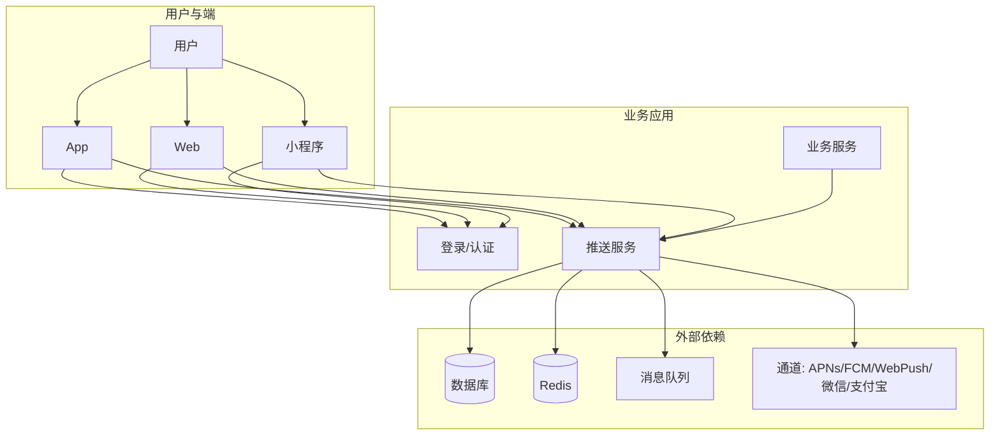
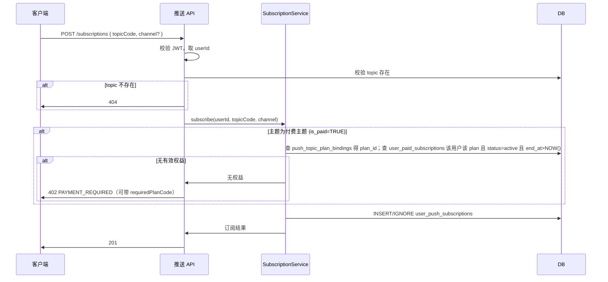
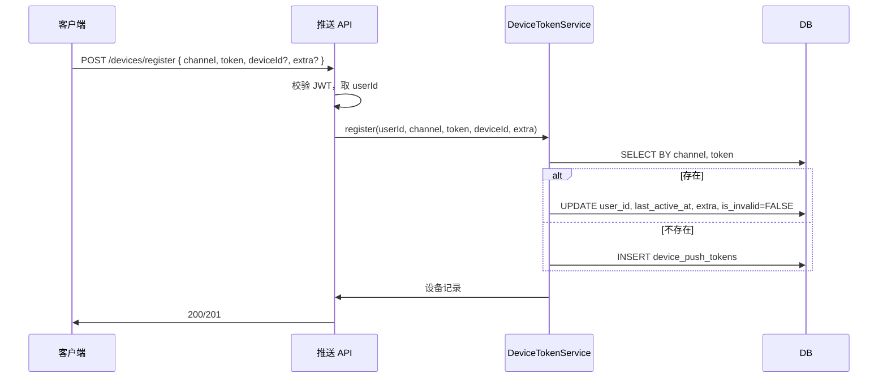

# 订阅与消息推送系统 — 详细设计文档

> 基于《公用-订阅、消息推送系统设计》的方案，本文档给出实现级详细设计，包括数据字典、接口规范、核心流程、队列与缓存、安全与测试，供开发与测试直接落地。

---

## 📋 文档信息

| 项目 | 说明 |
|------|------|
| **文档名称** | 订阅与消息推送系统详细设计 |
| **版本** | 1.0 |
| **参考文档** | 《公用-订阅、消息推送系统设计》《公用-登录功能模块实现》《公用-权限模块系统设计》 |
| **读者** | 后端/前端开发、测试、运维 |

---

## 📋 目录

- [1. 系统上下文与依赖](#1-系统上下文与依赖)
- [2. 数据字典与表结构](#2-数据字典与表结构)
- [3. 接口详细规范](#3-接口详细规范)
- [4. 核心流程详细设计](#4-核心流程详细设计)
- [5. 消息队列与投递设计](#5-消息队列与投递设计)
  - 含付费主题权益校验与发送过滤
- [6. 缓存与性能设计](#6-缓存与性能设计)
- [7. 安全与审计](#7-安全与审计)
- [8. 配置与部署](#8-配置与部署)
- [9. 测试与验收](#9-测试与验收)
- [附录 A：路由与 Worker 示例](#附录-a路由与-worker-示例)
- [附录 B：参考文档](#附录-b参考文档)

---

## 1. 系统上下文与依赖

### 1.1 系统边界



- **推送服务**：对外提供「订阅/取消订阅」「设备注册」「发送消息」「站内信列表/未读」等能力；依赖**登录模块**提供已认证用户（`request.user`），依赖**数据库**、**Redis**、**消息队列**与各**通道**做持久化、缓存与投递。
- **业务服务**：通过 HTTP 调用推送服务的「发送消息」接口，不直接访问推送表或通道。

### 1.2 与登录模块的约定

| 约定项 | 说明 |
|--------|------|
| 用户标识 | 使用 `users.id`（整型），推送模块不新建用户表 |
| 请求身份 | 需登录的接口在认证通过后，`request.user` 至少提供：`id`、`username` |
| JWT 载荷 | 登录模块签发 JWT，推送模块从 `request.user.id` 取 userId |
| 发送消息 | 仅业务服务或具备「推送管理」权限的账号可调用发送接口，见《公用-权限模块系统设计》 |

### 1.3 技术栈假设

| 层级 | 技术 |
|------|------|
| Web 框架 | Fastify / Express 等 |
| 认证 | @fastify/jwt 或等价 |
| 数据库 | MySQL 8.0+ / PostgreSQL 12+ |
| 缓存 | Redis 6+ |
| 消息队列 | Redis List/Stream、RabbitMQ、Kafka 等 |
| 通道 | APNs、FCM/JPush、Web Push（web-push）、微信开放接口、支付宝开放接口 |

---

## 2. 数据字典与表结构

### 2.1 主题表 (push_topics)

| 字段名 | 类型 | 约束 | 默认 | 说明 |
|--------|------|------|------|------|
| id | INT | PK, AUTO_INCREMENT | - | 主键 |
| code | VARCHAR(64) | NOT NULL, UNIQUE | - | 主题编码，如 order_status |
| name | VARCHAR(128) | NOT NULL | - | 展示名称 |
| description | VARCHAR(500) | NULL | - | 描述 |
| need_confirm | BOOLEAN | - | TRUE | 是否需要用户主动订阅（营销类必须 TRUE） |
| is_paid | BOOLEAN | - | FALSE | 是否为付费主题，付费主题需拥有对应计划权益方可订阅/收消息 |
| created_at | DATETIME | NOT NULL | CURRENT_TIMESTAMP | 创建时间 |
| updated_at | DATETIME | NOT NULL | ON UPDATE CURRENT_TIMESTAMP | 更新时间 |

**索引**：`UNIQUE(code)`，`INDEX(code)`，`INDEX(is_paid)`。

**约束**：`code` 仅允许字母、数字、下划线，长度 2–64。

---

### 2.2 用户订阅表 (user_push_subscriptions)

| 字段名 | 类型 | 约束 | 默认 | 说明 |
|--------|------|------|------|------|
| id | BIGINT | PK, AUTO_INCREMENT | - | 主键 |
| user_id | BIGINT | NOT NULL, FK→users(id) ON DELETE CASCADE | - | 用户 ID |
| topic_code | VARCHAR(64) | NOT NULL | - | 主题编码 |
| channel | VARCHAR(32) | NULL | - | 端：app_ios, app_android, web, miniprogram_wechat, miniprogram_alipay；NULL 表示全端 |
| created_at | DATETIME | NOT NULL | CURRENT_TIMESTAMP | 创建时间 |

**唯一约束**：`UNIQUE(user_id, topic_code, channel)`（channel 为 NULL 时按 NULL 参与唯一）。  
**索引**：`INDEX(user_id)`，`INDEX(topic_code)`，`INDEX(topic_code, user_id)`。

**channel 枚举**：`app_ios` | `app_android` | `web` | `miniprogram_wechat` | `miniprogram_alipay`。

---

### 2.3 设备/Token 表 (device_push_tokens)

| 字段名 | 类型 | 约束 | 默认 | 说明 |
|--------|------|------|------|------|
| id | BIGINT | PK, AUTO_INCREMENT | - | 主键 |
| user_id | BIGINT | NOT NULL, FK→users(id) ON DELETE CASCADE | - | 用户 ID |
| device_id | VARCHAR(128) | NULL | - | 端上设备唯一标识，同设备多端去重 |
| channel | VARCHAR(32) | NOT NULL | - | 端类型，同上 |
| token | VARCHAR(512) | NOT NULL | - | 推送 token：APNs deviceToken、FCM token、Web Push endpoint、小程序 openid 等 |
| extra | JSON | NULL | - | 通道扩展：如微信 template_id 订阅关系、设备名、系统版本 |
| last_active_at | DATETIME | NULL | - | 最后活跃时间 |
| is_invalid | BOOLEAN | - | FALSE | 通道侧已失效（如 APNs 返回 BadDeviceToken） |
| created_at | DATETIME | NOT NULL | CURRENT_TIMESTAMP | 创建时间 |
| updated_at | DATETIME | NOT NULL | ON UPDATE CURRENT_TIMESTAMP | 更新时间 |

**唯一约束**：`UNIQUE(channel, token(255))`（不同端 token 空间独立）。  
**索引**：`INDEX(user_id)`，`INDEX(user_id, channel)`，`INDEX(channel, is_invalid)`，`INDEX(last_active_at)`。

**约束**：同一 `(channel, token)` 仅允许一条有效记录；更新时按 token 做 upsert，并刷新 `last_active_at`。

---

### 2.4 用户标签表 (user_push_tags)

| 字段名 | 类型 | 约束 | 默认 | 说明 |
|--------|------|------|------|------|
| id | BIGINT | PK, AUTO_INCREMENT | - | 主键 |
| user_id | BIGINT | NOT NULL, FK→users(id) ON DELETE CASCADE | - | 用户 ID |
| tag | VARCHAR(128) | NOT NULL | - | 标签，如 vip, region:beijing |
| created_at | DATETIME | NOT NULL | CURRENT_TIMESTAMP | 创建时间 |

**唯一约束**：`UNIQUE(user_id, tag)`。  
**索引**：`INDEX(tag)`，`INDEX(user_id)`。

---

### 2.5 订阅计划表 (push_subscription_plans)

| 字段名 | 类型 | 约束 | 默认 | 说明 |
|--------|------|------|------|------|
| id | INT | PK, AUTO_INCREMENT | - | 主键 |
| code | VARCHAR(64) | NOT NULL, UNIQUE | - | 计划编码，如 premium_monthly |
| name | VARCHAR(128) | NOT NULL | - | 展示名称 |
| description | VARCHAR(500) | NULL | - | 描述 |
| duration_days | INT | NOT NULL | - | 有效天数，如 30、365 |
| sort_order | INT | - | 0 | 排序 |
| is_enabled | BOOLEAN | - | TRUE | 是否启用 |
| created_at | DATETIME | NOT NULL | CURRENT_TIMESTAMP | 创建时间 |
| updated_at | DATETIME | NOT NULL | ON UPDATE CURRENT_TIMESTAMP | 更新时间 |

**索引**：`UNIQUE(code)`，`INDEX(is_enabled)`。

**说明**：价格与计费由支付/商品模块负责，推送模块仅存计划与主题绑定；前端展示价格时可从业务接口或配置获取。

---

### 2.6 主题-计划绑定表 (push_topic_plan_bindings)

| 字段名 | 类型 | 约束 | 默认 | 说明 |
|--------|------|------|------|------|
| id | INT | PK, AUTO_INCREMENT | - | 主键 |
| topic_code | VARCHAR(64) | NOT NULL | - | 主题编码 |
| plan_id | INT | NOT NULL, FK→push_subscription_plans(id) ON DELETE CASCADE | - | 计划 ID |
| created_at | DATETIME | NOT NULL | CURRENT_TIMESTAMP | 创建时间 |

**唯一约束**：`UNIQUE(topic_code, plan_id)`。  
**索引**：`INDEX(topic_code)`，`INDEX(plan_id)`。

**说明**：拥有该计划且在有效期的用户可订阅该主题并接收该主题消息。

---

### 2.7 用户付费订阅表 (user_paid_subscriptions)

| 字段名 | 类型 | 约束 | 默认 | 说明 |
|--------|------|------|------|------|
| id | BIGINT | PK, AUTO_INCREMENT | - | 主键 |
| user_id | BIGINT | NOT NULL, FK→users(id) ON DELETE CASCADE | - | 用户 ID |
| plan_id | INT | NOT NULL, FK→push_subscription_plans(id) | - | 计划 ID |
| status | VARCHAR(20) | NOT NULL | active | active, cancelled, expired |
| start_at | DATETIME | NOT NULL | - | 生效时间 |
| end_at | DATETIME | NOT NULL | - | 到期时间 |
| order_id | VARCHAR(128) | NULL | - | 关联支付单号，便于对账 |
| created_at | DATETIME | NOT NULL | CURRENT_TIMESTAMP | 创建时间 |
| updated_at | DATETIME | NOT NULL | ON UPDATE CURRENT_TIMESTAMP | 更新时间 |

**索引**：`INDEX(user_id, plan_id)`，`INDEX(user_id, end_at)`，`INDEX(plan_id, end_at)`，`INDEX(status)`。

**说明**：由支付成功回调写入/更新；查询权益时条件为 `status=active` 且 `end_at > NOW()`。到期可定时任务将 status 更新为 expired，或查询时动态判断。

---

### 2.8 消息表 (push_messages)

| 字段名 | 类型 | 约束 | 默认 | 说明 |
|--------|------|------|------|------|
| id | BIGINT | PK, AUTO_INCREMENT | - | 主键 |
| topic_code | VARCHAR(64) | NOT NULL | - | 主题编码 |
| title | VARCHAR(256) | NOT NULL | - | 标题 |
| body | TEXT | NULL | - | 正文或 JSON 扩展 |
| payload | JSON | NULL | - | 点击跳转：{ "url", "path", "query" } |
| biz_id | VARCHAR(128) | NULL | - | 业务单号，去重与跳转 |
| biz_type | VARCHAR(64) | NULL | - | 业务类型 |
| created_at | DATETIME | NOT NULL | CURRENT_TIMESTAMP | 创建时间 |

**索引**：`INDEX(topic_code, created_at)`，`INDEX(biz_type, biz_id)`，`INDEX(created_at)`。

---

### 2.9 消息接收人表 (push_message_recipients)

| 字段名 | 类型 | 约束 | 默认 | 说明 |
|--------|------|------|------|------|
| id | BIGINT | PK, AUTO_INCREMENT | - | 主键 |
| message_id | BIGINT | NOT NULL, FK→push_messages(id) ON DELETE CASCADE | - | 消息 ID |
| user_id | BIGINT | NOT NULL, FK→users(id) ON DELETE CASCADE | - | 用户 ID |
| read_at | DATETIME | NULL | - | 站内信已读时间 |
| created_at | DATETIME | NOT NULL | CURRENT_TIMESTAMP | 创建时间 |

**唯一约束**：`UNIQUE(message_id, user_id)`。  
**索引**：`INDEX(user_id, read_at)`，`INDEX(message_id)`。

---

### 2.10 推送投递记录表 (push_deliveries)

| 字段名 | 类型 | 约束 | 默认 | 说明 |
|--------|------|------|------|------|
| id | BIGINT | PK, AUTO_INCREMENT | - | 主键 |
| message_id | BIGINT | NOT NULL, FK→push_messages(id) | - | 消息 ID |
| user_id | BIGINT | NOT NULL | - | 用户 ID |
| device_token_id | BIGINT | NOT NULL, FK→device_push_tokens(id) | - | 设备 Token 记录 ID |
| channel | VARCHAR(32) | NOT NULL | - | 端类型 |
| status | VARCHAR(20) | NOT NULL | - | pending, sent, failed, invalid_token |
| external_id | VARCHAR(128) | NULL | - | 通道侧消息 ID |
| error_message | VARCHAR(500) | NULL | - | 失败原因 |
| retry_count | INT | - | 0 | 重试次数 |
| sent_at | DATETIME | NULL | - | 成功发送时间 |
| created_at | DATETIME | NOT NULL | CURRENT_TIMESTAMP | 创建时间 |
| updated_at | DATETIME | NOT NULL | ON UPDATE CURRENT_TIMESTAMP | 更新时间 |

**索引**：`INDEX(message_id)`，`INDEX(user_id, message_id)`，`INDEX(status, created_at)`，`INDEX(device_token_id)`。

**status 枚举**：`pending` | `sent` | `failed` | `invalid_token`。

---

### 2.11 发送任务表 (push_send_tasks)（可选，用于异步任务追踪）

| 字段名 | 类型 | 约束 | 默认 | 说明 |
|--------|------|------|------|------|
| id | BIGINT | PK, AUTO_INCREMENT | - | 主键 |
| message_id | BIGINT | NOT NULL | - | 消息 ID |
| total_recipients | INT | NOT NULL | - | 接收人数 |
| total_deliveries | INT | NOT NULL | - | 待投递条数（设备数） |
| completed_deliveries | INT | - | 0 | 已处理条数 |
| status | VARCHAR(20) | NOT NULL | - | pending, processing, completed, partial_failed |
| created_at | DATETIME | NOT NULL | CURRENT_TIMESTAMP | 创建时间 |
| updated_at | DATETIME | NOT NULL | ON UPDATE CURRENT_TIMESTAMP | 更新时间 |

**索引**：`INDEX(message_id)`，`INDEX(status)`，`INDEX(created_at)`。

---

## 3. 接口详细规范

### 3.1 通用约定

- **Base URL**：`/api/v1/push` 或 `/api/push`（与现有项目一致）。
- **认证**：需登录的接口在 Header 中携带 `Authorization: Bearer <access_token>`。
- **统一响应**：成功 `{ "success": true, "data": ... }`；失败 `{ "success": false, "error": { "code": "...", "message": "..." } }`。
- **分页**：列表接口支持 `page`（从 1 开始）、`pageSize`（默认 20，最大 100）；响应中可带 `total`、`page`、`pageSize`。

### 3.2 错误码

| HTTP 状态 | code | 说明 |
|-----------|------|------|
| 401 | UNAUTHORIZED | 未登录或 Token 无效/过期 |
| 403 | FORBIDDEN | 无推送发送/管理权限 |
| 402 | PAYMENT_REQUIRED | 订阅付费主题需先购买对应计划 |
| 404 | NOT_FOUND | 资源不存在（如主题、消息、设备） |
| 409 | CONFLICT | 冲突（如主题 code 重复） |
| 422 | VALIDATION_ERROR | 参数校验失败，message 或 details 中给出字段级错误 |
| 429 | RATE_LIMIT_EXCEEDED | 发送频率超限 |
| 500 | INTERNAL_ERROR | 服务端错误 |

---

### 3.3 主题与订阅接口

#### GET /api/v1/push/topics

获取可订阅主题列表，并标注当前用户已订阅状态。

**请求**：无 Body；Header：`Authorization: Bearer <token>`。  
**Query**：可选 `channel`（只返回该端相关主题或标注该端订阅状态）。

**响应 200**：

```json
{
  "success": true,
  "data": {
    "items": [
      {
        "id": 1,
        "code": "order_status",
        "name": "订单状态通知",
        "description": "订单下单、支付、发货等状态变更",
        "needConfirm": true,
        "isPaid": false,
        "requiredPlanCode": null,
        "subscribed": true,
        "subscribedChannels": ["app_ios", "web"],
        "createdAt": "2024-01-01T00:00:00.000Z"
      },
      {
        "id": 2,
        "code": "premium_insight",
        "name": "专业洞察",
        "description": "付费主题，需购买专业版",
        "needConfirm": true,
        "isPaid": true,
        "requiredPlanCode": "premium_monthly",
        "subscribed": false,
        "subscribedChannels": [],
        "createdAt": "2024-01-01T00:00:00.000Z"
      }
    ],
    "total": 5
  }
}
```

| 字段 | 类型 | 说明 |
|------|------|------|
| isPaid | boolean | 是否为付费主题 |
| requiredPlanCode | string \| null | 付费主题时，需拥有的计划 code（若有多个计划可任选其一，可返回首个或列表） |
| subscribed | boolean | 当前用户是否已订阅该主题（任一端） |
| subscribedChannels | string[] | 已订阅的端列表，空表示未订阅 |

---

#### POST /api/v1/push/subscriptions

订阅主题。

**请求 Body**：

```json
{
  "topicCode": "order_status",
  "channel": "app_ios"
}
```

| 字段 | 类型 | 必填 | 说明 |
|------|------|------|------|
| topicCode | string | 是 | 主题编码 |
| channel | string | 否 | 端类型；不传表示全端订阅（写入多条或 channel=null 由实现决定） |

**响应 201**：

```json
{
  "success": true,
  "data": {
    "topicCode": "order_status",
    "channel": "app_ios",
    "createdAt": "2024-01-01T00:00:00.000Z"
  }
}
```

**响应 402**：主题为付费主题，当前用户无有效付费权益，需先购买对应计划（error.data 可带 `requiredPlanCode`、`planIds` 供前端跳转购买页）。  
**响应 404**：主题不存在。  
**响应 422**：topicCode/channel 格式不合法。

---

#### DELETE /api/v1/push/subscriptions/:topicCode

取消订阅。

**Query**：`channel`（可选）。不传则取消该主题下所有端的订阅；传则仅取消该端。

**响应 204**：无 Body。  
**响应 404**：主题不存在或当前用户未订阅该主题。

---

#### GET /api/v1/push/subscriptions

当前用户订阅列表。

**Query**：可选 `channel`（只返回该端订阅）。

**响应 200**：

```json
{
  "success": true,
  "data": {
    "items": [
      { "topicCode": "order_status", "channel": "app_ios", "createdAt": "2024-01-01T00:00:00.000Z" }
    ],
    "total": 3
  }
}
```

---

### 3.4 付费订阅接口

#### GET /api/v1/push/plans

可购买的订阅计划列表（价格由业务/支付模块提供，本接口可只返回计划与包含的主题）。

**请求**：无 Body；Header：`Authorization: Bearer <token>`（可选，未登录也可展示计划列表）。  
**Query**：可选 `enabledOnly=true`（默认只返回 is_enabled=TRUE）。

**响应 200**：

```json
{
  "success": true,
  "data": {
    "items": [
      {
        "id": 1,
        "code": "premium_monthly",
        "name": "专业版（月付）",
        "description": "含专业洞察、独家提醒等主题",
        "durationDays": 30,
        "topicCodes": ["premium_insight", "exclusive_alert"],
        "price": null,
        "priceDisplay": "¥29/月",
        "sortOrder": 0
      }
    ],
    "total": 2
  }
}
```

**说明**：`price`、`priceDisplay` 可由推送服务从配置读取，或由前端/业务接口单独获取；推送模块仅保证 plan 与 topic 绑定正确。

---

#### GET /api/v1/push/my-paid-subscriptions

当前用户付费订阅列表（需登录）。

**响应 200**：

```json
{
  "success": true,
  "data": {
    "items": [
      {
        "id": 1001,
        "planId": 1,
        "planCode": "premium_monthly",
        "planName": "专业版（月付）",
        "status": "active",
        "startAt": "2024-01-01T00:00:00.000Z",
        "endAt": "2024-01-31T23:59:59.000Z",
        "orderId": "order_xxx",
        "createdAt": "2024-01-01T00:00:00.000Z"
      }
    ],
    "total": 1
  }
}
```

**status 枚举**：`active` | `cancelled` | `expired`。权益判断以 `status=active` 且 `end_at > NOW()` 为准。

---

#### POST /api/v1/push/payments/callback

支付成功回调（由支付服务或业务服务调用，需校验签名/密钥，防止伪造）。

**请求 Body**（示例，与支付模块约定一致）：

```json
{
  "orderId": "order_xxx",
  "userId": 1,
  "planCode": "premium_monthly",
  "startAt": "2024-01-01T00:00:00.000Z",
  "endAt": "2024-01-31T23:59:59.000Z"
}
```

| 字段 | 类型 | 必填 | 说明 |
|------|------|------|------|
| orderId | string | 是 | 支付单号 |
| userId | number | 是 | 用户 ID |
| planCode | string | 是 | 计划编码 |
| startAt | string (ISO 8601) | 是 | 生效时间 |
| endAt | string (ISO 8601) | 是 | 到期时间 |

**响应 200**：`{ "success": true, "data": { "userPaidSubscriptionId": 1001 } }`。  
**说明**：根据 planCode 查 plan_id，INSERT 或 UPDATE `user_paid_subscriptions`（同一 user_id + plan_id 可续期：新增一条或更新原条 end_at，由业务约定）。  
**响应 404**：planCode 不存在。  
**响应 422**：参数不合法。

---

### 3.5 设备/Token 接口

#### POST /api/v1/push/devices/register

注册或更新设备推送 Token（需登录）。

**请求 Body**：

```json
{
  "channel": "app_ios",
  "token": "apns_device_token_xxx...",
  "deviceId": "client_generated_uuid",
  "extra": { "deviceName": "iPhone 14", "osVersion": "17.0" }
}
```

| 字段 | 类型 | 必填 | 说明 |
|------|------|------|------|
| channel | string | 是 | app_ios, app_android, web, miniprogram_wechat, miniprogram_alipay |
| token | string | 是 | 推送 token / Web Push endpoint / 小程序 openid |
| deviceId | string | 否 | 端上设备唯一标识，用于同设备多端合并 |
| extra | object | 否 | 通道扩展信息 |

**响应 200 或 201**：

```json
{
  "success": true,
  "data": {
    "id": 1001,
    "channel": "app_ios",
    "deviceId": "client_generated_uuid",
    "lastActiveAt": "2024-01-01T12:00:00.000Z",
    "createdAt": "2024-01-01T00:00:00.000Z"
  }
}
```

**说明**：同一 `(channel, token)` 若已存在则更新 `user_id`、`last_active_at`、`extra`，并清除 `is_invalid`（若曾失效）。  
**响应 422**：channel/token 格式不合法或超长。

---

#### DELETE /api/v1/push/devices

注销当前用户的某设备。

**Query**：`channel`（必填）、`token`（必填）。

**响应 204**：无 Body。  
**响应 404**：该 token 不存在或不属于当前用户。

---

#### GET /api/v1/push/devices

当前用户设备列表（token 脱敏，仅返回后几位或 mask）。

**响应 200**：

```json
{
  "success": true,
  "data": {
    "items": [
      {
        "id": 1001,
        "channel": "app_ios",
        "deviceId": "client_generated_uuid",
        "tokenMask": "***xxx",
        "lastActiveAt": "2024-01-01T12:00:00.000Z",
        "createdAt": "2024-01-01T00:00:00.000Z"
      }
    ],
    "total": 2
  }
}
```

---

### 3.6 发送消息接口（业务侧）

#### POST /api/v1/push/send

发送消息。仅允许业务服务（服务间认证）或具备「推送管理」权限的账号调用。

**请求 Body**：

```json
{
  "topicCode": "order_status",
  "userIds": [1, 2, 3],
  "tags": ["vip"],
  "title": "您的订单已发货",
  "body": "订单号 202401010001 已发货，请注意查收。",
  "payload": { "path": "/order/detail", "query": { "id": "202401010001" } },
  "bizId": "202401010001",
  "bizType": "order"
}
```

| 字段 | 类型 | 必填 | 说明 |
|------|------|------|------|
| topicCode | string | 是 | 主题编码 |
| userIds | number[] | 否 | 指定用户 ID 列表，与 tags 至少其一 |
| tags | string[] | 否 | 按标签筛选用户，与 userIds 至少其一；可同时传，表示取并集 |
| title | string | 是 | 标题，长度限制 256 |
| body | string | 否 | 正文 |
| payload | object | 否 | 点击跳转：path、query、url（H5） |
| bizId | string | 否 | 业务单号，用于去重与跳转 |
| bizType | string | 否 | 业务类型 |

**响应 202 Accepted**：

```json
{
  "success": true,
  "data": {
    "taskId": "uuid-or-message-id",
    "messageId": 10001,
    "recipientCount": 10,
    "deliveryCount": 15
  }
}
```

| 字段 | 说明 |
|------|------|
| taskId | 任务标识，用于查询进度（若实现任务表） |
| messageId | 消息主表 ID |
| recipientCount | 接收人数（去重用户） |
| deliveryCount | 待投递条数（设备数，可能一用户多设备） |

**响应 404**：主题不存在。  
**响应 422**：参数不合法（如 userIds 与 tags 均未传、title 为空）。  
**响应 429**：发送频率超限。

---

### 3.7 站内信接口（用户侧）

#### GET /api/v1/push/messages

站内信列表，分页。

**Query**：`page`、`pageSize`、`unreadOnly`（可选，true/false）。

**响应 200**：

```json
{
  "success": true,
  "data": {
    "items": [
      {
        "id": 10001,
        "topicCode": "order_status",
        "title": "您的订单已发货",
        "body": "订单号 202401010001 已发货",
        "payload": { "path": "/order/detail", "query": { "id": "202401010001" } },
        "bizId": "202401010001",
        "bizType": "order",
        "readAt": null,
        "createdAt": "2024-01-01T12:00:00.000Z"
      }
    ],
    "total": 50,
    "page": 1,
    "pageSize": 20
  }
}
```

---

#### POST /api/v1/push/messages/:id/read

标记单条已读。

**响应 200**：`{ "success": true, "data": { "id": 10001, "readAt": "2024-01-01T12:05:00.000Z" } }`。  
**响应 404**：消息不存在或不属于当前用户。

---

#### POST /api/v1/push/messages/read-all

全部标记已读。

**响应 200**：`{ "success": true, "data": { "count": 10 } }`（本次标记条数）。

---

#### GET /api/v1/push/messages/unread-count

未读数量（用于角标）。

**响应 200**：

```json
{
  "success": true,
  "data": { "count": 5 }
}
```

---

### 3.8 管理端与回调

#### 管理端（需 push:manage 或等价权限）

| 方法 | 路径 | 说明 |
|------|------|------|
| GET | /api/v1/push/admin/topics | 主题列表（含分页、检索、is_paid） |
| POST | /api/v1/push/admin/topics | 创建主题 |
| PUT | /api/v1/push/admin/topics/:id | 更新主题（含 is_paid） |
| GET | /api/v1/push/admin/plans | 订阅计划列表 |
| POST | /api/v1/push/admin/plans | 创建计划 |
| PUT | /api/v1/push/admin/plans/:id | 更新计划 |
| PUT | /api/v1/push/admin/topics/:topicCode/plans | 设置主题绑定的计划（topic_plan_bindings 全量替换） |
| GET | /api/v1/push/admin/messages | 消息列表，按主题/时间/状态筛选 |
| GET | /api/v1/push/admin/deliveries | 投递记录，按 message_id / status 筛选 |
| POST | /api/v1/push/admin/deliveries/:id/retry | 单条投递重试 |
| POST | /api/v1/push/admin/devices/clean-invalid | 清理无效 token（is_invalid=true 且超过 N 天） |

#### 通道回调

- **微信/支付宝/JPush** 等送达、点击、token 失效回调：由推送服务提供 Webhook URL，解析后更新 `push_deliveries.status`、`device_push_tokens.is_invalid`，并写入日志。
- **支付回调**：支付服务调用 `POST /api/v1/push/payments/callback` 写入/更新 `user_paid_subscriptions`，需校验签名或密钥防伪造。

---

## 4. 核心流程详细设计

### 4.1 用户订阅主题流程



**业务规则**：同一 (user_id, topic_code, channel) 仅一条记录；若 channel 不传，可插入一条 channel=NULL 或按枚举插入多条「全端」由实现决定。**付费主题**：先校验用户是否拥有该主题绑定计划的有效付费订阅（`user_paid_subscriptions` 中 status=active 且 end_at > NOW()），未通过则返回 402。

---

### 4.2 设备注册流程



**说明**：同一 (channel, token) 若已属于其他 user_id，可采取「覆盖为当前用户」或「返回 409」策略，建议覆盖以便用户换账号登录后仍能收到推送。

---

### 4.3 发送消息与解析接收人流程

1. **校验**：topicCode 存在；userIds 或 tags 至少其一；title 非空；频率限制（见 5.2）。
2. **解析接收人**：
   - 若传 `userIds`：直接使用（可选校验用户存在）。
   - 若传 `tags`：从 `user_push_tags` 按 tag IN (tags) 查 user_id 去重。
   - 若两者都传：取并集去重。
3. **可选：按主题过滤**：仅向已订阅该主题的用户发送（根据业务需求决定是否再过滤 `user_push_subscriptions`）。
4. **付费主题过滤**：若该主题 `is_paid=TRUE`，则仅保留「具备该主题对应计划有效付费权益」的用户：查 `push_topic_plan_bindings` 得 plan_id 列表，再查 `user_paid_subscriptions` 中 user_id 在接收人列表、plan_id 在该列表、`status=active` 且 `end_at > NOW()` 的记录，取这些 user_id 与当前接收人列表求交，得到最终接收人。
5. **写消息主表**：INSERT `push_messages`，得到 message_id。
6. **写接收人表**：INSERT `push_message_recipients` (message_id, user_id) 批量。
7. **解析设备**：对每个 user_id，查 `device_push_tokens` 且 `is_invalid=FALSE`，得到 (user_id, device_token_id, channel, token) 列表。
8. **写投递记录**：INSERT `push_deliveries` (message_id, user_id, device_token_id, channel, status=pending) 批量。
9. **入队**：按每条 delivery 或按 batch 将「投递任务」写入消息队列（payload 含 delivery_id 或 message_id + device_token_id 等）。
10. **返回**：202 + taskId/messageId、recipientCount、deliveryCount。

---

### 4.4 投递 Worker 流程

1. 从队列消费一条「投递任务」。
2. 根据 channel 选择通道适配器（APNs、FCM、Web Push、微信、支付宝）。
3. 调用通道 API 发送（传入 token、title、body、payload 等）。
4. 若成功：UPDATE `push_deliveries` SET status=sent, sent_at=NOW(), external_id=? WHERE id=?。
5. 若失败且为「token 无效」：UPDATE `push_deliveries` SET status=invalid_token；UPDATE `device_push_tokens` SET is_invalid=TRUE WHERE id=?；不再重试。
6. 若失败且为网络/5xx：UPDATE retry_count；根据重试次数决定是否重新入队（指数退避），见 5.2。

---

### 4.5 付费订阅与支付回调流程

1. **用户购买**：用户在业务/支付页选择订阅计划并完成支付，由支付模块或业务服务处理订单与支付渠道。
2. **支付成功**：支付服务或业务服务调用推送服务 `POST /api/v1/push/payments/callback`，传入 orderId、userId、planCode、startAt、endAt。
3. **推送服务**：根据 planCode 查 `push_subscription_plans` 得 plan_id；INSERT 或 UPDATE `user_paid_subscriptions`（同一 user_id + plan_id 可续期：新增一条或更新原条 end_at，由业务约定）。
4. **用户订阅付费主题**：用户再调用 `POST /api/v1/push/subscriptions` 订阅付费主题时，校验通过（见 4.1），写入 `user_push_subscriptions`。
5. **到期处理**：可定时任务扫描 `user_paid_subscriptions` 将 `end_at < NOW()` 且 status=active 的记录更新为 status=expired；或查询权益时动态判断 `end_at > NOW()`。

---

## 5. 消息队列与投递设计

### 5.1 队列选型与结构

| 方案 | 适用场景 | 说明 |
|------|----------|------|
| Redis List | 中小规模 | LPUSH 入队，BRPOP 消费；简单，需自建重试与死信 |
| Redis Stream | 中规模 | 消费组、ACK、pending 列表，支持至少一次投递 |
| RabbitMQ | 大规模、多消费者 | 队列、交换机、死信队列、TTL 重试 |
| Kafka | 海量、日志与审计 | 持久化、分区、可回溯 |

**任务 Payload 建议**：

```json
{
  "deliveryId": 100001,
  "messageId": 10001,
  "userId": 1,
  "deviceTokenId": 5001,
  "channel": "app_ios",
  "token": "...",
  "title": "...",
  "body": "...",
  "payload": {},
  "retryCount": 0
}
```

或仅存 `deliveryId`，Worker 根据 deliveryId 查 `push_deliveries` 关联 `push_messages`、`device_push_tokens` 取完整信息，减少 payload 体积。

### 5.2 去重、限流与重试

**去重**：

- 业务层：同一 `(biz_type, biz_id)` 在时间窗口（如 1 分钟）内仅生成一条消息（先 SELECT 再 INSERT 或唯一索引 + 忽略冲突）。
- 接收人层：同一 (message_id, user_id) 仅一条 `push_message_recipients`。

**限流**：

- 按 userId：每用户每日 Push 条数上限（如 50），超限可只写站内信不推 Push。
- 按 topicCode：每主题每用户冷却时间（如 1 分钟内同主题只发一条）。
- 全局限流：每秒/每分钟发送条数，超限返回 429 或排队。

**重试**：

- 可重试条件：网络超时、5xx、通道限流（带 Retry-After）。
- 不可重试：4xx（除限流外）、invalid_token。
- 策略：指数退避，如第 1 次 1min、第 2 次 2min、第 3 次 5min，最大重试 3–5 次；超限写入 failed 或死信队列供人工/管理端重试。

---

## 6. 缓存与性能设计

### 6.1 缓存键与 TTL

| 键模式 | 说明 | TTL |
|--------|------|-----|
| push:topic:list | 可订阅主题列表（管理端配置或 DB） | 300s |
| push:user:subscriptions:{userId} | 用户订阅列表 (topic_code[] 或 topic+channel) | 300s |
| push:user:unread:{userId} | 未读数量（站内信） | 60s，写时失效 |
| push:user:paid:{userId} | 用户有效付费计划 ID 列表（可选，用于订阅/发送时权益校验） | 300s，支付回调或到期时失效 |

### 6.2 失效策略

- 用户订阅变更：删除 `push:user:subscriptions:{userId}`。
- 用户标记已读/新消息到达：删除 `push:user:unread:{userId}`；或采用 INCR/DECR 维护未读数（需与 DB 定期同步）。
- 支付回调写入/更新 `user_paid_subscriptions` 或到期更新 status：删除 `push:user:paid:{userId}`（若启用该缓存）。

### 6.3 性能建议

- 解析接收人：userIds 直接使用；tags 查询加索引；大批量 userIds 分批查设备避免 IN 过长。
- 站内信列表：按 user_id + read_at 索引分页，避免深分页（可 cursor 或 limit offset 上限）。
- 投递写入：push_deliveries 批量 INSERT；队列生产可批量入队减少 RTT。

---

## 7. 安全与审计

### 7.1 安全要点

- 设备注册、订阅、站内信接口仅允许登录用户，且只能操作自身数据（设备/订阅与 userId 绑定）。
- 发送消息接口必须校验「服务间凭证」或「用户具备 push:manage 权限」。
- 推送内容与 payload 不信任业务方任意 URL；跳转使用 path + query 由端内路由打开，避免外链钓鱼。
- Token 仅存服务端，传输全程 HTTPS；管理端设备列表脱敏。

### 7.2 审计日志（可选）

- 事件类型：topic_subscribed、topic_unsubscribed、device_registered、device_removed、message_sent、delivery_retried、invalid_token_cleaned。
- 记录内容：operator_id、target_type、target_id、extra（如 messageId、channel）、ip、user_agent、created_at。
- 存储：专用表 `push_audit_log` 或统一安全事件表。

---

## 8. 配置与部署

### 8.1 环境变量建议

| 变量名 | 说明 | 示例 |
|--------|------|------|
| PUSH_QUEUE_TYPE | 队列类型：redis_list / redis_stream / rabbitmq | redis_stream |
| PUSH_QUEUE_URL | 队列连接（Redis URL 或 RabbitMQ URL） | redis://localhost:6379 |
| PUSH_DEDUP_WINDOW_SECONDS | 业务去重时间窗口（秒） | 60 |
| PUSH_USER_DAILY_LIMIT | 每用户每日 Push 条数上限 | 50 |
| PUSH_RETRY_MAX | 单条投递最大重试次数 | 3 |
| PUSH_CACHE_TTL_SUBSCRIPTIONS | 用户订阅缓存 TTL | 300 |
| APNS_KEY_ID / APNS_TEAM_ID / APNS_BUNDLE_ID / APNS_PRIVATE_KEY_PATH | iOS 推送 | - |
| FCM_CREDENTIALS_PATH 或 JPUSH_APP_KEY / JPUSH_MASTER_SECRET | Android 推送 | - |
| VAPID_PUBLIC_KEY / VAPID_PRIVATE_KEY | Web Push | - |
| WECHAT_APP_ID / WECHAT_APP_SECRET | 微信小程序 | - |

### 8.2 数据库迁移

- 按本文 2.1–2.8 建表；若有推送任务表则建 `push_send_tasks`。
- 初始化 `push_topics` 种子数据（如 order_status、system_announce、approval_notify、remind、marketing）。

### 8.3 Worker 部署

- Worker 与 API 可同进程或独立进程；独立部署时多实例消费同一队列，需支持幂等（同一 delivery_id 只成功更新一次）。
- 监控：队列积压、投递成功率、各 channel 失败率、invalid_token 比例。

---

## 9. 测试与验收

### 9.1 单元测试要点

- SubscriptionService：订阅/取消订阅、同一 (user, topic, channel) 幂等。
- DeviceTokenService：同一 (channel, token) upsert、is_invalid 清除。
- 发送逻辑：解析 userIds/tags、写 message/recipients/deliveries、入队条数与 delivery 数一致。
- 去重：同一 biz_type+biz_id 窗口内不重复生成消息（若实现）。
- 限流：超限返回 429 或仅站内信。
- 付费主题：订阅时无权益返回 402；发送时仅向具备有效付费权益的订阅者投递（过滤逻辑见 4.3）。

### 9.2 接口测试场景

| 场景 | 预期 |
|------|------|
| 未带 Token 访问需登录接口 | 401 UNAUTHORIZED |
| 无权限调用 POST /push/send | 403 FORBIDDEN |
| GET /push/topics | 返回主题列表，当前用户已订阅状态正确 |
| POST /push/subscriptions | 201，DB 有对应 user_push_subscriptions |
| DELETE /push/subscriptions/:topicCode | 204，对应订阅删除 |
| POST /push/devices/register | 200/201，同一 token 再次注册为更新 |
| POST /push/send（userIds + title） | 202，message 与 recipients、deliveries 条数符合预期，队列有任务 |
| GET /push/messages、unread-count、read | 列表与未读数、已读状态一致 |
| GET /push/plans | 返回计划列表及包含的 topicCodes |
| GET /push/my-paid-subscriptions | 返回当前用户付费订阅及到期时间 |
| POST /push/subscriptions（付费主题且无权益） | 402 PAYMENT_REQUIRED |
| POST /push/payments/callback（支付成功） | 200，user_paid_subscriptions 有对应记录 |
| POST /push/send（付费主题） | 仅向具备有效付费权益的订阅者投递 |

### 9.3 验收标准

- 所有接口符合本文第 3 节请求/响应与错误码约定。
- 发送消息后，站内信列表可见；Push 通道（需 mock 或测试环境）收到或 delivery 状态为 sent。
- 无效 token 经通道回调或重试失败后标记 is_invalid，后续不再向该设备推送。
- 限流与去重策略按配置生效。

---

## 附录 A：路由与 Worker 示例

### A.1 Fastify 路由注册示例

```javascript
// 用户侧（需登录）
fastify.get('/api/v1/push/topics', { preHandler: [authPreHandler] }, getPushTopics);
fastify.post('/api/v1/push/subscriptions', { preHandler: [authPreHandler] }, postPushSubscriptions);
fastify.delete('/api/v1/push/subscriptions/:topicCode', { preHandler: [authPreHandler] }, deletePushSubscriptions);
fastify.get('/api/v1/push/subscriptions', { preHandler: [authPreHandler] }, getPushSubscriptions);
fastify.post('/api/v1/push/devices/register', { preHandler: [authPreHandler] }, registerDevice);
fastify.delete('/api/v1/push/devices', { preHandler: [authPreHandler] }, deleteDevice);
fastify.get('/api/v1/push/devices', { preHandler: [authPreHandler] }, getDevices);
fastify.get('/api/v1/push/messages', { preHandler: [authPreHandler] }, getMessages);
fastify.post('/api/v1/push/messages/:id/read', { preHandler: [authPreHandler] }, markMessageRead);
fastify.get('/api/v1/push/messages/unread-count', { preHandler: [authPreHandler] }, getUnreadCount);

// 发送消息（业务侧：服务间或 push:manage 权限）
fastify.post('/api/v1/push/send', { preHandler: [authPreHandler, requirePermission('push:manage')] }, sendMessage);
// 或使用 API Key / 服务间 JWT 校验
```

### A.2 Worker 消费伪代码

```javascript
async function consumeDeliveryTask(payload) {
  const { deliveryId } = payload;
  const delivery = await getDeliveryWithMessageAndToken(deliveryId);
  if (!delivery || delivery.status !== 'pending') return;
  const channel = delivery.channel;
  const adapter = getChannelAdapter(channel); // APNs / FCM / WebPush / Wechat / Alipay
  try {
    const result = await adapter.send(delivery.token, delivery.title, delivery.body, delivery.payload);
    await updateDelivery(deliveryId, { status: 'sent', sentAt: new Date(), externalId: result.id });
  } catch (err) {
    if (isInvalidTokenError(err)) {
      await updateDelivery(deliveryId, { status: 'invalid_token' });
      await markTokenInvalid(delivery.deviceTokenId);
    } else if (delivery.retryCount < PUSH_RETRY_MAX) {
      await updateDelivery(deliveryId, { retryCount: delivery.retryCount + 1 });
      await reEnqueue(payload, delaySeconds(delivery.retryCount + 1));
    } else {
      await updateDelivery(deliveryId, { status: 'failed', errorMessage: err.message });
    }
  }
}
```

---

## 附录 B：参考文档

- 《公用-订阅、消息推送系统设计》— 方案与模型总览  
- 《公用-登录功能模块实现》— 用户表、JWT、认证流程  
- 《公用-权限模块系统设计》— 权限校验与 push:manage 权限定义  
